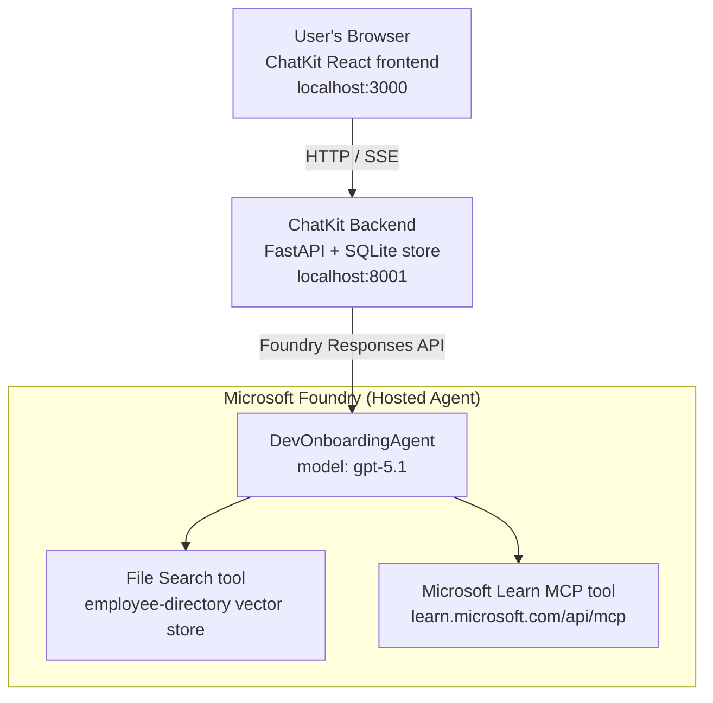

# Lesson 4: Agent Deployment with Microsoft Foundry Hosted Agents + ChatKit

This lesson demonstrates how to deploy a tool-using agent to Microsoft Foundry as a hosted agent and create a ChatKit-based frontend to interact with it.

## Architecture

The hosted agent is a **single `DevOnboardingAgent`** (running on `gpt-5.1`) that answers developer-onboarding questions using two hosted tools: a **File Search** tool over the employee-directory vector store, and the **Microsoft Learn MCP** tool. A ChatKit React frontend talks to a FastAPI backend, which calls the agent through the Foundry **Responses API**.



## Prerequisites

1. **Microsoft Foundry Project** in North Central US region
2. **Azure CLI** authenticated (`az login`)
3. **Azure Developer CLI** (`azd`) installed
4. **Python 3.12+** and **Node.js 18+**
5. **Vector Store** created with employee data

## Quick Start

### 1. Set Up Environment Variables

```bash
cd lesson-4-agentdeployment
cp .env.example .env
# Edit .env with your Microsoft Foundry project details
```

### 2. Deploy the Hosted Agent

**Option A: Using Azure Developer CLI (Recommended)**

```bash
cd hosted-agent
azd auth login
azd agent deploy
```

**Option B: Using Docker + Azure Container Registry**

```bash
cd hosted-agent

# Build the container
docker build -t developer-onboarding-agent:latest .

# Tag for ACR
docker tag developer-onboarding-agent:latest <your-acr>.azurecr.io/developer-onboarding-agent:latest

# Push to ACR
az acr login --name <your-acr>
docker push <your-acr>.azurecr.io/developer-onboarding-agent:latest

# Deploy via Microsoft Foundry portal or SDK
```

### 3. Start the ChatKit Backend

```bash
cd chatkit-server
python -m venv .venv
source .venv/bin/activate  # On Windows: .venv\Scripts\activate
pip install -r requirements.txt
python app.py
```

The server will start on `http://localhost:8001`

### 4. Start the ChatKit Frontend

```bash
cd chatkit-server/frontend
npm install
npm run dev
```

The frontend will start on `http://localhost:3000`

### 5. Test the Application

Open `http://localhost:3000` in your browser and try these queries:

**Employee Search:**
- "I'm new here! Has anyone worked at Microsoft?"
- "Who has experience with Azure Functions?"

**Learning Resources:**
- "Create a learning path for Kubernetes"
- "What certifications should I pursue for cloud architecture?"

**Coding Help:**
- "Help me write Python code for connecting to CosmosDB"
- "Show me how to create an Azure Function"

**Multi-Agent Queries:**
- "I'm starting as a cloud engineer. Who should I connect with and what should I learn?"

## Project Structure

```
lesson-4-agentdeployment/
├── .env.example                 # Environment variables template
├── implementation-plan.md       # Detailed implementation guide
├── README.md                    # This file
├── hosted-agent/               # Microsoft Foundry hosted agent
│   ├── main.py                 # Multi-agent workflow implementation
│   ├── requirements.txt        # Python dependencies
│   ├── Dockerfile              # Container definition
│   └── agent.yaml              # Agent deployment configuration
└── chatkit-server/             # ChatKit server application
    ├── app.py                  # FastAPI backend
    ├── store.py                # SQLite persistence layer
    ├── requirements.txt        # Python dependencies
    └── frontend/               # React frontend
        ├── package.json
        ├── vite.config.ts
        ├── tsconfig.json
        ├── index.html
        └── src/
            ├── main.tsx
            ├── App.tsx
            ├── App.css
            └── index.css
```

## The Agent and Its Tools

The hosted agent is a **single agent** (`DevOnboardingAgent`, defined in `hosted-agent/main.py`) that handles three onboarding domains. Rather than orchestrating separate sub-agents, it exposes each capability as a tool (or relies on the model directly):

| Capability | How it's handled | Tool |
|-----------|------------------|------|
| **Employee search & connections** | Foundry hosted File Search over the employee-directory vector store | `client.get_file_search_tool(vector_store_ids=[...])` |
| **Learning & training** | Microsoft Learn MCP server (hosted MCP tool) | `client.get_mcp_tool(url="https://learn.microsoft.com/api/mcp")` |
| **Coding assistance** | Handled by the `gpt-5.1` model directly — no external tool | — |

The agent is created with `client.as_agent(name="DevOnboardingAgent", instructions=..., tools=[file_search_tool, learn_mcp_tool])` and served with `from_agent_framework(agent).run()`.

> **Design note.** Earlier drafts of this lesson used a `HandoffBuilder` multi-agent workflow (Triage → specialists). The shipped agent is a single tool-using agent, which is simpler to deploy and reason about for onboarding-style Q&A. For an example of multi-agent orchestration and handoffs, see Lesson 2 and Lesson 3.

## Smoke Testing the Hosted Agent (CI Gate)

Deploying a hosted agent "successfully" only proves the control plane accepted the
definition — it does **not** prove the agent actually answers. A missing dependency,
bad model routing, or an expired connection can leave a green-but-silent agent.

This lesson ships a lightweight **smoke test** that acts as a fast, cheap post-deploy
gate. It uses the [AI Smoke Test](https://github.com/marketplace/actions/ai-smoke-test)
GitHub Action to POST prompts to the agent's Foundry **Responses** endpoint
(`POST {project_endpoint}/agents/{agent_name}/endpoint/protocols/openai/responses`)
and assert on the returned text. It catches broken deployments, auth regressions,
system-prompt drift, and threading breakage in seconds.

> Smoke tests are **not** a replacement for the full evaluations in
> [Lesson 3](../lesson-3-agent-evals/README.md) — they are a complement. Smoke tests
> answer *"is the agent reachable, responding, and following basic prompt expectations?"*;
> evaluations answer *"how good is the response?"*. Run the cheap gate on every deploy.

### What gets tested

The catalog lives at [`hosted-agent/tests/smoke-tests.json`](./hosted-agent/tests/smoke-tests.json)
and exercises the agent's three domains plus prompt adherence and multi-turn threading:

| Test | What it verifies |
|------|------------------|
| `reachability` | Agent responds with non-empty, on-scope text |
| `employee-search` | File-search domain returns a healthy `200` (reply is data-dependent) |
| `learning-path` | Learning domain echoes the topic and produces a path-style answer |
| `coding-assistance` | Coding domain returns a code-shaped Python answer |
| `prompt-adherence-offtopic` | Off-topic request is redirected, not answered in detail |
| `threading-turn-1/2` | Conversation state is retained across turns via `previous_response_id` |

### Run it in CI

The workflow at [`.github/workflows/smoke-test-hosted-agent.yml`](../.github/workflows/smoke-test-hosted-agent.yml)
has two jobs:

- **`static`** — a fast, no-Azure gate that runs on every pull request and push:
  it compiles all Python sources (`py_compile`) and checks Markdown links. No secrets
  required, so it works on fork PRs.
- **`smoke`** — the Azure-connected smoke test below. It runs on demand
  (Actions → **Agent CI (static + smoke)** → Run workflow) and can be chained after your
  deploy workflow.

Configure these repository **variables** and **secrets** for the smoke job:

| Kind | Name | Value |
|------|------|-------|
| Variable | `FOUNDRY_PROJECT_ENDPOINT` | `https://<account>.services.ai.azure.com/api/projects/<project>` |
| Variable | `HOSTED_AGENT_NAME` | Deployed agent name (e.g. `dev-onboarding` — must match your deployment) |
| Secret | `AZURE_CLIENT_ID` / `AZURE_TENANT_ID` / `AZURE_SUBSCRIPTION_ID` | OIDC federated identity for `azure/login` |

The runner identity needs the **`Azure AI User`** role at **Foundry project scope** so it can
call the Responses (and conversations) data-plane endpoints. Grant it with:

```bash
az role assignment create \
  --assignee <object-id-or-appId-of-runner-identity> \
  --role "Azure AI User" \
  --scope "/subscriptions/<sub>/resourceGroups/<rg>/providers/Microsoft.CognitiveServices/accounts/<account>/projects/<project>"
```

### Run it locally

You can run the same catalog before pushing. Acquire a data-plane token scoped to
`https://ai.azure.com/` and point the runner at your deployment:

```bash
# Audience MUST be https://ai.azure.com/ (cognitiveservices.azure.com tokens are rejected)
export FOUNDRY_TOKEN=$(az account get-access-token --resource https://ai.azure.com/ --query accessToken -o tsv)

git clone https://github.com/JFolberth/ai-smoketest && cd ai-smoketest
python runner.py \
  --project-endpoint "https://<account>.services.ai.azure.com/api/projects/<project>" \
  --agent-name dev-onboarding \
  --tests-file ../lesson-4-agentdeployment/hosted-agent/tests/smoke-tests.json
```

Exit codes: `0` all passed, `1` an assertion failed, `2` runner error (bad catalog / token).

## Troubleshooting

### Agent not responding
- Verify the hosted agent is deployed and running in Microsoft Foundry
- Check the `HOSTED_AGENT_NAME` and `HOSTED_AGENT_VERSION` match your deployment

### Vector store errors
- Ensure `VECTOR_STORE_ID` is set correctly
- Verify the vector store contains the employee data

### Authentication errors
- Run `az login` to refresh credentials
- Ensure you have access to the Microsoft Foundry project

## Resources

- [Microsoft Foundry Hosted Agents Documentation](https://learn.microsoft.com/en-us/azure/ai-foundry/agents/concepts/hosted-agents)
- [Microsoft Agent Framework](https://github.com/microsoft/agent-framework)
- [ChatKit Integration Sample](https://github.com/microsoft/agent-framework/tree/main/python/samples/demos/chatkit-integration)
- [Azure Developer CLI](https://learn.microsoft.com/en-us/azure/developer/azure-developer-cli/overview)
- [AI Smoke Test GitHub Action](https://github.com/marketplace/actions/ai-smoke-test)
- [Smoke Test Microsoft Foundry Agents with GitHub Actions (blog)](https://techcommunity.microsoft.com/blog/azuredevcommunityblog/smoke-test-microsoft-foundry-agents-with-github-actions/4531912)

---

## Next Steps

Your agent runs on Microsoft-managed infrastructure. To take it to enterprise production —
controlling where its data lives (data sovereignty, private networking, bring-your-own Azure
Cosmos DB / Storage / AI Search) and governing its tools — continue to
**[Lesson 5: Production Hosted Agents](../lesson-5-hosted-agents-production/README.md)**, which
explains the crucial difference between **Hosted Agents** and **Capability Hosts**.
