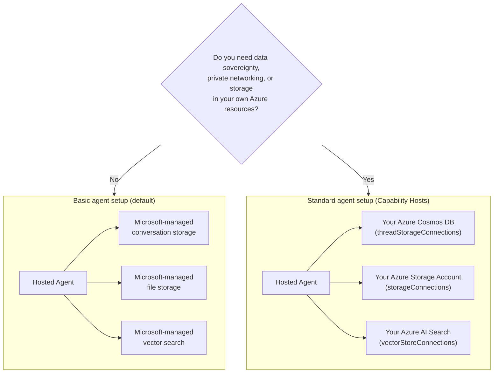

# Lesson 5: Production Hosted Agents — Storage, Memory & Governance

In [Lesson 4](../lesson-4-agentdeployment/README.md) you deployed the Developer Onboarding
Agent as a **Microsoft Foundry Hosted Agent** and put a ChatKit frontend in front of it. That
lesson answered *"how do I ship an agent?"*. This lesson answers the questions that come next
in an enterprise: **Where is my agent's data stored? Who controls it? How do I meet compliance,
networking, and governance requirements?**

The single most important idea in this lesson is the difference between a **Hosted Agent** and a
**Capability Host** — two concepts that are easy to confuse but solve completely different
problems.

## Learning Objectives

By the end of this lesson you will be able to:

- Explain what a **Hosted Agent** gives you (Microsoft-managed execution) and what it does **not**.
- Explain what a **Capability Host** is and precisely when you need one.
- Choose between **basic agent setup** (Microsoft-managed storage) and **standard agent setup**
  (bring-your-own Azure resources).
- Understand how **conversation history, file uploads, and vector stores** are persisted, and how
  to redirect them to your own Azure Cosmos DB, Azure Storage, and Azure AI Search.
- Apply governance controls: data sovereignty, private networking, and **Hosted MCP tool approval**.

---

## Prerequisites

1. Completed [Lesson 4](../lesson-4-agentdeployment/README.md) — you have a hosted agent deployed.
2. A **Microsoft Foundry** project, and an Azure account with permission to create resources
   (Cosmos DB, Storage, Azure AI Search) and assign roles in the subscription/resource group.
3. **Azure CLI** authenticated: `az login` (and `az account set --subscription <id>` if you have
   more than one subscription).
4. **Azure Developer CLI** (`azd`) installed — used for the standard-setup provisioning flow.
5. **Python 3.12+** with the course dependencies installed (`pip install -r ../requirements.txt`).
6. A current, non-retired model deployment (for example `gpt-5.1`). Avoid retired GPT-4o / GPT-4.1.

> This lesson is mostly conceptual and control-plane focused. You can read it end-to-end without
> provisioning anything, then use the hands-on exercises when you are ready to configure a
> standard setup.

---

## 1. Hosted Agents: what Foundry manages for you

A **Hosted Agent** is an agent whose *execution environment* is fully managed by Microsoft
Foundry Agent Service. When you deploy a hosted agent (as you did in Lesson 4), Foundry provides:

- **Compute** — the runtime that executes your agent code and tools.
- **Scaling** — replicas scale up and down with load (see `agent.yaml` `scale` in Lesson 4).
- **Identity** — a managed identity for the agent, so it authenticates to Azure without secrets.
- **Observability** — tracing and telemetry (see Lesson 3's observability section).
- **Session management** — threads/conversations, so multi-turn chats "remember" prior turns.

> **Key point:** You do **not** need to configure a Capability Host simply to *run* a Hosted
> Agent. A hosted agent works out of the box on Microsoft-managed infrastructure.

---

## 2. Hosted Agents vs Capability Hosts

**Hosted Agents and Capability Hosts solve different problems.**

**Hosted Agents** provide the Microsoft-managed execution environment, including compute, scaling,
identity, observability and session management. You do **not** need Capability Hosts simply to run
a Hosted Agent.

**Capability Hosts** are only required when you want Agent Service to use **customer-owned
resources** instead of Microsoft-managed storage. If you are happy with the default
Microsoft-managed storage, vector search and conversation persistence, **no Capability Host
configuration is required.**

If your organisation requires **data sovereignty, private networking, compliance controls or
storage in your own Azure Cosmos DB, Azure Storage Account and Azure AI Search resources**, then
you configure Capability Hosts to connect Agent Service to those resources.

In one sentence:

> A **Hosted Agent** is about *where your agent runs*. A **Capability Host** is about *where your
> agent's data lives*.

| Concern | Hosted Agent | Capability Host |
|---------|--------------|-----------------|
| Compute / scaling / identity | ✅ Provided | — |
| Observability / tracing | ✅ Provided | — |
| Conversation & thread session management | ✅ Provided | Redirects *where it is stored* |
| Where conversation history is stored | Microsoft-managed by default | Your Azure Cosmos DB |
| Where uploaded files are stored | Microsoft-managed by default | Your Azure Storage Account |
| Where vector embeddings are stored | Microsoft-managed by default | Your Azure AI Search |
| Required to run an agent? | ✅ Yes (it *is* the agent host) | ❌ No — optional |
| Required for data sovereignty / BYO storage? | ❌ Not sufficient alone | ✅ Yes |

---

## 3. Basic vs Standard agent setup

Foundry describes the two data configurations as **basic** and **standard** agent setup.



### When to stay on basic setup (no Capability Host)

- Development, prototyping, and testing.
- Internal tools where Microsoft-managed storage satisfies your data-handling policy.
- You want the fastest path to a working agent with the least infrastructure.

### When you need standard setup (Capability Hosts)

- **Data sovereignty** — all agent data must remain in your Azure subscription/region.
- **Security control** — you must use your own storage accounts, databases, and search services.
- **Compliance** — you have regulatory or organizational requirements about where data lives.
- **Private networking** — traffic must stay inside your virtual network (BYO virtual network).

> **Recommendation from Microsoft:** use *separate* Foundry accounts/projects for standard vs
> basic setup. Avoid mixing setup types within the same Foundry account.

---

## 4. How Capability Hosts work

A **Capability Host** is a sub-resource you configure at **two scopes**: the Foundry **account**
and the Foundry **project**. It tells Agent Service where to store and process agent data:
conversation history, file uploads, and vector stores.

Two rules matter most:

1. **Account before project.** You cannot create a project capability host unless an
   account-level capability host already exists.
2. **No inheritance of configuration.** The **project** capability host is what Agent Service
   actually reads to decide which storage/conversation/vector resources to use. Account-level
   connections are *not* automatically used by a project — the project capability host must
   reference them explicitly.

### Connections a standard setup needs

Capability hosts reference **connections** (created in your Foundry account/project) that point at
your Azure resources:

| Capability host property | Stores | Your Azure resource |
|--------------------------|--------|---------------------|
| `threadStorageConnections` | Agent definitions + conversation history | Azure Cosmos DB |
| `storageConnections` | File uploads / blob storage | Azure Storage Account |
| `vectorStoreConnections` | Vector embeddings for retrieval/search | Azure AI Search |
| `aiServicesConnections` *(optional)* | Your own model deployments | Azure OpenAI |

Each connection must have `authType`, `category`, `target` (the service **endpoint URL**, not the
resource ID), and `metadata.ResourceId` (the full Azure resource ID) populated, or Agent Service
cannot resolve the resource at runtime.

### Configuring the capability hosts (control plane)

Capability hosts are currently managed via the **Azure Resource Manager REST API** (there is no
SDK for capability-host management yet). First create the **account** capability host:

```http
PUT https://management.azure.com/subscriptions/{subscriptionId}/resourceGroups/{rg}/providers/Microsoft.CognitiveServices/accounts/{account}/capabilityHosts/{name}?api-version=2025-06-01

{
  "properties": { "capabilityHostKind": "Agents" }
}
```

Then create the **project** capability host that references your connections:

```http
PUT https://management.azure.com/subscriptions/{subscriptionId}/resourceGroups/{rg}/providers/Microsoft.CognitiveServices/accounts/{account}/projects/{project}/capabilityHosts/{name}?api-version=2025-06-01

{
  "properties": {
    "capabilityHostKind": "Agents",
    "threadStorageConnections": ["my-cosmosdb-connection"],
    "vectorStoreConnections":  ["my-ai-search-connection"],
    "storageConnections":      ["my-storage-connection"]
  }
}
```

> **Constraints to remember:**
> - **One capability host per scope.** A second one at the same scope returns `409 Conflict`.
> - **No updates.** To change configuration you must **delete and recreate** the capability host.
> - **Deletion is destructive.** Deleting a capability host removes agents' access to the files,
>   conversations, and vector stores it pointed at.

### Verify it works

After configuration, run a test conversation and confirm that:

- Conversations appear in **your Azure Cosmos DB**.
- Uploaded files appear in **your Azure Storage account**.
- Vector data appears in **your Azure AI Search index**.

---

## 5. Memory & context management

"Session management" (a Hosted Agent feature) and "where threads are stored" (a Capability Host
concern) combine to give your agent **memory**:

- A **thread** (conversation) holds the ordered turns of a chat. The Responses API threads calls
  together via `previous_response_id` (you saw this in the Lesson 4 smoke tests).
- On **basic setup**, thread/conversation state lives in Microsoft-managed storage.
- On **standard setup**, that same state is persisted to **your Azure Cosmos DB** via
  `threadStorageConnections` — giving you durable, queryable, sovereign conversation history.

This is the difference between an agent that "remembers within a session" and an enterprise
system where every conversation is retained in your own compliance boundary.

---

## 6. Governance & security checklist

Use this checklist when promoting a hosted agent from prototype to production:

- [ ] **Decide basic vs standard setup** using the questions in §3 — document the decision.
- [ ] **Data sovereignty:** if required, configure Capability Hosts so conversation history
      (Cosmos DB), files (Storage), and vectors (AI Search) stay in your subscription/region.
- [ ] **Private networking:** for standard setup, restrict traffic with Bring Your Own Virtual
      Network so data cannot leave your network (helps prevent data exfiltration).
- [ ] **RBAC:** grant least privilege. Creating capability hosts needs **Contributor** on the
      Foundry account; assigning access to your Azure resources needs **User Access Administrator**
      or **Owner**.
- [ ] **Hosted MCP tool governance:** review every MCP server your agent can call and set an
      **approval mode** (see §7). Never expose an unreviewed external tool to a production agent.
- [ ] **Observability:** confirm tracing/telemetry is on (Lesson 3) so you can audit tool calls.
- [ ] **Cost:** BYO resources (Cosmos DB, AI Search, Storage) are billed to *your* subscription —
      size and monitor them. Basic setup folds storage into the managed service.

---

## 7. Hosted MCP tools & approval workflows

The Developer Onboarding Agent in Lesson 4 already uses a **Hosted MCP tool** — the
[Microsoft Learn MCP server](https://learn.microsoft.com/api/mcp) — added with:

```python
client.get_mcp_tool(
    name="Microsoft Learn MCP",
    url="https://learn.microsoft.com/api/mcp",
    approval_mode="never_require",
)
```

The **Model Context Protocol (MCP)** is an open standard that lets an agent discover and call
external tools over a uniform interface. **Hosted MCP tools** let Foundry call an MCP server on the
agent's behalf. Two governance levers matter in production:

- **`approval_mode`** — controls whether a human/caller must approve each tool invocation.
  - `never_require` is convenient for a trusted, read-only server like Microsoft Learn.
  - For servers that can **write** or reach sensitive systems, require approval so a call is
    reviewed before it executes. This is your **approval workflow**.
- **Server allow-listing** — only connect MCP servers you have reviewed and trust. Treat an MCP
  URL like any other production dependency.

> **Try it:** change the Lesson 4 agent's `approval_mode` to require approval, redeploy, and
> observe how tool calls now pause for confirmation before running.

---

## Hands-on exercises

1. **Classify a scenario.** For each of these, decide *basic* or *standard* setup and justify it:
   (a) a hackathon demo, (b) a healthcare onboarding assistant handling PII, (c) an internal
   FAQ bot, (d) a bank agent that must keep all data in-region.
2. **Map the storage.** For the Lesson 4 agent, list which capability-host property would store
   its (a) chat history, (b) uploaded employee files, (c) vector embeddings.
3. **Design an approval workflow.** Add a hypothetical "create Jira ticket" MCP tool to the agent.
   What `approval_mode` would you use and why?
4. **Cost trade-off.** Write two or three sentences on the cost implications of moving from basic
   to standard setup for a high-traffic agent.

---

## Resources

- [Capability hosts — Microsoft Foundry](https://learn.microsoft.com/azure/foundry/agents/concepts/capability-hosts)
- [Standard agent setup (built-in enterprise readiness)](https://learn.microsoft.com/azure/foundry/agents/concepts/standard-agent-setup)
- [Use your own resources](https://learn.microsoft.com/azure/foundry/agents/how-to/use-your-own-resources)
- [Set up your agent environment (basic vs standard)](https://learn.microsoft.com/azure/foundry/agents/environment-setup)
- [Set up private networking for Foundry Agent Service](https://learn.microsoft.com/azure/foundry/agents/how-to/virtual-networks)
- [Add a connection to your project](https://learn.microsoft.com/azure/foundry/how-to/connections-add)
- [Microsoft Learn MCP server](https://learn.microsoft.com/training/support/mcp)
- [Model Context Protocol](https://modelcontextprotocol.io/)

---

**Previous:** [Lesson 4 — Agent Deployment](../lesson-4-agentdeployment/README.md) &nbsp;·&nbsp; **Next:** [Lesson 6 — Microsoft Toolbox](../lesson-6-toolbox/README.md)
