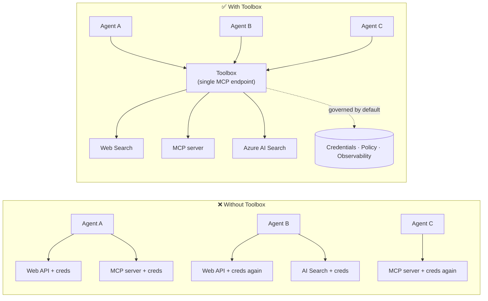

# Lesson 6: Microsoft Toolbox — Governed Tools for Agents

By [Lesson 5](../lesson-5-hosted-agents-production/README.md) your hosted agent runs in
production with the storage and governance posture your organisation needs. But look back at the
Lesson 4 agent: every tool was **hardcoded** into `main.py` — the Microsoft Learn MCP URL, the
file-search vector store, and so on. That works for one agent. It does **not** scale to an
organisation with dozens of agents and teams.

This lesson introduces **Microsoft Toolbox**: the way Foundry lets you define a curated set of
tools **once**, manage them **centrally**, and expose them to any agent through a **single,
governed endpoint**.

## Learning Objectives

By the end of this lesson you will be able to:

- Explain the tool-sprawl problem Toolbox solves.
- Describe the **Build** and **Consume** pillars and the tool types a toolbox can contain.
- **Build** a toolbox version with the Foundry SDK.
- **Consume** a toolbox from a Microsoft Agent Framework hosted agent via a single MCP endpoint.
- Use **versioning** to ship tool changes with no agent code changes or redeploys.
- Apply **governance**: RBAC, credential injection, and guardrail (RAI) policies.

---

## Prerequisites

1. Completed [Lesson 4](../lesson-4-agentdeployment/README.md) and ideally
   [Lesson 5](../lesson-5-hosted-agents-production/README.md).
2. A **Microsoft Foundry** project with permission to create and manage toolbox resources.
3. **Azure CLI** authenticated: `az login`. The Foundry toolbox APIs require the
   `https://ai.azure.com/.default` token scope (shown in the code below).
4. **Python 3.12+** with the course dependencies installed (`pip install -r ../requirements.txt`).
5. A current, non-retired model deployment (for example `gpt-5.1`). Avoid retired GPT-4o / GPT-4.1.

---

## 1. The problem: tool sprawl

A single agent can depend on many tools — REST APIs, MCP servers, connectors, and flows — each
with its own authentication model and owning team. As you scale across an organisation:

- Teams **re-implement the same tools** independently.
- **Credentials get duplicated** across agents and repos.
- **Governance becomes inconsistent** — every agent enforces (or forgets) policy on its own.
- There's **little visibility** into what tools exist or who is using them.

Developers stall — not because the models aren't capable, but because **tool integration becomes
the bottleneck**.



Enterprises already have the infrastructure — gateways, credential vaults, policies, observability.
What was missing is a developer experience that packages it into something **reusable,
discoverable, and governed by default**. That is Toolbox.

---

## 2. What a Toolbox is

A **Toolbox** is a **managed Foundry resource**. You define a curated set of tools once, manage
them centrally in Foundry, and expose them through **a single MCP-compatible endpoint** that any
agent can consume. At runtime the platform handles **credential injection, token refresh, and
enterprise policy enforcement**.

Because a toolbox is a managed resource, you can add, remove, or reconfigure tools **without
changing code in your agent** — the agent always connects to the same endpoint.

Toolbox covers the tool lifecycle through four pillars; **Build** and **Consume** are available
today:

| Pillar | Status | What it enables |
|--------|--------|-----------------|
| **Build** | Available today | Select tools, configure authentication centrally, publish a reusable toolbox any team can consume. |
| **Consume** | Available today | Connect any agent to one MCP-compatible endpoint to dynamically discover and invoke all tools in the toolbox. |

The consumption surface is **open**: any MCP-compatible runtime or client can use a toolbox —
Microsoft Agent Framework, LangGraph, GitHub Copilot, Claude Code, Microsoft Copilot Studio, or
custom code.

### Tool types a toolbox can contain

Web Search · MCP · Azure AI Search · Code Interpreter · File Search · OpenAPI · **Agent-to-Agent
(A2A)** · Fabric IQ · Tool Search · Work IQ · Browser Automation · Skill references, plus a
**Guardrail (RAI) policy** applied at the toolbox layer.

> **Tip:** Add a `description` to **every** tool so the model can pick the right one. A toolbox
> allows at most **one unnamed tool per type** — give each additional instance of the same type a
> unique `name`, or you'll get an `invalid_payload` error.

---

## 3. Build a toolbox

Toolboxes are managed with the Foundry SDKs (Python/.NET/JavaScript), the REST API, `azd`, and the
**Microsoft Foundry Toolkit for VS Code**. Here is the Python (`azure-ai-projects`) pattern:

```python
from azure.identity import DefaultAzureCredential
from azure.ai.projects import AIProjectClient
from azure.ai.projects.models import MCPTool, ToolboxSearchPreviewTool, WebSearchTool

endpoint = "https://<your-foundry-account>.services.ai.azure.com/api/projects/<your-project>"
project = AIProjectClient(endpoint=endpoint, credential=DefaultAzureCredential())

toolbox_version = project.toolboxes.create_toolbox_version(
    name="agent-tools",
    description="Web search + an MCP server + tool search",
    tools=[
        WebSearchTool(),
        MCPTool(
            server_label="myserver",
            server_url="https://your-mcp-server.example.com",
            require_approval="never",
            project_connection_id="my-key-auth-connection",  # credentials live in Foundry
        ),
        ToolboxSearchPreviewTool(),
    ],
)
print(f"Created toolbox: {toolbox_version.name}, version: {toolbox_version.version}")
```

Notice what you **don't** do: no secrets in the agent. Credentials are held by a Foundry
**connection** (`project_connection_id`) and injected by the platform at call time.

> **Preview note.** Toolbox **management** (creating/updating versions) is a preview capability.
> The `project.toolboxes.*` operations shown above ship in preview SDK builds, the REST API, `azd`,
> and the **Foundry Toolkit for VS Code** — they are **not** in the pinned `azure-ai-projects` used
> elsewhere in this course. Treat the snippet above as the shape of the Build step; for a
> click-through path, create the toolbox in the **Foundry portal** or the **Foundry Toolkit**. The
> **Consume** step below works with the course's pinned SDK today.

---

## 4. Consume a toolbox from your agent

A toolbox exposes an **MCP endpoint**. There are two patterns:

| Role | Endpoint | When to use |
|------|----------|-------------|
| **Toolbox consumer** | `{project_endpoint}/toolboxes/{name}/mcp?api-version=v1` | Connect agents. Always serves the **default version**. |
| **Toolbox developer** | `{project_endpoint}/toolboxes/{name}/versions/{version}/mcp?api-version=v1` | Test a specific version before promoting it. |

> **Connect agents to the *consumer* endpoint.** Because it always serves the default version, you
> can promote new versions **without changing agent code or redeploying**.

### Integrating with a Microsoft Agent Framework hosted agent

Recall the Lesson 4 agent added a single hardcoded MCP tool with `client.get_mcp_tool(...)`. With
Toolbox you instead point **one** `MCPStreamableHTTPTool` at the toolbox endpoint — and the agent
gets **every** tool in the toolbox, governed centrally:

```python
import httpx
from azure.identity import DefaultAzureCredential, get_bearer_token_provider
from agent_framework import MCPStreamableHTTPTool

# Auth: Foundry toolbox requires the https://ai.azure.com/.default scope
credential = DefaultAzureCredential()
token_provider = get_bearer_token_provider(credential, "https://ai.azure.com/.default")
http_client = httpx.AsyncClient(auth=_ToolboxAuth(token_provider), timeout=120.0)

TOOLBOX_ENDPOINT = os.environ["TOOLBOX_ENDPOINT"]  # platform-injected at runtime

mcp_tool = MCPStreamableHTTPTool(
    name="toolbox",
    url=TOOLBOX_ENDPOINT,
    http_client=http_client,
    load_prompts=False,
)

agent = chat_client.as_agent(
    name="my-toolbox-agent",
    instructions="You are a helpful assistant with access to Foundry toolbox tools.",
    tools=[mcp_tool],
)
```

Corresponding `.env` (note: use a **current** model such as `gpt-5.1`, **not** the retired
`gpt-4o`):

```env
FOUNDRY_PROJECT_ENDPOINT=https://<account>.services.ai.azure.com/api/projects/<project>
TOOLBOX_ENDPOINT=https://<account>.services.ai.azure.com/api/projects/<project>/toolboxes/agent-tools/mcp?api-version=v1
AZURE_AI_MODEL_DEPLOYMENT_NAME=gpt-5.1
```

> **Verify first.** Before wiring the full agent, connect an MCP client SDK (`pip install mcp`) to
> the **version-specific** endpoint and list the tools to confirm they load as expected.

### Run the consume sample

This lesson ships a runnable consume-side sample, [`toolbox_agent.py`](./toolbox_agent.py). It uses
the same `FoundryChatClient.get_mcp_tool(...)` pattern you learned in Lesson 2, but points the one
MCP tool at your **toolbox** endpoint — so the agent gets every governed tool in the toolbox:

```bash
# In your .env, set TOOLBOX_ENDPOINT to your toolbox consumer endpoint, then:
python lesson-6-toolbox/toolbox_agent.py
```

Open the printed `http://localhost:8096` URL and ask a question that exercises one of your
toolbox's tools. Add or upgrade a tool in the toolbox and ask again — **without changing this
code** — to see central governance and versioning in action.

---

## 5. Versioning: ship tool changes safely

Toolbox versioning gives you explicit control over when changes take effect:

1. **Create** a new toolbox version with the updated tool set.
2. **Test** it against the version-specific (developer) endpoint.
3. **Promote** it to `default_version` when you're ready.

Every agent pointed at the **consumer** endpoint picks up the promoted version automatically — **no
code changes, no redeployment**. (The first version you create is auto-promoted to the default.)

This is the tool-governance equivalent of a blue/green deploy: you validate a change in isolation,
then flip the default for every consumer at once.

---

## 6. Governance: how Toolbox improves control

Toolbox is **governed by default**. The governance levers you should know:

- **RBAC.** Grant the **Foundry User** role on the project to each identity: the **developer** who
  manages toolbox versions, the **agent's managed identity** (for hosted agents calling tools at
  runtime), and, for OAuth flows, the **end user** whose identity is proxied.
- **Centralised credentials.** Tool credentials live in Foundry **connections**, not in agent code
  or `.env` files. The platform injects them and refreshes tokens at runtime.
- **Guardrails (RAI policy).** Attach a named responsible-AI policy to a toolbox version via
  `policies.rai_config.rai_policy_name`. It runs at the **toolbox layer**, independently of any
  model-level content filter, screening tool inputs and outputs.
- **MCP approval.** Per-tool `require_approval` controls whether an MCP tool call needs approval —
  the same approval-workflow concept you saw in [Lesson 5 §7](../lesson-5-hosted-agents-production/README.md#7-hosted-mcp-tools--approval-workflows).
- **Private networking.** Toolbox supports virtual-network configurations for enterprises that
  keep traffic inside their network.
- **Visibility.** Because tools are catalogued centrally, you finally get an inventory of what
  exists and who consumes it.

---

## Hands-on exercises

1. **Refactor Lesson 4.** The Lesson 4 agent hardcodes the Microsoft Learn MCP tool. Sketch how you
   would move that tool into a `agent-tools` toolbox and repoint `main.py` at the toolbox consumer
   endpoint. What changes in `main.py`? What no longer lives there?
2. **Design a version bump.** You need to add a Web Search tool to a live toolbox used by five
   agents. Describe the create → test → promote sequence and explain why none of the five agents
   need redeploying.
3. **Pick the auth identities.** For a hosted agent that calls an OAuth-based MCP tool through a
   toolbox, list which identities need the **Foundry User** role and why.
4. **Guardrail placement.** Explain the difference between a model-level content filter and a
   toolbox guardrail, and give one scenario where you need the toolbox guardrail specifically.

---

## Resources

- [Create, test, and deploy a toolbox in Foundry](https://learn.microsoft.com/azure/foundry/agents/how-to/tools/toolbox)
- [Tool catalog — Foundry Agent Service](https://learn.microsoft.com/azure/foundry/agents/concepts/tool-catalog)
- [Microsoft Agent Framework — Microsoft Foundry provider (tools)](https://learn.microsoft.com/agent-framework/agents/providers/microsoft-foundry)
- [Guardrails overview](https://learn.microsoft.com/azure/foundry/guardrails/guardrails-overview)
- [Get started with Foundry in VS Code (Foundry Toolkit)](https://learn.microsoft.com/azure/ai-foundry/how-to/develop/get-started-projects-vs-code)
- [Model Context Protocol](https://modelcontextprotocol.io/)

---

**Previous:** [Lesson 5 — Production Hosted Agents](../lesson-5-hosted-agents-production/README.md)
&nbsp;·&nbsp; **Next:** [Lesson 7 — Multi-Agent & A2A](../lesson-7-multi-agent-a2a/README.md)
