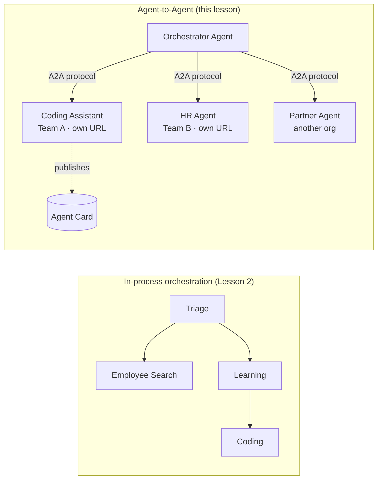

# Lesson 7: Multi-Agent Orchestration & Agent-to-Agent (A2A)

By [Lesson 6](../lesson-6-toolbox/README.md) you can build governed tools and hosted agents.
But real systems rarely use **one** agent. As you scale, you compose **many** agents — some you
own, some owned by other teams, some running in other organisations entirely. This lesson is about
how agents work **together**.

You already met one form of multi-agent design in
[Lesson 2's `agent-orchestration.py`](../lesson-2-agent-development/README.md): the **handoff**
pattern, where a triage agent routes to specialists **inside a single process**. This lesson goes
one level up — to **Agent-to-Agent (A2A)**, the open protocol for agents that run as independent
**networked services** and call each other across process, team, and organisational boundaries.

## Learning Objectives

By the end of this lesson you will be able to:

- Explain the difference between **in-process orchestration** (handoff/workflows) and
  **Agent-to-Agent (A2A)** communication, and choose the right one.
- Describe the A2A building blocks: **Agent Card**, **skills**, **tasks**, and **discovery**.
- **Expose** a Microsoft Agent Framework agent as an A2A service with `A2AExecutor`.
- **Consume** a remote agent as a networked peer with `A2AAgent`.
- Apply enterprise concerns to A2A: **security, identity, governance, observability, and cost**.

---

## Prerequisites

1. Completed [Lesson 2](../lesson-2-agent-development/README.md) (agent development & orchestration).
2. A **Microsoft Foundry** project with a current model deployment (for example `gpt-5.1`, and
   `gpt-5-codex` for the coding sample). Avoid retired GPT-4o / GPT-4.1.
3. **Azure CLI** authenticated: `az login`.
4. **Python 3.12+** with the course dependencies installed (`pip install -r ../requirements.txt`).
   Lesson 7 adds the preview `agent-framework-a2a`, `a2a-sdk`, and `uvicorn` packages.
5. `FOUNDRY_PROJECT_ENDPOINT` and `FOUNDRY_MODEL` set in your `.env` (see the course README).

---

## 1. Two ways agents work together

There is no single "multi-agent" pattern. Pick the one that matches your **boundary**:

| Pattern | Where agents run | How they connect | Use when |
|---------|------------------|------------------|----------|
| **Handoff / Workflow** (Lesson 2) | One process, one codebase | In-memory graph (`HandoffBuilder`, `WorkflowBuilder`) | You own all the agents and deploy them together. |
| **Agent-to-Agent (A2A)** (this lesson) | Separate services, separate lifecycles | Open **A2A protocol** over HTTP, discovered via **Agent Cards** | Agents are owned by different teams/orgs, scale independently, or are written in different frameworks. |

Handoff is about **routing inside an application**. A2A is about **composing agents as
independent services** — the agent equivalent of moving from function calls to microservices.



> **They compose.** An orchestrator you build with `HandoffBuilder` can have **remote A2A agents**
> as participants — in-process routing to services that themselves run anywhere.

---

## 2. The A2A building blocks

A2A is an **open protocol** (not Microsoft-specific), so an A2A agent can be consumed by Microsoft
Agent Framework, LangGraph, custom code, or another company's stack. Four concepts matter:

- **Agent Card** — a small JSON document, published at
  `/.well-known/agent-card.json`, that advertises the agent's **name, description, URL, version,
  skills, and capabilities**. This is how a client **discovers** what a remote agent can do.
- **Skills** — the declared things the agent can do (`id`, `name`, `description`, `tags`,
  `examples`). Clients (and models) use these to decide whether to call it.
- **Tasks** — a call to an A2A agent is a **task** with a lifecycle (submitted → working →
  completed/failed). The server tracks tasks in a **task store**; streaming updates are supported.
- **Discovery** — a client given only a URL fetches the Agent Card and knows how to call the agent.

---

## 3. Expose an agent as an A2A service — `a2a_server.py`

The **Build/serve** side wraps any Microsoft Agent Framework agent with `A2AExecutor` and mounts it
on an A2A HTTP application. See [`a2a_server.py`](./a2a_server.py). The key wiring:

```python
from agent_framework.a2a import A2AExecutor
from a2a.server.apps import A2AStarletteApplication
from a2a.server.request_handlers import DefaultRequestHandler
from a2a.server.tasks import InMemoryTaskStore
from a2a.types import AgentCapabilities, AgentCard, AgentSkill

agent = client.as_agent(name="coding-assistant", instructions="...")

agent_card = AgentCard(
    name="Coding Assistant",
    description="Generates runnable code samples...",
    url="http://localhost:9000/",
    version="1.0.0",
    capabilities=AgentCapabilities(streaming=True),
    default_input_modes=["text"],
    default_output_modes=["text"],
    skills=[AgentSkill(id="generate-code", name="Generate code",
                       description="Write a runnable code snippet.", tags=["code"])],
)

request_handler = DefaultRequestHandler(
    agent_executor=A2AExecutor(agent),
    task_store=InMemoryTaskStore(),
)
app = A2AStarletteApplication(agent_card=agent_card, http_handler=request_handler).build()
# served with uvicorn on port 9000
```

Notice the agent code is **unchanged** — `A2AExecutor` adapts your existing agent to the protocol.
The Agent Card is what makes it **discoverable** to any A2A client.

---

## 4. Consume a remote agent — `a2a_client.py`

The **Consume** side connects to a remote agent **by URL**, fetches its Agent Card, and calls it
exactly like a local agent. See [`a2a_client.py`](./a2a_client.py):

```python
from agent_framework.a2a import A2AAgent

remote_agent = A2AAgent(name="remote-coding-assistant", url="http://localhost:9000")
result = await remote_agent.run("Write a Python function that reverses a string.")
print(result.text)
```

That's the whole point of A2A: from the caller's side a remote agent behaves like any other
`agent_framework` agent, so you can drop it into a workflow or hand off to it — even though it runs
in a different process, on a different machine, owned by a different team.

### Run it end to end

```bash
# Terminal 1 — start the A2A service
python a2a_server.py

# Terminal 2 — call it
python a2a_client.py "Write a Python function that reverses a string."
```

You'll see the coding assistant's response arrive over the A2A protocol. Open
`http://localhost:9000/.well-known/agent-card.json` in a browser to see the published Agent Card.

---

## 5. Enterprise concerns

Turning agents into networked services introduces the same concerns as any distributed system —
plus a few AI-specific ones:

- **Identity & authentication.** Never expose an A2A agent unauthenticated. The Agent Card carries
  `security` / `security_schemes`, and `A2AAgent` accepts an `auth_interceptor` so callers attach
  credentials (OAuth bearer tokens, API keys). Use Entra ID / managed identities for
  service-to-service auth in production; put the service behind a gateway.
- **Governance.** Combine A2A with [Lesson 6's Toolbox](../lesson-6-toolbox/README.md): a remote
  agent can be published as an **A2A tool** inside a governed toolbox so RBAC, credential injection,
  and guardrail policies apply centrally.
- **Observability.** A request now crosses process boundaries, so propagate tracing across the call.
  Enable [Foundry Observability / OpenTelemetry](../lesson-3-agent-evals/README.md) on **both** the
  orchestrator and each remote agent so you get one end-to-end trace.
- **Versioning.** The Agent Card has a `version`. Treat it like an API: additive changes are safe;
  breaking a skill's contract needs a new version and a migration window for consumers.
- **Reliability.** Remote agents fail independently. Set timeouts (`A2AAgent(timeout=...)`), handle
  partial failure, and don't let one slow peer block the whole orchestration.
- **Cost.** Every remote agent call is its own model invocation. Fan-out multiplies token spend —
  budget for it, and prefer routing to **one** best agent over broadcasting to many.

---

## Hands-on exercises

1. **Add a second service.** Copy `a2a_server.py` to expose the **employee-search** agent on port
   9001 with its own Agent Card and skills. Run both, and have a client call each.
2. **Orchestrate remote peers.** Build a small `HandoffBuilder` (or plain router) whose participants
   include two `A2AAgent`s pointing at your two services. Route a query to the right one.
3. **Secure it.** Add an `auth_interceptor` to the client and require a bearer token on the server.
   What breaks if the token is missing? Where would you store the token in production?
4. **Handoff vs A2A.** Write two short paragraphs: when would you keep the Lesson 2 in-process
   handoff, and when is the extra complexity of A2A justified? Give a concrete example of each.

---

## Resources

- [Agent-to-Agent (A2A) — Microsoft Agent Framework](https://learn.microsoft.com/agent-framework/user-guide/agent-orchestration/a2a)
- [Multi-agent orchestration — Microsoft Agent Framework](https://learn.microsoft.com/agent-framework/user-guide/agent-orchestration/)
- [A2A protocol specification](https://a2a-protocol.org/)
- [A2A Python SDK (`a2a-sdk`)](https://github.com/a2aproject/a2a-python)
- [Foundry Agent Service — multi-agent patterns](https://learn.microsoft.com/azure/ai-foundry/agents/concepts/connected-agents)

---

**Previous:** [Lesson 6 — Microsoft Toolbox](../lesson-6-toolbox/README.md)
