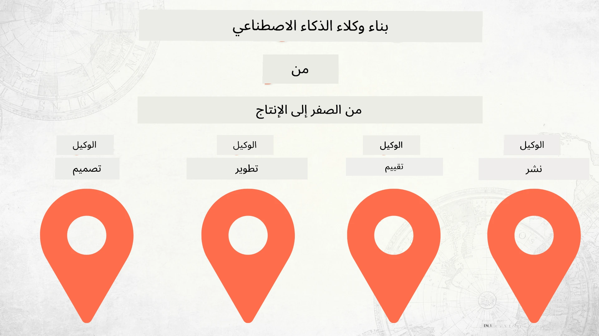

# بناء وكلاء الذكاء الاصطناعي من الصفر إلى الإنتاج



### 🌐 دعم متعدد اللغات

#### مدعوم عبر إجراء GitHub (آلي ودائمًا محدث)

<!-- CO-OP TRANSLATOR LANGUAGES TABLE START -->
[العربية](./README.md) | [البنغالية](../bn/README.md) | [البلغارية](../bg/README.md) | [البورمية (ميانمار)](../my/README.md) | [الصينية (المبسطة)](../zh-CN/README.md) | [الصينية (التقليدية، هونغ كونغ)](../zh-HK/README.md) | [الصينية (التقليدية، ماكاو)](../zh-MO/README.md) | [الصينية (التقليدية، تايوان)](../zh-TW/README.md) | [الكرواتية](../hr/README.md) | [التشيكية](../cs/README.md) | [الدنماركية](../da/README.md) | [الهولندية](../nl/README.md) | [الإستونية](../et/README.md) | [الفنلندية](../fi/README.md) | [الفرنسية](../fr/README.md) | [الألمانية](../de/README.md) | [اليونانية](../el/README.md) | [العبرية](../he/README.md) | [الهندية](../hi/README.md) | [الهنغارية](../hu/README.md) | [الإندونيسية](../id/README.md) | [الإيطالية](../it/README.md) | [اليابانية](../ja/README.md) | [الكانادا](../kn/README.md) | [الكورية](../ko/README.md) | [الليتوانية](../lt/README.md) | [الماليزية](../ms/README.md) | [المالايالامية](../ml/README.md) | [الماراثي](../mr/README.md) | [النيبالية](../ne/README.md) | [نيجيري بيدجين](../pcm/README.md) | [النرويجية](../no/README.md) | [الفارسية (اللغة الفارسية)](../fa/README.md) | [البولندية](../pl/README.md) | [البرتغالية (البرازيل)](../pt-BR/README.md) | [البرتغالية (البرتغال)](../pt-PT/README.md) | [البنجابية (غورموخي)](../pa/README.md) | [الرومانية](../ro/README.md) | [الروسية](../ru/README.md) | [الصربية (السيريلية)](../sr/README.md) | [السلوفاكية](../sk/README.md) | [السلوفينية](../sl/README.md) | [الإسبانية](../es/README.md) | [السواحيلية](../sw/README.md) | [السويدية](../sv/README.md) | [التاغالوغ (الفلبينية)](../tl/README.md) | [التاميل](../ta/README.md) | [التيلجو](../te/README.md) | [التايلاندية](../th/README.md) | [التركية](../tr/README.md) | [الأوكرانية](../uk/README.md) | [الأردو](../ur/README.md) | [الفيتنامية](../vi/README.md)

> **تفضل النسخ محليًا؟**
>
> يتضمن هذا المستودع أكثر من 50 ترجمة للغات مما يزيد بشكل كبير من حجم التحميل. لنسخ المستودع بدون الترجمات، استخدم سحب اختيار ضيق:
>
> **Bash / macOS / Linux:**
> ```bash
> git clone --filter=blob:none --sparse https://github.com/microsoft/Building-AI-Agents-From-Zero-To-Production.git
> cd Building-AI-Agents-From-Zero-To-Production
> git sparse-checkout set --no-cone '/*' '!translations' '!translated_images'
> ```
>
> **CMD (ويندوز):**
> ```cmd
> git clone --filter=blob:none --sparse https://github.com/microsoft/Building-AI-Agents-From-Zero-To-Production.git
> cd Building-AI-Agents-From-Zero-To-Production
> git sparse-checkout set --no-cone "/*" "!translations" "!translated_images"
> ```
>
> هذا يعطيك كل ما تحتاجه لإكمال الدورة مع تحميل أسرع بكثير.
<!-- CO-OP TRANSLATOR LANGUAGES TABLE END -->

## دورة تعلمك أساسيات دورة حياة تطوير وكلاء الذكاء الاصطناعي

[](https://github.com/microsoft/Building-AI-Agents-From-Zero-To-Production/blob/master/LICENSE?WT.mc_id=academic-105485-koreyst)
[](https://GitHub.com/microsoft/Building-AI-Agents-From-Zero-To-Production/graphs/contributors/?WT.mc_id=academic-105485-koreyst)
[](https://GitHub.com/microsoft/Building-AI-Agents-From-Zero-To-Production/issues/?WT.mc_id=academic-105485-koreyst)
[](https://GitHub.com/microsoft/Building-AI-Agents-From-Zero-To-Production/pulls/?WT.mc_id=academic-105485-koreyst)
[](http://makeapullrequest.com?WT.mc_id=academic-105485-koreyst)

[](https://discord.gg/Kuaw3ktsu6)

## 🌱 البداية

تشمل هذه الدورة دروسًا تغطي أساسيات بناء ونشر وكلاء الذكاء الاصطناعي.

كل درس يبني على الذي قبله، لذلك نوصي بالبدء من البداية والعمل حتى النهاية.

إذا أردت استكشاف المزيد حول موضوعات وكلاء الذكاء الاصطناعي، يمكنك الاطلاع على [دورة وكلاء الذكاء الاصطناعي للمبتدئين](https://aka.ms/ai-agents-beginners).

### تعرف على متعلمين آخرين، واحصل على إجابات لأسئلتك

إذا واجهتك أية عقبات أو كانت لديك أسئلة حول بناء وكلاء الذكاء الاصطناعي، انضم إلى قناة Discord المخصصة لنا في [Microsoft Foundry Discord](https://discord.gg/Kuaw3ktsu6).

### ما تحتاج إليه

كل درس لديه مثال برمجي خاص يمكن تشغيله محليًا. يمكنك [تشعب هذا المستودع](https://github.com/microsoft/Building-AI-Agents-From-Zero-To-Production/fork) لإنشاء نسختك الخاصة.

تستخدم هذه الدورة حاليًا ما يلي:

- [إطار عمل وكلاء مايكروسوفت (MAF)](https://aka.ms/ai-agents-beginners/agent-framework)
- [Microsoft Foundry](https://azure.microsoft.com/products/ai-foundry)
- [خدمة Azure OpenAI](https://azure.microsoft.com/products/ai-foundry/models/openai)
- [Azure CLI](https://learn.microsoft.com/cli/azure/authenticate-azure-cli?view=azure-cli-latest)

يرجى التأكد من أن لديك حق الوصول إلى هذه الخدمات قبل البدء.

خيارات أخرى حول استضافة النماذج والخدمات قادمة قريبًا.

## 🗃️ الدروس

| **الدرس**         | **الوصف**                                                                                     |
|--------------------|--------------------------------------------------------------------------------------------------|
| [تصميم الوكيل](./lesson-1-agent-design/README.md)       | مقدمة عن حالة استخدام "الانضمام للمطور" لوكلائنا وكيفية تصميم وكلاء فعّالين  |
| [تطوير الوكيل](./lesson-2-agent-development/README.md)  | باستخدام إطار عمل وكلاء مايكروسوفت (MAF)، أنشئ 3 وكلاء لمساعدة المطورين الجدد على الانضمام.       |
| [تقييم الوكلاء](./lesson-3-agent-evals/README.md)  | باستخدام Microsoft Foundry، تعرّف على مدى أداء وكلاء الذكاء الاصطناعي لدينا وكيفية تحسينهم. |
| [نشر الوكيل](./lesson-4-agent-deployment/README.md)   | باستخدام وكلاء مستضافين و OpenAI Chatkit، شاهد كيفية نشر وكيل ذكاء اصطناعي للإنتاج.       |


## 🎒 دورات أخرى

ينتج فريقنا دورات أخرى! اطلع على:

<!-- CO-OP TRANSLATOR OTHER COURSES START -->
### LangChain
[](https://aka.ms/langchain4j-for-beginners)
[](https://aka.ms/langchainjs-for-beginners?WT.mc_id=m365-94501-dwahlin)
[](https://github.com/microsoft/langchain-for-beginners?WT.mc_id=m365-94501-dwahlin)
---

### Azure / Edge / MCP / وكلاء
[](https://github.com/microsoft/AZD-for-beginners?WT.mc_id=academic-105485-koreyst)
[](https://github.com/microsoft/edgeai-for-beginners?WT.mc_id=academic-105485-koreyst)
[](https://github.com/microsoft/mcp-for-beginners?WT.mc_id=academic-105485-koreyst)
[](https://github.com/microsoft/ai-agents-for-beginners?WT.mc_id=academic-105485-koreyst)

---
 
### سلسلة الذكاء الاصطناعي التوليدي
[](https://github.com/microsoft/generative-ai-for-beginners?WT.mc_id=academic-105485-koreyst)
[-9333EA?style=for-the-badge&labelColor=E5E7EB&color=9333EA)](https://github.com/microsoft/Generative-AI-for-beginners-dotnet?WT.mc_id=academic-105485-koreyst)
[-C084FC?style=for-the-badge&labelColor=E5E7EB&color=C084FC)](https://github.com/microsoft/generative-ai-for-beginners-java?WT.mc_id=academic-105485-koreyst)
[-E879F9?style=for-the-badge&labelColor=E5E7EB&color=E879F9)](https://github.com/microsoft/generative-ai-with-javascript?WT.mc_id=academic-105485-koreyst)

---
 
### التعلم الأساسي
[](https://aka.ms/ml-beginners?WT.mc_id=academic-105485-koreyst)
[](https://aka.ms/datascience-beginners?WT.mc_id=academic-105485-koreyst)
[](https://aka.ms/ai-beginners?WT.mc_id=academic-105485-koreyst)
[](https://github.com/microsoft/Security-101?WT.mc_id=academic-96948-sayoung)
[](https://aka.ms/webdev-beginners?WT.mc_id=academic-105485-koreyst)
[](https://aka.ms/iot-beginners?WT.mc_id=academic-105485-koreyst)
[](https://github.com/microsoft/xr-development-for-beginners?WT.mc_id=academic-105485-koreyst)

---
 
### سلسلة كوبايلوت
[](https://aka.ms/GitHubCopilotAI?WT.mc_id=academic-105485-koreyst)
[](https://github.com/microsoft/mastering-github-copilot-for-dotnet-csharp-developers?WT.mc_id=academic-105485-koreyst)
[](https://github.com/microsoft/CopilotAdventures?WT.mc_id=academic-105485-koreyst)
<!-- CO-OP TRANSLATOR OTHER COURSES END -->

## المساهمة

يرحب هذا المشروع بالمساهمات والاقتراحات. تتطلب معظم المساهمات موافقتك على اتفاقية ترخيص المساهمين (CLA) التي تعلن بموجبها أن لديك الحق، وأنك بالفعل تمنحنا حقوق استخدام مساهمتك. لمزيد من التفاصيل، قم بزيارة <https://cla.opensource.microsoft.com>.

عند تقديم طلب سحب (Pull Request)، سيحدد روبوت CLA تلقائيًا ما إذا كنت بحاجة إلى تقديم CLA ويزين الطلب بطريقة مناسبة (مثل: فحص الحالة، تعليق). ما عليك سوى اتباع التعليمات المقدمة من الروبوت. ستحتاج إلى القيام بذلك مرة واحدة فقط عبر جميع المستودعات التي تستخدم CLA الخاصة بنا.

اعتمد هذا المشروع على [مدونة قواعد السلوك مفتوحة المصدر من مايكروسوفت](https://opensource.microsoft.com/codeofconduct/).
للحصول على مزيد من المعلومات، راجع [الأسئلة الشائعة حول قواعد السلوك](https://opensource.microsoft.com/codeofconduct/faq/) أو اتصل بـ [opencode@microsoft.com](mailto:opencode@microsoft.com) لأي أسئلة أو تعليقات إضافية.

## العلامات التجارية

قد يحتوي هذا المشروع على علامات تجارية أو شعارات لمشروعات أو منتجات أو خدمات. يخضع الاستخدام المصرح به لعلامات أو شعارات Microsoft لما يحدده ويتعين اتباعه وفقًا لـ
[إرشادات علامة Microsoft التجارية والعلامة التجارية](https://www.microsoft.com/legal/intellectualproperty/trademarks/usage/general).
يجب ألا يتسبب استخدام علامات أو شعارات Microsoft في إصدارات معدلة من هذا المشروع في حدوث ارتباك أو التعبير ضمنيًا عن رعاية Microsoft.
أي استخدام لعلامات تجارية أو شعارات طرف ثالث يخضع لسياسات تلك الأطراف الثالثة.

## الحصول على المساعدة

إذا واجهت صعوبة أو كان لديك أي أسئلة حول بناء تطبيقات الذكاء الاصطناعي، انضم إلى:

[](https://discord.gg/Kuaw3ktsu6)

إذا كان لديك ملاحظات على المنتج أو أخطاء أثناء البناء، زر:

[](https://aka.ms/foundry/forum)

---

<!-- CO-OP TRANSLATOR DISCLAIMER START -->
**إخلاء المسؤولية**:  
تمت ترجمة هذا المستند باستخدام خدمة الترجمة الآلية [Co-op Translator](https://github.com/Azure/co-op-translator). رغم سعينا لتحقيق الدقة، يرجى ملاحظة أن الترجمات الآلية قد تحتوي على أخطاء أو عدم دقة. يجب اعتبار المستند الأصلي بلغته الأصلية المصدر المعتمد. للمعلومات الحساسة أو الهامة، يُنصح بالاعتماد على الترجمة المهنية البشرية. نحن غير مسؤولين عن أي سوء فهم أو تفسير ناتج عن استخدام هذه الترجمة.
<!-- CO-OP TRANSLATOR DISCLAIMER END -->