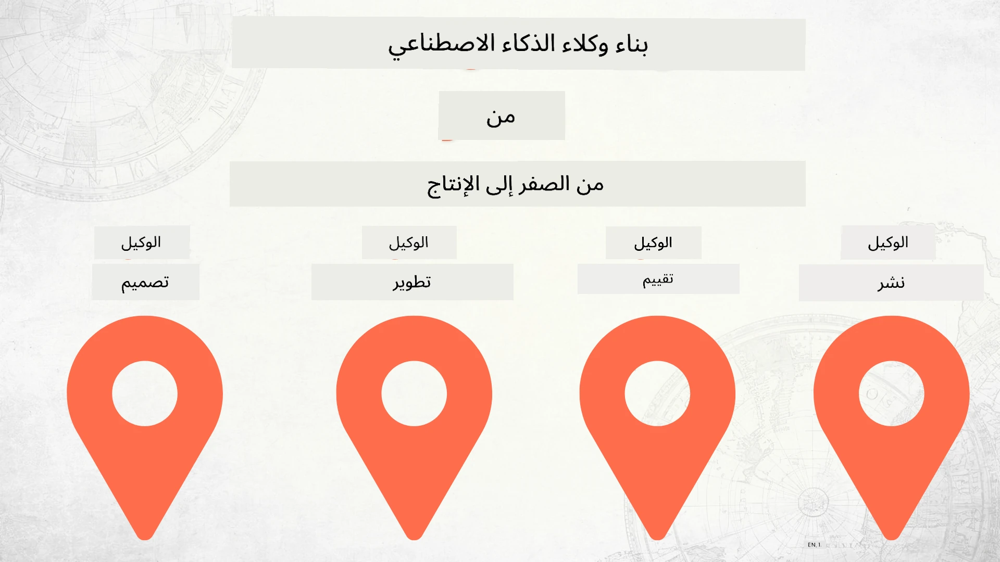

# بناء وكلاء الذكاء الاصطناعي من الصفر حتى الإنتاج



### 🌐 دعم متعدد اللغات

#### مدعوم عبر GitHub Action (آلي ودائم التحديث)

<!-- CO-OP TRANSLATOR LANGUAGES TABLE START -->
[العربية](./README.md) | [البنغالية](../bn/README.md) | [البلغارية](../bg/README.md) | [البورمية (ميانمار)](../my/README.md) | [الصينية (المبسطة)](../zh-CN/README.md) | [الصينية (التيشينية، هونغ كونغ)](../zh-HK/README.md) | [الصينية (التيشينية، ماكاو)](../zh-MO/README.md) | [الصينية (التيشينية، تايوان)](../zh-TW/README.md) | [الكرواتية](../hr/README.md) | [التشيكية](../cs/README.md) | [الدانماركية](../da/README.md) | [الهولندية](../nl/README.md) | [الإستونية](../et/README.md) | [الفنلندية](../fi/README.md) | [الفرنسية](../fr/README.md) | [الألمانية](../de/README.md) | [اليونانية](../el/README.md) | [العبرية](../he/README.md) | [الهندية](../hi/README.md) | [الهنغارية](../hu/README.md) | [الإندونيسية](../id/README.md) | [الإيطالية](../it/README.md) | [اليابانية](../ja/README.md) | [الكانادا](../kn/README.md) | [الخمير](../km/README.md) | [الكورية](../ko/README.md) | [الليتوانية](../lt/README.md) | [الماليزية](../ms/README.md) | [المالايالامية](../ml/README.md) | [الماراثية](../mr/README.md) | [النيبالية](../ne/README.md) | [النيجيرية بيدجين](../pcm/README.md) | [النرويجية](../no/README.md) | [الفارسية (فارسي)](../fa/README.md) | [البولندية](../pl/README.md) | [البرتغالية (البرازيل)](../pt-BR/README.md) | [البرتغالية (البرتغال)](../pt-PT/README.md) | [البنجابية (غورموخي)](../pa/README.md) | [الرومانية](../ro/README.md) | [الروسية](../ru/README.md) | [الصربية (السيريلية)](../sr/README.md) | [السلوفاكية](../sk/README.md) | [السلوفينية](../sl/README.md) | [الإسبانية](../es/README.md) | [السواحيلية](../sw/README.md) | [السويدية](../sv/README.md) | [التاغالوغية (الفلبينية)](../tl/README.md) | [التاميلية](../ta/README.md) | [التيلجو](../te/README.md) | [التايلاندية](../th/README.md) | [التركية](../tr/README.md) | [الأوكرانية](../uk/README.md) | [الأردية](../ur/README.md) | [الفيتنامية](../vi/README.md)

> **هل تفضل الاستنساخ محليًا؟**
>
> يحتوي هذا المستودع على ترجمات لأكثر من 50 لغة مما يزيد بشكل كبير من حجم التنزيل. لاستنساخ بدون الترجمات، استخدم الفحص النطاقي:
>
> **Bash / macOS / Linux:**
> ```bash
> git clone --filter=blob:none --sparse https://github.com/microsoft/Building-AI-Agents-From-Zero-To-Production.git
> cd Building-AI-Agents-From-Zero-To-Production
> git sparse-checkout set --no-cone '/*' '!translations' '!translated_images'
> ```
>
> **CMD (ويندوز):**
> ```cmd
> git clone --filter=blob:none --sparse https://github.com/microsoft/Building-AI-Agents-From-Zero-To-Production.git
> cd Building-AI-Agents-From-Zero-To-Production
> git sparse-checkout set --no-cone "/*" "!translations" "!translated_images"
> ```
>
> هذا يمنحك كل ما تحتاجه لإكمال الدورة مع تحميل أسرع بكثير.
<!-- CO-OP TRANSLATOR LANGUAGES TABLE END -->

## دورة تعلمك أساسيات دورة حياة تطوير وكلاء الذكاء الاصطناعي

[](https://github.com/microsoft/Building-AI-Agents-From-Zero-To-Production/blob/master/LICENSE?WT.mc_id=academic-105485-koreyst)
[](https://GitHub.com/microsoft/Building-AI-Agents-From-Zero-To-Production/graphs/contributors/?WT.mc_id=academic-105485-koreyst)
[](https://GitHub.com/microsoft/Building-AI-Agents-From-Zero-To-Production/issues/?WT.mc_id=academic-105485-koreyst)
[](https://GitHub.com/microsoft/Building-AI-Agents-From-Zero-To-Production/pulls/?WT.mc_id=academic-105485-koreyst)
[](http://makeapullrequest.com?WT.mc_id=academic-105485-koreyst)

[](https://discord.gg/Kuaw3ktsu6)

## 🌱 البدء

تحتوي هذه الدورة على دروس تغطي أساسيات بناء ونشر وكلاء الذكاء الاصطناعي.

كل درس يبني على الدرس السابق، لذا نوصي بالبدء من البداية والعمل حتى النهاية.

إذا كنت ترغب في استكشاف المزيد حول موضوعات وكلاء الذكاء الاصطناعي، يمكنك الاطلاع على [دورة وكلاء الذكاء الاصطناعي للمبتدئين](https://aka.ms/ai-agents-beginners).

### قابل متعلمين آخرين، واحصل على إجابات لأسئلتك

إذا واجهت صعوبة أو كان لديك أي أسئلة حول بناء وكلاء الذكاء الاصطناعي، انضم إلى قناتنا المخصصة على ديسكورد في [Microsoft Foundry Discord](https://discord.gg/Kuaw3ktsu6).

### ما تحتاجه


لكل درس عينة كود خاصة به يمكنك تشغيلها محليًا. يمكنك [فورك هذا الريبو](https://github.com/microsoft/Building-AI-Agents-From-Zero-To-Production/fork) لإنشاء نسختك الخاصة.

يستخدم هذا الدورة حاليًا ما يلي:

- [إطار عمل الوكيل من مايكروسوفت (MAF)](https://aka.ms/ai-agents-beginners/agent-framework)
- [Microsoft Foundry](https://azure.microsoft.com/products/ai-foundry) — مشروع مع نموذج **سلسلة GPT-5** منشور (على سبيل المثال `gpt-5.1`). لا تستخدم نماذج GPT-4o / GPT-4.1 المتقاعدة.
- [خدمة Azure OpenAI](https://azure.microsoft.com/products/ai-foundry/models/openai)
- [واجهة سطر أوامر Azure](https://learn.microsoft.com/cli/azure/authenticate-azure-cli?view=azure-cli-latest) — سجّل الدخول باستخدام الأمر `az login` قبل تشغيل أي نموذج
- **بايثون 3.12 أو أحدث**

يرجى التأكد من حصولك على إمكانية الوصول إلى هذه الخدمات قبل البدء.

> **💰 التكلفة والتنظيف.** الدروس العملية تنشئ موارد Azure حقيقية — مشروع Microsoft Foundry،
> نشر نموذج، مخزن متجهات، و (في الدروس 4-6) وكلاء وأدوات مستضافة.
> قد تتكبد تكلفة طالما هذه الموارد موجودة. عندما تنهي درسًا — أو الدورة — احذف
> الموارد التي لم تعد تحتاج إليها. أبسط نهج هو وضع كل شيء في مجموعة موارد مخصصة
> وحذف المجموعة بأكملها عندما تنتهي:
>
> ```bash
> az group delete --name <your-resource-group> --yes --no-wait
> ```
>
> يمكنك أيضًا حذف وكلاء فرديين، مخازن المتجهات، وأدوات من بوابة Foundry.

> **ملاحظة حول النماذج.** تقدم هذه الدورة كل النماذج من خلال **Microsoft Foundry**. ولا
> تستخدم *نماذج GitHub* التي سيتم إيقافها في **30 يوليو 2026** — Microsoft Foundry هو
> المسار الرسمي للترحيل. إذا كان لديك كود قديم يستدعي نماذج GitHub، وجهه إلى
> نشر نموذج في Foundry بدلاً من ذلك.

المزيد من الخيارات حول استضافة النماذج والخدمات قادمة قريبًا.

## 🗃️ الدروس

| **الدرس**         | **الوصف**                                                                                  |
|--------------------|--------------------------------------------------------------------------------------------------|
| [تصميم الوكيل](./lesson-1-agent-design/README.md)       | مقدمة إلى حالة استخدام وكيل "توجيه المطورين" وكيفية تصميم وكلاء فعالين  |
| [تطوير الوكيل](./lesson-2-agent-development/README.md)  | باستخدام إطار عمل الوكيل من مايكروسوفت (MAF)، بنِ مجموعة من الوكلاء المتخصصين لمساعدة المطورين الجدد على البدء.       |
| [تقييم الوكلاء](./lesson-3-agent-evals/README.md)  | باستخدام Microsoft Foundry، اكتشف مدى أداء وكلاء الذكاء الاصطناعي لدينا وكيفية تحسينهم. |
| [نشر الوكيل](./lesson-4-agentdeployment/README.md)   | باستخدام وكلاء مستضافين في Microsoft Foundry وOpenAI ChatKit، تعرف على كيفية نشر وكيل ذكاء اصطناعي في الإنتاج.       |
| [وكلاء الإنتاج المستضافين](./lesson-5-hosted-agents-production/README.md)   | خذ وكيلًا مستضافًا إلى بيئة إنتاج المؤسسات: الفرق بين الوكلاء المستضافين والمستضيفين القادرين، وإعداد التخزين والذاكرة والحكم الخاص بك.       |
| [أدوات مايكروسوفت](./lesson-6-toolbox/README.md)   | عرّف الأدوات مرة واحدة وتحكم بها مركزيًا: أنشئ صندوق أدوات، واستهلكه من وكيل عبر نقطة نهاية MCP واحدة، ونسخ الأدوات بأمان.       |
| [الوكلاء المتعددون والبروتوكول بين الوكلاء (A2A)](./lesson-7-multi-agent-a2a/README.md)   | كوّن الوكلاء كخدمات مترابطة: اكشف عن وكيل عبر بروتوكول الوكيل-إلى-الوكيل المفتوح واطلب وكيلًا بعيدًا كندّ.       |


## 🎒 دورات أخرى

ينتج فريقنا دورات أخرى! تفقد:

<!-- CO-OP TRANSLATOR OTHER COURSES START -->
### LangChain
[](https://aka.ms/langchain4j-for-beginners)
[](https://aka.ms/langchainjs-for-beginners?WT.mc_id=m365-94501-dwahlin)
[](https://github.com/microsoft/langchain-for-beginners?WT.mc_id=m365-94501-dwahlin)
---

### Azure / Edge / MCP / الوكلاء
[](https://github.com/microsoft/AZD-for-beginners?WT.mc_id=academic-105485-koreyst)
[](https://github.com/microsoft/edgeai-for-beginners?WT.mc_id=academic-105485-koreyst)
[](https://github.com/microsoft/mcp-for-beginners?WT.mc_id=academic-105485-koreyst)
[](https://github.com/microsoft/ai-agents-for-beginners?WT.mc_id=academic-105485-koreyst)

---
 
### سلسلة الذكاء الاصطناعي التوليدي

[](https://github.com/microsoft/generative-ai-for-beginners?WT.mc_id=academic-105485-koreyst)
[-9333EA?style=for-the-badge&labelColor=E5E7EB&color=9333EA)](https://github.com/microsoft/Generative-AI-for-beginners-dotnet?WT.mc_id=academic-105485-koreyst)
[-C084FC?style=for-the-badge&labelColor=E5E7EB&color=C084FC)](https://github.com/microsoft/generative-ai-for-beginners-java?WT.mc_id=academic-105485-koreyst)
[-E879F9?style=for-the-badge&labelColor=E5E7EB&color=E879F9)](https://github.com/microsoft/generative-ai-with-javascript?WT.mc_id=academic-105485-koreyst)

---
 
### التعلم الأساسي
[](https://aka.ms/ml-beginners?WT.mc_id=academic-105485-koreyst)
[](https://aka.ms/datascience-beginners?WT.mc_id=academic-105485-koreyst)
[](https://aka.ms/ai-beginners?WT.mc_id=academic-105485-koreyst)
[](https://github.com/microsoft/Security-101?WT.mc_id=academic-96948-sayoung)
[](https://aka.ms/webdev-beginners?WT.mc_id=academic-105485-koreyst)
[](https://aka.ms/iot-beginners?WT.mc_id=academic-105485-koreyst)
[](https://github.com/microsoft/xr-development-for-beginners?WT.mc_id=academic-105485-koreyst)

---
 
### سلسلة المساعد الذكي
[](https://aka.ms/GitHubCopilotAI?WT.mc_id=academic-105485-koreyst)
[](https://github.com/microsoft/mastering-github-copilot-for-dotnet-csharp-developers?WT.mc_id=academic-105485-koreyst)
[](https://github.com/microsoft/CopilotAdventures?WT.mc_id=academic-105485-koreyst)
<!-- CO-OP TRANSLATOR OTHER COURSES END -->

## المساهمة

يرحب هذا المشروع بالمساهمات والاقتراحات. تتطلب معظم المساهمات موافقتك على
اتفاقية ترخيص المساهمين (CLA) التي تعلن فيها أنك تمتلك الحق، وأنك فعلاً تمنحنا
حقوق استخدام مساهمتك. لمزيد من التفاصيل، زوروا <https://cla.opensource.microsoft.com>.

عند تقديم طلب سحب، سيقوم روبوت CLA تلقائياً بتحديد ما إذا كنت بحاجة إلى تقديم
اتفاقية CLA وتزيين طلب السحب بشكل مناسب (مثل، تحقق الحالة، تعليق). ببساطة اتبع التعليمات
المقدمة من الروبوت. ستحتاج إلى القيام بهذا مرة واحدة فقط في جميع المستودعات التي تستخدم CLA الخاص بنا.

اعتمد هذا المشروع [مدونة قواعد السلوك للمصدر المفتوح من مايكروسوفت](https://opensource.microsoft.com/codeofconduct/).
لمزيد من المعلومات، راجع [الأسئلة الشائعة حول مدونة قواعد السلوك](https://opensource.microsoft.com/codeofconduct/faq/) أو
تواصل مع [opencode@microsoft.com](mailto:opencode@microsoft.com) لأي استفسارات أو تعليقات إضافية.

## العلامات التجارية

قد يحتوي هذا المشروع على علامات تجارية أو شعارات لمشاريع أو منتجات أو خدمات. يخضع الاستخدام المصرح به لعلامات مايكروسوفت التجارية أو الشعارات
ويجب أن يتبع
[إرشادات العلامات التجارية والهوية لمايكروسوفت](https://www.microsoft.com/legal/intellectualproperty/trademarks/usage/general).
يجب ألا يؤدي استخدام علامات مايكروسوفت التجارية أو الشعارات في نسخ معدلة من هذا المشروع إلى أي لبس أو التباس أو إيحاء برعاية مايكروسوفت.
يخضع أي استخدام لعلامات تجارية أو شعارات طرف ثالث لسياسات تلك الأطراف الثالثة.

## الحصول على المساعدة

إذا واجهت صعوبة أو كان لديك أي أسئلة حول بناء تطبيقات الذكاء الاصطناعي، انضم إلى:

[](https://discord.gg/Kuaw3ktsu6)

إذا كان لديك ملاحظات على المنتج أو أخطاء أثناء البناء، قم بزيارة:

[](https://aka.ms/foundry/forum)

---

<!-- CO-OP TRANSLATOR DISCLAIMER START -->
**تنويه**:
تمت ترجمة هذا المستند باستخدام خدمة الترجمة بالذكاء الاصطناعي [Co-op Translator](https://github.com/Azure/co-op-translator). بينما نسعى للدقة، يرجى العلم أن الترجمات الآلية قد تحتوي على أخطاء أو عدم دقة. يجب اعتبار المستند الأصلي بلغته الأصلية المصدر الرسمي والمعتمد. للمعلومات الهامة، يُنصح بالاستعانة بترجمة بشرية محترفة. نحن غير مسؤولين عن أي سوء فهم أو تفسير ناتج عن استخدام هذه الترجمة.
<!-- CO-OP TRANSLATOR DISCLAIMER END -->