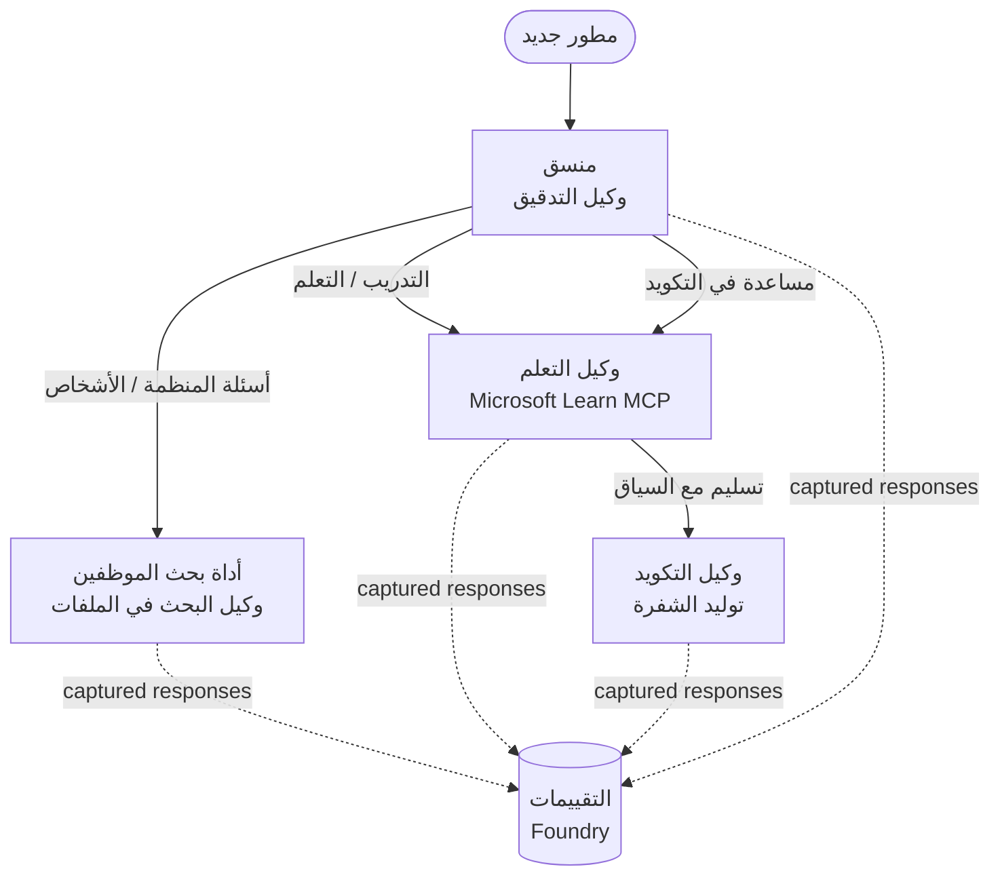

# الدرس 3: تقييم الوكلاء باستخدام Microsoft Foundry

مرحبًا بك في الدرس الثالث من دورة **"بناء وكلاء الذكاء الاصطناعي من الصفر إلى الإنتاج"**!

في [الدرس 2](../lesson-2-agent-development/README.md) قمت ببناء الوكلاء. في هذا الدرس ستتعلم
كيفية الإجابة على سؤال أصعب بكثير: **هل هم جيدون؟** إطلاق وكيل يعمل أمر سهل؛
معرفة ما إذا كان يوجه بشكل صحيح، يبقى مرتبطًا ببياناتك، ويستخدم أداواته بشكل مناسب
هو ما يميز العرض التوضيحي عن نظام الإنتاج.

في هذا الدرس سنغطي:

- لماذا تقييم الوكلاء مهم وكيف يختلف عن الاختبار التقليدي
- الفرق بين **الملاحظة**، **اختبارات التدخين**، و**التقييمات**
- سير العمل متعدد الوكلاء الذي سنقوم بقياسه
- أدوات التقييم المدمجة في **Microsoft Foundry** (الملاءمة، الترابط مع البيانات، دقة استدعاء الأداة، استخدام مخرجات الأداة)
- شرح خطوة بخطوة لأنبوب التقييم في [`agent-evals.py`](../../../lesson-3-agent-evals/agent-evals.py)
- كيفية تشغيله وقراءة النتائج

---

## لماذا نقيم الوكلاء؟

الاختبار التقليدي للوحدة يثبت أن `add(2, 2) == 4`. الوكلاء لا يعملون بتلك الطريقة — نفس
المطالبة يمكن أن تنتج صياغات مختلفة في كل مرة، يمكن استدعاء الأدوات بترتيب مختلف، و
"الصحيح" كثيرًا ما يكون مسألة درجة بدلاً من قيمة منطقية. لا يمكنك أن تثبت على سلاسل نصية دقيقة.

بدلًا من ذلك، تقوم بتقييم الوكلاء عبر **أبعاد الجودة** باستخدام أدوات *تقييمية* تعتمد على النماذج
(تُسمى أيضًا "LLM-كقاضٍ") بالإضافة إلى الفحوصات الحتمية على استخدام الأدوات. هذا يخبرك بأشياء مثل:

- هل أجاب الجواب فعليًا على السؤال؟ (**الملاءمة**)
- هل الجواب مدعوم بالبيانات المسترجعة، أم أن الوكيل تخيل؟ (**الترابط مع البيانات**)
- هل استدعى الوكيل الأداة الصحيحة بالمعاملات الصحيحة؟ (**دقة استدعاء الأداة**)
- هل استخدم الوكيل فعليًا ما أعادته الأداة؟ (**استخدام مخرجات الأداة**)

### ثلاث طبقات تكاملية للجودة

هذه ليست تقنيات متنافسة — الوكيل الإنتاجي يستخدم الثلاثة جميعًا:

| الطبقة | السؤال الذي تجيبه | التكلفة | متى تعمل | مغطى في |
|-------|--------------------|------|--------------|------------|
| **الملاحظة / التتبع** | *ما الذي فعله الوكيل، خطوة بخطوة؟* | مجاني (دائمًا مُفعّل) | بشكل مستمر في الإنتاج | هذا الدرس |
| **اختبارات التدخين** | *هل الوكيل متاح ويتبع مطالبه الأساسية؟* | رخيص، ثوانٍ | في كل نشر | [الدرس 4](../lesson-4-agentdeployment/README.md#smoke-testing-the-hosted-agent-ci-gate) |
| **التقييمات** | *ما مدى **جودة** الردود؟* | أبطأ، تعتمد على النموذج | عند الطلب / ليليًا / قبل الإصدار | هذا الدرس |

اختبارات التدخين تجيب "هل تعطل؟"؛ التقييمات تجيب "هل هو جيد؟". تريد كلاهما.

---

## المتطلبات الأساسية

1. إتمام [الدرس 2](../lesson-2-agent-development/README.md) (الوكلاء + مخزن المتجهات).
2. مشروع **Microsoft Foundry**.
3. مصادقة **Azure CLI**: `az login`.
4. **بايثون 3.12+** وتثبيت تبعيات الدورة:

   ```bash
   pip install -r ../requirements.txt
   ```


5. متغيرات البيئة (أنشئ ملف `.env` في هذا المجلد أو صدّرها):

   | المتغير | الغرض |
   |----------|---------|
   | `FOUNDRY_PROJECT_ENDPOINT` | نقطة نهاية مشروع Foundry الخاص بك (`https://<account>.services.ai.azure.com/api/projects/<project>`). تُقرأ بواسطة `FoundryChatClient` الخاص بالوكلاء **و** مساعد التقييم. |
   | `FOUNDRY_MODEL` | نشر النموذج الذي يعمل عليه **الوكلاء** (مثال: `gpt-5.1`). |
   | `VECTOR_STORE_ID` | متجر المتجهات لدليل الموظفين الذي تم إنشاؤه في الدرس 2 |
   | `AZURE_AI_MODEL_DEPLOYMENT_NAME` | نشر النموذج المستخدم **بواسطة المقيمين** (افتراضيًا إلى `FOUNDRY_MODEL`، ثم `gpt-5.1`) |

> يستخدم الوكلاء `FoundryChatClient`، الذي يقرأ الإعدادات من المتغيرات التي تبدأ بـ `FOUNDRY_`
> (`FOUNDRY_PROJECT_ENDPOINT`، `FOUNDRY_MODEL`). يستخدم مساعد التقييم السحابي
> حزمة SDK `azure-ai-projects` وسيتراجع إلى `FOUNDRY_PROJECT_ENDPOINT` إذا لم يتم تعيين
> `AZURE_AI_PROJECT_ENDPOINT` — لذا فإن متغيري `FOUNDRY_` كافيان
> لتشغيل الدرس بأكمله.
>
> يتم تشغيل المقيمين أنفسهم بواسطة نموذج، لذا يتحكم `AZURE_AI_MODEL_DEPLOYMENT_NAME`
> في أي نشر يقوم بالتقييم — لا يجب أن يكون نفس النموذج الذي يستخدمه
> وكلاؤك.

---

## سير العمل الذي نقوم بتقييمه

لتقييم شيء ما، يجب أولًا تشغيله. يعيد هذا الدرس استخدام سير عمل **التهيئة للمطور**
متعدد الوكلاء: يقوم منسق **الفرز** بتحويل المهام إلى ثلاثة متخصصين.



تم بناء سير العمل باستخدام تنظيم **التسليم** في إطار عمل Microsoft Agent. الفكرة الأساسية
للتقييم هي أن **كل دور لوكيل يتم حفظه على الخادم** ويتم تمييزه بواسطة
`response_id`. هذه المعرفات هي ما نقدمه إلى خدمة التقييم.

---

## خط أنابيب التقييم، خطوة بخطوة

يقوم [`agent-evals.py`](../../../lesson-3-agent-evals/agent-evals.py) بتنفيذ خط أنابيب من ست خطوات. إليك ما تفعله كل خطوة
ولماذا.

### الخطوة 1 — تشغيل سير العمل وتتبع معرفات الاستجابة

يتم تنفيذ سير العمل باستخدام `run_stream(...)`، وأثناء تدفق الأحداث يقوم الكود بتسجيل
المعرفات `response_id` و `conversation_id` التي ينتجها كل وكيل. الردود المحفوظة هي المادة الخام
للتقييم — أنت تقوم بتقييم الردود الحقيقية المنتجة، وليس التي يعاد توليدها.


### الخطوة 2 — تلخيص ما تم التقاطه

يتم طباعة ملخص سريع يوضح عدد الردود التي أنتجها كل وكيل، حتى تتمكن من التأكد من أن سير العمل
قد استخدم الوكلاء الذين تنوي تقييمهم فعليًا.

### الخطوة 3 — جلب الردود النهائية

لكل وكيل، يتم استرجاع آخر `response_id` من خلال عميل متوافق مع OpenAI الخاص بالمشروع
(`project_client.get_openai_client().responses.retrieve(...)`) حتى تتمكن من معاينة
النص الذي سيتم تقييمه.

### الخطوة 4 — إنشاء التقييم

يتم إنشاء تقييم بأربعة **مقيمين مدمجين من Foundry**:

| المقيم | `evaluator_name` | ما يقيسه |
|-----------|------------------|------------------|

| الصلة | `builtin.relevance` | هل تستجيب الإجابة لطلب المستخدم؟ |

| الثبات | `builtin.groundedness` | هل الرد مدعوم ببيانات تم استرجاعها/أدوات (ليس تخيليًا)؟ |
| دقة استدعاء الأداة | `builtin.tool_call_accuracy` | هل تم استدعاء الأدوات الصحيحة مع الوسائط الصحيحة؟ |
| استخدام مخرجات الأدوات | `builtin.tool_output_utilization` | هل استخدم الوكيل فعليًا نتائج الأدوات في إجابته؟ |

يتم تهيئة كل مقيم باستخدام النشر المسمى بواسطة `AZURE_AI_MODEL_DEPLOYMENT_NAME`.

> **لماذا هؤلاء الأربعة؟** تقيس الصلة والثبات *جودة الإجابة*؛ يقيس المثبتان الخاصان بالأدوات *السلوك الوكلي* — الجزء الذي تغفل عنه مؤشرات معالجة اللغة الطبيعية التقليدية تمامًا. بالنسبة لنظام متعدد الوكلاء يستخدم الأدوات، غالبًا ما تكون مؤشرات الأدوات هي المكان الذي تخفي فيه التراجع الحقيقي.
> 


### الخطوة 5 — تنفيذ التقييم

يتم تمرير معرفات `response_id` التي تم التقاطها إلى `evals.runs.create(...)` كمصدر للبيانات. تقوم الخدمة بإعادة تشغيل كل رد مخزن عبر كل مقيم.


### الخطوة 6 — مراقبة وقراءة النتائج

تقوم الشفرة بالاستطلاع حتى يتم الانتهاء من التشغيل أو فشله، ثم تطبع أعداد النتائج و
**`report_url`** — رابط عميق في بوابة Foundry حيث يمكنك فحص الدرجات لكل مقياس،
أعداد النجاح/الفشل، والردود التي تم الحكم عليها فرديًا.

---

## تشغيله

```bash
cd lesson-3-agent-evals
python agent-evals.py
```

بشكل افتراضي، يقوم بتقييم استعلام المثال الأول
(`"أنا جديد هنا! هل عمل أحد في Microsoft هنا؟"`). يتم تضمين استعلامين إضافيين متعددَي النوايا
في `run_evaluation_workflow()` — قم بتبديل متغير `query` لتجربة سيناريوهات التوجيه
التي تشمل المزيد من الوكلاء في تشغيل واحد.

تدفق وحدة التحكم المتوقع:

```
Step 1: Running Developer Onboarding Workflow
Step 2: Response Data Summary
Step 3: Fetching Agent Responses
Step 4: Creating Evaluation
Step 5: Running Evaluation
Step 6: Monitoring Evaluation
  Status: running ...
  Evaluation completed successfully
  Report URL: https://...   <-- open this in the Foundry portal
```

---

## المراقبة والتتبع

تخبرك التقييمات *بمدى جودة* الردود؛ **المراقبة** تخبرك *بما حدث*
لإنتاجها — كل خطوة عبر الوكلاء، استدعاء الأداة، عدد الرموز، والزمن المستغرق. في Microsoft Foundry،
تصدر تشغيلات الوكلاء تتبعات OpenTelemetry التي يمكنك عرضها في البوابة، ويمكن لإطار الوكيل
تصديرها إلى Azure Monitor / Application Insights باستدعاء واحد:

```python
from agent_framework.foundry import FoundryChatClient

client = FoundryChatClient()
client.configure_azure_monitor()   # تصدير التتبعات + القياسات إلى Application Insights
```

استخدم التتبع لـ **تصحيح** درجة تقييم ضعيفة: عندما ينخفض الثبات، يظهر التتبع ما إذا كانت أداة البحث عن الملفات لم تُرجع شيئًا، أو أعادت بيانات تجاهلها الوكيل (وهو بالضبط ما يقيسه استخدام مخرجات الأداة).


---

## من "التشغيلات" إلى "الجيد": كيفية استخدام هذا في الممارسة

- **بوابة ما قبل الإصدار.** تشغيل تقييمات مقابل مجموعة ثابتة من الاستعلامات التمثيلية قبل
  ترقية مطالبة جديدة أو نموذج. قارن الدرجات مع النسخة السابقة — اعتبر الانخفاض انتكاسة.
- **إشارة جودة ليلية.** جدولة التقييم لالتقاط الانحرافات الناتجة عن البيانات أو تغييرات الاعتماد.
- **الإقران باختبارات التدخين.** [اختبار التدخين للدرس 4](../lesson-4-agentdeployment/README.md#smoke-testing-the-hosted-agent-ci-gate)
  هو بوابة سريعة لكل نشر؛ التقييمات هي بوابة جودة أعمق وأبطأ. شغل الاختبار الرخيص
  في كل دمج والاختبار المكلف بشكل مجدول أو قبل الإصدار.


---

## ملاحظة التحديث

يجري ترحيل هذا المثال إلى سطح واجهة برمجة تطبيقات إطار الوكيل الحالي لـ Microsoft Foundry
(`agent_framework.foundry`). إذا كنت تقوم بتحديث الكود، راجع دليل الترحيل في جذر المستودع
[`MIGRATION-GUIDE.md`](../MIGRATION-GUIDE.md) للخرائط المؤكدة قبل/بعد الاستيراد والعميل
(مثلًا `AzureAIClient` -> `FoundryChatClient`، وبناء الأدوات المستضافة عبر
`client.get_file_search_tool(...)` / `client.get_mcp_tool(...)`). مفاهيم التقييم وخط الأنابيب المكون من ست خطوات أعلاه لم تتغير بفعل هذا الترحيل.


---

## الموارد

- [تقييم نماذج وتطبيقات الذكاء الاصطناعي التوليدي (Microsoft Learn)](https://learn.microsoft.com/en-us/azure/ai-foundry/concepts/evaluation-approach-gen-ai)
- [المقومون المدمجون للذكاء الاصطناعي التوليدي](https://learn.microsoft.com/en-us/azure/ai-foundry/concepts/evaluation-evaluators/agent-evaluators)
- [المراقبة في Microsoft Foundry](https://learn.microsoft.com/en-us/azure/ai-foundry/concepts/observability)
- [إطار عمل الوكيل من Microsoft](https://github.com/microsoft/agent-framework)
- [تنسيق تسليم الوكيل](https://learn.microsoft.com/en-us/agent-framework/workflows/orchestrations/handoff)

---

<!-- CO-OP TRANSLATOR DISCLAIMER START -->
**تنويه**:
تمت ترجمة هذا المستند باستخدام خدمة الترجمة بالذكاء الاصطناعي [Co-op Translator](https://github.com/Azure/co-op-translator). بينما نسعى للدقة، يرجى العلم أن الترجمات الآلية قد تحتوي على أخطاء أو عدم دقة. يجب اعتبار المستند الأصلي بلغته الأصلية المصدر الرسمي والمعتمد. للمعلومات الهامة، يُنصح بالاستعانة بترجمة بشرية محترفة. نحن غير مسؤولين عن أي سوء فهم أو تفسير ناتج عن استخدام هذه الترجمة.
<!-- CO-OP TRANSLATOR DISCLAIMER END -->