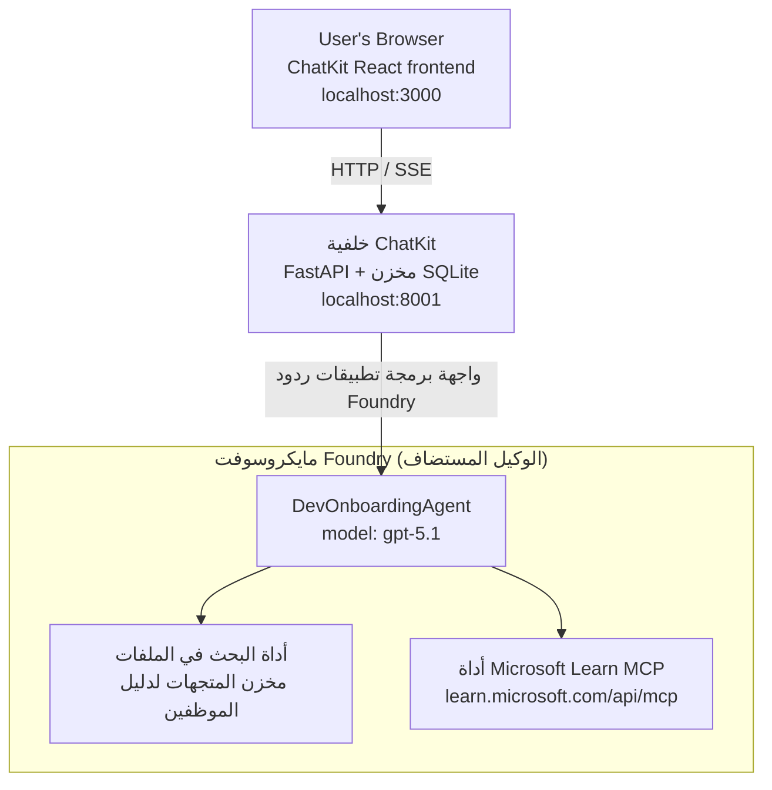

# الدرس 4: نشر الوكيل مع وكلاء Microsoft Foundry المستضافين + ChatKit

يوضح هذا الدرس كيفية نشر وكيل يستخدم الأدوات في Microsoft Foundry كوكيل مستضاف وإنشاء واجهة أمامية تعتمد على ChatKit للتفاعل معه.

## البنية الهندسية

الوكيل المستضاف هو **وكيل `DevOnboardingAgent` واحد** (يعمل على `gpt-5.1`) يجيب على أسئلة التهيئة للمطورين باستخدام أداتين مستضافتين: أداة **بحث الملفات** عبر مخزن متجهات دليل الموظفين، وأداة **Microsoft Learn MCP**. تتحدث واجهة React الخاصة بـ ChatKit إلى خلفية FastAPI، التي تستدعي الوكيل عبر واجهة برمجة التطبيقات **Responses API** في Foundry.



## المتطلبات المسبقة

1. **مشروع Microsoft Foundry** في منطقة شمال وسط الولايات المتحدة
2. **Azure CLI** مصادق عليه (`az login`)
3. **Azure Developer CLI** (`azd`) مثبت
4. **بايثون 3.12+** و **Node.js 18+**
5. **مخزن متجهات** تم إنشاؤه باستخدام بيانات الموظفين

## بدء سريع

### 1. إعداد متغيرات البيئة

```bash
cd lesson-4-agentdeployment
cp .env.example .env
# حرر ملف .env بمعلومات مشروع Microsoft Foundry الخاص بك
```

### 2. نشر الوكيل المستضاف

**الخيار أ: استخدام Azure Developer CLI (موصى به)**

```bash
cd hosted-agent
azd auth login
azd agent deploy
```

**الخيار ب: استخدام Docker + Azure Container Registry**

```bash
cd hosted-agent

# بناء الحاوية
docker build -t developer-onboarding-agent:latest .

# العلامة لـ ACR
docker tag developer-onboarding-agent:latest <your-acr>.azurecr.io/developer-onboarding-agent:latest

# الدفع إلى ACR
az acr login --name <your-acr>
docker push <your-acr>.azurecr.io/developer-onboarding-agent:latest

# النشر عبر بوابة Microsoft Foundry أو SDK
```

### 3. بدء خلفية ChatKit

```bash
cd chatkit-server
python -m venv .venv
source .venv/bin/activate  # في ويندوز: .venv\Scripts\activate
pip install -r requirements.txt
python app.py
```

سيبدأ الخادم على `http://localhost:8001`

### 4. بدء الواجهة الأمامية لـ ChatKit

```bash
cd chatkit-server/frontend
npm install
npm run dev
```

ستبدأ الواجهة الأمامية على `http://localhost:3000`

### 5. اختبار التطبيق

افتح `http://localhost:3000` في متصفحك وجرب هذه الاستفسارات:

**بحث الموظفين:**
- "أنا جديد هنا! هل عمل أحدهم في Microsoft؟"
- "من لديه خبرة في Azure Functions؟"

**مصادر التعلم:**
- "إنشاء مسار تعلم لـ Kubernetes"
- "ما الشهادات التي يجب أن أتابعها لهندسة السحابة؟"

**مساعدة في البرمجة:**
- "ساعدني في كتابة كود Python للاتصال بـ CosmosDB"
- "أرني كيف أنشئ Azure Function"

**استفسارات متعددة الوكلاء:**
- "أنا أبدأ كمهندس سحابة. مع من يجب أن أتواصل وماذا يجب أن أتعلم؟"

## هيكل المشروع

```
lesson-4-agentdeployment/
├── .env.example                 # Environment variables template
├── implementation-plan.md       # Detailed implementation guide
├── README.md                    # This file
├── hosted-agent/               # Microsoft Foundry hosted agent
│   ├── main.py                 # Multi-agent workflow implementation
│   ├── requirements.txt        # Python dependencies
│   ├── Dockerfile              # Container definition
│   └── agent.yaml              # Agent deployment configuration
└── chatkit-server/             # ChatKit server application
    ├── app.py                  # FastAPI backend
    ├── store.py                # SQLite persistence layer
    ├── requirements.txt        # Python dependencies
    └── frontend/               # React frontend
        ├── package.json
        ├── vite.config.ts
        ├── tsconfig.json
        ├── index.html
        └── src/
            ├── main.tsx
            ├── App.tsx
            ├── App.css
            └── index.css
```

## الوكيل وأدواته

الوكيل المستضاف هو **وكيل واحد** (`DevOnboardingAgent`، معرف في `hosted-agent/main.py`) يتعامل مع ثلاثة مجالات تهيئة. بدلاً من التنسيق بين وكلاء فرعيين منفصلين، فإنه يكشف عن كل قدرة كأداة (أو يعتمد مباشرة على النموذج):

| القدرة | كيف يتم التعامل معها | الأداة |
|-----------|------------------|------|
| **بحث الموظفين والاتصالات** | بحث ملفات مستضاف في Foundry عبر مخزن متجهات دليل الموظفين | `client.get_file_search_tool(vector_store_ids=[...])` |
| **التعلم والتدريب** | خادم Microsoft Learn MCP (أداة MCP مستضافة) | `client.get_mcp_tool(url="https://learn.microsoft.com/api/mcp")` |
| **مساعدة البرمجة** | تتم مباشرة بواسطة نموذج `gpt-5.1` — بدون أداة خارجية | — |

يتم إنشاء الوكيل باستخدام `client.as_agent(name="DevOnboardingAgent", instructions=..., tools=[file_search_tool, learn_mcp_tool])` ويُشغل بواسطة `from_agent_framework(agent).run()`.

> **ملاحظة تصميم.** استخدمت مسودات سابقة من هذا الدرس سير عمل وكيل متعدد `HandoffBuilder` (توجيه → المتخصصين). الوكيل المشحون هو وكيل يستخدم أداة واحدة، وهو أبسط للنشر والفهم لأسئلة وأجوبة التهيئة. لمثال على تنسيق الوكلاء المتعددين والتسليمات، راجع الدرس 2 والدرس 3.

## اختبار التدخين للوكيل المستضاف (بوابة CI)

إن نشر وكيل مستضاف "بنجاح" يثبت فقط أن
لوحة التحكم قبلت التعريف — لكنه **لا** يثبت أن الوكيل يجيب فعليًا. اعتماد مفقود،
توجيه نموذج خاطئ، أو اتصال منتهي يمكن أن يترك وكيلًا أخضر لكن صامتًا.

يرسل هذا الدرس اختبار تدخين خفيف الوزن يعمل كبوابة
سريعة ورخيصة بعد النشر. يستخدم إجراءات GitHub [AI Smoke Test](https://github.com/marketplace/actions/ai-smoke-test)
لإرسال طلبات POST إلى نقطة نهاية **Responses** للوكيل في Foundry
(`POST {project_endpoint}/agents/{agent_name}/endpoint/protocols/openai/responses`)
ويؤكد على النص المُعاد. يلتقط نشرات مكسورة، تراجعات المصادقة،
انحراف موجه النظام، وتعطيل خيوط المحادثة في ثوانٍ.

> اختبارات التدخين **ليست** بديلاً عن التقييمات الكاملة في
> [الدرس 3](../lesson-3-agent-evals/README.md) — إنها مكملة لها. اختبارات التدخين
> تجيب على *"هل الوكيل متاح، يرد، ويتبع توقعات الموجه الأساسية؟"*;
> التقييمات تجيب على *"ما مدى جودة الرد؟"*. شغل البوابة الرخيصة عند كل نشر.

### ما يتم اختباره

يعيش الكتالوج في [`hosted-agent/tests/smoke-tests.json`](../../../lesson-4-agentdeployment/hosted-agent/tests/smoke-tests.json)
ويمارس المجالات الثلاثة للوكيل بالإضافة إلى الالتزام بالموجه والخيوط متعددة الأدوار:

| الاختبار | ما يتحقق منه |
|------|------------------|
| `reachability` | يرد الوكيل بنص غير فارغ وفي النطاق |
| `employee-search` | مجال بحث الملفات يعيد حالة `200` سليمة (الرد يعتمد على البيانات) |
| `learning-path` | مجال التعلم يعكس الموضوع وينتج إجابة بأسلوب مسار |
| `coding-assistance` | مجال البرمجة يعيد جوابًا كودياً بـ Python |
| `prompt-adherence-offtopic` | يتم إعادة توجيه طلب خارج الموضوع، لا يتم الرد عليه بالتفصيل |
| `threading-turn-1/2` | يحتفظ بحالة المحادثة بين الأدوار عبر `previous_response_id` |

### تشغيله في CI

سير العمل في [`.github/workflows/smoke-test-hosted-agent.yml`](../../../.github/workflows/smoke-test-hosted-agent.yml)
يحتوي على مهمتين:

- **`static`** — بوابة سريعة بدون Azure تعمل على كل طلب سحب ودفع:
  تقوم بتجميع كل مصادر بايثون (`py_compile`) وتتحقق من روابط Markdown. لا تتطلب أسرار،
  لذلك تعمل على طلبات السحب من الفروع.
- **`smoke`** — اختبار التدخين المتصل بـ Azure أدناه. يعمل عند الطلب
  (Actions → **Agent CI (static + smoke)** → تشغيل سير العمل) ويمكن ربطه بعد
  سير عمل النشر الخاص بك.

قم بتكوين هذه **المتغيرات** و**الأسرار** للمستودع لوظيفة الاختبار التدخيني:

| النوع | الاسم | القيمة |
|------|------|-------|

| متغير | `FOUNDRY_PROJECT_ENDPOINT` | `https://<account>.services.ai.azure.com/api/projects/<project>` |
| متغير | `HOSTED_AGENT_NAME` | اسم الوكيل المنشور (مثل `dev-onboarding` — يجب أن يتطابق مع نشراتك) |
| سر | `AZURE_CLIENT_ID` / `AZURE_TENANT_ID` / `AZURE_SUBSCRIPTION_ID` | هوية موحدة OIDC لـ `azure/login` |

تحتاج هوية المشغل إلى دور **`Azure AI User`** على **نطاق مشروع Foundry** لكي تتمكن من
استدعاء نقاط النهاية لبيانات الاستجابات (والمحادثات). امنحه ذلك عبر:

```bash
az role assignment create \
  --assignee <object-id-or-appId-of-runner-identity> \
  --role "Azure AI User" \
  --scope "/subscriptions/<sub>/resourceGroups/<rg>/providers/Microsoft.CognitiveServices/accounts/<account>/projects/<project>"
```

### تشغيله محليًا

يمكنك تشغيل نفس الكتالوج قبل الدفع. احصل على رمز مميز لطائرة البيانات بنطاق
`https://ai.azure.com/` ووجه المشغل إلى نشراتك:

```bash
# يجب أن يكون الجمهور https://ai.azure.com/ (تُرفض رموز cognitiveservices.azure.com)
export FOUNDRY_TOKEN=$(az account get-access-token --resource https://ai.azure.com/ --query accessToken -o tsv)

git clone https://github.com/JFolberth/ai-smoketest && cd ai-smoketest
python runner.py \
  --project-endpoint "https://<account>.services.ai.azure.com/api/projects/<project>" \
  --agent-name dev-onboarding \
  --tests-file ../lesson-4-agentdeployment/hosted-agent/tests/smoke-tests.json
```

رموز الخروج: `0` كل شيء ناجح، `1` فشل تحقق، `2` خطأ في المشغل (كتالوج/رمز مميز خاطئ).

## استكشاف الأخطاء وإصلاحها

### الوكيل لا يستجيب
- تحقق من أن الوكيل المُستضاف منشور ويعمل في Microsoft Foundry
- تحقق من تطابق `HOSTED_AGENT_NAME` و `HOSTED_AGENT_VERSION` مع نشراتك

### أخطاء متجر المتجهات
- تأكد من تعيين `VECTOR_STORE_ID` بشكل صحيح
- تحقق من أن متجر المتجهات يحتوي على بيانات الموظف

### أخطاء المصادقة
- شغّل `az login` لتحديث بيانات الاعتماد
- تأكد من أن لديك صلاحية الوصول إلى مشروع Microsoft Foundry

## الموارد

- [توثيق وكلاء Microsoft Foundry المستضافين](https://learn.microsoft.com/en-us/azure/ai-foundry/agents/concepts/hosted-agents)
- [إطار عمل الوكيل من مايكروسوفت](https://github.com/microsoft/agent-framework)
- [مثال التكامل مع ChatKit](https://github.com/microsoft/agent-framework/tree/main/python/samples/demos/chatkit-integration)
- [واجهة سطر أوامر مطور Azure](https://learn.microsoft.com/en-us/azure/developer/azure-developer-cli/overview)
- [إجراء اختبار دخان AI على GitHub](https://github.com/marketplace/actions/ai-smoke-test)
- [مدونة: اختبار دخان وكلاء Microsoft Foundry باستخدام إجراءات GitHub](https://techcommunity.microsoft.com/blog/azuredevcommunityblog/smoke-test-microsoft-foundry-agents-with-github-actions/4531912)

---

## الخطوات التالية

يعمل وكيلك على بنية تحتية تُدار من مايكروسوفت. للانتقال به إلى الإنتاج المؤسسي —
للتحكم في مكان تخزين بياناته (سيادة البيانات، الشبكات الخاصة، إحضار Azure الخاص بك
Cosmos DB / Storage / AI Search) والحكم على أدواته — تابع إلى
**[الدرس 5: الوكلاء المستضافون في الإنتاج](../lesson-5-hosted-agents-production/README.md)**، الذي
يشرح الفرق الحاسم بين **الوكلاء المستضافين** و **مضيفي القدرات**.

---

<!-- CO-OP TRANSLATOR DISCLAIMER START -->
**تنويه**:
تمت ترجمة هذا المستند باستخدام خدمة الترجمة بالذكاء الاصطناعي [Co-op Translator](https://github.com/Azure/co-op-translator). بينما نسعى للدقة، يرجى العلم أن الترجمات الآلية قد تحتوي على أخطاء أو عدم دقة. يجب اعتبار المستند الأصلي بلغته الأصلية المصدر الرسمي والمعتمد. للمعلومات الهامة، يُنصح بالاستعانة بترجمة بشرية محترفة. نحن غير مسؤولين عن أي سوء فهم أو تفسير ناتج عن استخدام هذه الترجمة.
<!-- CO-OP TRANSLATOR DISCLAIMER END -->