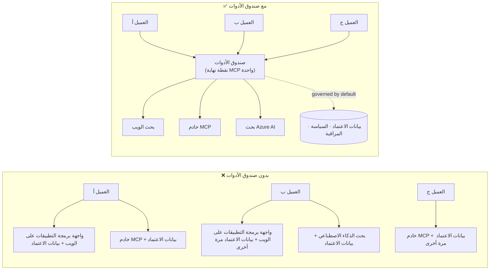

# الدرس 6: صندوق أدوات مايكروسوفت — أدوات مُدارة للوكلاء

في [الدرس 5](../lesson-5-hosted-agents-production/README.md) يتم تشغيل الوكيل المُستضاف الخاص بك في
بيئة الإنتاج مع وضع التخزين والحكم الذي تحتاجه منظمتك. لكن ارجع إلى
وكيل الدرس 4: كل أداة كانت **مشفرة صلبًا** داخل `main.py` — عنوان URL الخاص بـ Microsoft Learn MCP،
مخزن متجهات البحث في الملفات، وهكذا. هذا يعمل لوكيل واحد. لكنه **لا** يتوسع إلى
منظمة بها عشرات من الوكلاء والفرق.

يقدم هذا الدرس **صندوق أدوات مايكروسوفت**: الطريقة التي يتيح بها Foundry لك تعريف مجموعة منتقاة من
الأدوات **مرة واحدة**، إدارتها **مركزيًا**، وتمكين أي وكيل من استخدامها عبر **نقطة نهاية مُدارة واحدة،**
ومتوافقة مع MCP.

## أهداف التعلم

بحلول نهاية هذا الدرس ستكون قادرًا على:

- شرح مشكلة انتشار الأدوات التي يحلها صندوق الأدوات.
- وصف أعمدة **البناء** و**الاستهلاك** وأنواع الأدوات التي يمكن أن يحتويها صندوق الأدوات.
- **بناء** إصدار من صندوق أدوات باستخدام Foundry SDK.
- **استهلاك** صندوق أدوات من وكيل مستضاف باستخدام إطار عمل Microsoft Agent عبر نقطة نهاية MCP واحدة.
- استخدام **الإصدار** لشحن تغييرات الأدوات بدون تغييرات في كود الوكيل أو إعادة نشر.
- تطبيق **الحوكمة**: التحكم في الوصول بناءً على الأدوار، حقن بيانات الاعتماد، وسياسات الحماية (RAI).

---

## المتطلبات الأساسية

1. إتمام [الدرس 4](../lesson-4-agentdeployment/README.md) ومن الأفضل أيضًا
   [الدرس 5](../lesson-5-hosted-agents-production/README.md).
2. مشروع **Microsoft Foundry** مع صلاحية لإنشاء وإدارة موارد صندوق الأدوات.
3. المصادقة على **Azure CLI**: `az login`. APIs صندوق أدوات Foundry تتطلب
   نطاق رمز `https://ai.azure.com/.default` (مبين في الكود أدناه).
4. **بايثون 3.12+** مع تثبيت تبعيات الدورة (`pip install -r ../requirements.txt`).
5. نشر نموذج حالي وغير متقاعد (مثل `gpt-5.1`). تجنب GPT-4o / GPT-4.1 المتقاعدة.

---

## 1. المشكلة: انتشار الأدوات

يمكن لوكيل واحد أن يعتمد على العديد من الأدوات — APIs REST، خوادم MCP، الموصلات، والتدفقات — كل
منها له نموذج المصادقة الخاص به وفريقه المالك. عند التوسع عبر منظمة:

- تقوم الفرق **بإعادة تنفيذ نفس الأدوات** بشكل مستقل.
- تُكرّر **بيانات الاعتماد** عبر الوكلاء والمستودعات.
- تصبح **الحوكمة غير متسقة** — كل وكيل ينفذ (أو ينسى) السياسة بمفرده.
- هناك **رؤية محدودة** لما هي الأدوات الموجودة ومن يستخدمها.

يتوقف المطورون — ليس لأن النماذج غير قادرة، ولكن لأن **تكامل الأدوات يصبح
عنق الزجاجة**.



تمتلك المؤسسات بالفعل البنية التحتية — البوابات، خزائن بيانات الاعتماد، السياسات، الرصد.
ما كان مفقودًا هو تجربة تطوير تغلف هذه العناصر في شيء **قابل لإعادة الاستخدام،
قابل للاكتشاف، وتخضع لحوكمة افتراضية**. هذا هو صندوق الأدوات.

---

## 2. ما هو صندوق الأدوات

صندوق الأدوات هو **مورد مُدار في Foundry**. تقوم بتعريف مجموعة منتقاة من الأدوات مرة واحدة، تديرها
مركزيًا في Foundry، وتكشفها من خلال **نقطة نهاية واحدة متوافقة مع MCP** يمكن لأي

يمكن للوكيل استهلاكه. في وقت التشغيل يدير النظام الأساسي **حقن بيانات الاعتماد، تحديث الرموز، وتنفيذ سياسات المؤسسة**.
 

نظرًا لأن صندوق الأدوات هو مورد مُدار، يمكنك إضافة أدوات أو إزالتها أو إعادة تكوينها **دون تغيير الكود في وكيلك** — فالوكيل يتصل دائمًا بنفس نقطة النهاية.
 

يغطي صندوق الأدوات دورة حياة الأداة من خلال أربعة أعمدة؛ **الإنشاء** و **الاستهلاك** متوفرتان
اليوم:

| العمود | الحالة | ما يتيحه |
|--------|--------|-----------------|
| **الإنشاء** | متوفر اليوم | اختيار الأدوات، تكوين المصادقة مركزيًا، نشر صندوق أدوات قابل لإعادة الاستخدام يمكن لأي فريق استهلاكه. |
| **الاستهلاك** | متوفر اليوم | ربط أي وكيل بنقطة نهاية متوافقة مع MCP لاكتشاف جميع الأدوات في صندوق الأدوات وتنفيذها ديناميكيًا. |

واجهة الاستهلاك **مفتوحة**: يمكن لأي وقت تشغيل أو عميل متوافق مع MCP استخدام صندوق الأدوات — 
Microsoft Agent Framework، LangGraph، GitHub Copilot، Claude Code، Microsoft Copilot Studio، أو 
كود مخصص.

### أنواع الأدوات التي يمكن أن يحتويها صندوق الأدوات

البحث على الويب · MCP · Azure AI Search · مفسر الشفرة · البحث في الملفات · OpenAPI · **وكيل إلى وكيل
(A2A)** · Fabric IQ · البحث في الأدوات · Work IQ · أتمتة المتصفح · مراجع المهارات، بالإضافة إلى 
**سياسة الحماية (RAI)** المطبقة على طبقة صندوق الأدوات.

> **نصيحة:** أضف `الوصف` إلى **كل** أداة حتى يتمكن النموذج من اختيار الأداة المناسبة. يسمح صندوق الأدوات 
> بأقصى حد **أداة واحدة بدون اسم لكل نوع** — امنح كل مثيل إضافي من نفس النوع `اسم` فريد، وإلا ستواجه خطأ `invalid_payload`.
 

---

## 3. بناء صندوق أدوات

تتم إدارة صناديق الأدوات باستخدام Foundry SDKs (Python/.NET/JavaScript)، واجهة REST، `azd`، و
**مجموعة أدوات Microsoft Foundry لبرنامج VS Code**. هذا هو نمط Python (`azure-ai-projects`):

```python
from azure.identity import DefaultAzureCredential
from azure.ai.projects import AIProjectClient
from azure.ai.projects.models import MCPTool, ToolboxSearchPreviewTool, WebSearchTool

endpoint = "https://<your-foundry-account>.services.ai.azure.com/api/projects/<your-project>"
project = AIProjectClient(endpoint=endpoint, credential=DefaultAzureCredential())

toolbox_version = project.toolboxes.create_toolbox_version(
    name="agent-tools",
    description="Web search + an MCP server + tool search",
    tools=[
        WebSearchTool(),
        MCPTool(
            server_label="myserver",
            server_url="https://your-mcp-server.example.com",
            require_approval="never",
            project_connection_id="my-key-auth-connection",  # بيانات الاعتماد موجودة في Foundry
        ),
        ToolboxSearchPreviewTool(),
    ],
)
print(f"Created toolbox: {toolbox_version.name}, version: {toolbox_version.version}")
```

لاحظ ما لا تفعله: لا أسرار في الوكيل. تحتفظ بيانات الاعتماد بواسطة 
**اتصال** في Foundry (`project_connection_id`) ويتم حقنها بواسطة النظام الأساسي عند وقت الاتصال.

> **ملاحظة المعاينة.** إدارة صندوق الأدوات **(إنشاء/تحديث الإصدارات)** هي ميزة معاينة.
> عمليات `project.toolboxes.*` الموضحة أعلاه تعمل في إصدارات معاينة من SDK، وواجهة REST، و`azd`،
> و**مجموعة أدوات Foundry لبرنامج VS Code** — هي **ليست** موجودة في `azure-ai-projects` المثبتة 
> والمستخدمة في أماكن أخرى من هذه الدورة. اعتبر المقتطف أعلاه كهيكل خطوة الإنشاء؛ للمسار 
> الكامل، أنشئ صندوق الأدوات في **بوابة Foundry** أو **مجموعة أدوات Foundry**. خطوة **الاستهلاك** أدناه 
> تعمل حاليًا مع SDK المثبت في الدورة.

---

## 4. استهلاك صندوق أدوات من وكيلك

يكشف صندوق الأدوات عن نقطة نهاية **MCP**. هناك نمطان:

| الدور | نقطة النهاية | متى تستخدم |
|------|----------|-------------|
| **مستهلك صندوق الأدوات** | `{project_endpoint}/toolboxes/{name}/mcp?api-version=v1` | ربط الوكلاء. يخدم دائمًا **الإصدار الافتراضي**. |
| **مطور صندوق الأدوات** | `{project_endpoint}/toolboxes/{name}/versions/{version}/mcp?api-version=v1` | اختبار إصدار معين قبل ترقيته. |


> **اتصل بالوكلاء على نقطة النهاية *المستهلك*.** لأنه يخدم دائمًا الإصدار الافتراضي، أنت

> يمكن الترويج لإصدارات جديدة **دون تغيير كود العميل أو إعادة النشر**.

### التكامل مع عميل مستضاف بإطار عمل Microsoft Agent

تذكر أن عميل الدرس الرابع أضاف أداة MCP واحدة مشفرة ضمنياً باستخدام `client.get_mcp_tool(...)`. مع
Toolbox، تشير بدلاً من ذلك إلى **أداة واحدة** `MCPStreamableHTTPTool` على نقطة نهاية صندوق الأدوات — ويحصل العميل
على **كل** الأدوات في صندوق الأدوات، مع الحوكمة المركزية:

```python
import httpx
from azure.identity import DefaultAzureCredential, get_bearer_token_provider
from agent_framework import MCPStreamableHTTPTool

# المصادقة: تتطلب صندوق أدوات Foundry صلاحية https://ai.azure.com/.default
credential = DefaultAzureCredential()
token_provider = get_bearer_token_provider(credential, "https://ai.azure.com/.default")
http_client = httpx.AsyncClient(auth=_ToolboxAuth(token_provider), timeout=120.0)

TOOLBOX_ENDPOINT = os.environ["TOOLBOX_ENDPOINT"]  # تم حقنها بواسطة المنصة أثناء وقت التشغيل

mcp_tool = MCPStreamableHTTPTool(
    name="toolbox",
    url=TOOLBOX_ENDPOINT,
    http_client=http_client,
    load_prompts=False,
)

agent = chat_client.as_agent(
    name="my-toolbox-agent",
    instructions="You are a helpful assistant with access to Foundry toolbox tools.",
    tools=[mcp_tool],
)
```

الملف `.env` المقابل (ملاحظة: استخدم نموذج **حالي** مثل `gpt-5.1`، **ليس** النموذج المنسحب
`gpt-4o`):

```env
FOUNDRY_PROJECT_ENDPOINT=https://<account>.services.ai.azure.com/api/projects/<project>
TOOLBOX_ENDPOINT=https://<account>.services.ai.azure.com/api/projects/<project>/toolboxes/agent-tools/mcp?api-version=v1
AZURE_AI_MODEL_DEPLOYMENT_NAME=gpt-5.1
```

> **تحقق أولاً.** قبل ربط العميل الكامل، قم بتوصيل SDK عميل MCP (`pip install mcp`) بنقطة النهاية الخاصة بالإصدار
> وقم بإدراج الأدوات لتأكيد تحميلها كما هو متوقع.

### تشغيل مثال الاستهلاك

يشتمل هذا الدرس على مثال قابل للتشغيل على جانب الاستهلاك، [`toolbox_agent.py`](../../../lesson-6-toolbox/toolbox_agent.py). يستخدم
نفس نمط `FoundryChatClient.get_mcp_tool(...)` الذي تعلمته في الدرس 2، ولكنه يشير إلى أداة MCP واحدة على
نقطة نهاية **صندوق الأدوات** — لذا يحصل العميل على كل أداة محكومة في صندوق الأدوات:

```bash
# في ملف .env الخاص بك، قم بتعيين TOOLBOX_ENDPOINT إلى نقطة نهاية مستهلك الصندوق الخاص بك، ثم:
python lesson-6-toolbox/toolbox_agent.py
```

افتح عنوان URL المطبوعة `http://localhost:8096` واطرح سؤالاً يُستخدم فيه أحد أدوات
صندوق الأدوات الخاص بك. أضف أداة أو حدث أداة في صندوق الأدوات واطرح السؤال مرة أخرى — **دون تغيير هذا
الكود** — لمشاهدة الحوكمة المركزية والإصدار يعملان.

---

## 5. إصدار النسخ: نشر تغييرات الأدوات بأمان

يتيح الإصدار في صندوق الأدوات تحكمًا صريحًا في وقت تنفيذ التغييرات:

1. **إنشاء** إصدار جديد من صندوق الأدوات مع مجموعة الأدوات المحدثة.
2. **اختبار** الإصدار عبر نقطة النهاية الخاصة بالإصدار (للمطور).
3. **الترويج** له إلى `default_version` عندما تكون جاهزًا.

كل عميل يشير إلى نقطة نهاية **المستهلك** يلتقط الإصدار المروج تلقائيًا — **بدون تغييرات في الكود، بدون إعادة نشر**. (الإصدار الأول الذي تُنشئه يُروج تلقائيًا كافتراضي.)


ثم تقلب الافتراضي لكل المستهلكين دفعة واحدة.


---

## 6. الحوكمة: كيف يحسن Toolbox التحكم

صندوق الأدوات **محكوم افتراضيًا**. رافعات الحوكمة التي يجب أن تعرفها:

- **التحكم بالوصول بناءً على الأدوار (RBAC).** منح دور **Foundry User** في المشروع لكل هوية: **المطور** الذي
  يدير إصدارات صندوق الأدوات، و**الهوية المُدارة للعميل** (لعملاء مستضافين يستدعون الأدوات أثناء التشغيل)،
  ولتدفقات OAuth، **المستخدم النهائي** الذي تُحاكي هويته.
- **بيانات الاعتماد المركزية.** تعيش بيانات اعتماد الأدوات في **connections** في Foundry، وليس في كود العميل
  أو ملفات `.env`. تقوم المنصة بحقنها وتجديد الرموز عند التشغيل.
- **قواعد الحماية (سياسة RAI).** ألحق سياسة ذكاء مسؤول مسماة بإصدار صندوق الأدوات عبر
  `policies.rai_config.rai_policy_name`. تعمل على **طبقة صندوق الأدوات**، مستقلة عن أي
  فلتر محتوى على مستوى النموذج، تفحص مدخلات ومخرجات الأدوات.
- **موافقة MCP.** تتحكم الخاصية `require_approval` لكل أداة MCP فيما إذا كانت مكالمة أداة MCP تحتاج موافقة —
  نفس مفهوم سير عمل الموافقة الذي رأيته في [الدرس 5 §7](../lesson-5-hosted-agents-production/README.md#7-hosted-mcp-tools--approval-workflows).
- **الشبكات الخاصة.** يدعم صندوق الأدوات تكوينات الشبكة الافتراضية للمؤسسات التي
  تحافظ على المرور داخل شبكتها.
- **الرؤية.** لأن الأدوات مفهرسة مركزيًا، تحصل أخيرًا على جرد لما
  هو موجود ومن يستخدمه.

---

## تمارين تطبيقية

1. **إعادة هيكلة الدرس 4.** عميل الدرس 4 يشفّر أداة Microsoft Learn MCP. ارسم كيف
   ستنقل تلك الأداة إلى صندوق أدوات `agent-tools` وتُعيد توجيه `main.py` إلى نقطة استهلاك صندوق الأدوات.
   ما التغييرات في `main.py`؟ ما الذي لم يعد موجودًا هناك؟
2. **تصميم ترقية إصدار.** تحتاج لإضافة أداة بحث ويب إلى صندوق أدوات حي يستخدمه خمسة
   عملاء. صف تسلسل الإنشاء → الاختبار → الترويج وشرح لماذا لا يحتاج أي من العملاء الخمسة
   إلى إعادة نشر.
3. **اختيار الهويات الموثقة.** لعميل مستضاف يستدعي أداة MCP قائمة على OAuth عبر
   صندوق الأدوات، أدرج الهويات التي تحتاج إلى دور **Foundry User** ولماذا.
4. **تعيين حواجز الحماية.** اشرح الفرق بين فلتر محتوى على مستوى النموذج
   وحاجز حماية في صندوق الأدوات، وقدم سيناريو واحد تحتاج فيه حاجز الحماية في صندوق الأدوات تحديدًا.

---

## الموارد

- [إنشاء، اختبار، ونشر صندوق أدوات في Foundry](https://learn.microsoft.com/azure/foundry/agents/how-to/tools/toolbox)
- [فهرس الأدوات — خدمة عملاء Foundry](https://learn.microsoft.com/azure/foundry/agents/concepts/tool-catalog)
- [إطار عمل Microsoft Agent — موفر Microsoft Foundry (الأدوات)](https://learn.microsoft.com/agent-framework/agents/providers/microsoft-foundry)
- [نظرة عامة على الحواجز](https://learn.microsoft.com/azure/foundry/guardrails/guardrails-overview)
- [البدء مع Foundry في VS Code (مجموعة أدوات Foundry)](https://learn.microsoft.com/azure/ai-foundry/how-to/develop/get-started-projects-vs-code)
- [بروتوكول سياق النموذج](https://modelcontextprotocol.io/)

---

**السابق:** [الدرس 5 — عملاء مستضافون في الإنتاج](../lesson-5-hosted-agents-production/README.md)
&nbsp;·&nbsp; **التالي:** [الدرس 7 — العملاء المتعددون و A2A](../lesson-7-multi-agent-a2a/README.md)

---

<!-- CO-OP TRANSLATOR DISCLAIMER START -->
**تنويه**:
تمت ترجمة هذا المستند باستخدام خدمة الترجمة بالذكاء الاصطناعي [Co-op Translator](https://github.com/Azure/co-op-translator). بينما نسعى للدقة، يرجى العلم أن الترجمات الآلية قد تحتوي على أخطاء أو عدم دقة. يجب اعتبار المستند الأصلي بلغته الأصلية المصدر الرسمي والمعتمد. للمعلومات الهامة، يُنصح بالاستعانة بترجمة بشرية محترفة. نحن غير مسؤولين عن أي سوء فهم أو تفسير ناتج عن استخدام هذه الترجمة.
<!-- CO-OP TRANSLATOR DISCLAIMER END -->