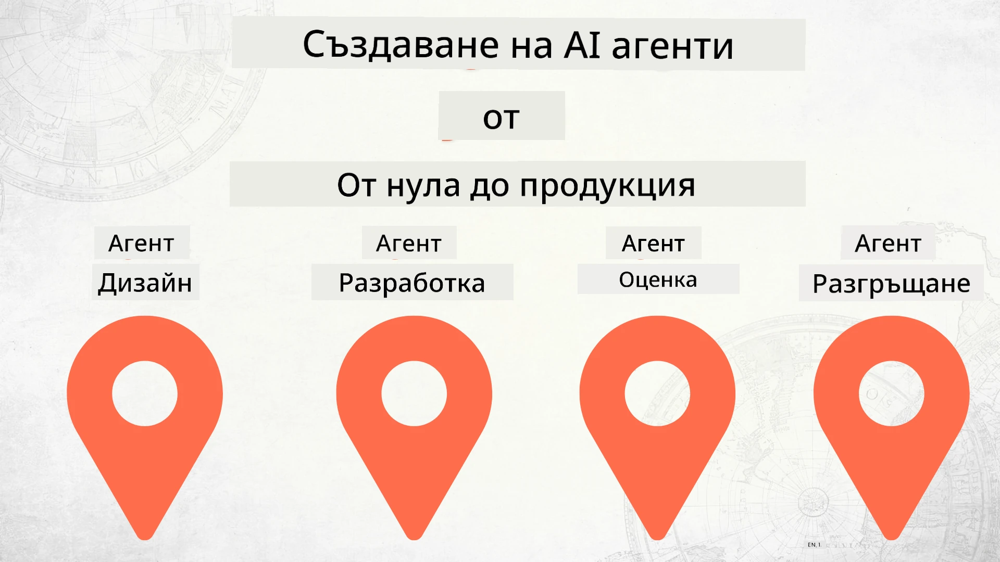

# Изграждане на AI агенти от нулата до продукция



### 🌐 Поддръжка на множество езици

#### Поддържа се чрез GitHub Action (Автоматично и винаги актуално)

<!-- CO-OP TRANSLATOR LANGUAGES TABLE START -->
[Arabic](../ar/README.md) | [Bengali](../bn/README.md) | [Bulgarian](./README.md) | [Burmese (Myanmar)](../my/README.md) | [Chinese (Simplified)](../zh-CN/README.md) | [Chinese (Traditional, Hong Kong)](../zh-HK/README.md) | [Chinese (Traditional, Macau)](../zh-MO/README.md) | [Chinese (Traditional, Taiwan)](../zh-TW/README.md) | [Croatian](../hr/README.md) | [Czech](../cs/README.md) | [Danish](../da/README.md) | [Dutch](../nl/README.md) | [Estonian](../et/README.md) | [Finnish](../fi/README.md) | [French](../fr/README.md) | [German](../de/README.md) | [Greek](../el/README.md) | [Hebrew](../he/README.md) | [Hindi](../hi/README.md) | [Hungarian](../hu/README.md) | [Indonesian](../id/README.md) | [Italian](../it/README.md) | [Japanese](../ja/README.md) | [Kannada](../kn/README.md) | [Khmer](../km/README.md) | [Korean](../ko/README.md) | [Lithuanian](../lt/README.md) | [Malay](../ms/README.md) | [Malayalam](../ml/README.md) | [Marathi](../mr/README.md) | [Nepali](../ne/README.md) | [Nigerian Pidgin](../pcm/README.md) | [Norwegian](../no/README.md) | [Persian (Farsi)](../fa/README.md) | [Polish](../pl/README.md) | [Portuguese (Brazil)](../pt-BR/README.md) | [Portuguese (Portugal)](../pt-PT/README.md) | [Punjabi (Gurmukhi)](../pa/README.md) | [Romanian](../ro/README.md) | [Russian](../ru/README.md) | [Serbian (Cyrillic)](../sr/README.md) | [Slovak](../sk/README.md) | [Slovenian](../sl/README.md) | [Spanish](../es/README.md) | [Swahili](../sw/README.md) | [Swedish](../sv/README.md) | [Tagalog (Filipino)](../tl/README.md) | [Tamil](../ta/README.md) | [Telugu](../te/README.md) | [Thai](../th/README.md) | [Turkish](../tr/README.md) | [Ukrainian](../uk/README.md) | [Urdu](../ur/README.md) | [Vietnamese](../vi/README.md)

> **Предпочитате локално клониране?**
>
> Това хранилище включва над 50 езикови превода, което значително увеличава размера за изтегляне. За да клонирате без преводи, използвайте sparse checkout:
>
> **Bash / macOS / Linux:**
> ```bash
> git clone --filter=blob:none --sparse https://github.com/microsoft/Building-AI-Agents-From-Zero-To-Production.git
> cd Building-AI-Agents-From-Zero-To-Production
> git sparse-checkout set --no-cone '/*' '!translations' '!translated_images'
> ```
>
> **CMD (Windows):**
> ```cmd
> git clone --filter=blob:none --sparse https://github.com/microsoft/Building-AI-Agents-From-Zero-To-Production.git
> cd Building-AI-Agents-From-Zero-To-Production
> git sparse-checkout set --no-cone "/*" "!translations" "!translated_images"
> ```
>
> Това ви осигурява всичко необходимо за завършване на курса с много по-бързо изтегляне.
<!-- CO-OP TRANSLATOR LANGUAGES TABLE END -->

## Курс, който ви учи на основите на жизнения цикъл на разработка на AI агенти

[](https://github.com/microsoft/Building-AI-Agents-From-Zero-To-Production/blob/master/LICENSE?WT.mc_id=academic-105485-koreyst)
[](https://GitHub.com/microsoft/Building-AI-Agents-From-Zero-To-Production/graphs/contributors/?WT.mc_id=academic-105485-koreyst)
[](https://GitHub.com/microsoft/Building-AI-Agents-From-Zero-To-Production/issues/?WT.mc_id=academic-105485-koreyst)
[](https://GitHub.com/microsoft/Building-AI-Agents-From-Zero-To-Production/pulls/?WT.mc_id=academic-105485-koreyst)
[](http://makeapullrequest.com?WT.mc_id=academic-105485-koreyst)

[](https://discord.gg/Kuaw3ktsu6)

## 🌱 Започване

Този курс съдържа уроци, които обхващат основите на изграждането и разгръщането на AI агенти.

Всеки урок надгражда предишния, затова препоръчваме да започнете от началото и да продължите до края.

Ако искате да проучите повече теми за AI агенти, можете да разгледате [Курс за AI агенти за начинаещи](https://aka.ms/ai-agents-beginners).

### Срещнете други учащи, получете отговори на въпросите си

Ако се забиете или имате въпроси за изграждането на AI агенти, присъединете се към нашия специализиран Discord канал в [Microsoft Foundry Discord](https://discord.gg/Kuaw3ktsu6).

### Какво ви е необходимо

Всеки урок има собствен примерен код, който можете да стартирате локално. Можете да [форкнете това хранилище](https://github.com/microsoft/Building-AI-Agents-From-Zero-To-Production/fork), за да създадете свое копие.

Този курс в момента използва следното:

- [Microsoft Agent Framework (MAF)](https://aka.ms/ai-agents-beginners/agent-framework)
- [Microsoft Foundry](https://azure.microsoft.com/products/ai-foundry)
- [Azure OpenAI Service](https://azure.microsoft.com/products/ai-foundry/models/openai)
- [Azure CLI](https://learn.microsoft.com/cli/azure/authenticate-azure-cli?view=azure-cli-latest)

Моля, уверете се, че имате достъп до тези услуги преди да започнете.

Още опции за хостване на модели и услуги ще бъдат налични скоро.

## 🗃️ Уроци

| **Урок**           | **Описание**                                                                                     |
|--------------------|-------------------------------------------------------------------------------------------------|
| [Проектиране на агент](./lesson-1-agent-design/README.md)       | Въведение в нашия случай на използване "Приемане на разработчик" и как да проектираме ефективни агенти  |
| [Разработка на агент](./lesson-2-agent-development/README.md)  | Използване на Microsoft Agent Framework (MAF), създайте 3 агента, които помагат новите разработчици при приемането им.       |
| [Оценка на агенти](./lesson-3-agent-evals/README.md)  | С помощта на Microsoft Foundry, разберете колко добре работят нашите AI агенти и как да ги подобрите. |
| [Разгръщане на агент](./lesson-4-agent-deployment/README.md)   | Използвайки Hosted Agents и OpenAI Chatkit, вижте как да разположите AI агент в продукция.       |


## 🎒 Други курсове

Нашият екип произвежда и други курсове! Разгледайте:

<!-- CO-OP TRANSLATOR OTHER COURSES START -->
### LangChain
[](https://aka.ms/langchain4j-for-beginners)
[](https://aka.ms/langchainjs-for-beginners?WT.mc_id=m365-94501-dwahlin)
[](https://github.com/microsoft/langchain-for-beginners?WT.mc_id=m365-94501-dwahlin)
---

### Azure / Edge / MCP / Агенти
[](https://github.com/microsoft/AZD-for-beginners?WT.mc_id=academic-105485-koreyst)
[](https://github.com/microsoft/edgeai-for-beginners?WT.mc_id=academic-105485-koreyst)
[](https://github.com/microsoft/mcp-for-beginners?WT.mc_id=academic-105485-koreyst)
[](https://github.com/microsoft/ai-agents-for-beginners?WT.mc_id=academic-105485-koreyst)

---

### Серия за Генеративен AI
[](https://github.com/microsoft/generative-ai-for-beginners?WT.mc_id=academic-105485-koreyst)
[-9333EA?style=for-the-badge&labelColor=E5E7EB&color=9333EA)](https://github.com/microsoft/Generative-AI-for-beginners-dotnet?WT.mc_id=academic-105485-koreyst)
[-C084FC?style=for-the-badge&labelColor=E5E7EB&color=C084FC)](https://github.com/microsoft/generative-ai-for-beginners-java?WT.mc_id=academic-105485-koreyst)
[-E879F9?style=for-the-badge&labelColor=E5E7EB&color=E879F9)](https://github.com/microsoft/generative-ai-with-javascript?WT.mc_id=academic-105485-koreyst)

---

### Основно обучение
[](https://aka.ms/ml-beginners?WT.mc_id=academic-105485-koreyst)
[](https://aka.ms/datascience-beginners?WT.mc_id=academic-105485-koreyst)
[](https://aka.ms/ai-beginners?WT.mc_id=academic-105485-koreyst)
[](https://github.com/microsoft/Security-101?WT.mc_id=academic-96948-sayoung)
[](https://aka.ms/webdev-beginners?WT.mc_id=academic-105485-koreyst)
[](https://aka.ms/iot-beginners?WT.mc_id=academic-105485-koreyst)
[](https://github.com/microsoft/xr-development-for-beginners?WT.mc_id=academic-105485-koreyst)

---
 
### Серия Copilot
[](https://aka.ms/GitHubCopilotAI?WT.mc_id=academic-105485-koreyst)
[](https://github.com/microsoft/mastering-github-copilot-for-dotnet-csharp-developers?WT.mc_id=academic-105485-koreyst)
[](https://github.com/microsoft/CopilotAdventures?WT.mc_id=academic-105485-koreyst)
<!-- CO-OP TRANSLATOR OTHER COURSES END -->

## Допринасяне

Този проект приветства приноси и предложения. Повечето приноси изискват да се съгласите с
Споразумение за права на приносител (CLA), в което декларирате, че имате право и наистина ни
предоставяте правата да използваме вашия принос. За подробности посетете <https://cla.opensource.microsoft.com>.

Когато изпратите pull request, ботът за CLA автоматично ще определи дали трябва да предоставите
CLA и ще отбележи PR съответно (например, проверка на статус, коментар). Просто следвайте инструкциите,
предоставени от бота. Това трябва да направите само веднъж за всички хранилища, използващи нашия CLA.

Този проект е приел [Кодекса за поведение на Microsoft Open Source](https://opensource.microsoft.com/codeofconduct/).
За повече информация вижте [Често задавани въпроси относно Кодекса за поведение](https://opensource.microsoft.com/codeofconduct/faq/) или
се свържете с [opencode@microsoft.com](mailto:opencode@microsoft.com) при допълнителни въпроси или коментари.

## Търговски марки

Този проект може да съдържа търговски марки или лога на проекти, продукти или услуги. Авторизираното използване на търговски марки или лога на Microsoft
е предмет на и трябва да следва
[Ръководството за търговски марки и бранд на Microsoft](https://www.microsoft.com/legal/intellectualproperty/trademarks/usage/general).
Използването на търговски марки или лога на Microsoft в модифицирани версии на този проект не трябва да причинява объркване или да предполага спонсорство от Microsoft.
Всяко използване на търговски марки или лога на трети страни е предмет на политиките на тези трети страни.

## Получаване на помощ

Ако имате затруднения или въпроси относно създаването на AI приложения, присъединете се към:

[](https://discord.gg/Kuaw3ktsu6)

Ако имате обратна връзка за продукта или грешки по време на разработка, посетете:

[](https://aka.ms/foundry/forum)

---

<!-- CO-OP TRANSLATOR DISCLAIMER START -->
**Отказ от отговорност**:  
Този документ е преведен чрез AI преводаческа услуга [Co-op Translator](https://github.com/Azure/co-op-translator). Въпреки че се стремим към точност, моля, имайте предвид, че автоматизираните преводи могат да съдържат грешки или неточности. Оригиналният документ на неговия оригинален език трябва да се счита за авторитетен източник. За критична информация се препоръчва професионален човешки превод. Ние не носим отговорност за никакви недоразумения или неправилни тълкувания, произтичащи от използването на този превод.
<!-- CO-OP TRANSLATOR DISCLAIMER END -->