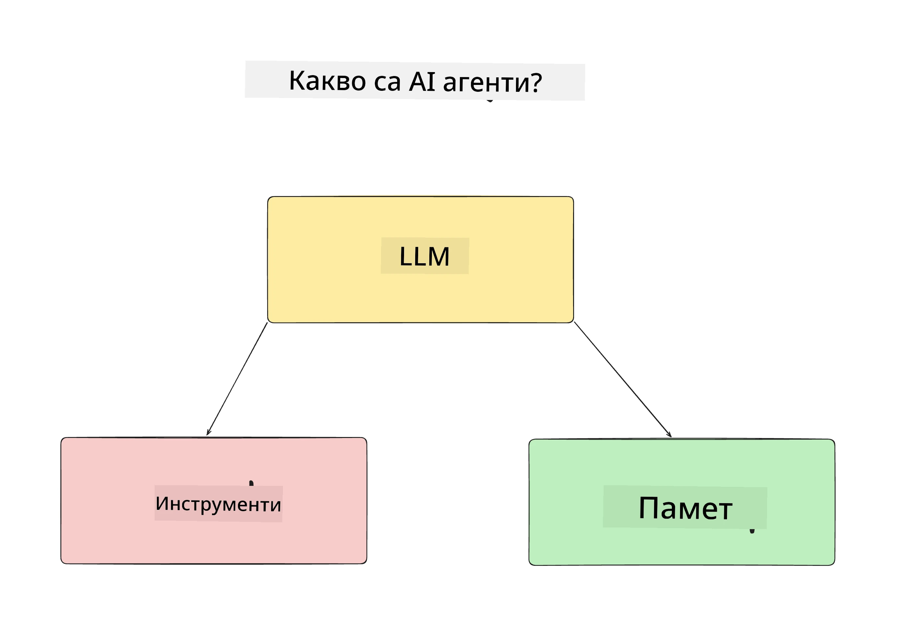
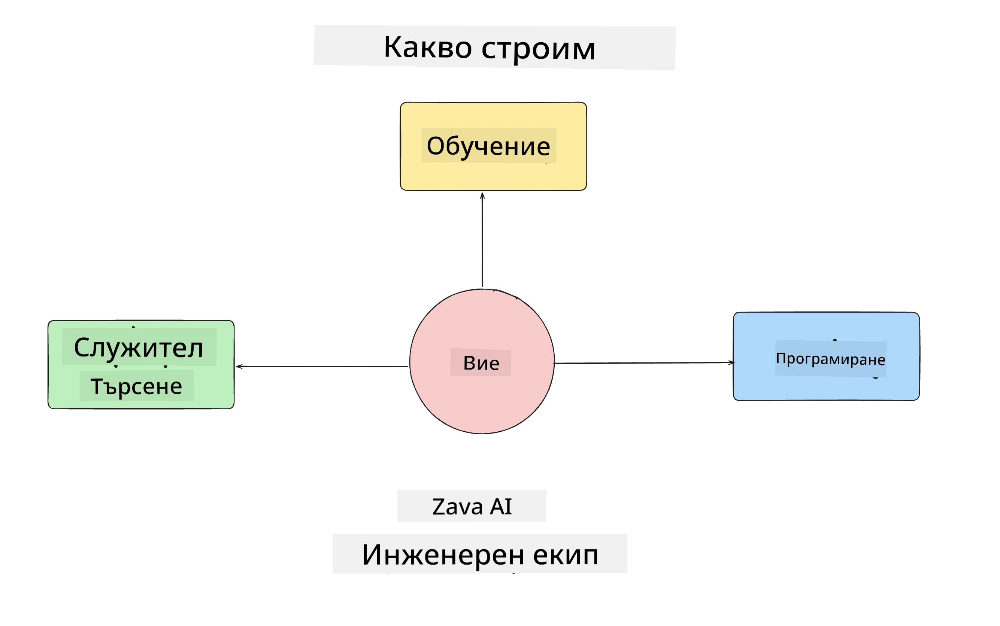
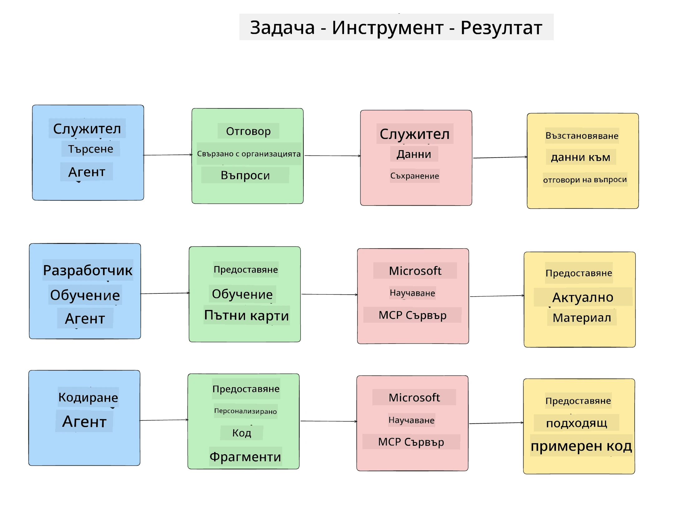
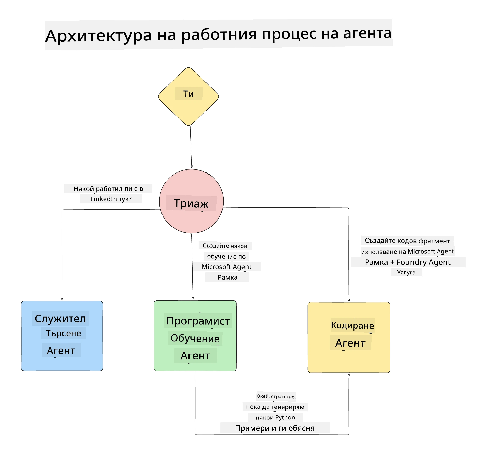

# Урок 1: Проектиране на AI Агент

Добре дошли в първия урок от курса "Създаване на AI Агент от Нула до Производство"!

В този урок ще разгледаме:

- Определяне какво са AI агентите
  
- Обсъждане на AI агентното приложение, което ще изграждаме  

- Идентифициране на необходимите инструменти и услуги за всеки агент
  
- Архитектиране на нашето агентно приложение
  
Нека започнем с определяне какво е агент и защо бихме го използвали в едно приложение.

> **Преди да започнете курса.** Този първи урок е концептуален — няма код за изпълнение.
> От [Урок 2](../lesson-2-agent-development/README.md) нататък ще ви е необходим: **абонамент за Azure** с достъп до **Microsoft Foundry**, разположен **GPT-5 series модел** (например `gpt-5.1` — избягвайте остарелите GPT-4o / GPT-4.1), **Python 3.12+** и **Azure CLI** (`az login`). Вижте [Какво ви е нужно](../README.md#what-you-need) в README на курса за пълен списък и връзки.

## Какво са AI Агентите?

Ако това е първият ви опит да разгледате как се изгражда AI агент, може да имате въпроси как точно да определите какво е AI агент.

Ето един прост начин да определим какво е AI агент чрез съставните му части:

**Голям езиков модел** - LLM ще захранва както способността за обработка на естествен език от потребителя за разбиране на задачата, която иска да изпълни, така и разчитането на описанията на наличните инструменти за изпълнение на тези задачи.

**Инструменти** - Това ще бъдат функции, API-та, хранилища на данни и други услуги, които LLM може да използва, за да изпълни задачите, поискащи от потребителя.

**Памет** - Това е начинът, по който съхраняваме както краткосрочните, така и дългосрочните взаимодействия между AI агента и потребителя. Съхраняването и извличането на тази информация е важно за подобренията и запазването на потребителските предпочитания с течение на времето.

## Нашият случай на употреба на AI Агент

За този курс ще изградим AI агентно приложение, което да помага на нови разработчици да се включват в нашия екип за AI агентно развитие!

Преди да започнем с разработката, първата стъпка към успешното AI агентно приложение е да дефинираме ясни сценарии за това как очакваме потребителите да работят с нашите AI агенти.

За това приложение ще работим със следните сценарии:

**Сценарий 1:** Нов служител се присъединява към организацията и иска да научи повече за екипа, в който е влязъл, и как да се свърже с тях.

**Сценарий 2:** Нов служител иска да разбере коя би била най-добрата първа задача, на която да започне да работи.

**Сценарий 3:** Нов служител иска да събере учебни ресурси и кодови примери, за да му помогнат да започне работа по задачата.

## Идентифициране на инструментите и услугите

Сега, след като имаме създадени тези сценарии, следващата стъпка е да ги свържем с инструментите и услугите, от които нашите AI агенти ще имат нужда, за да изпълнят тези задачи.

Този процес попада в категорията на Копускулно инженерство, тъй като ще се съсредоточим върху това нашите AI агенти да имат правилния контекст в подходящото време за изпълнението на задачите.

Нека направим това сцена по сцена и да извършим добър агентен дизайн, като изброим задачите, инструментите и желаните резултати за всеки агент.

### Сценарий 1 - Агент за търсене на служители

**Задача** - Отговаряне на въпроси за служители в организацията, като дата на присъединяване, текущ екип, местоположение и последна позиция.

**Инструменти** - Хранилище с текущ списък на служителите и организационна схема

**Резултати** - Способност за извличане на информация от хранилището за отговор на общи организационни въпроси и конкретни въпроси за служителите.

### Сценарий 2 - Агент за препоръка на задачи

**Задача** - Въз основа на опита на новия служител като разработчик, да предложи 1-3 задачи, по които новият служител може да работи.

**Инструменти** - GitHub MCP сървър за получаване на отворени задачи и изграждане на профил на разработчика

**Резултати** - Способност за четене на последните 5 комита на GitHub профил и отворени задачи по GitHub проект и правене на препоръки на базата на съвпадение

### Сценарий 3 - Агент асистент по кодиране

**Задача** - Въз основа на препоръчаните от агента "Препоръка на задачи" отворени задачи, да изследва и предоставя ресурси и да генерира кодови фрагменти за помощ на служителя.

**Инструменти** - Microsoft Learn MCP за търсене на ресурси и Code Interpreter за генериране на персонализирани кодови фрагменти.

**Резултати** - Ако потребителят поиска допълнителна помощ, работният поток трябва да използва сървъра Learn MCP за предоставяне на връзки и фрагменти от ресурси и след това да прехвърли към агента Code Interpreter за генериране на малки кодови фрагменти с обяснения.

## Архитектура на нашето агентно приложение

След като определихме всеки от нашите агенти, нека създадем диаграма на архитектурата, която ще ни помогне да разберем как всеки агент ще работи заедно и поотделно в зависимост от задачата:

## Следващи стъпки

След като проектирахме всеки агент и нашата агента система, нека преминем към следващия урок, в който ще разработим всеки от тези агенти!

---

<!-- CO-OP TRANSLATOR DISCLAIMER START -->
**Отказ от отговорност**:
Този документ е преведен с помощта на AI преводачески услуга [Co-op Translator](https://github.com/Azure/co-op-translator). Въпреки че се стремим към точност, моля имайте предвид, че автоматизираните преводи могат да съдържат грешки или неточности. Оригиналният документ на неговия роден език трябва да се счита за авторитетен източник. За критична информация се препоръчва професионален човешки превод. Ние не носим отговорност за каквито и да е недоразумения или неправилни тълкувания, произтичащи от използването на този превод.
<!-- CO-OP TRANSLATOR DISCLAIMER END -->