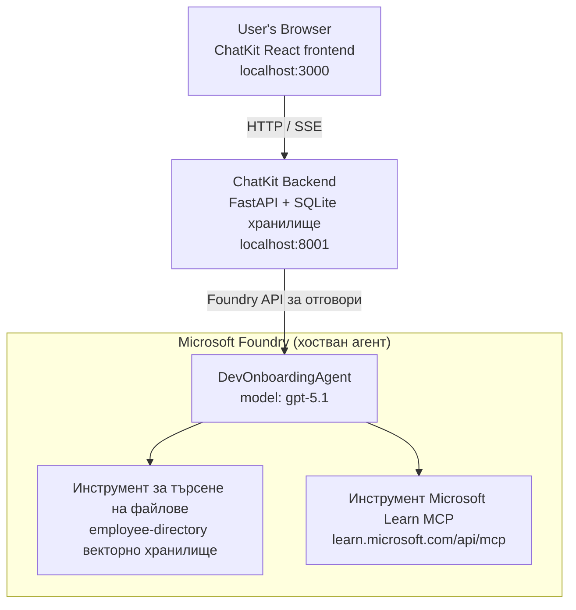

# Урок 4: Разгръщане на агент с Microsoft Foundry хоствани агенти + ChatKit

Този урок демонстрира как да разположите агент, използващ инструменти, в Microsoft Foundry като хостван агент и да създадете frontend базиран на ChatKit за взаимодействие с него.

## Архитектура

Хостваният агент е **единствен `DevOnboardingAgent`** (работещ на `gpt-5.1`), който отговаря на въпроси за въвеждане на разработчици чрез два хоствани инструмента: инструмент за **търсене на файлове** върху векторното хранилище на служителите и инструментът **Microsoft Learn MCP**. Frontend на ChatKit React комуникира с FastAPI backend, който извиква агента чрез Foundry **Responses API**.



## Предварителни условия

1. **Microsoft Foundry проект** в региона North Central US
2. **Azure CLI** с удостоверяване (`az login`)
3. Инсталиран **Azure Developer CLI** (`azd`)
4. **Python 3.12+** и **Node.js 18+**
5. Създадено **векторно хранилище** с данни за служителите

## Бърз старт

### 1. Настройте променливите на средата

```bash
cd lesson-4-agentdeployment
cp .env.example .env
# Редактирайте .env с информацията за вашия проект Microsoft Foundry
```

### 2. Разгръщане на хоствания агент

**Вариант А: Използване на Azure Developer CLI (Препоръчително)**

```bash
cd hosted-agent
azd auth login
azd agent deploy
```

**Вариант Б: Използване на Docker + Azure Container Registry**

```bash
cd hosted-agent

# Изградете контейнера
docker build -t developer-onboarding-agent:latest .

# Таг за ACR
docker tag developer-onboarding-agent:latest <your-acr>.azurecr.io/developer-onboarding-agent:latest

# Качване в ACR
az acr login --name <your-acr>
docker push <your-acr>.azurecr.io/developer-onboarding-agent:latest

# Разгръщане чрез портала или SDK на Microsoft Foundry
```

### 3. Стартирайте backend на ChatKit

```bash
cd chatkit-server
python -m venv .venv
source .venv/bin/activate  # В Windows: .venv\Scripts\activate
pip install -r requirements.txt
python app.py
```

Сървърът ще стартира на `http://localhost:8001`

### 4. Стартирайте frontend на ChatKit

```bash
cd chatkit-server/frontend
npm install
npm run dev
```

Frontend-ът ще стартира на `http://localhost:3000`

### 5. Тествайте приложението

Отворете `http://localhost:3000` във вашия браузър и опитайте следните заявки:

**Търсене на служители:**
- "Аз съм нов тук! Някой работил ли е в Microsoft?"
- "Кой има опит с Azure Functions?"

**Обучителни ресурси:**
- "Създай учебен път за Kubernetes"
- "Какви сертификати трябва да взема за облачна архитектура?"

**Помощ с кода:**
- "Помогни ми да напиша Python код за връзка с CosmosDB"
- "Покажи ми как да създам Azure Function"

**Запитвания с множество агенти:**
- "Започвам като облачен инженер. С кого да се свържа и какво трябва да уча?"

## Структура на проекта

```
lesson-4-agentdeployment/
├── .env.example                 # Environment variables template
├── implementation-plan.md       # Detailed implementation guide
├── README.md                    # This file
├── hosted-agent/               # Microsoft Foundry hosted agent
│   ├── main.py                 # Multi-agent workflow implementation
│   ├── requirements.txt        # Python dependencies
│   ├── Dockerfile              # Container definition
│   └── agent.yaml              # Agent deployment configuration
└── chatkit-server/             # ChatKit server application
    ├── app.py                  # FastAPI backend
    ├── store.py                # SQLite persistence layer
    ├── requirements.txt        # Python dependencies
    └── frontend/               # React frontend
        ├── package.json
        ├── vite.config.ts
        ├── tsconfig.json
        ├── index.html
        └── src/
            ├── main.tsx
            ├── App.tsx
            ├── App.css
            └── index.css
```

## Агентът и неговите инструменти

Хостваният агент е **единствен агент** (`DevOnboardingAgent`, дефиниран във `hosted-agent/main.py`), който обслужва три домейна на въвеждането. Вместо да оркестрира отделни подагенти, той излага всяка възможност като инструмент (или разчита директно на модела):

| Възможност | Как се обработва | Инструмент |
|-----------|------------------|------------|
| **Търсене на служители и връзки** | Хостван инструмент File Search на Foundry върху векторното хранилище на служителите | `client.get_file_search_tool(vector_store_ids=[...])` |
| **Обучение и обучение** | Microsoft Learn MCP сървър (хостван MCP инструмент) | `client.get_mcp_tool(url="https://learn.microsoft.com/api/mcp")` |
| **Помощ с кода** | Обработва се директно от модела `gpt-5.1` — без външен инструмент | — |

Агентът се създава с `client.as_agent(name="DevOnboardingAgent", instructions=..., tools=[file_search_tool, learn_mcp_tool])` и се обслужва с `from_agent_framework(agent).run()`.

> **Забележка за дизайна.** По-ранни версии на този урок използваха многоагентен работен процес `HandoffBuilder` (Триаж → специалисти). Доставеният агент е единствен агент, който използва инструменти, което е по-лесно за разгръщане и разбиране за Q&A в стил въвеждане. За пример с многоагентна оркестрация и предавания вижте Урок 2 и Урок 3.

## Димно тестване на хоствания агент (CI контролна точка)

Разгръщането на хостван агент „успешно“ доказва само, че контролният план е приел
дефиницията — то **не** доказва, че агентът всъщност отговаря. Липсваща зависимост,
неправилно маршрутизиране на модела или изтекла връзка могат да оставят агент в зелено, но без отговор.

Този урок предлага лек **димно тестване**, което действа като бърза, евтина пост-разгръщателна
контролна точка. Използва се [AI Smoke Test](https://github.com/marketplace/actions/ai-smoke-test)
GitHub Action за изпращане на заявки към Foundry **Responses** крайна точка на агента
(`POST {project_endpoint}/agents/{agent_name}/endpoint/protocols/openai/responses`)
и проверка на върнатия текст. Засича счупени разгръщания, проблеми с удостоверяването,
отклонения в системните подсказки и проблеми с нишково изпълнение за секунди.

> Димните тестове **не са** заместител на пълните оценки в
> [Урок 3](../lesson-3-agent-evals/README.md) — те са допълнение. Димните тестове
> отговарят на *„агентът достъпен ли е, отговаря ли и следва ли основните очаквания към подсказката?“*;
> оценките отговарят на *„колко добър е отговорът?“*. Изпълнявайте евтината контролна точка при всяко разгръщане.

### Какво се тества

Каталогът се намира в [`hosted-agent/tests/smoke-tests.json`](../../../lesson-4-agentdeployment/hosted-agent/tests/smoke-tests.json)
и тества трите домейна на агента плюс съответствието с подсказките и нишковото изпълнение:

| Тест | Какво проверява |
|------|------------------|
| `reachability` | Агентът отговаря с непразен, в обхвата на заявката текст |
| `employee-search` | Домейнът за търсене на файлове връща здрав `200` (отговорът зависи от данните) |
| `learning-path` | Домейн за обучение повтаря темата и дава отговор във форма на път |
| `coding-assistance` | Домейн за кодиране връща Python кодов отговор |
| `prompt-adherence-offtopic` | Запитване извън темата се пренасочва, не се отговаря детайлно |
| `threading-turn-1/2` | Състоянието на разговора се поддържа през ходовете чрез `previous_response_id` |

### Стартирайте го в CI

Работният процес в [`.github/workflows/smoke-test-hosted-agent.yml`](../../../.github/workflows/smoke-test-hosted-agent.yml)
има две задачи:

- **`static`** — бърза, без Azure контрола, която се изпълнява при всяко pull request и push:
  компилира целия Python код (`py_compile`) и проверява Markdown връзките. Не се изискват тайни,
  затова работи и при fork PR.
- **`smoke`** — свързаният с Azure димен тест по-долу. Стартира се по заявка
  (Actions → **Agent CI (static + smoke)** → Run workflow) и може да следва вашия
  разгръщателен работен процес.

Конфигурирайте тези **променливи** и **тайни** на репозиторито за димната задача:

| Вид | Име | Стойност |
|------|------|----------|
| Променлива | `FOUNDRY_PROJECT_ENDPOINT` | `https://<account>.services.ai.azure.com/api/projects/<project>` |
| Променлива | `HOSTED_AGENT_NAME` | Името на разположения агент (напр. `dev-onboarding` — трябва да съвпада с вашето разгръщане) |
| Тайна | `AZURE_CLIENT_ID` / `AZURE_TENANT_ID` / `AZURE_SUBSCRIPTION_ID` | OIDC федеративна самоличност за `azure/login` |

Идентичността на runner-а се нуждае от ролята **`Azure AI User`** в контекста на **Foundry проект**, за да може
да извиква Responses (и conversations) крайни точки на data plane. Дайте ѝ чрез:

```bash
az role assignment create \
  --assignee <object-id-or-appId-of-runner-identity> \
  --role "Azure AI User" \
  --scope "/subscriptions/<sub>/resourceGroups/<rg>/providers/Microsoft.CognitiveServices/accounts/<account>/projects/<project>"
```

### Стартирайте го локално

Можете да изпълните същия каталог преди да push-нете. Осигурете data plane токен с обхват
`https://ai.azure.com/` и насочете runner-а към вашето разгръщане:

```bash
# АудиторияТА ТРЯБВА да бъде https://ai.azure.com/ (токени от cognitiveservices.azure.com се отхвърлят)
export FOUNDRY_TOKEN=$(az account get-access-token --resource https://ai.azure.com/ --query accessToken -o tsv)

git clone https://github.com/JFolberth/ai-smoketest && cd ai-smoketest
python runner.py \
  --project-endpoint "https://<account>.services.ai.azure.com/api/projects/<project>" \
  --agent-name dev-onboarding \
  --tests-file ../lesson-4-agentdeployment/hosted-agent/tests/smoke-tests.json
```

Кодове на изхода: `0` всички преминали, `1` провален асерция, `2` грешка на runner-а (грешен каталог / токен).

## Отстраняване на неизправности

### Агентът не отговаря
- Проверете дали хостваният агент е разположен и работи в Microsoft Foundry
- Проверете дали `HOSTED_AGENT_NAME` и `HOSTED_AGENT_VERSION` съвпадат с вашето разгръщане

### Грешки с векторното хранилище
- Уверете се, че `VECTOR_STORE_ID` е настроен правилно
- Проверете дали векторното хранилище съдържа данни за служителите

### Грешки при удостоверяване
- Изпълнете `az login` за обновяване на креденциалите
- Уверете се, че имате достъп до Microsoft Foundry проекта

## Ресурси

- [Документация за Microsoft Foundry хоствани агенти](https://learn.microsoft.com/en-us/azure/ai-foundry/agents/concepts/hosted-agents)
- [Microsoft Agent Framework](https://github.com/microsoft/agent-framework)
- [Пример за ChatKit интеграция](https://github.com/microsoft/agent-framework/tree/main/python/samples/demos/chatkit-integration)
- [Azure Developer CLI](https://learn.microsoft.com/en-us/azure/developer/azure-developer-cli/overview)
- [AI Smoke Test GitHub Action](https://github.com/marketplace/actions/ai-smoke-test)
- [Димно тестване на Microsoft Foundry агенти с GitHub Actions (блог)](https://techcommunity.microsoft.com/blog/azuredevcommunityblog/smoke-test-microsoft-foundry-agents-with-github-actions/4531912)

---

## Следващи стъпки

Вашият агент работи на инфраструктура, управлявана от Microsoft. За да го въведете в производствена среда —
контролирайки къде се съхраняват данните му (суверенитет на данните, частни мрежи, собствен Azure
Cosmos DB / Storage / AI Search) и управлявайки инструментите му — продължете към
**[Урок 5: Производствени хоствани агенти](../lesson-5-hosted-agents-production/README.md)**, който
обяснява ключовата разлика между **Hosted Agents** и **Capability Hosts**.

---

<!-- CO-OP TRANSLATOR DISCLAIMER START -->
**Отказ от отговорност**:
Този документ е преведен с помощта на AI преводачески услуга [Co-op Translator](https://github.com/Azure/co-op-translator). Въпреки че се стремим към точност, моля имайте предвид, че автоматизираните преводи могат да съдържат грешки или неточности. Оригиналният документ на неговия роден език трябва да се счита за авторитетен източник. За критична информация се препоръчва професионален човешки превод. Ние не носим отговорност за каквито и да е недоразумения или неправилни тълкувания, произтичащи от използването на този превод.
<!-- CO-OP TRANSLATOR DISCLAIMER END -->