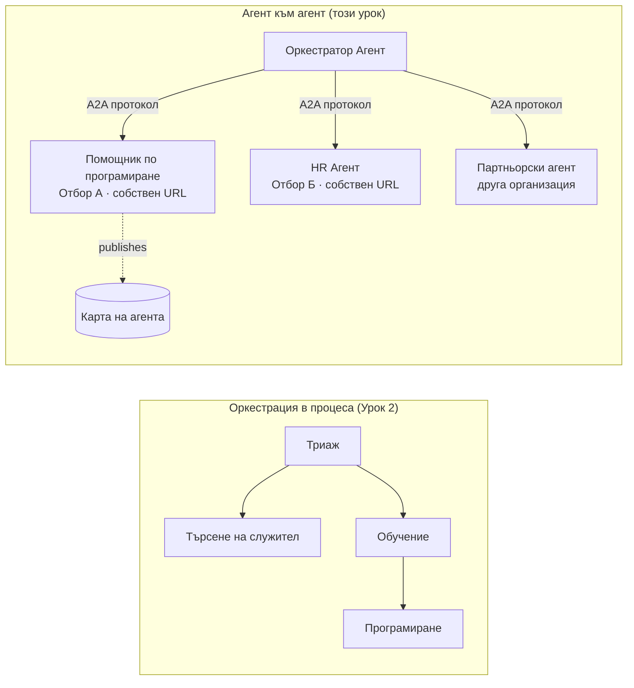

# Урок 7: Къде се организират множество агенти & Агент към агент (A2A)

В [Урок 6](../lesson-6-toolbox/README.md) можете да изграждате управлявани инструменти и хоствани агенти.
Но истинските системи рядко използват **един** агент. Когато мащабирате, съставяте **много** агенти — някои са ваши,
други са собственост на други екипи, някои работят в съвсем различни организации. Този урок е за това
как агентите работят **заедно**.

Вече срещнахте една форма на дизайн с множество агенти в
[„agent-orchestration.py“ от Урок 2](../lesson-2-agent-development/README.md): шаблонът **handoff**,
при който агент за триаж насочва към специалисти **в рамките на един процес**. Този урок се придвижва
една степен нагоре — към **Agent-to-Agent (A2A)**, отворения протокол за агенти, които работят като независими
**мрежови услуги** и се обаждат един на друг през процесни, екипни и организационни граници.

## Учебни цели

В края на този урок ще можете да:

- Обясните разликата между **оркестрация в процеса** (handoff/работни потоци) и
  комуникация **Agent-to-Agent (A2A)** и да изберете подходящото.
- Опишете основните елементи на A2A: **Agent Card**, **умения**, **задачи** и **откриване**.
- **Излагате** агент от Microsoft Agent Framework като A2A услуга с `A2AExecutor`.
- **Използвате** отдалечен агент като мрежов партньор с `A2AAgent`.
- Прилагате корпоративни съображения към A2A: **сигурност, идентичност, управление, наблюдаемост и разходи**.

---

## Предварителни условия

1. Завършен [Урок 2](../lesson-2-agent-development/README.md) (разработка на агенти & оркестрация).
2. Проект **Microsoft Foundry** с текущо разгръщане на модел (например `gpt-5.1` и
   `gpt-5-codex` за примерния код). Избягвайте остарели GPT-4o / GPT-4.1.
3. Впечатление в **Azure CLI**: `az login`.
4. **Python 3.12+** с инсталирани зависимости на курса (`pip install -r ../requirements.txt`).
   Урок 7 добавя предварителни пакети `agent-framework-a2a`, `a2a-sdk` и `uvicorn`.
5. Настроени `FOUNDRY_PROJECT_ENDPOINT` и `FOUNDRY_MODEL` във вашия `.env` (вижте README на курса).

---

## 1. Два начина агентите да работят заедно

Няма един единствен "многоагентен" шаблон. Изберете този, който съвпада с Вашите **граници**:

| Шаблон | Къде работят агентите | Как се свързват | Кога се използва |
|---------|------------------|------------------|----------|
| **Handoff / Работен поток** (Урок 2) | Един процес, едно кодово хранилище | В памет граф (`HandoffBuilder`, `WorkflowBuilder`) | Вие притежавате всички агенти и ги разгръщате заедно. |
| **Agent-to-Agent (A2A)** (този урок) | Отделни услуги, отделен жизнен цикъл | Отворен протокол **A2A** през HTTP, открива се чрез **Agent Cards** | Агентите са собственост на различни екипи/организации, мащабират се независимо или са написани в различни рамки. |

Handoff е за **пренасочване в рамките на едно приложение**. A2A е за **съставяне на агенти като
независими услуги** — еквивалентно на прехода от повиквания на функции към микросервизи.



> **Те се съставят.** Оркестратор, който изградите с `HandoffBuilder`, може да има **отдалечени A2A агенти**
> като участници — маршрутизиране в процеса към услуги, които сами по себе си работят навсякъде.

---

## 2. Основните елементи на A2A

A2A е **отворен протокол** (не е специфичен за Microsoft), затова един A2A агент може да бъде използван от Microsoft
Agent Framework, LangGraph, потребителски код или стек на друга компания. Четири концепции са важни:

- **Agent Card** — малък JSON документ, публикуван на
  `/.well-known/agent-card.json`, който рекламира **името, описанието, URL, версията,
  уменията и възможностите** на агента. Това е начин клиентът да **открие** какво може отдалеченият агент.
- **Умения** — декларираните неща, които агентът може да прави (`id`, `name`, `description`, `tags`,
  `examples`). Клиенти (и модели) ги използват, за да решат дали да се обадят на агента.
- **Задачи** — повикването към A2A агент е **задача** с жизнен цикъл (изпратена → в процес на работа →
  завършена/неуспешна). Сървърът следи задачите в **хранилище за задачи**; поддържат се поточни актуализации.
- **Откриване** — клиент, с даден само URL, изтегля Agent Card и знае как да се обади на агента.

---

## 3. Изложете агент като A2A услуга — `a2a_server.py`

Страната за **Създаване/сървиране** обвива всеки агент от Microsoft Agent Framework с `A2AExecutor` и го монтира
в A2A HTTP приложение. Вижте [`a2a_server.py`](../../../lesson-7-multi-agent-a2a/a2a_server.py). Ключовото свързване:

```python
from agent_framework.a2a import A2AExecutor
from a2a.server.apps import A2AStarletteApplication
from a2a.server.request_handlers import DefaultRequestHandler
from a2a.server.tasks import InMemoryTaskStore
from a2a.types import AgentCapabilities, AgentCard, AgentSkill

agent = client.as_agent(name="coding-assistant", instructions="...")

agent_card = AgentCard(
    name="Coding Assistant",
    description="Generates runnable code samples...",
    url="http://localhost:9000/",
    version="1.0.0",
    capabilities=AgentCapabilities(streaming=True),
    default_input_modes=["text"],
    default_output_modes=["text"],
    skills=[AgentSkill(id="generate-code", name="Generate code",
                       description="Write a runnable code snippet.", tags=["code"])],
)

request_handler = DefaultRequestHandler(
    agent_executor=A2AExecutor(agent),
    task_store=InMemoryTaskStore(),
)
app = A2AStarletteApplication(agent_card=agent_card, http_handler=request_handler).build()
# обслужва се с uvicorn на порт 9000
```

Обърнете внимание, че кодът на агента е **непокътнат** — `A2AExecutor` адаптира вашия съществуващ агент към протокола.
Agent Card е това, което го прави **откриваем** за всеки A2A клиент.

---

## 4. Използвайте отдалечен агент — `a2a_client.py`

Страната за **Използване** се свързва с отдалечен агент **по URL**, изтегля Agent Card и го повиква
точно както локален агент. Вижте [`a2a_client.py`](../../../lesson-7-multi-agent-a2a/a2a_client.py):

```python
from agent_framework.a2a import A2AAgent

remote_agent = A2AAgent(name="remote-coding-assistant", url="http://localhost:9000")
result = await remote_agent.run("Write a Python function that reverses a string.")
print(result.text)
```

Това е смисълът на A2A: от страна на повикващия отдалеченият агент се държи като всеки друг
агент от `agent_framework`, така че може да го включите в работен поток или да препратите към него — макар че работи
в различен процес, на различна машина, собственост на различен екип.

### Стартирайте го от край до край

```bash
# Терминал 1 — стартирайте услугата A2A
python a2a_server.py

# Терминал 2 — извикайте я
python a2a_client.py "Write a Python function that reverses a string."
```

Ще видите отговора на асистента по кодиране през A2A протокола. Отворете
`http://localhost:9000/.well-known/agent-card.json` в браузър, за да видите публикуваната Agent Card.

---

## 5. Корпоративни съображения

Превръщането на агентите в мрежови услуги въвежда същите проблеми като при всяка разпределена система —
плюс някои специфични за ИИ:

- **Идентичност и удостоверяване.** Никога не излагайте A2A агент без удостоверяване. Agent Card носи
  `security` / `security_schemes`, а `A2AAgent` приема `auth_interceptor`, така че повикващите прикачват
  удостоверителни данни (OAuth bearer токени, API ключове). Използвайте Entra ID / управлявани идентичности за
  удостоверяване услуга към услуга в продукция; поставете услугата зад шлюз.
- **Управление.** Комбинирайте A2A с [Урок 6 Toolbox](../lesson-6-toolbox/README.md): отдалечен
  агент може да бъде публикуван като **A2A инструмент** вътре в управляван тулбокс, за да се прилагат централно RBAC, инжектиране на удостоверения
  и guardrail политики.
- **Наблюдаемост.** Заявката вече преминава през граници на процеса, затова предавайте трейсинга през повикването.
  Активирайте [Foundry Observability / OpenTelemetry](../lesson-3-agent-evals/README.md) както на
  оркестратора, така и на всеки отдалечен агент, за да получите краен край до край трайс.
- **Версиониране.** Agent Card има `version`. Отнасяйте го като API: добавъчните промени са безопасни;
  нарушаването на контракта на умение изисква нова версия и прозорец за миграция за потребителите.
- **Надеждност.** Отдалечените агенти отказват независимо. Задавайте тайм-аути (`A2AAgent(timeout=...)`), справяйте се
  с частични провали и не позволявайте един бавен партньор да блокира цялата оркестрация.
- **Разходи.** Всяко повикване на отдалечен агент е отделно използване на модел. Разпръскването умножава разхода на токени —
  планирайте го и предпочитайте маршрутизиране към **един** най-добър агент, вместо да пращате до много.

---

## Практически упражнения

1. **Добавете втора услуга.** Копирайте `a2a_server.py`, за да изложите агента **employee-search** на порт
   9001 със собствен Agent Card и умения. Стартирайте и двете, и нека клиент повика всеки.
2. **Оркестрирайте отдалечени партньори.** Изградете малък `HandoffBuilder` (или обикновен маршрутизатор), чиито участници
   включват два `A2AAgent` посочващи към двете ви услуги. Насочете заявка към правилния.
3. **Осигурете го.** Добавете `auth_interceptor` към клиента и изисквайте bearer token на сървъра.
   Какво се чупи, ако токенът липсва? Къде бихте съхранили токена в продукция?
4. **Handoff срещу A2A.** Напишете два кратки параграфа: кога бихте запазили в Урок 2 оркестрация в процеса
   и кога допълнителната сложност на A2A е оправдана? Дайте конкретни примери за всеки.

---

## Ресурси

- [Agent-to-Agent (A2A) — Microsoft Agent Framework](https://learn.microsoft.com/agent-framework/user-guide/agent-orchestration/a2a)
- [Многоагентска оркестрация — Microsoft Agent Framework](https://learn.microsoft.com/agent-framework/user-guide/agent-orchestration/)
- [Спецификация на A2A протокол](https://a2a-protocol.org/)
- [A2A Python SDK (`a2a-sdk`)](https://github.com/a2aproject/a2a-python)
- [Foundry Agent Service — многоагентни шаблони](https://learn.microsoft.com/azure/ai-foundry/agents/concepts/connected-agents)

---

**Предишен:** [Урок 6 — Microsoft Toolbox](../lesson-6-toolbox/README.md)

---

<!-- CO-OP TRANSLATOR DISCLAIMER START -->
**Отказ от отговорност**:
Този документ е преведен с помощта на AI преводачески услуга [Co-op Translator](https://github.com/Azure/co-op-translator). Въпреки че се стремим към точност, моля имайте предвид, че автоматизираните преводи могат да съдържат грешки или неточности. Оригиналният документ на неговия роден език трябва да се счита за авторитетен източник. За критична информация се препоръчва професионален човешки превод. Ние не носим отговорност за каквито и да е недоразумения или неправилни тълкувания, произтичащи от използването на този превод.
<!-- CO-OP TRANSLATOR DISCLAIMER END -->