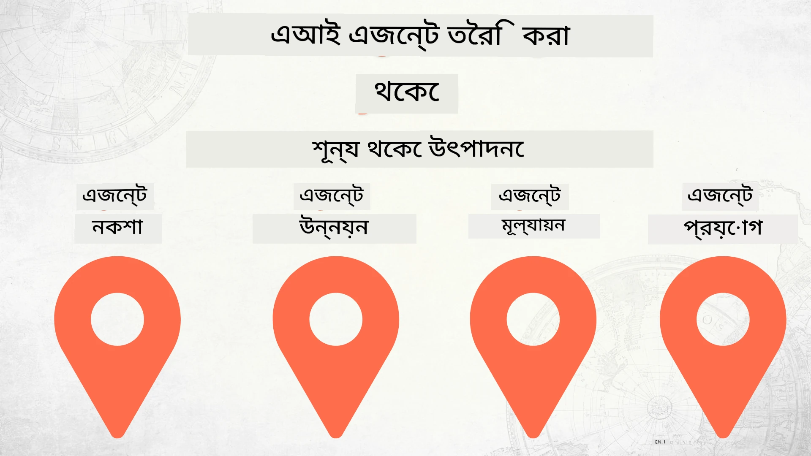

# শূন থেকে প্রোডাকশনে AI এজেন্ট তৈরি



### 🌐 বহুভাষিক সমর্থন

#### GitHub অ্যাকশনের মাধ্যমে সমর্থিত (স্বয়ংক্রিয় এবং সর্বদা হালনাগাদ)

<!-- CO-OP TRANSLATOR LANGUAGES TABLE START -->
[Arabic](../ar/README.md) | [Bengali](./README.md) | [Bulgarian](../bg/README.md) | [Burmese (Myanmar)](../my/README.md) | [Chinese (Simplified)](../zh-CN/README.md) | [Chinese (Traditional, Hong Kong)](../zh-HK/README.md) | [Chinese (Traditional, Macau)](../zh-MO/README.md) | [Chinese (Traditional, Taiwan)](../zh-TW/README.md) | [Croatian](../hr/README.md) | [Czech](../cs/README.md) | [Danish](../da/README.md) | [Dutch](../nl/README.md) | [Estonian](../et/README.md) | [Finnish](../fi/README.md) | [French](../fr/README.md) | [German](../de/README.md) | [Greek](../el/README.md) | [Hebrew](../he/README.md) | [Hindi](../hi/README.md) | [Hungarian](../hu/README.md) | [Indonesian](../id/README.md) | [Italian](../it/README.md) | [Japanese](../ja/README.md) | [Kannada](../kn/README.md) | [Khmer](../km/README.md) | [Korean](../ko/README.md) | [Lithuanian](../lt/README.md) | [Malay](../ms/README.md) | [Malayalam](../ml/README.md) | [Marathi](../mr/README.md) | [Nepali](../ne/README.md) | [Nigerian Pidgin](../pcm/README.md) | [Norwegian](../no/README.md) | [Persian (Farsi)](../fa/README.md) | [Polish](../pl/README.md) | [Portuguese (Brazil)](../pt-BR/README.md) | [Portuguese (Portugal)](../pt-PT/README.md) | [Punjabi (Gurmukhi)](../pa/README.md) | [Romanian](../ro/README.md) | [Russian](../ru/README.md) | [Serbian (Cyrillic)](../sr/README.md) | [Slovak](../sk/README.md) | [Slovenian](../sl/README.md) | [Spanish](../es/README.md) | [Swahili](../sw/README.md) | [Swedish](../sv/README.md) | [Tagalog (Filipino)](../tl/README.md) | [Tamil](../ta/README.md) | [Telugu](../te/README.md) | [Thai](../th/README.md) | [Turkish](../tr/README.md) | [Ukrainian](../uk/README.md) | [Urdu](../ur/README.md) | [Vietnamese](../vi/README.md)

> **স্থানীয়ভাবে ক্লোন করতে পছন্দ করেন?**
>
> এই রেপোজিটরিতে ৫০+ ভাষার অনুবাদ অন্তর্ভুক্ত রয়েছে যা ডাউনলোডের আকার উল্লেখযোগ্যভাবে বৃদ্ধি করে। অনুবাদ ছাড়া ক্লোন করতে, স্পার্স চেকআউট ব্যবহার করুন:
>
> **Bash / macOS / Linux:**
> ```bash
> git clone --filter=blob:none --sparse https://github.com/microsoft/Building-AI-Agents-From-Zero-To-Production.git
> cd Building-AI-Agents-From-Zero-To-Production
> git sparse-checkout set --no-cone '/*' '!translations' '!translated_images'
> ```
>
> **CMD (Windows):**
> ```cmd
> git clone --filter=blob:none --sparse https://github.com/microsoft/Building-AI-Agents-From-Zero-To-Production.git
> cd Building-AI-Agents-From-Zero-To-Production
> git sparse-checkout set --no-cone "/*" "!translations" "!translated_images"
> ```
>
> এইভাবে আপনি কোর্স সম্পন্ন করার জন্য প্রয়োজনীয় সবকিছু অনেক দ্রুত ডাউনলোড করতে পারবেন।
<!-- CO-OP TRANSLATOR LANGUAGES TABLE END -->

## AI এজেন্ট উন্নয়ন জীবনচক্রের মৌলিক বিষয় শেখানোর একটি কোর্স

[](https://github.com/microsoft/Building-AI-Agents-From-Zero-To-Production/blob/master/LICENSE?WT.mc_id=academic-105485-koreyst)
[](https://GitHub.com/microsoft/Building-AI-Agents-From-Zero-To-Production/graphs/contributors/?WT.mc_id=academic-105485-koreyst)
[](https://GitHub.com/microsoft/Building-AI-Agents-From-Zero-To-Production/issues/?WT.mc_id=academic-105485-koreyst)
[](https://GitHub.com/microsoft/Building-AI-Agents-From-Zero-To-Production/pulls/?WT.mc_id=academic-105485-koreyst)
[](http://makeapullrequest.com?WT.mc_id=academic-105485-koreyst)

[](https://discord.gg/Kuaw3ktsu6)

## 🌱 শুরু করা

এই কোর্সে AI এজেন্ট তৈরি এবং ডিপ্লয়মেন্টের মৌলিক বিষয় কভার করা হয়েছে।

প্রতিটি পাঠের ওপর আগেরটি ভিত্তি করে তৈরি, তাই আমরা শুরু থেকেই শুরু করে শেষ পর্যন্ত কাজ করার পরামর্শ দিই।

আপনি AI এজেন্ট বিষয় সম্পর্কে আরও জানতে চাইলে [AI Agents For Beginners Course](https://aka.ms/ai-agents-beginners) দেখুন।

### অন্যান্য শিক্ষার্থীদের সাথে পরিচিত হন, আপনার প্রশ্নগুলোর উত্তর পান

যদি আটকে যান বা AI এজেন্ট তৈরি সম্পর্কে কোনও প্রশ্ন থাকে, তাহলে আমাদের নিবেদিত <a href="https://discord.gg/Kuaw3ktsu6">Microsoft Foundry Discord</a> চ্যানেলে যোগ দিন।

### যা আপনার দরকার

প্রতিটি পাঠের নিজস্ব কোড স্যাম্পল থাকে যা আপনি স্থানীয়ভাবে চালাতে পারবেন। আপনি [এই রেপো ফর্ক](https://github.com/microsoft/Building-AI-Agents-From-Zero-To-Production/fork) করতে পারেন নিজের কপি তৈরি করতে।

এই কোর্স বর্তমানে নিম্নলিখিত ব্যবহার করে:

- [Microsoft Agent Framework (MAF)](https://aka.ms/ai-agents-beginners/agent-framework)
- [Microsoft Foundry](https://azure.microsoft.com/products/ai-foundry) — একটি প্রকল্প যা একটি ডিপ্লয় করা **GPT-5 সিরিজ** মডেল রয়েছে (যেমন `gpt-5.1`)। অবসরপ্রাপ্ত GPT-4o / GPT-4.1 মডেল ব্যবহার করবেন না।
- [Azure OpenAI Service](https://azure.microsoft.com/products/ai-foundry/models/openai)
- [Azure CLI](https://learn.microsoft.com/cli/azure/authenticate-azure-cli?view=azure-cli-latest) — যেকোন স্যাম্পল চালানোর আগে `az login` দিয়ে সাইন ইন করুন
- **Python 3.12 বা তার পরে**

শুরু করার আগে নিশ্চিত করুন যে আপনার এগুলোর অ্যাক্সেস আছে।

> **💰 খরচ ও পরিষ্কার।** এই হাতেকলমে পাঠগুলি বাস্তব Azure রিসোর্স তৈরি করে — একটি Microsoft Foundry
> প্রকল্প, একটি মডেল ডিপ্লয়মেন্ট, একটি ভেক্টর স্টোর, এবং (পাঠ ৪–৬ এ) হোস্টেড এজেন্ট ও টুলবক্স।
> এগুলোর অস্তিত্বের সময় খরচ হতে পারে। যখন আপনি একটি পাঠ অথবা কোর্স শেষ করবেন — তখন আর প্রয়োজনীয় নয় এমন
> রিসোর্সগুলি মুছে দিন। সবচেয়ে সহজ উপায় হলো সব কিছু একটি নিবেদিত রিসোর্স
> গ্রুপে রাখা এবং কাজ শেষ হলে পুরো গ্রুপ ডিলিট করা:
>
> ```bash
> az group delete --name <your-resource-group> --yes --no-wait
> ```
>
> আপনি Foundry পোর্টাল থেকে পৃথক এজেন্ট, ভেক্টর স্টোর এবং টুলবক্সও মুছে ফেলতে পারেন।

> **মডেল সম্পর্কে নোট।** এই কোর্স সব মডেল Microsoft Foundry এর মাধ্যমে সরবরাহ করে। এটি
> *GitHub Models* ব্যবহার করে না, যেটি **৩০ জুলাই, ২০২৬** এ অবসরপ্রাপ্ত হবে—Microsoft Foundry হচ্ছে
> অফিসিয়াল মাইগ্রেশন পথ। যদি আপনার পুরানো কোড GitHub মডেল কল করে, তাহলে সেটি Foundry
> মডেল ডিপ্লয়মেন্টের দিকে নির্দেশ করুন।

মডেল হোস্টিং এবং সার্ভিসের মধ্যে আরো অপশন শীঘ্রই আসছে।

## 🗃️ পাঠসমূহ

| **পাঠ**         | **বিবরণ**                                                                                  |
|--------------------|--------------------------------------------------------------------------------------------------|
| [এজেন্ট ডিজাইন](./lesson-1-agent-design/README.md)       | আমাদের "ডেভেলপার অনবোর্ডিং" এজেন্ট ব্যবহার কেসের পরিচিতি এবং কার্যকর এজেন্ট ডিজাইন করার পদ্ধতি  |
| [এজেন্ট উন্নয়ন](./lesson-2-agent-development/README.md)  | Microsoft Agent Framework (MAF) ব্যবহার করে নতুন ডেভেলপারদের সাহায্য করার জন্য বিশেষায়িত এজেন্ট তৈরি করুন।       |
| [এজেন্ট মূল্যায়ন](./lesson-3-agent-evals/README.md)  | Microsoft Foundry ব্যবহার করে আমাদের AI এজেন্টগুলো কত ভালো করছে এবং কীভাবে উন্নত করা যায় তা জানুন। |
| [এজেন্ট ডিপ্লয়মেন্ট](./lesson-4-agentdeployment/README.md)   | Microsoft Foundry হোস্টেড এজেন্ট ও OpenAI ChatKit ব্যবহার করে প্রোডাকশনে AI এজেন্ট ডিপ্লয় করুন।       |
| [প্রোডাকশনে হোস্টেড এজেন্ট](./lesson-5-hosted-agents-production/README.md)   | একটি হোস্টেড এজেন্ট এন্টারপ্রাইজ প্রোডাকশনে নিয়ে যান: হোস্টেড এজেন্ট বনাম ক্যাপাবিলিটি হোস্ট, নিজের স্টোরেজ, মেমোরি এবং গভর্নেন্স আনুন।       |
| [Microsoft টুলবক্স](./lesson-6-toolbox/README.md)   | টুলস একবার সংজ্ঞায়িত করুন এবং কেন্দ্রীয়ভাবে নিয়ন্ত্রণ করুন: একটি টুলবক্স নির্মাণ করুন, একটি এজেন্ট থেকে একটি MCP এন্ডপয়েন্টের মাধ্যমে ব্যবহার করুন, এবং টুলের ভার্সন নিরাপদে করুন।       |
| [মাল্টি-এজেন্ট ও A2A](./lesson-7-multi-agent-a2a/README.md)   | এজেন্টকে নেটওয়ার্ক সার্ভিস হিসাবে রচনা করুন: ওপেন Agent-to-Agent (A2A) প্রোটোকল দিয়ে একটি এজেন্ট এক্সপোজ করুন এবং পিয়ার হিসেবে একটি রিমোট এজেন্ট ব্যবহার করুন।       |


## 🎒 অন্যান্য কোর্সসমূহ

আমাদের টিম আরও কোর্স তৈরি করে! দেখুন:

<!-- CO-OP TRANSLATOR OTHER COURSES START -->
### LangChain
[](https://aka.ms/langchain4j-for-beginners)
[](https://aka.ms/langchainjs-for-beginners?WT.mc_id=m365-94501-dwahlin)
[](https://github.com/microsoft/langchain-for-beginners?WT.mc_id=m365-94501-dwahlin)
---

### Azure / Edge / MCP / Agents
[](https://github.com/microsoft/AZD-for-beginners?WT.mc_id=academic-105485-koreyst)
[](https://github.com/microsoft/edgeai-for-beginners?WT.mc_id=academic-105485-koreyst)
[](https://github.com/microsoft/mcp-for-beginners?WT.mc_id=academic-105485-koreyst)
[](https://github.com/microsoft/ai-agents-for-beginners?WT.mc_id=academic-105485-koreyst)

---
 
### জেনারেটিভ AI সিরিজ

[](https://github.com/microsoft/generative-ai-for-beginners?WT.mc_id=academic-105485-koreyst)
[-9333EA?style=for-the-badge&labelColor=E5E7EB&color=9333EA)](https://github.com/microsoft/Generative-AI-for-beginners-dotnet?WT.mc_id=academic-105485-koreyst)
[-C084FC?style=for-the-badge&labelColor=E5E7EB&color=C084FC)](https://github.com/microsoft/generative-ai-for-beginners-java?WT.mc_id=academic-105485-koreyst)
[-E879F9?style=for-the-badge&labelColor=E5E7EB&color=E879F9)](https://github.com/microsoft/generative-ai-with-javascript?WT.mc_id=academic-105485-koreyst)

---
 
### কোর লার্নিং
[](https://aka.ms/ml-beginners?WT.mc_id=academic-105485-koreyst)
[](https://aka.ms/datascience-beginners?WT.mc_id=academic-105485-koreyst)
[](https://aka.ms/ai-beginners?WT.mc_id=academic-105485-koreyst)
[](https://github.com/microsoft/Security-101?WT.mc_id=academic-96948-sayoung)
[](https://aka.ms/webdev-beginners?WT.mc_id=academic-105485-koreyst)
[](https://aka.ms/iot-beginners?WT.mc_id=academic-105485-koreyst)
[](https://github.com/microsoft/xr-development-for-beginners?WT.mc_id=academic-105485-koreyst)

---
 
### কপিলট সিরিজ
[](https://aka.ms/GitHubCopilotAI?WT.mc_id=academic-105485-koreyst)
[](https://github.com/microsoft/mastering-github-copilot-for-dotnet-csharp-developers?WT.mc_id=academic-105485-koreyst)
[](https://github.com/microsoft/CopilotAdventures?WT.mc_id=academic-105485-koreyst)
<!-- CO-OP TRANSLATOR OTHER COURSES END -->

## অবদান রাখা

এই প্রকল্পে অবদান রাখা এবং পরামর্শ স্বাগত। বেশিরভাগ অবদানের জন্য আপনাকে সম্মতি দিতে হবে
একটি Contributor License Agreement (CLA) যাতে ঘোষণা করা থাকে যে আপনার অধিকার রয়েছে এবং আপনি বাস্তবে আমাদের
আপনার অবদানের ব্যবহার করার অধিকার প্রদান করেছেন। বিস্তারিত জানতে <https://cla.opensource.microsoft.com> দেখুন।

যখন আপনি একটি pull request জমা দেন, একটি CLA বট স্বয়ংক্রিয়ভাবে নির্ধারণ করবে আপনি CLA প্রদান করতে হবে কিনা
এবং PR কে উপযুক্তভাবে সজ্জিত করবে (যেমন: স্ট্যাটাস চেক, কমেন্ট)। আপনি শুধু বটের দেওয়া নির্দেশাবলী অনুসরণ করুন।
আপনাকে আমাদের CLA ব্যবহার করে সব রেপোতে শুধুমাত্র একবার এটি করতে হবে।

এই প্রকল্পে [Microsoft Open Source Code of Conduct](https://opensource.microsoft.com/codeofconduct/) গ্রহণ করা হয়েছে।
আরও তথ্যের জন্য [Code of Conduct FAQ](https://opensource.microsoft.com/codeofconduct/faq/) দেখুন অথবা
যেকোন অতিরিক্ত প্রশ্ন বা মন্তব্যের জন্য [opencode@microsoft.com](mailto:opencode@microsoft.com) এ যোগাযোগ করুন।

## ট্রেডমার্ক

এই প্রকল্পে প্রকল্প, পণ্য বা সেবার ট্রেডমার্ক বা লোগো থাকতে পারে। Microsoft এর
ট্রেডমার্ক বা লোগোর অনুমোদিত ব্যবহার বিষয়বস্তু মেনে চলতে হবে এবং অবশ্যই
[Microsoft এর Trademark & Brand Guidelines](https://www.microsoft.com/legal/intellectualproperty/trademarks/usage/general) অনুসরণ করতে হবে।
Microsoft ট্রেডমার্ক বা লোগো এর পরিবর্তিত সংস্করণে ব্যবহার Microsoft এর স্পন্সরশিপ বোঝানো বা বিভ্রান্তি সৃষ্টি করবে না।

তৃতীয় পক্ষের ট্রেডমার্ক বা লোগো ব্যবহারের যেকোনো ক্ষেত্রে সেই তৃতীয় পক্ষের নীতি প্রযোজ্য।

## সহায়তা প্রাপ্তি

যদি আপনি আটকে যান বা AI অ্যাপ তৈরি সম্পর্কে কোনো প্রশ্ন থাকে, যোগ দিন:

[](https://discord.gg/Kuaw3ktsu6)

যদি আপনার পণ্য প্রতিক্রিয়া বা ত্রুটি থাকে, পরিদর্শন করুন:

[](https://aka.ms/foundry/forum)

---

<!-- CO-OP TRANSLATOR DISCLAIMER START -->
**অস্বীকৃতি**:
এই নথিটি AI অনুবাদ পরিষেবা [Co-op Translator](https://github.com/Azure/co-op-translator) ব্যবহার করে অনূদিত হয়েছে। যদিও আমরা শুদ্ধতার জন্য চেষ্টা করি, অনুগ্রহ করে মনে রাখবেন যে স্বয়ংক্রিয় অনুবাদে ত্রুটি বা অসঙ্গতি থাকতে পারে। মূল নথিটি তার স্বভাষায় কর্তৃত্বপূর্ণ উৎস হিসেবে বিবেচিত হওয়া উচিত। গুরুত্বপূর্ণ তথ্যের জন্য পেশাদার মানব অনুবাদ সুপারিশ করা হয়। এই অনুবাদের ব্যবহারে প্রয়োজনীয় ভুল বোঝাবুঝি বা ভুল ব্যাখ্যার জন্য আমরা দায়বদ্ধ নই।
<!-- CO-OP TRANSLATOR DISCLAIMER END -->