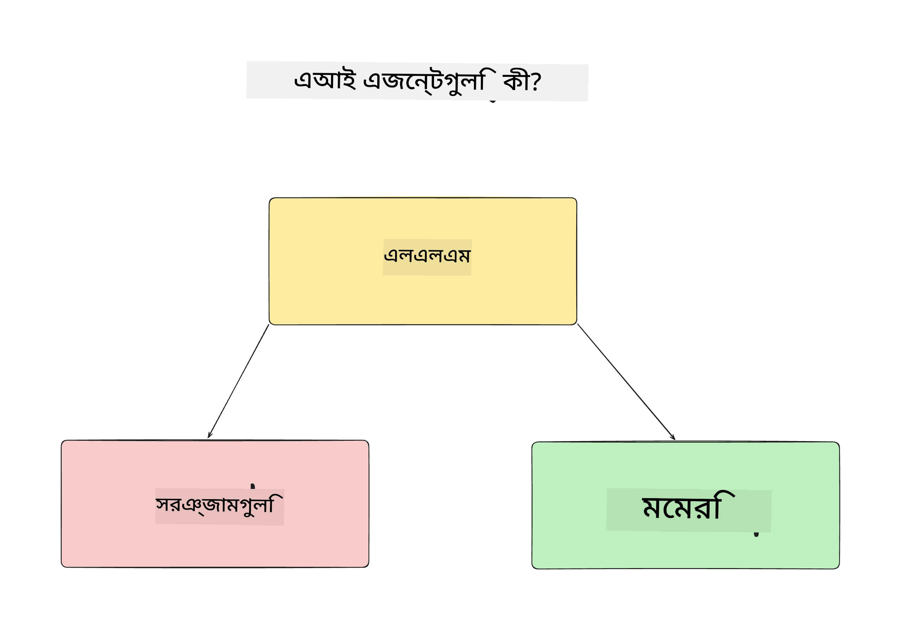
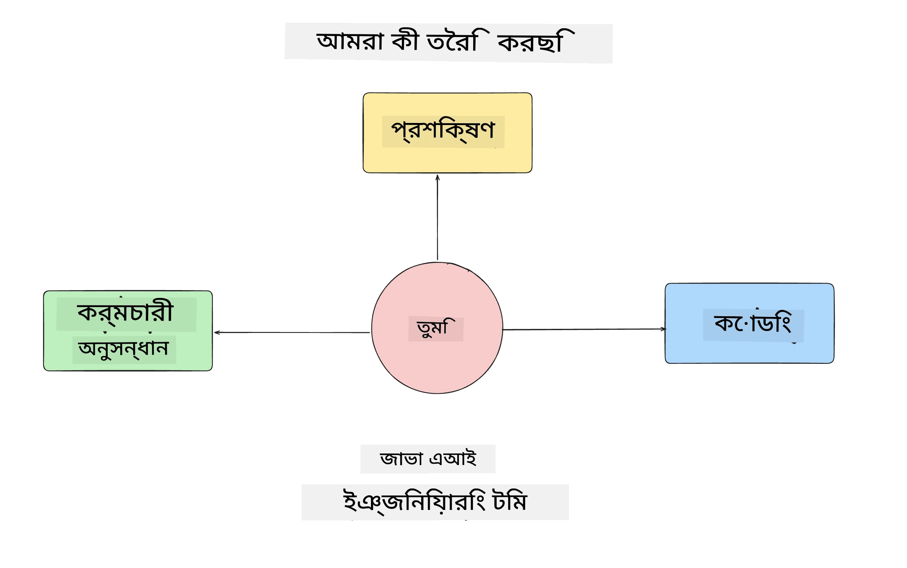
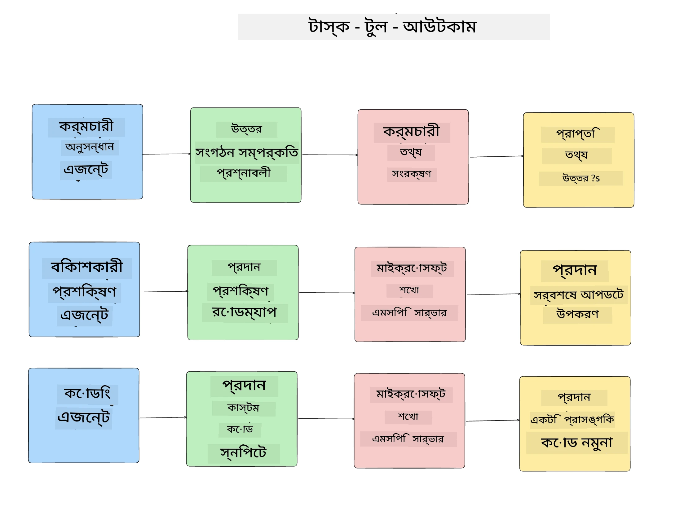
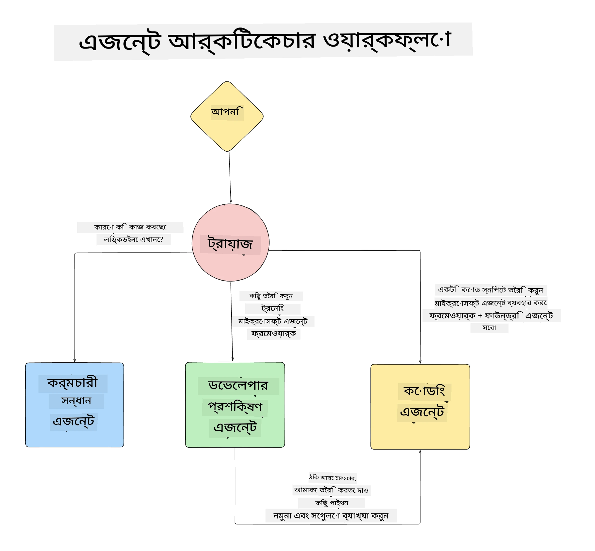

# পাঠ ১: এআই এজেন্ট ডিজাইন

"শূন্য থেকে প্রোডাকশনে AI এজেন্ট নির্মাণ কোর্স"-এর প্রথম পাঠে আপনাকে স্বাগতম!

এই পাঠে আমরা আলোচনা করব:

- এআই এজেন্ট কি তা নির্ধারণ করা
  
- আমরা যে AI এজেন্ট অ্যাপ্লিকেশন তৈরি করছি তা আলোচনা করা  

- প্রতিটি এজেন্টের জন্য প্রয়োজনীয় সরঞ্জাম এবং পরিষেবা নির্ধারণ করা
  
- আমাদের এজেন্ট অ্যাপ্লিকেশন আর্কিটেক্ট করা
  
চলুন শুরু করি এজেন্ট কী এবং কেন আমরা তাদের অ্যাপ্লিকেশনের মধ্যে ব্যবহার করব তা সংজ্ঞায়িত করে।

> **কোর্স শুরু করার আগে।** এই প্রথম পাঠটি ধারণাগত — এখানে কোনো কোড রান করার নেই।
> [Lesson 2](../lesson-2-agent-development/README.md) থেকে আপনি প্রথমে প্রয়োজন হবে: একটি **Azure সাবস্ক্রিপশন** যা **Microsoft Foundry** এবং একটি স্থাপিত **GPT-5 সিরিজ মডেল** (উদাহরণস্বরূপ `gpt-5.1` — অবসরপ্রাপ্ত GPT-4o / GPT-4.1 ব্যবহার করবেন না), **Python 3.12+**, এবং **Azure CLI** (`az login`) অ্যাক্সেস। সম্পূর্ণ তালিকা এবং লিঙ্কের জন্য কোর্স README এর [What You Need](../README.md#what-you-need) দেখুন।

## এআই এজেন্ট কী?

যদি এটি আপনার প্রথমবারের মতো AI এজেন্ট তৈরির প্রক্রিয়া অন্বেষণ হয়, তাহলে আপনি হয়তো ভাবছেন ঠিক কীভাবে AI এজেন্ট সংজ্ঞায়িত করবেন।

একটি সহজ উপায় AI এজেন্ট সংজ্ঞায়িত করার জন্য তার উপাদানসমূহ দ্বারা:

**বড় ভাষার মডেল** - LLM ব্যবহারকারীর ভাষা প্রক্রিয়া করার ক্ষমতা প্রদান করে, তারা কি কাজ করতে চায় তা বুঝে এবং উপলব্ধ টুলের বর্ণনা ব্যাখ্যা করে।

**সরঞ্জাম** - এগুলো হবে ফাংশন, API, ডাটাস্টোর এবং অন্যান্য পরিষেবা যা LLM ব্যবহার করতে পারে ব্যবহারকারীর অনুরোধকৃত কাজ সম্পন্ন করার জন্য।

**মেমরি** - এটি AI এজেন্ট এবং ব্যবহারকারীর মধ্যে স্বল্পমেয়াদী ও দীর্ঘমেয়াদী পারস্পরিক ক্রিয়াকলাপ সংরক্ষণ করে। তথ্য সংরক্ষণ এবং পুনরুদ্ধার উন্নতি এবং ব্যবহারকারীর পছন্দ সংরক্ষণে গুরুত্বপূর্ণ।

## আমাদের AI এজেন্ট ব্যবহারের কেস

এই কোর্সের জন্য, আমরা এমন একটি AI এজেন্ট অ্যাপ্লিকেশন তৈরি করব যা নতুন ডেভেলপারদের আমাদের AI এজেন্ট ডেভেলপমেন্ট দলের সাথে সহজে অনবোর্ড হতে সাহায্য করবে!

যেকোনো ডেভেলপমেন্ট কাজ শুরু করার আগে, একটি সফল AI এজেন্ট অ্যাপ্লিকেশন তৈরির প্রথম ধাপ হল আমাদের ব্যবহারকারীদের AI এজেন্টের সাথে কাজ করার প্রত্যাশিত পরিস্থিতি স্পষ্টভাবে সংজ্ঞায়িত করা।

এই অ্যাপ্লিকেশনের জন্য, আমরা নিম্নলিখিত পরিস্থিতির সাথে কাজ করব:

**পর্দৃশ্য ১**: একটি নতুন কর্মচারী আমাদের প্রতিষ্ঠানে যোগ দেয় এবং তিনি দল সম্পর্কে এবং তাদের সাথে যোগাযোগের উপায় জানতে চান।

**পর্দৃশ্য ২:** নতুন কর্মচারী জানতে চান কোনটি তাদের প্রথম কাজ হিসেবে সবচেয়ে ভালো হবে।

**পর্দৃশ্য ৩:** নতুন কর্মচারী শেখার উপকরণ এবং কোড নমুনা সংগ্রহ করতে চান যা তাদের কাজ শুরু করতে সাহায্য করবে।

## সরঞ্জাম এবং পরিষেবা নির্ধারণ

এখন যেহেতু আমাদের কাছে পরিস্থিতিগুলো তৈরি হয়েছে, পরবর্তী ধাপ হল এগুলোকে এমন সরঞ্জাম এবং পরিষেবার সাথে ম্যাপ করা যা আমাদের AI এজেন্টদের কাজগুলি সম্পন্ন করতে প্রয়োজন হবে।

এই প্রক্রিয়াটি Context Engineering-এর মধ্যে পড়ে কারণ আমরা আমাদের AI এজেন্টদের সঠিক সময়ে সঠিক প্রসঙ্গ প্রদান নিশ্চিত করতে চাই।

চলুন এটি পরিস্থিতি অনুসারে করি এবং প্রতিটি এজেন্টের কাজ, সরঞ্জাম এবং কাঙ্ক্ষিত ফলাফল তালিকাভুক্ত করে ভাল এজেন্টিক ডিজাইন করি।

### পরিস্থিতি ১ - কর্মচারী অনুসন্ধান এজেন্ট

**কাজ** - প্রতিষ্ঠানের কর্মচারীদের সম্পর্কে প্রশ্নের উত্তর দেওয়া যেমন যোগদানের তারিখ, বর্তমান দল, অবস্থান এবং শেষ পদবী।

**সরঞ্জাম** - বর্তমান কর্মচারী তালিকা এবং অর্গ চার্টের ডাটাস্টোর

**ফলাফল** - ডাটাস্টোর থেকে তথ্য সংগ্রহ করে সাধারণ সাংগঠনিক প্রশ্ন এবং নির্দিষ্ট কর্মচারীদের সম্পর্কে প্রশ্নের উত্তর দিতে সক্ষম।

### পরিস্থিতি ২ - কাজের সুপারিশ এজেন্ট

**কাজ** - নতুন কর্মচারীর ডেভেলপার অভিজ্ঞতার ভিত্তিতে, ১-৩টি সমস্যা বেছে নেওয়া যেগুলো নতুন কর্মচারী কাজ শুরু করতে পারে।

**সরঞ্জাম** - GitHub MCP সার্ভার থেকে খোলা ইস্যুগুলো পেতে এবং ডেভেলপার প্রোফাইল তৈরী করতে

**ফলাফল** - GitHub প্রোফাইলের শেষ ৫টি কমিট এবং GitHub প্রকল্পের খোলা ইস্যুগুলো পড়ে মেলানোর ভিত্তিতে সুপারিশ করতে সক্ষম।

### পরিস্থিতি ৩ - কোড সহকারী এজেন্ট

**কাজ** - "কাজের সুপারিশ" এজেন্ট দ্বারা প্রস্তাবিত খোলা ইস্যুগুলোর ভিত্তিতে, গবেষণা করা, উপকরণ প্রদান এবং কোড স্নিপেট তৈরি করা কর্মচারীর সাহায্যে।

**সরঞ্জাম** - Microsoft Learn MCP থেকে উপকরণ খুঁজে পাওয়া এবং কোড ইন্টারপ্রেটার ব্যবহার করে কাস্টম কোড স্নিপেট তৈরি।

**ফলাফল** - ব্যবহারকারী যদি অতিরিক্ত সাহায্য চান, তাহলে ওয়ার্কফ্লোটি Learn MCP সার্ভার ব্যবহার করে লিঙ্ক এবং কোড স্নিপেট প্রদান করবে এবং পরে কোড ইন্টারপ্রেটার এজেন্টকে ছোট কোড স্নিপেট ব্যাখ্যাসহ তৈরি করার জন্য হস্তান্তর করবে।

## আমাদের এজেন্ট অ্যাপ্লিকেশন আর্কিটেক্ট করা

এখন যেহেতু আমরা প্রতিটি এজেন্ট সংজ্ঞায়িত করেছি, চলুন একটি আর্কিটেকচার ডায়াগ্রাম তৈরি করি যা আমাদের বুঝতে সাহায্য করবে কিভাবে প্রতিটি এজেন্ট আলাদাভাবে এবং একসাথে কাজ করবে কাজের ভিত্তিতে:

## পরবর্তী ধাপ

এখন যেহেতু আমরা প্রতিটি এজেন্ট এবং আমাদের এজেন্টিক সিস্টেম ডিজাইন করেছি, চলুন পরবর্তী পাঠে যাই যেখানে আমরা এই এজেন্টগুলোকে ডেভেলপ করব!

---

<!-- CO-OP TRANSLATOR DISCLAIMER START -->
**অস্বীকৃতি**:
এই নথিটি AI অনুবাদ পরিষেবা [Co-op Translator](https://github.com/Azure/co-op-translator) ব্যবহার করে অনূদিত হয়েছে। যদিও আমরা শুদ্ধতার জন্য চেষ্টা করি, অনুগ্রহ করে মনে রাখবেন যে স্বয়ংক্রিয় অনুবাদে ত্রুটি বা অসঙ্গতি থাকতে পারে। মূল নথিটি তার স্বভাষায় কর্তৃত্বপূর্ণ উৎস হিসেবে বিবেচিত হওয়া উচিত। গুরুত্বপূর্ণ তথ্যের জন্য পেশাদার মানব অনুবাদ সুপারিশ করা হয়। এই অনুবাদের ব্যবহারে প্রয়োজনীয় ভুল বোঝাবুঝি বা ভুল ব্যাখ্যার জন্য আমরা দায়বদ্ধ নই।
<!-- CO-OP TRANSLATOR DISCLAIMER END -->