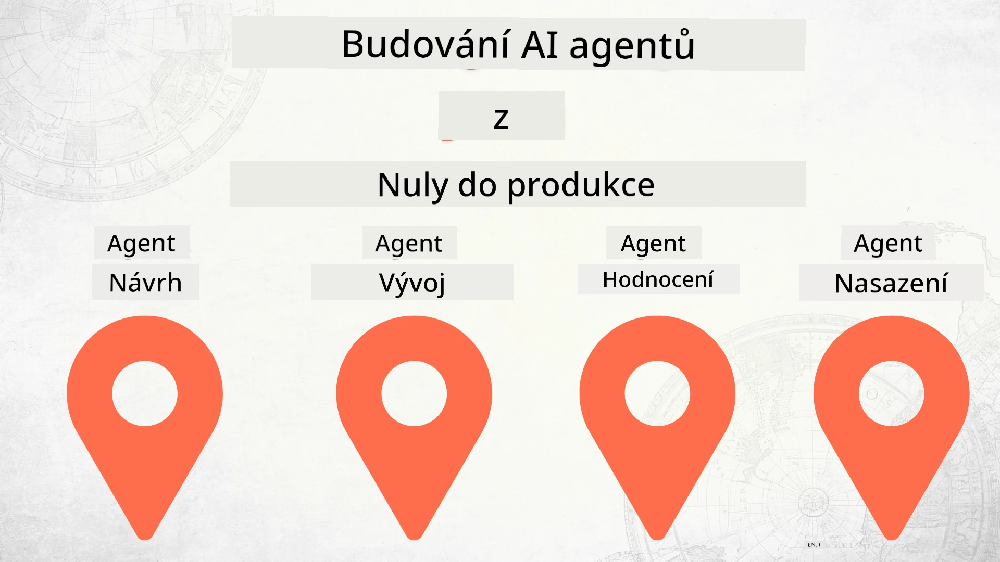

# Vytváření AI agentů od nuly až do produkce



### 🌐 Podpora více jazyků

#### Podporováno pomocí GitHub Action (automatizováno a vždy aktuální)

<!-- CO-OP TRANSLATOR LANGUAGES TABLE START -->
[Arabština](../ar/README.md) | [Bengálština](../bn/README.md) | [Bulharština](../bg/README.md) | [Barmsky (Myanmar)](../my/README.md) | [Čínština (zjednodušená)](../zh-CN/README.md) | [Čínština (tradiční, Hong Kong)](../zh-HK/README.md) | [Čínština (tradiční, Macau)](../zh-MO/README.md) | [Čínština (tradiční, Taiwan)](../zh-TW/README.md) | [Chorvatština](../hr/README.md) | [Čeština](./README.md) | [Dánština](../da/README.md) | [Nizozemština](../nl/README.md) | [Estonština](../et/README.md) | [Finština](../fi/README.md) | [Francouzština](../fr/README.md) | [Němčina](../de/README.md) | [Řečtina](../el/README.md) | [Hebrejština](../he/README.md) | [Hindština](../hi/README.md) | [Maďarština](../hu/README.md) | [Indonéština](../id/README.md) | [Italština](../it/README.md) | [Japonština](../ja/README.md) | [Kannadština](../kn/README.md) | [Korejština](../ko/README.md) | [Litevština](../lt/README.md) | [Malajština](../ms/README.md) | [Malajalámština](../ml/README.md) | [Maráthština](../mr/README.md) | [Nepálština](../ne/README.md) | [Nigerijská pidžin](../pcm/README.md) | [Norština](../no/README.md) | [Perština (Fársí)](../fa/README.md) | [Polština](../pl/README.md) | [Portugalština (Brazílie)](../pt-BR/README.md) | [Portugalština (Portugalsko)](../pt-PT/README.md) | [Paňdžábština (Gurmukhí)](../pa/README.md) | [Rumunština](../ro/README.md) | [Ruština](../ru/README.md) | [Srbština (cyrilice)](../sr/README.md) | [Slovenština](../sk/README.md) | [Slovinština](../sl/README.md) | [Španělština](../es/README.md) | [Svahilština](../sw/README.md) | [Švédština](../sv/README.md) | [Tagalog (Filipíny)](../tl/README.md) | [Tamilština](../ta/README.md) | [Telugština](../te/README.md) | [Thajština](../th/README.md) | [Turečtina](../tr/README.md) | [Ukrajinština](../uk/README.md) | [Urdu](../ur/README.md) | [Vietnamština](../vi/README.md)

> **Raději klonovat lokálně?**

> Tento repozitář obsahuje překlady do více než 50 jazyků, což výrazně zvětšuje velikost ke stažení. Pro klonování bez překladů použijte sparse checkout:
> ```bash
> git clone --filter=blob:none --sparse https://github.com/microsoft/Building-AI-Agents-From-Zero-To-Production.git
> cd Building-AI-Agents-From-Zero-To-Production
> git sparse-checkout set --no-cone '/*' '!translations' '!translated_images'
> ```
> To vám poskytne vše potřebné ke dokončení kurzu s mnohem rychlejším stažením.
<!-- CO-OP TRANSLATOR LANGUAGES TABLE END -->

## Kurz, který vás naučí základy životního cyklu vývoje AI agentů

[](https://github.com/microsoft/Building-AI-Agents-From-Zero-To-Production/blob/master/LICENSE?WT.mc_id=academic-105485-koreyst)
[](https://GitHub.com/microsoft/Building-AI-Agents-From-Zero-To-Production/graphs/contributors/?WT.mc_id=academic-105485-koreyst)
[](https://GitHub.com/microsoft/Building-AI-Agents-From-Zero-To-Production/issues/?WT.mc_id=academic-105485-koreyst)
[](https://GitHub.com/microsoft/Building-AI-Agents-From-Zero-To-Production/pulls/?WT.mc_id=academic-105485-koreyst)
[](http://makeapullrequest.com?WT.mc_id=academic-105485-koreyst)

[](https://discord.gg/Kuaw3ktsu6)

## 🌱 Začínáme

Tento kurz obsahuje lekce pokrývající základy tvorby a nasazení AI agentů.

Každá lekce navazuje na předchozí, proto doporučujeme začít od začátku a postupovat až do konce.

Pokud chcete prozkoumat více témat týkajících se AI agentů, můžete si prohlédnout [Kurz AI Agentů pro začátečníky](https://aka.ms/ai-agents-beginners).

### Seznamte se s ostatními studenty a získejte odpovědi na své otázky

Pokud narazíte na potíže nebo máte jakékoli otázky ohledně tvorby AI agentů, připojte se k našemu speciálnímu Discord kanálu v [Microsoft Foundry Discord](https://discord.gg/Kuaw3ktsu6).

### Co potřebujete

Každá lekce má vlastní ukázkový kód, který můžete spustit lokálně. Můžete si [vykopat tento repozitář](https://github.com/microsoft/Building-AI-Agents-From-Zero-To-Production/fork) a vytvořit si vlastní kopii.

Tento kurz aktuálně používá:

- [Microsoft Agent Framework (MAF)](https://aka.ms/ai-agents-beginners/agent-framework)
- [Microsoft Foundry](https://azure.microsoft.com/products/ai-foundry)
- [Azure OpenAI Service](https://azure.microsoft.com/products/ai-foundry/models/openai)
- [Azure CLI](https://learn.microsoft.com/cli/azure/authenticate-azure-cli?view=azure-cli-latest)

Před zahájením se ujistěte, že máte přístup k těmto službám.

Brzy přibudou další možnosti hostování modelů a služeb.

## 🗃️ Lekce

| **Lekce**         | **Popis**                                                                                     |
|--------------------|---------------------------------------------------------------------------------------------|
| [Návrh agenta](./lesson-1-agent-design/README.md)           | Úvod do případové studie "Onboarding vývojáře" a jak navrhovat efektivní agenty          |
| [Vývoj agenta](./lesson-2-agent-development/README.md)      | Pomocí Microsoft Agent Framework (MAF) vytvořte 3 agenty, kteří pomohou novým vývojářům. |
| [Hodnocení agenta](./lesson-3-agent-evals/README.md)        | Pomocí Microsoft Foundry zjistěte, jak si naši AI agenti vedou a jak je zlepšit.         |
| [Nasazení agenta](./lesson-4-agent-deployment/README.md)    | Pomocí Hosted Agents a OpenAI Chatkit zjistěte, jak nasadit AI agenta do produkce.      |


## 🎒 Další kurzy

Náš tým vytváří i jiné kurzy! Podívejte se na:

<!-- CO-OP TRANSLATOR OTHER COURSES START -->
### LangChain
[](https://aka.ms/langchain4j-for-beginners)
[](https://aka.ms/langchainjs-for-beginners?WT.mc_id=m365-94501-dwahlin)

---

### Azure / Edge / MCP / Agenti
[](https://github.com/microsoft/AZD-for-beginners?WT.mc_id=academic-105485-koreyst)
[](https://github.com/microsoft/edgeai-for-beginners?WT.mc_id=academic-105485-koreyst)
[](https://github.com/microsoft/mcp-for-beginners?WT.mc_id=academic-105485-koreyst)
[](https://github.com/microsoft/ai-agents-for-beginners?WT.mc_id=academic-105485-koreyst)

---
 
### Série Generativní AI
[](https://github.com/microsoft/generative-ai-for-beginners?WT.mc_id=academic-105485-koreyst)
[-9333EA?style=for-the-badge&labelColor=E5E7EB&color=9333EA)](https://github.com/microsoft/Generative-AI-for-beginners-dotnet?WT.mc_id=academic-105485-koreyst)
[-C084FC?style=for-the-badge&labelColor=E5E7EB&color=C084FC)](https://github.com/microsoft/generative-ai-for-beginners-java?WT.mc_id=academic-105485-koreyst)
[-E879F9?style=for-the-badge&labelColor=E5E7EB&color=E879F9)](https://github.com/microsoft/generative-ai-with-javascript?WT.mc_id=academic-105485-koreyst)

---
 
### Základní vzdělávání
[](https://aka.ms/ml-beginners?WT.mc_id=academic-105485-koreyst)
[](https://aka.ms/datascience-beginners?WT.mc_id=academic-105485-koreyst)
[](https://aka.ms/ai-beginners?WT.mc_id=academic-105485-koreyst)
[](https://github.com/microsoft/Security-101?WT.mc_id=academic-96948-sayoung)
[](https://aka.ms/webdev-beginners?WT.mc_id=academic-105485-koreyst)
[](https://aka.ms/iot-beginners?WT.mc_id=academic-105485-koreyst)
[](https://github.com/microsoft/xr-development-for-beginners?WT.mc_id=academic-105485-koreyst)

---
 
### Série Copilot
[](https://aka.ms/GitHubCopilotAI?WT.mc_id=academic-105485-koreyst)
[](https://github.com/microsoft/mastering-github-copilot-for-dotnet-csharp-developers?WT.mc_id=academic-105485-koreyst)
[](https://github.com/microsoft/CopilotAdventures?WT.mc_id=academic-105485-koreyst)
<!-- CO-OP TRANSLATOR OTHER COURSES END -->

## Přispívání

Tento projekt vítá příspěvky a návrhy. Většina příspěvků vyžaduje, abyste souhlasili s
Licenční smlouvou přispěvatele (CLA), která deklaruje, že máte právo a skutečně nám
udělujete práva k použití vašeho příspěvku. Pro podrobnosti navštivte <https://cla.opensource.microsoft.com>.

Když odešlete pull request, bot CLA automaticky zjistí, zda je potřeba poskytnout
CLA a příslušně označí PR (např. kontrola stavu, komentář). Jednoduše postupujte podle pokynů
poskytnutých botem. Toto bude potřeba udělat pouze jednou napříč všemi repozitáři používajícími naši CLA.

Tento projekt přijal [Microsoft Open Source Code of Conduct](https://opensource.microsoft.com/codeofconduct/).
Pro více informací viz [Často kladené otázky o Kodexu chování](https://opensource.microsoft.com/codeofconduct/faq/) nebo
kontaktujte [opencode@microsoft.com](mailto:opencode@microsoft.com) s případnými dalšími otázkami či komentáři.

## Ochranné známky

Tento projekt může obsahovat ochranné známky nebo loga projektů, produktů či služeb. Autorizované použití ochranných známek nebo log Microsoftu
podléhá a musí dodržovat
[Pravidla používání ochranných známek a značek Microsoftu](https://www.microsoft.com/legal/intellectualproperty/trademarks/usage/general).
Použití ochranných známek nebo log Microsoftu v upravených verzích tohoto projektu nesmí způsobit záměnu nebo naznačovat sponzorství Microsoftem.
Jakékoli použití ochranných známek nebo log třetích stran podléhá pravidlům těchto třetích stran.

## Získání pomoci

Pokud jste zablokováni nebo máte jakékoli dotazy ohledně vytváření AI aplikací, připojte se:

[](https://discord.gg/Kuaw3ktsu6)

Pokud máte zpětnou vazbu k produktu nebo chyby během vývoje, navštivte:

[](https://aka.ms/foundry/forum)

---

<!-- CO-OP TRANSLATOR DISCLAIMER START -->
**Zřeknutí se odpovědnosti**:  
Tento dokument byl přeložen pomocí služby automatického překladu [Co-op Translator](https://github.com/Azure/co-op-translator). Přestože usilujeme o přesnost, mějte prosím na paměti, že automatické překlady mohou obsahovat chyby nebo nepřesnosti. Původní dokument v jeho mateřském jazyce by měl být považován za autoritativní zdroj. Pro důležité informace se doporučuje profesionální lidský překlad. Nejsme odpovědní za jakékoliv nedorozumění nebo mylné výklady vyplývající z použití tohoto překladu.
<!-- CO-OP TRANSLATOR DISCLAIMER END -->