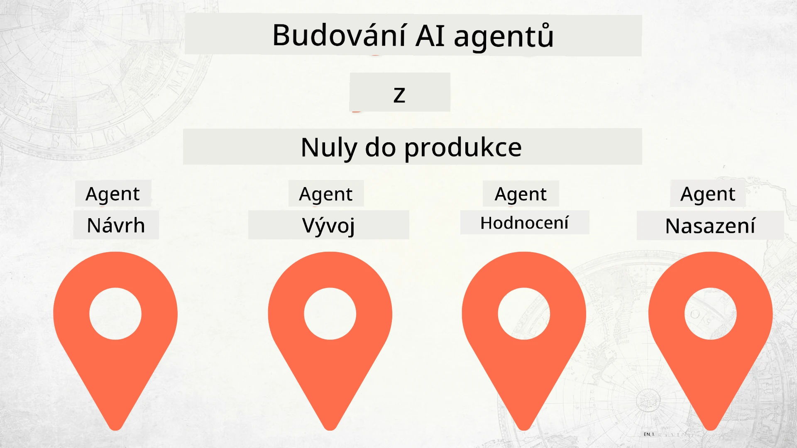

# Vytváření AI agentů od nuly až do produkce



### 🌐 Podpora více jazyků

#### Podporováno pomocí GitHub Action (automatizované a vždy aktuální)

<!-- CO-OP TRANSLATOR LANGUAGES TABLE START -->
[Arabic](../ar/README.md) | [Bengali](../bn/README.md) | [Bulgarian](../bg/README.md) | [Burmese (Myanmar)](../my/README.md) | [Chinese (Simplified)](../zh-CN/README.md) | [Chinese (Traditional, Hong Kong)](../zh-HK/README.md) | [Chinese (Traditional, Macau)](../zh-MO/README.md) | [Chinese (Traditional, Taiwan)](../zh-TW/README.md) | [Croatian](../hr/README.md) | [Czech](./README.md) | [Danish](../da/README.md) | [Dutch](../nl/README.md) | [Estonian](../et/README.md) | [Finnish](../fi/README.md) | [French](../fr/README.md) | [German](../de/README.md) | [Greek](../el/README.md) | [Hebrew](../he/README.md) | [Hindi](../hi/README.md) | [Hungarian](../hu/README.md) | [Indonesian](../id/README.md) | [Italian](../it/README.md) | [Japanese](../ja/README.md) | [Kannada](../kn/README.md) | [Khmer](../km/README.md) | [Korean](../ko/README.md) | [Lithuanian](../lt/README.md) | [Malay](../ms/README.md) | [Malayalam](../ml/README.md) | [Marathi](../mr/README.md) | [Nepali](../ne/README.md) | [Nigerian Pidgin](../pcm/README.md) | [Norwegian](../no/README.md) | [Persian (Farsi)](../fa/README.md) | [Polish](../pl/README.md) | [Portuguese (Brazil)](../pt-BR/README.md) | [Portuguese (Portugal)](../pt-PT/README.md) | [Punjabi (Gurmukhi)](../pa/README.md) | [Romanian](../ro/README.md) | [Russian](../ru/README.md) | [Serbian (Cyrillic)](../sr/README.md) | [Slovak](../sk/README.md) | [Slovenian](../sl/README.md) | [Spanish](../es/README.md) | [Swahili](../sw/README.md) | [Swedish](../sv/README.md) | [Tagalog (Filipino)](../tl/README.md) | [Tamil](../ta/README.md) | [Telugu](../te/README.md) | [Thai](../th/README.md) | [Turkish](../tr/README.md) | [Ukrainian](../uk/README.md) | [Urdu](../ur/README.md) | [Vietnamese](../vi/README.md)

> **Preferujete klonovat lokálně?**
>
> Tento repozitář obsahuje více než 50 jazykových překladů, což výrazně zvětšuje velikost stahování. Pro klonování bez překladů použijte sparse checkout:
>
> **Bash / macOS / Linux:**
> ```bash
> git clone --filter=blob:none --sparse https://github.com/microsoft/Building-AI-Agents-From-Zero-To-Production.git
> cd Building-AI-Agents-From-Zero-To-Production
> git sparse-checkout set --no-cone '/*' '!translations' '!translated_images'
> ```
>
> **CMD (Windows):**
> ```cmd
> git clone --filter=blob:none --sparse https://github.com/microsoft/Building-AI-Agents-From-Zero-To-Production.git
> cd Building-AI-Agents-From-Zero-To-Production
> git sparse-checkout set --no-cone "/*" "!translations" "!translated_images"
> ```
>
> Tento způsob vám poskytne vše potřebné k dokončení kurzu s mnohem rychlejším stahováním.
<!-- CO-OP TRANSLATOR LANGUAGES TABLE END -->

## Kurz, který vás naučí základy životního cyklu vývoje AI agentů

[](https://github.com/microsoft/Building-AI-Agents-From-Zero-To-Production/blob/master/LICENSE?WT.mc_id=academic-105485-koreyst)
[](https://GitHub.com/microsoft/Building-AI-Agents-From-Zero-To-Production/graphs/contributors/?WT.mc_id=academic-105485-koreyst)
[](https://GitHub.com/microsoft/Building-AI-Agents-From-Zero-To-Production/issues/?WT.mc_id=academic-105485-koreyst)
[](https://GitHub.com/microsoft/Building-AI-Agents-From-Zero-To-Production/pulls/?WT.mc_id=academic-105485-koreyst)
[](http://makeapullrequest.com?WT.mc_id=academic-105485-koreyst)

[](https://discord.gg/Kuaw3ktsu6)

## 🌱 Začínáme

Tento kurz obsahuje lekce pokrývající základy budování a nasazování AI agentů.

Každá lekce navazuje na předchozí, proto doporučujeme začít od začátku a pokračovat až do konce.

Pokud chcete prozkoumat více o tématech AI agentů, můžete si prohlédnout [Kurz AI agentů pro začátečníky](https://aka.ms/ai-agents-beginners).

### Poznejte ostatní studenty, získejte odpovědi na své otázky

Pokud se zaseknete nebo máte jakékoli dotazy ohledně vytváření AI agentů, připojte se k našemu dedikovanému Discord kanálu na [Microsoft Foundry Discord](https://discord.gg/Kuaw3ktsu6).

### Co budete potřebovat

Každá lekce má vlastní ukázkový kód, který můžete spustit lokálně. Můžete [forknout tento repozitář](https://github.com/microsoft/Building-AI-Agents-From-Zero-To-Production/fork) a vytvořit si vlastní kopii.

Tento kurz momentálně používá následující nástroje:

- [Microsoft Agent Framework (MAF)](https://aka.ms/ai-agents-beginners/agent-framework)
- [Microsoft Foundry](https://azure.microsoft.com/products/ai-foundry) — projekt s nasazeným modelem **GPT-5 série** (například `gpt-5.1`). Nepoužívejte ukončené modely GPT-4o / GPT-4.1.
- [Azure OpenAI Service](https://azure.microsoft.com/products/ai-foundry/models/openai)
- [Azure CLI](https://learn.microsoft.com/cli/azure/authenticate-azure-cli?view=azure-cli-latest) — přihlaste se pomocí `az login` před spuštěním jakékoli ukázky
- **Python 3.12 nebo novější**

Ujistěte se, že máte přístup k těmto službám před zahájením.

> **💰 Náklady a úklid.** Praktické lekce vytvářejí skutečné Azure zdroje — projekt Microsoft Foundry,
> nasazení modelu, vektorové úložiště a (v lekcích 4–6) hostované agenty a nástroje.
> Tyto mohou během své existence generovat náklady. Po dokončení lekce — nebo celého kurzu — smažte
> zdroje, které již nepotřebujete. Nejjednodušším způsobem je umístit vše do vyhrazené
> skupiny zdrojů a po skončení ji celý skupinu smazat:
>
> ```bash
> az group delete --name <your-resource-group> --yes --no-wait
> ```
>
> Můžete také smazat jednotlivé agenty, vektorová úložiště a nástroje z portálu Foundry.

> **Poznámka k modelům.** Tento kurz poskytuje všechny modely přes **Microsoft Foundry**. Nepoužívá
> *GitHub Models*, které budou ukončeny k **30. červenci 2026** — Microsoft Foundry je
> oficiální migrační cesta. Pokud máte starší kód, který používá GitHub Models, nasměrujte ho raději na
> nasazení modelu ve Foundry.

Brzy přijdou další možnosti ohledně hostování modelů a služeb.

## 🗃️ Lekce

| **Lekce**         | **Popis**                                                                                  |
|--------------------|--------------------------------------------------------------------------------------------------|
| [Návrh agenta](./lesson-1-agent-design/README.md)       | Úvod do případu použití agenta „Onboarding vývojáře“ a jak navrhnout efektivní agenty  |
| [Vývoj agenta](./lesson-2-agent-development/README.md)  | Použití Microsoft Agent Framework (MAF) k vytvoření sady specializovaných agentů pro pomoc novým vývojářům s onboardingem.       |
| [Hodnocení agentů](./lesson-3-agent-evals/README.md)  | Pomocí Microsoft Foundry zjistěte, jak si naši AI agenti vedou a jak je zlepšit. |
| [Nasazení agenta](./lesson-4-agentdeployment/README.md)   | Pomocí hostovaných agentů Microsoft Foundry a OpenAI ChatKit uvidíte, jak nasadit AI agenta do produkce.       |
| [Produkčně hostovaní agenti](./lesson-5-hosted-agents-production/README.md)   | Přeneste hostovaného agenta do podnikového provozu: hostovaní agenti versus hostitelé schopností, vlastní úložiště, paměť a správa.       |
| [Microsoft Toolbox](./lesson-6-toolbox/README.md)   | Jednou definujte nástroje a spravujte je centrálně: vytvořte toolbox, používejte ho z agenta pomocí jednoho MCP endpointu a bezpečně verzujte nástroje.       |
| [Více agentů & A2A](./lesson-7-multi-agent-a2a/README.md)   | Skládejte agenty jako síťované služby: zpřístupněte agenta přes otevřený protokol Agent-to-Agent (A2A) a využívejte vzdáleného agenta jako partnera.       |


## 🎒 Další kurzy

Náš tým vytváří další kurzy! Podívejte se na:

<!-- CO-OP TRANSLATOR OTHER COURSES START -->
### LangChain
[](https://aka.ms/langchain4j-for-beginners)
[](https://aka.ms/langchainjs-for-beginners?WT.mc_id=m365-94501-dwahlin)
[](https://github.com/microsoft/langchain-for-beginners?WT.mc_id=m365-94501-dwahlin)
---

### Azure / Edge / MCP / Agenti
[](https://github.com/microsoft/AZD-for-beginners?WT.mc_id=academic-105485-koreyst)
[](https://github.com/microsoft/edgeai-for-beginners?WT.mc_id=academic-105485-koreyst)
[](https://github.com/microsoft/mcp-for-beginners?WT.mc_id=academic-105485-koreyst)
[](https://github.com/microsoft/ai-agents-for-beginners?WT.mc_id=academic-105485-koreyst)

---
 
### Série o generativní AI

[](https://github.com/microsoft/generative-ai-for-beginners?WT.mc_id=academic-105485-koreyst)
[-9333EA?style=for-the-badge&labelColor=E5E7EB&color=9333EA)](https://github.com/microsoft/Generative-AI-for-beginners-dotnet?WT.mc_id=academic-105485-koreyst)
[-C084FC?style=for-the-badge&labelColor=E5E7EB&color=C084FC)](https://github.com/microsoft/generative-ai-for-beginners-java?WT.mc_id=academic-105485-koreyst)
[-E879F9?style=for-the-badge&labelColor=E5E7EB&color=E879F9)](https://github.com/microsoft/generative-ai-with-javascript?WT.mc_id=academic-105485-koreyst)

---
 
### Základní učení
[](https://aka.ms/ml-beginners?WT.mc_id=academic-105485-koreyst)
[](https://aka.ms/datascience-beginners?WT.mc_id=academic-105485-koreyst)
[](https://aka.ms/ai-beginners?WT.mc_id=academic-105485-koreyst)
[](https://github.com/microsoft/Security-101?WT.mc_id=academic-96948-sayoung)
[](https://aka.ms/webdev-beginners?WT.mc_id=academic-105485-koreyst)
[](https://aka.ms/iot-beginners?WT.mc_id=academic-105485-koreyst)
[](https://github.com/microsoft/xr-development-for-beginners?WT.mc_id=academic-105485-koreyst)

---
 
### Série Copilot
[](https://aka.ms/GitHubCopilotAI?WT.mc_id=academic-105485-koreyst)
[](https://github.com/microsoft/mastering-github-copilot-for-dotnet-csharp-developers?WT.mc_id=academic-105485-koreyst)
[](https://github.com/microsoft/CopilotAdventures?WT.mc_id=academic-105485-koreyst)
<!-- CO-OP TRANSLATOR OTHER COURSES END -->

## Přispívání

Tento projekt vítá příspěvky a návrhy. Většina příspěvků vyžaduje, abyste souhlasili s
smlouvou o licenci přispěvatele (Contributor License Agreement, CLA), v níž prohlašujete, že máte právo
a skutečně nám udělujete práva k použití vašeho příspěvku. Pro podrobnosti navštivte <https://cla.opensource.microsoft.com>.

Při podání pull requestu automaticky CLA bot zjistí, zda potřebujete poskytnout
CLA a vhodně označí PR (např. kontrola stavu, komentář). Jednoduše postupujte podle pokynů
poskytnutých botem. Toto budete muset udělat pouze jednou napříč všemi repozitáři používajícími naši CLA.

Tento projekt přijal [Microsoft Open Source Code of Conduct](https://opensource.microsoft.com/codeofconduct/).
Pro více informací viz [Často kladené otázky o Kodexu chování](https://opensource.microsoft.com/codeofconduct/faq/) nebo
kontaktujte [opencode@microsoft.com](mailto:opencode@microsoft.com) s jakýmikoli dalšími dotazy nebo připomínkami.

## Ochranné známky

Tento projekt může obsahovat ochranné známky nebo loga projektů, produktů či služeb. Autorizované použití ochranných známek nebo log Microsoftu
podléhá pravidlům a musí dodržovat
[Pravidla používání ochranných známek a značek Microsoftu](https://www.microsoft.com/legal/intellectualproperty/trademarks/usage/general).
Použití ochranných známek nebo log Microsoftu v upravených verzích tohoto projektu nesmí způsobit záměnu nebo naznačovat sponzorství Microsoftem.
Jakékoli použití ochranných známek nebo log třetích stran podléhá politikám těchto třetích stran.

## Získání pomoci

Pokud narazíte na problém nebo máte otázky ohledně tvorby AI aplikací, připojte se:

[](https://discord.gg/Kuaw3ktsu6)

Máte-li zpětnou vazbu k produktu nebo chyby při vývoji, navštivte:

[](https://aka.ms/foundry/forum)

---

<!-- CO-OP TRANSLATOR DISCLAIMER START -->
**Prohlášení o omezení odpovědnosti**:
Tento dokument byl přeložen pomocí AI překladatelské služby [Co-op Translator](https://github.com/Azure/co-op-translator). Přestože usilujeme o co největší přesnost, mějte prosím na paměti, že automatizované překlady mohou obsahovat chyby nebo nepřesnosti. Originální dokument v jeho mateřském jazyce by měl být považován za autoritativní zdroj. Pro kritické informace se doporučuje profesionální lidský překlad. Nejsme odpovědní za jakékoli nedorozumění nebo nesprávné interpretace vzniklé použitím tohoto překladu.
<!-- CO-OP TRANSLATOR DISCLAIMER END -->