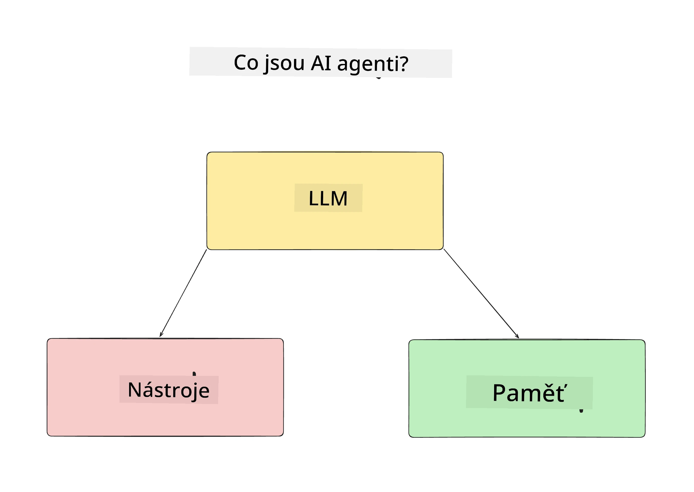
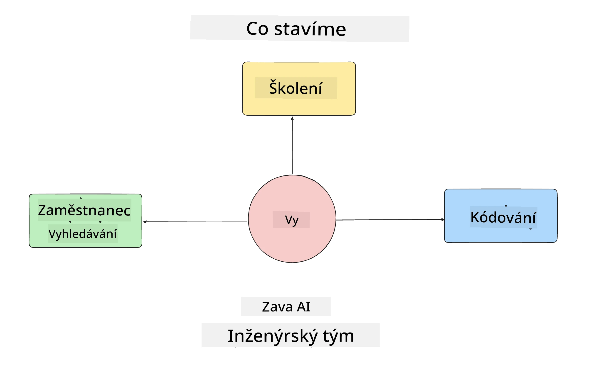
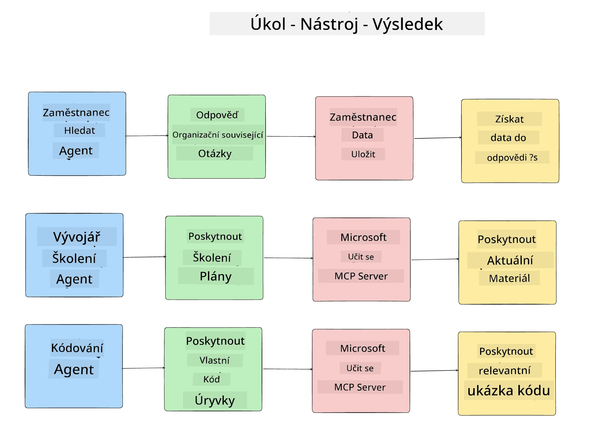
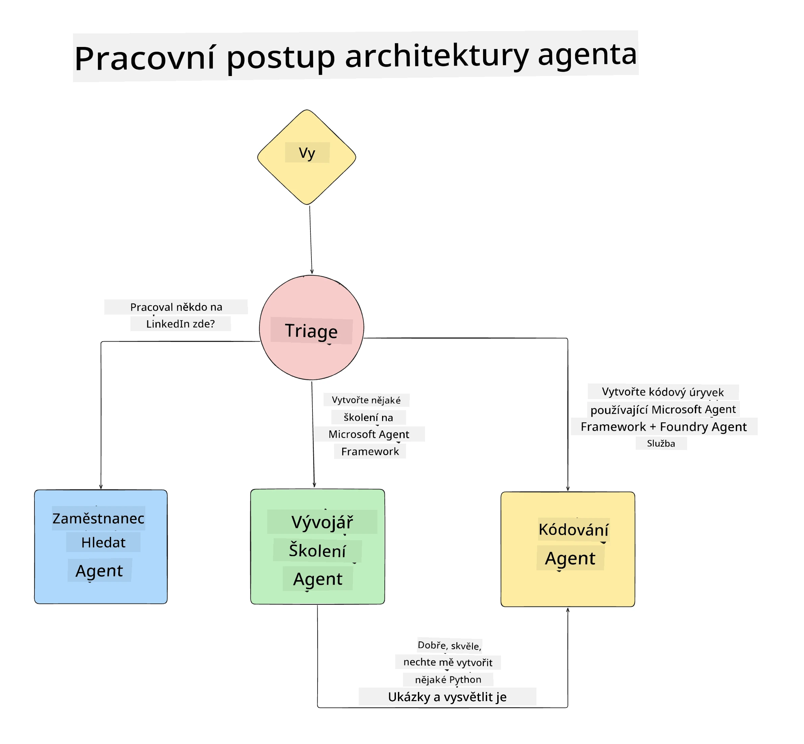

# Lekce 1: Návrh AI agenta

Vítejte u první lekce kurzu „Vytváření AI agenta od nuly do produkce“!

V této lekci se budeme věnovat:

- Definování, co jsou AI agenti
  
- Diskuzi o aplikaci AI agenta, kterou budujeme  

- Identifikaci potřebných nástrojů a služeb pro každý agent
  
- Návrhu naší Agentní aplikace
  
Začněme definováním, co je agent a proč bychom ho v aplikaci používali.

> **Než začnete kurz.** Tato první lekce je koncepční — není zde žádný kód k spuštění.
> Od [Lekce 2](../lesson-2-agent-development/README.md) dál budete potřebovat: **předplatné Azure** s přístupem k **Microsoft Foundry**, nasazený **model řady GPT-5** (například `gpt-5.1` — vyhněte se ukončeným GPT-4o / GPT-4.1), **Python 3.12+** a **Azure CLI** (`az login`). Viz [Co potřebujete](../README.md#what-you-need) v README kurzu pro úplný seznam a odkazy.

## Co jsou AI agenti?

Pokud je to vaše první seznámení s tvorbou AI agenta, možná si kladete otázky, jak přesně definovat, co AI agent je.

Jednoduchý způsob, jak definovat AI agenta podle komponent, které ho tvoří:

**Velký jazykový model** - LLM umožňuje jak zpracování přirozeného jazyka od uživatele k pochopení úkolu, který chce splnit, tak i interpretaci popisů nástrojů dostupných k jeho dokončení.

**Nástroje** - Jsou to funkce, API, datové úložiště a další služby, které LLM může zvolit pro splnění zadaných úkolů.

**Paměť** - Zde uchováváme krátkodobé i dlouhodobé interakce mezi AI agentem a uživatelem. Ukládání a získávání těchto informací je důležité pro zlepšování a uchovávání uživatelských preferencí v průběhu času.

## Náš případ použití AI agenta

Pro tento kurz vytvoříme aplikaci AI agenta, která pomáhá novým vývojářům nastoupit do našeho týmu vývoje AI agentů!

Než začneme s vývojem, prvním krokem k vytvoření úspěšné aplikace AI agenta je definovat jasné scénáře, jak očekáváme, že naši uživatelé budou s našimi AI agenty pracovat.

Pro tuto aplikaci budeme pracovat s těmito scénáři:

**Scénář 1:** Nový zaměstnanec nastoupí do naší organizace a chce získat více informací o týmu, do kterého se přidal, a jak se s nimi spojit.

**Scénář 2:** Nový zaměstnanec chce zjistit, jaký by byl nejlepší první úkol, na kterém by začal pracovat.

**Scénář 3:** Nový zaměstnanec chce sbírat vzdělávací materiály a ukázky kódu, které mu pomohou začít s dokončením tohoto úkolu.

## Identifikace nástrojů a služeb

Nyní, když máme tyto scénáře vytvořené, dalším krokem je mapovat je na nástroje a služby, které naši AI agenti budou potřebovat k dokončení těchto úkolů.

Tento proces spadá do kategorie inženýrství kontextu, protože se zaměříme na to, aby naši AI agenti měli správný kontext ve správný čas pro splnění úkolů.

Pojďme na to scénář po scénáři a proveďme dobrý agentní návrh tím, že vypíšeme úkoly, nástroje a očekávané výsledky každého agenta.

### Scénář 1 - Agent pro vyhledávání zaměstnanců

**Úkol** - Odpovídat na otázky o zaměstnancích v organizaci, jako je datum přijetí, aktuální tým, lokalita a poslední pozice.

**Nástroje** - Databáze aktuálního seznamu zaměstnanců a organizační schéma

**Výsledky** - Schopnost získat informace z databáze pro odpovědi na obecné organizační otázky a specifické otázky o zaměstnancích.

### Scénář 2 - Agent pro doporučení úkolů

**Úkol** - Na základě vývojářských zkušeností nového zaměstnance navrhnout 1-3 úkoly, na kterých může nový zaměstnanec pracovat.

**Nástroje** - GitHub MCP server pro získání otevřených problémů a vytvoření vývojářského profilu

**Výsledky** - Schopnost přečíst posledních 5 commitů na GitHub profilu a otevřené problémy na GitHub projektu a doporučit úkoly na základě shody

### Scénář 3 - Agent asistenta pro kódování

**Úkol** - Na základě otevřených problémů doporučených agentem „Doporučení úkolů“ vyhledávat a poskytovat zdroje a generovat útržky kódu, které pomohou zaměstnanci.

**Nástroje** - Microsoft Learn MCP k nalezení zdrojů a Code Interpreter k generování vlastních útržků kódu.

**Výsledky** - Pokud uživatel požádá o další pomoc, workflow by měl použít Learn MCP server k poskytnutí odkazů a útržků ke zdrojům a poté předat další zpracování agentovi Code Interpreter generujícímu malé útržky kódu s vysvětlením.

## Návrh architektury naší Agentní aplikace

Nyní, když jsme definovali každého agenta, vytvořme architektonický diagram, který nám pomůže pochopit, jak budou jednotliví agenti spolupracovat i samostatně podle úkolu:

## Další kroky

Nyní, když jsme navrhli každého agenta a náš agentní systém, přejděme k další lekci, kde vyvineme každého z těchto agentů!

---

<!-- CO-OP TRANSLATOR DISCLAIMER START -->
**Prohlášení o omezení odpovědnosti**:
Tento dokument byl přeložen pomocí AI překladatelské služby [Co-op Translator](https://github.com/Azure/co-op-translator). Přestože usilujeme o co největší přesnost, mějte prosím na paměti, že automatizované překlady mohou obsahovat chyby nebo nepřesnosti. Originální dokument v jeho mateřském jazyce by měl být považován za autoritativní zdroj. Pro kritické informace se doporučuje profesionální lidský překlad. Nejsme odpovědní za jakékoli nedorozumění nebo nesprávné interpretace vzniklé použitím tohoto překladu.
<!-- CO-OP TRANSLATOR DISCLAIMER END -->