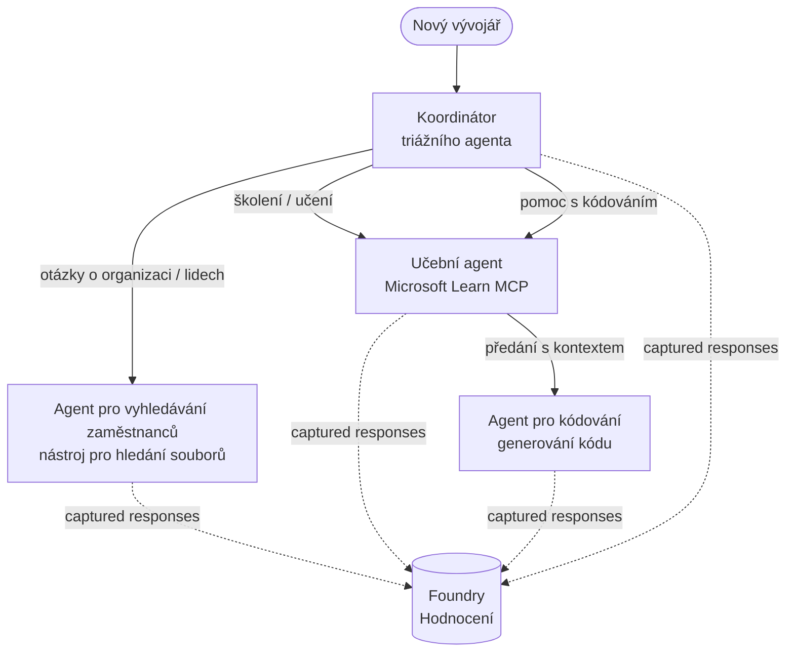

# Lekce 3: Hodnocení Agentů s Microsoft Foundry

Vítejte ve třetí lekci kurzu **"Budování AI agentů od nuly do produkce"**!

V [Lekci 2](../lesson-2-agent-development/README.md) jste stavěli agenty. V této lekci se naučíte odpovědět na mnohem těžší otázku: **jsou vůbec dobří?** Nasazení agenta, který funguje, je snadné; vědět, zda správně směruje, zůstává zakotvený ve vašich datech a správně používá své nástroje, to je to, co odlišuje demo od produkčního systému.


V této lekci pokryjeme:

- Proč je hodnocení agentů důležité a jak se liší od tradičního testování
- Rozdíl mezi **pozorovatelností**, **smoke testy** a **hodnoceními**
- Víceagentní pracovní postup, který budeme měřit
- Vestavěné **hodnotící nástroje Microsoft Foundry** (relevance, zakotvenost, přesnost volání nástroje, využití výstupu nástroje)
- Krok za krokem průchod hodnotícím pipeline v [`agent-evals.py`](../../../lesson-3-agent-evals/agent-evals.py)
- Jak ji spustit a číst výsledky

---

## Proč hodnotit agenty?

Tradiční jednotkový test tvrdošíjně ověřuje, že `add(2, 2) == 4`. Agentům to tak však nefunguje – stejný
prompt může při každém spuštění přinést odlišné znění, nástroje mohou být volány v různém pořadí a
„správnost“ je často otázkou stupně místo booleanu. Nelze ověřovat přesné řetězce.

Místo toho se agenti hodnotí podél **dimenzí kvality** pomocí modelových *evaluátorů* (také
nazýváno „LLM-jako-soudce“) plus deterministických kontrol využití nástrojů. To vám říká věci jako:

- Odpověděla odpověď skutečně na otázku? (**relevance**)
- Je odpověď podložená získanými daty, nebo agent halucinoval? (**zakotvenost**)
- Zavolal agent správný nástroj se správnými argumenty? (**přesnost volání nástroje**)
- Skutečně agent využil výstup, který nástroj vrátil? (**využití výstupu nástroje**)

### Tři komplementární úrovně kvality

Nejedná se o konkurující se techniky — produkční agent používá všechny tři:

| Vrstva | Otázka, na kterou odpovídá | Náklad | Kdy běží | Pokryto v |
|-------|----------------------------|---------|------------|------------|
| **Pozorovatelnost / sledování** | *Co agent dělal, krok za krokem?* | Zdarma (vždy zapnuto) | Nepřetržitě v produkci | Tato lekce |
| **Smoke testy** | *Je agent dostupný a dodržuje základní prompt?* | Levné, v řádu sekund | Při každém nasazení | [Lekce 4](../lesson-4-agentdeployment/README.md#smoke-testing-the-hosted-agent-ci-gate) |
| **Hodnocení** | *Jak **dobré** jsou odpovědi?* | Pomalejší, na základě modelu | Na vyžádání / noční / před vydáním | Tato lekce |

Smoke testy odpovídají na otázku „rozbilo se to?“; hodnocení odpovídají na otázku „je to dobré?“. Potřebujete obojí.

---

## Předpoklady

1. Dokončená [Lekce 2](../lesson-2-agent-development/README.md) (agenti + vektorové úložiště).
2. Projekt **Microsoft Foundry**.
3. Autentizace přes **Azure CLI**: `az login`.
4. Nainstalovaný **Python 3.12+** a závislosti kurzu:

   ```bash
   pip install -r ../requirements.txt
   ```

5. Proměnné prostředí (vytvořte soubor `.env` v této složce nebo je exportujte):

   | Proměnná | Účel |
   |----------|-------|
   | `FOUNDRY_PROJECT_ENDPOINT` | Endpoint vašeho Foundry projektu (`https://<account>.services.ai.azure.com/api/projects/<project>`). Čte ji agentův `FoundryChatClient` **a** pomocník pro hodnocení. |
   | `FOUNDRY_MODEL` | Nasazení modelu, na kterém **runují agenti** (např. `gpt-5.1`). |
   | `VECTOR_STORE_ID` | Vektorové úložiště adresáře zaměstnanců vytvořené v Lekci 2 |
   | `AZURE_AI_MODEL_DEPLOYMENT_NAME` | Nasazení modelu používané **evaluátory** (výchozí `FOUNDRY_MODEL`, potom `gpt-5.1`) |

> Agenti používají `FoundryChatClient`, který čte konfiguraci z proměnných s prefixem `FOUNDRY_`
> (`FOUNDRY_PROJECT_ENDPOINT`, `FOUNDRY_MODEL`). Cloudový pomocník pro hodnocení
> používá SDK `azure-ai-projects` a při neexistenci `AZURE_AI_PROJECT_ENDPOINT` použije `FOUNDRY_PROJECT_ENDPOINT`
> — takže tyto dvě `FOUNDRY_` proměnné jsou dostačující ke spuštění celé lekce.
>
> Evaluátoři sami jsou poháněni modelem, takže `AZURE_AI_MODEL_DEPLOYMENT_NAME`
> určuje, které nasazení bude hodnotit — nemusí to být stejný model, jaký používají
> agenti.


---

## Pracovní postup, který hodnotíme

Abychom něco ohodnotili, musíme to nejdřív spustit. Tato lekce znovu používá víceagentní pracovní postup **Developer Onboarding**: koordinátor **triage** předává práci třem specialistům.




Pracovní postup je postaven na orchestrace handoff rámce Microsoft Agent Framework. Klíčový
princip hodnocení je, že **každý tah agenta je perzistentně uložen na serveru** a identifikován
`response_id`. Tyto ID pak předáváme hodnotící službě.

---

## Pipeline hodnocení krok za krokem

Skript [`agent-evals.py`](../../../lesson-3-agent-evals/agent-evals.py) implementuje šestikrokovou pipeline. Zde je, co každý krok dělá
a proč.

### Krok 1 — Spusťte pracovní postup a sledujte response ID

Pracovní postup se spouští s `run_stream(...)` a jakmile se streamují události zpět, kód zaznamenává
`response_id` a `conversation_id` vytvořené každým agentem. Perzistentní odpovědi jsou surový
materiál pro hodnocení — hodnotíte *skutečné* odpovědi ve výrobním tvaru, ne znovu generované.


### Krok 2 — Shrňte, co bylo zaznamenáno

Krátké shrnutí vytiskne, kolik odpovědí každý agent vytvořil, abyste si potvrdili, že pracovní postup
skutečně vyzkoušel agenty, které chcete hodnotit.

### Krok 3 — Získejte konečné odpovědi

Pro každého agenta se poslední `response_id` vyhledá přes projektového OpenAI-kompatibilního
klienta (`project_client.get_openai_client().responses.retrieve(...)`), abyste viděli text,
který bude hodnocen.

### Krok 4 — Vytvořte hodnocení

Hodnocení se vytvoří se čtyřmi **vestavěnými Foundry evaluátory**:

| Evaluátor | `evaluator_name` | Co měří |
|-----------|------------------|----------|
| Relevance | `builtin.relevance` | Odpovídá odpověď na požadavek uživatele? |

| Základnost | `builtin.groundedness` | Je odpověď podložena získanými/datovými z nástrojů (není halucinována)? |
| Přesnost volání nástroje | `builtin.tool_call_accuracy` | Byly zavolány správné nástroje se správnými argumenty? |
| Využití výstupu nástroje | `builtin.tool_output_utilization` | Použil agent skutečně výsledky nástroje ve své odpovědi? |

Každý hodnotitel je inicializován s nasazením pojmenovaným podle `AZURE_AI_MODEL_DEPLOYMENT_NAME`.

> **Proč právě těchto čtyři?** Relevance a základnost měří *kvalitu odpovědi*; dva nástroje pro hodnocení měří *agentní chování* — část, kterou tradiční metriky NLP zcela opomíjejí. Pro systém využívající nástroje a více agentů jsou metriky nástrojů často místem, kde se skutečné regrese skrývají.


### Krok 5 — Spusťte vyhodnocení

Zachycené `response_id`s jsou předány do `evals.runs.create(...)` jako zdroj dat. Služba pak každou uloženou odpověď přehraje přes všechny hodnotitele.


### Krok 6 — Sledujte a čtěte výsledky

Kód polluje běh, dokud není `completed` nebo `failed`, poté vytiskne počty výsledků a **`report_url`** — hluboký odkaz do portálu Foundry, kde můžete zkontrolovat skóre po jednotlivých metrikách, počty úspěchů/neúspěchů a jednotlivé hodnocené odpovědi.


---

## Spusťte to

```bash
cd lesson-3-agent-evals
python agent-evals.py
```

Ve výchozím nastavení vyhodnotí první příklad dotazu
(`"I'm new here! Has anyone worked at Microsoft here?"`). Ve funkci `run_evaluation_workflow()` jsou zahrnuty další dva příklady dotazů s více záměry — změňte proměnnou `query` a vyzkoušejte scénáře směrování,
které aktivují více agentů v jednom běhu.


Očekávaný průběh v konzoli:

```
Step 1: Running Developer Onboarding Workflow
Step 2: Response Data Summary
Step 3: Fetching Agent Responses
Step 4: Creating Evaluation
Step 5: Running Evaluation
Step 6: Monitoring Evaluation
  Status: running ...
  Evaluation completed successfully
  Report URL: https://...   <-- open this in the Foundry portal
```

---

## Monitorování a sledování

Hodnocení vám říkají, *jak dobré* odpovědi byly; **monitorování** vám říká, *co se stalo*, aby je vyprodukovalo — každé přepojení agenta, volání nástroje, počet tokenů a latence. V Microsoft Foundry
agentní běhy vydávají stopy OpenTelemetry, které můžete zobrazit v portálu, a Agent Framework je může exportovat do Azure Monitor / Application Insights jediným voláním:

```python
from agent_framework.foundry import FoundryChatClient

client = FoundryChatClient()
client.configure_azure_monitor()   # exportovat trasování + metriky do Application Insights
```


zda nástroj pro vyhledávání v souborech nic nevrátil, nebo vrátil data, která agent pak ignoroval (což je právě to, co hodnotí využití výstupu nástroje).


---

## Od „běhů“ k „dobrým výsledkům“: jak to používat v praxi

- **Předběžná brána.** Proveďte hodnocení na pevné sadě reprezentativních dotazů před
  propagací nového promptu nebo modelu. Porovnejte skóre s předchozí verzí — pokles považujte za
  regresi.
- **Noční signál kvality.** Naplánujte hodnocení, aby zachytilo drift dat nebo změny závislostí.
- **Spojte s kouřovými testy.** [Kouřový test Lekce 4](../lesson-4-agentdeployment/README.md#smoke-testing-the-hosted-agent-ci-gate)
  je vaše rychlá brána pro každé nasazení; hodnocení jsou pomalejší, hlubší kvalitní brána. Spusťte levnou
  verzi při každém merge a drahou verzi podle plánu nebo před vydáním.


---

## Poznámka k modernizaci

Tento příklad je převeden na aktuální API Microsoft Agent Framework Foundry
(`agent_framework.foundry`). Pokud upravujete kód, podívejte se do kořenového repozitáře na
[`MIGRATION-GUIDE.md`](../MIGRATION-GUIDE.md) pro ověřené před/po mapování importů a klientů (například `AzureAIClient` -> `FoundryChatClient` a konstrukce hostovaných nástrojů přes
`client.get_file_search_tool(...)` / `client.get_mcp_tool(...)`). Koncepty hodnocení a výše uvedený
šestistupňový pipeline zůstávají touto migrací beze změny.


---

## Zdroje

- [Vyhodnocení generativních AI modelů a aplikací (Microsoft Learn)](https://learn.microsoft.com/en-us/azure/ai-foundry/concepts/evaluation-approach-gen-ai)
- [Vestavěné hodnotitele pro generativní AI](https://learn.microsoft.com/en-us/azure/ai-foundry/concepts/evaluation-evaluators/agent-evaluators)
- [Monitorování v Microsoft Foundry](https://learn.microsoft.com/en-us/azure/ai-foundry/concepts/observability)
- [Microsoft Agent Framework](https://github.com/microsoft/agent-framework)
- [Orchestrace předání agenta](https://learn.microsoft.com/en-us/agent-framework/workflows/orchestrations/handoff)

---

<!-- CO-OP TRANSLATOR DISCLAIMER START -->
**Prohlášení o omezení odpovědnosti**:
Tento dokument byl přeložen pomocí AI překladatelské služby [Co-op Translator](https://github.com/Azure/co-op-translator). Přestože usilujeme o co největší přesnost, mějte prosím na paměti, že automatizované překlady mohou obsahovat chyby nebo nepřesnosti. Originální dokument v jeho mateřském jazyce by měl být považován za autoritativní zdroj. Pro kritické informace se doporučuje profesionální lidský překlad. Nejsme odpovědní za jakékoli nedorozumění nebo nesprávné interpretace vzniklé použitím tohoto překladu.
<!-- CO-OP TRANSLATOR DISCLAIMER END -->