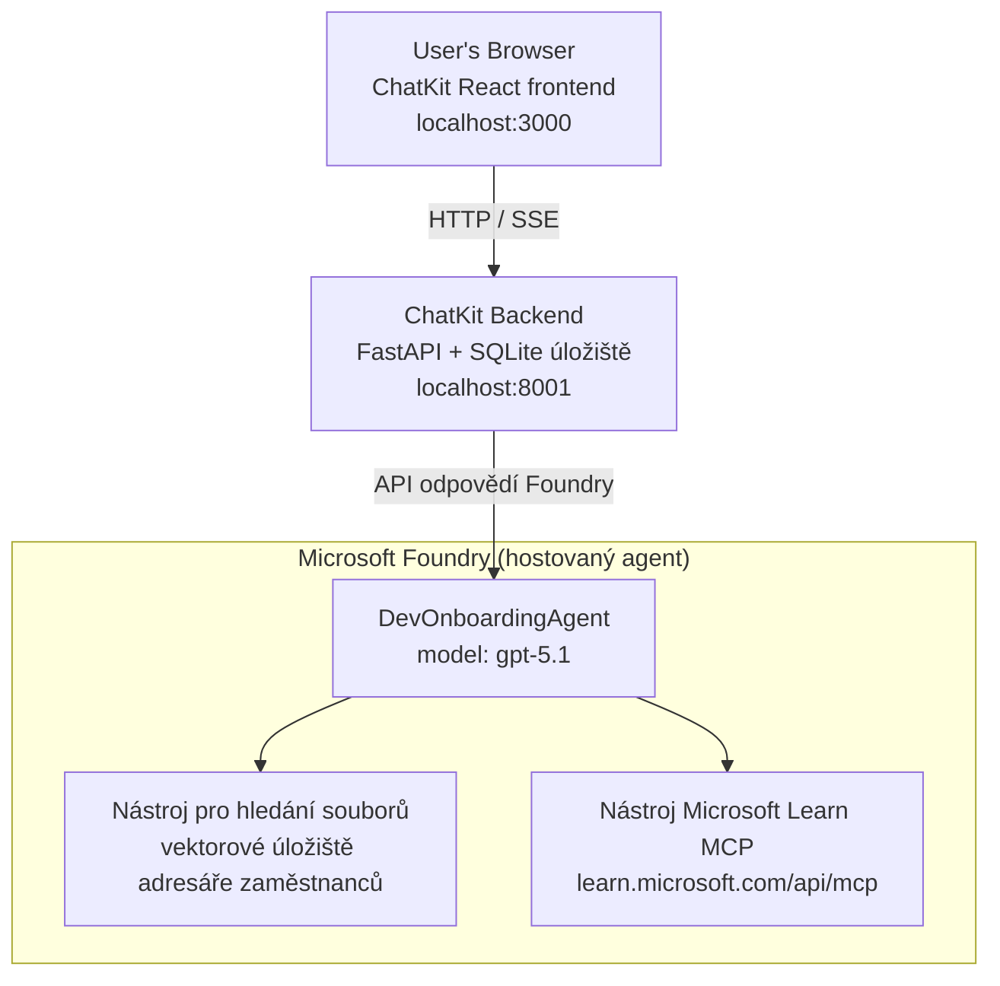

# Lekce 4: Nasazení agenta s Microsoft Foundry Hostovanými Agenty + ChatKit

Tato lekce ukazuje, jak nasadit agenta používajícího nástroje do Microsoft Foundry jako hostovaného agenta a vytvořit frontend založený na ChatKitu pro interakci s ním.

## Architektura

Hostovaný agent je **jediný `DevOnboardingAgent`** (běžící na `gpt-5.1`), který odpovídá na otázky k onboardingu vývojářů pomocí dvou hostovaných nástrojů: nástroje **File Search** nad vektorovým úložištěm employee-directory a nástroje **Microsoft Learn MCP**. React frontend ChatKitu komunikuje s FastAPI backendem, který volá agenta přes Foundry **Responses API**.



## Požadavky

1. **Microsoft Foundry projekt** v regionu North Central US
2. **Azure CLI** autentifikované (`az login`)
3. Nainstalovaný **Azure Developer CLI** (`azd`)
4. **Python 3.12+** a **Node.js 18+**
5. Vytvořené **vektorové úložiště** s daty o zaměstnancích

## Rychlý start

### 1. Nastavení prostředí proměnných

```bash
cd lesson-4-agentdeployment
cp .env.example .env
# Upravte .env s detaily vašeho projektu Microsoft Foundry
```

### 2. Nasazení hostovaného agenta

**Možnost A: Použití Azure Developer CLI (doporučeno)**

```bash
cd hosted-agent
azd auth login
azd agent deploy
```

**Možnost B: Použití Dockeru + Azure Container Registry**

```bash
cd hosted-agent

# Vytvořit kontejner
docker build -t developer-onboarding-agent:latest .

# Tag pro ACR
docker tag developer-onboarding-agent:latest <your-acr>.azurecr.io/developer-onboarding-agent:latest

# Push do ACR
az acr login --name <your-acr>
docker push <your-acr>.azurecr.io/developer-onboarding-agent:latest

# Nasadit přes portál Microsoft Foundry nebo SDK
```

### 3. Spuštění ChatKit backendu

```bash
cd chatkit-server
python -m venv .venv
source .venv/bin/activate  # Ve Windows: .venv\Scripts\activate
pip install -r requirements.txt
python app.py
```

Server se spustí na `http://localhost:8001`

### 4. Spuštění ChatKit frontendu

```bash
cd chatkit-server/frontend
npm install
npm run dev
```

Frontend se spustí na `http://localhost:3000`

### 5. Testování aplikace

Otevřete v prohlížeči `http://localhost:3000` a vyzkoušejte tyto dotazy:

**Vyhledávání zaměstnanců:**
- "Jsem tu nový! Pracoval už někdo v Microsoftu?"
- "Kdo má zkušenosti s Azure Functions?"

**Učební materiály:**
- "Vytvoř učební plán pro Kubernetes"
- "Jaké certifikace bych měl/a získat pro cloudovou architekturu?"

**Pomoc s kódováním:**
- "Pomoz mi napsat Python kód pro připojení k CosmosDB"
- "Ukáž mi, jak vytvořit Azure Function"

**Víceagentové dotazy:**
- "Začínám jako cloudový inženýr. S kým bych se měl spojit a co bych se měl naučit?"

## Struktura projektu

```
lesson-4-agentdeployment/
├── .env.example                 # Environment variables template
├── implementation-plan.md       # Detailed implementation guide
├── README.md                    # This file
├── hosted-agent/               # Microsoft Foundry hosted agent
│   ├── main.py                 # Multi-agent workflow implementation
│   ├── requirements.txt        # Python dependencies
│   ├── Dockerfile              # Container definition
│   └── agent.yaml              # Agent deployment configuration
└── chatkit-server/             # ChatKit server application
    ├── app.py                  # FastAPI backend
    ├── store.py                # SQLite persistence layer
    ├── requirements.txt        # Python dependencies
    └── frontend/               # React frontend
        ├── package.json
        ├── vite.config.ts
        ├── tsconfig.json
        ├── index.html
        └── src/
            ├── main.tsx
            ├── App.tsx
            ├── App.css
            └── index.css
```

## Agent a jeho nástroje

Hostovaný agent je **jediný agent** (`DevOnboardingAgent`, definovaný v `hosted-agent/main.py`), který pokrývá tři oblasti onboardingu. Místo orchestraci samostatných sub-agentů vystavuje každou schopnost jako nástroj (nebo spoléhá přímo na model):

| Schopnost | Jak se zpracovává | Nástroj |
|-----------|------------------|---------|
| **Vyhledávání zaměstnanců & kontakty** | Foundry hostovaný File Search nad vektorovým úložištěm employee-directory | `client.get_file_search_tool(vector_store_ids=[...])` |
| **Učení & školení** | Microsoft Learn MCP server (hostovaný MCP nástroj) | `client.get_mcp_tool(url="https://learn.microsoft.com/api/mcp")` |
| **Pomoc s kódováním** | Řeší model `gpt-5.1` přímo — žádný externí nástroj | — |

Agent je vytvořen pomocí `client.as_agent(name="DevOnboardingAgent", instructions=..., tools=[file_search_tool, learn_mcp_tool])` a spuštěn s `from_agent_framework(agent).run()`.

> **Poznámka k designu.** Předchozí verze této lekce využívaly workflow víceagentové spolupráce pomocí `HandoffBuilder` (Triage → specialisté). Nasazený agent je jediný agent používající nástroje, což je jednodušší pro nasazení a pochopení v Q&A stylu onboardingu. Pro příklad víceagentové orchestraci a předávání viz Lekce 2 a Lekce 3.

## Smoke testování hostovaného agenta (CI brána)

Nasazení hostovaného agenta „úspěšně“ jen dokazuje, že kontrolní rovina přijala
definici — **ne** dokazuje, že agent skutečně odpovídá. Chybějící závislost,
špatné směrování modelu nebo vypršené připojení může způsobit tichého agenta na zeleno.

Tato lekce obsahuje lehký **smoke test**, který funguje jako rychlá, levná post-deploy brána.
Používá [AI Smoke Test](https://github.com/marketplace/actions/ai-smoke-test)
GitHub Action k odeslání promptů na agentovu Foundry **Responses** konečnou
(`POST {project_endpoint}/agents/{agent_name}/endpoint/protocols/openai/responses`)
a ověřuje vrácený text. Zachytí rozbité nasazení, regresi autorizace,
odchylku systémového promptu a chyby vláken během sekund.

> Smoke testy nejsou **náhradou** za plné evaluace v
> [Lekci 3](../lesson-3-agent-evals/README.md) — jsou doplňkem. Smoke testy
> odpovídají na otázku *„je agent dostupný, odpovídá a dodržuje základní očekávání promptu?“*;
> evaluace odpovídají na otázku *„jak dobrá je odpověď?“*. Spouštějte tuto levnou bránu při každém nasazení.

### Co se testuje

Katalog je v souboru [`hosted-agent/tests/smoke-tests.json`](../../../lesson-4-agentdeployment/hosted-agent/tests/smoke-tests.json)
a pokrývá tři oblasti agenta, dodržování promptu a multi-turn konverzaci:

| Test | Co ověřuje |
|------|------------|
| `reachability` | Agent odpovídá neprázdným, na téma relevantním textem |
| `employee-search` | Oblast vyhledávání vrací platný `200` (odpověď závisí na datech) |
| `learning-path` | Oblast učení opakuje téma a generuje odpověď ve stylu studijní cesty |
| `coding-assistance` | Oblast kódování vrací pythonovskou odpověď ve tvaru kódu |
| `prompt-adherence-offtopic` | Nedotýkající se téma je odmítnuto, není podrobně zodpovězeno |
| `threading-turn-1/2` | Stav konverzace je udržován mezi koly pomocí `previous_response_id` |

### Spuštění v CI

Workflow v [`.github/workflows/smoke-test-hosted-agent.yml`](../../../.github/workflows/smoke-test-hosted-agent.yml)
má dvě práce:

- **`static`** — rychlá brána bez Azure, spouštěná u každého pull requestu a push:
  překládá všechny Python zdroje (`py_compile`) a kontroluje Markdown odkazy. Nevyžaduje tajné údaje,
  takže funguje i na fork PR.
- **`smoke`** — níže uvedený smoke test připojený k Azure. Spouští se na vyžádání
  (Actions → **Agent CI (static + smoke)** → Run workflow) a může následovat po vašem
  nasazovacím workflow.

Nakonfigurujte tyto **proměnné** a **tajné klíče** repozitáře pro smoke job:

| Typ | Název | Hodnota |
|------|-------|---------|
| Proměnná | `FOUNDRY_PROJECT_ENDPOINT` | `https://<account>.services.ai.azure.com/api/projects/<project>` |
| Proměnná | `HOSTED_AGENT_NAME` | Jméno nasazeného agenta (např. `dev-onboarding` — musí odpovídat vašemu nasazení) |
| Tajný klíč | `AZURE_CLIENT_ID` / `AZURE_TENANT_ID` / `AZURE_SUBSCRIPTION_ID` | OIDC federovaná identita pro `azure/login` |

Identita běžícího runneru potřebuje roli **`Azure AI User`** v rámci **foundry projektu**, aby mohla
volat datové plánové endpointy Responses (a konverzací). Udělte ji s:

```bash
az role assignment create \
  --assignee <object-id-or-appId-of-runner-identity> \
  --role "Azure AI User" \
  --scope "/subscriptions/<sub>/resourceGroups/<rg>/providers/Microsoft.CognitiveServices/accounts/<account>/projects/<project>"
```

### Spuštění lokálně

Stejný katalog můžete spustit před pushnutím. Získejte token datové roviny s rozsahem
`https://ai.azure.com/` a ukažte runner na vaše nasazení:

```bash
# Publikem MUSÍ být https://ai.azure.com/ (tokeny cognitiveservices.azure.com jsou odmítnuty)
export FOUNDRY_TOKEN=$(az account get-access-token --resource https://ai.azure.com/ --query accessToken -o tsv)

git clone https://github.com/JFolberth/ai-smoketest && cd ai-smoketest
python runner.py \
  --project-endpoint "https://<account>.services.ai.azure.com/api/projects/<project>" \
  --agent-name dev-onboarding \
  --tests-file ../lesson-4-agentdeployment/hosted-agent/tests/smoke-tests.json
```

Výstupní kódy: `0` všechny testy prošly, `1` neprošel nějaký assert, `2` chyba runneru (špatný katalog / token).

## Řešení problémů

### Agent neodpovídá
- Ověřte, že hostovaný agent je nasazený a běží v Microsoft Foundry
- Zkontrolujte, zda `HOSTED_AGENT_NAME` a `HOSTED_AGENT_VERSION` odpovídají vašemu nasazení

### Chyby ve vektorovém úložišti
- Ujistěte se, že `VECTOR_STORE_ID` je správně nastaveno
- Ověřte, že vektorové úložiště obsahuje data o zaměstnancích

### Chyby autentifikace
- Spusťte `az login` pro obnovení přihlašovacích údajů
- Ujistěte se, že máte přístup k Microsoft Foundry projektu

## Zdroje

- [Dokumentace Microsoft Foundry Hosted Agents](https://learn.microsoft.com/en-us/azure/ai-foundry/agents/concepts/hosted-agents)
- [Microsoft Agent Framework](https://github.com/microsoft/agent-framework)
- [ChatKit integrační ukázka](https://github.com/microsoft/agent-framework/tree/main/python/samples/demos/chatkit-integration)
- [Azure Developer CLI](https://learn.microsoft.com/en-us/azure/developer/azure-developer-cli/overview)
- [AI Smoke Test GitHub Action](https://github.com/marketplace/actions/ai-smoke-test)
- [Smoke Test Microsoft Foundry Agents s GitHub Actions (blog)](https://techcommunity.microsoft.com/blog/azuredevcommunityblog/smoke-test-microsoft-foundry-agents-with-github-actions/4531912)

---

## Další kroky

Váš agent běží na infrastruktuře spravované Microsoftem. Pro nasazení do podnikové produkce —
kde budete kontrolovat, kde data žijí (datová suverenita, privátní sítě, vlastní Azure
Cosmos DB / Storage / AI Search) a spravovat jeho nástroje — pokračujte v
**[Lekci 5: Produkční hostovaní agenti](../lesson-5-hosted-agents-production/README.md)**, která
vysvětluje zásadní rozdíl mezi **hostovanými agenty** a **Capability Hosts**.

---

<!-- CO-OP TRANSLATOR DISCLAIMER START -->
**Prohlášení o omezení odpovědnosti**:
Tento dokument byl přeložen pomocí AI překladatelské služby [Co-op Translator](https://github.com/Azure/co-op-translator). Přestože usilujeme o co největší přesnost, mějte prosím na paměti, že automatizované překlady mohou obsahovat chyby nebo nepřesnosti. Originální dokument v jeho mateřském jazyce by měl být považován za autoritativní zdroj. Pro kritické informace se doporučuje profesionální lidský překlad. Nejsme odpovědní za jakékoli nedorozumění nebo nesprávné interpretace vzniklé použitím tohoto překladu.
<!-- CO-OP TRANSLATOR DISCLAIMER END -->