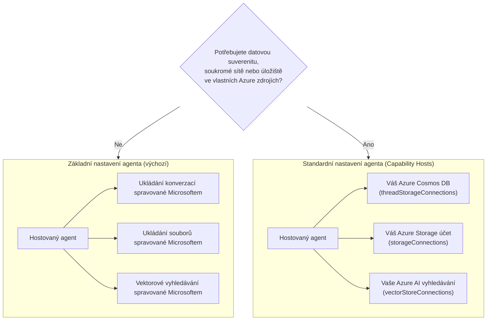

# Lekce 5: Produkčně hostovaní agenti — úložiště, paměť a správa

V [Lekci 4](../lesson-4-agentdeployment/README.md) jste nasadili agenta Developer Onboarding
jako **Microsoft Foundry Hosted Agenta** a před něj umístili frontend ChatKit. Tato
lekce odpověděla na otázku *„jak nasadím agenta?“*. Tato lekce odpovídá na další otázky,
které přicházejí ve firemním prostředí: **Kde jsou data mého agenta uložena? Kdo je kontroluje? Jak
splnit požadavky na dodržování pravidel, síťování a správu?**

Nejpodstatnější myšlenkou této lekce je rozdíl mezi **Hosted Agentem** a **Capability Hostem** —
dvěma koncepty, které se snadno zaměňují, ale řeší úplně odlišné problémy.


## Cíle učení

Na konci této lekce budete umět:

- Vysvětlit, co vám **Hosted Agent** poskytuje (spravovaný běh Microsoftem) a co **ne**.
- Vysvětlit, co je **Capability Host** a přesně, kdy ho potřebujete.
- Vybrat mezi **základním nastavením agenta** (Microsoftem spravované úložiště) a **standardním nastavením agenta**
  (použití vlastních Azure zdrojů).
- Pochopit, jak se **historie konverzací, nahrávané soubory a vektorové úložiště** ukládají a jak je
  přesměrovat do vlastního Azure Cosmos DB, Azure Storage a Azure AI Search.
- Aplikovat řídící kontroly: suverenita dat, privátní síťování a **schvalování Hosted MCP nástrojů**.

---

## Předpoklady

1. Dokončená [Lekce 4](../lesson-4-agentdeployment/README.md) — máte nasazeného hostovaného agenta.
2. Projekt **Microsoft Foundry** a Azure účet s oprávněním vytvářet zdroje
   (Cosmos DB, Storage, Azure AI Search) a přiřazovat role v předplatném/skupině zdrojů.
3. **Azure CLI** autentizováno: `az login` (a `az account set --subscription <id>`, pokud máte
   více předplatných).
4. Nainstalovaný **Azure Developer CLI** (`azd`) — používaný pro provisioning standardního nastavení.
5. **Python 3.12+** s nainstalovanými závislostmi kurzu (`pip install -r ../requirements.txt`).
6. Aktuální, nepřerušené nasazení modelu (například `gpt-5.1`). Vyhněte se uvedeným zaniklým modelům GPT-4o / GPT-4.1.

> Tato lekce je většinou koncepční a zaměřená na řídící rovinu. Můžete ji přečíst celou bez provisioningu,
> a poté použít praktická cvičení, až budete připraveni konfigurovat standardní nastavení.


---

## 1. Hostovaní agenti: co za vás Foundry spravuje

**Hosted Agent** je agent, jehož *provozní prostředí* je plně spravováno službou Microsoft
Foundry Agent Service. Když nasadíte hostovaného agenta (jak jste udělali v Lekci 4), Foundry poskytuje:

- **Výpočetní kapacita** — runtime, který vykonává váš agentní kód a nástroje.
- **Škálování** — repliky se škálují nahoru a dolů podle zátěže (viz `agent.yaml` `scale` v Lekci 4).
- **Identitu** — spravovanou identitu pro agenta, takže se autentizuje v Azure bez tajemství.
- **Pozorovatelnost** — trasování a telemetrie (viz sekci o pozorovatelnosti v Lekci 3).
- **Správu session** — vlákna/konverzace, takže vícekolové chaty „pamatují“ předchozí reakce.

> **Klíčový bod:** Nemusíte konfigurovat Capability Host jen pro *běh* Hosted Agenta. Hostovaný agent funguje
> ihned bez nutnosti správy infrastruktury ze strany Microsoftu.

---

## 2. Hostovaní agenti vs Capability Hosts

**Hostovaní agenti a Capability Hosts řeší odlišné problémy.**

**Hostovaní agenti** poskytují Microsoftem spravované provozní prostředí, včetně výpočetní kapacity, škálování,
identity, pozorovatelnosti a správy session. Nemusíte mít Capability Hosty jen kvůli provozu
hostovaného agenta.

**Capability Hosty** potřebujete pouze tehdy, když chcete, aby Agent Service používal **zdroje vlastněné zákazníkem**
místo Microsoftem spravovaného úložiště. Pokud jste spokojeni s výchozím
Microsoftem spravovaným úložištěm, vektorovým vyhledáváním a uchováváním konverzací, **není potřeba Capability Host
konfigurace.**

Pokud vaše organizace vyžaduje **suverenitu dat, privátní síťování, kontrolu dodržování pravidel nebo
ukládání ve vlastních Azure Cosmos DB, Azure Storage účtu a Azure AI Search zdrojích**, pak
konfiguruje Capability Hosty, které Agent Service napojí na tyto zdroje.

Jednou větou:

> **Hosted Agent** je o *kde váš agent běží*. **Capability Host** je o *kde žijí data vašeho
> agenta*.

| Oblast zájmu | Hosted Agent | Capability Host |
|---------|--------------|-----------------|
| Výpočetní kapacita / škálování / identita | ✅ Poskytnuto | — |
| Pozorovatelnost / trasování | ✅ Poskytnuto | — |
| Správa session konverzace a vláken | ✅ Poskytnuto | Přesměrovává *kam se ukládá* |
| Kde se ukládá historie konverzací | Výchozí Microsoft spravováno | Vaše Azure Cosmos DB |
| Kde jsou uloženy nahrané soubory | Výchozí Microsoft spravováno | Váš Azure Storage účet |
| Kde jsou uloženy vektorové embeddingy | Výchozí Microsoft spravováno | Váš Azure AI Search |
| Požadováno pro běh agenta? | ✅ Ano (je to hostitel agenta) | ❌ Ne — volitelné |
| Požadováno pro suverenitu dat / BYO úložiště? | ❌ Samotné nestačí | ✅ Ano |

---

## 3. Základní vs Standardní nastavení agenta

Foundry popisuje dvě konfigurace dat jako **základní** a **standardní** nastavení agenta.



### Kdy zůstat u základního nastavení (bez Capability Host)

- Vývoj, prototypování a testování.
- Interní nástroje, kde Microsoftem spravované úložiště splňuje vaši politiku nakládání s daty.
- Chcete nejrychlejší cestu k funkčnímu agentu s nejméně nutnou infrastrukturou.

### Kdy potřebujete standardní nastavení (Capability Hosty)

- **Suverenita dat** — veškerá data agenta musí zůstat ve vašem Azure předplatném/regionu.
- **Bezpečnostní kontrola** — musíte používat vlastní účty úložiště, databáze a vyhledávací služby.
- **Dodržování pravidel** — máte regulační nebo organizační požadavky, kde data musejí být uložena.
- **Privátní síťování** — provoz musí zůstat uvnitř vaší virtuální sítě (vlastní virtuální síť).

> **Doporučení Microsoftu:** používejte *oddělené* Foundry účty/projekty pro standardní a
> základní nastavení. Vyvarujte se míchání typů nastavení ve stejném Foundry účtu.

---

## 4. Jak fungují Capability Hosty

**Capability Host** je podzdroj, který konfigurujete na **dvou úrovních**: ve Foundry **účtu**
a ve Foundry **projektu**. Říká Agent Service, kam ukládat a zpracovávat data agenta:
historii konverzace, nahrané soubory a vektorová úložiště.

Platí dvě nejdůležitější pravidla:

1. **Účet před projektem.** Nemůžete vytvořit projektový Capability Host, pokud už neexistuje
   Capability Host na úrovni účtu.
2. **Žádné dědění konfigurace.** **Projektový** Capability Host je to, co Agent Service
   skutečně čte pro rozhodnutí, jaké úložiště/konverzace/vektorové zdroje použít. Připojení na úrovni účtu nejsou
   automaticky použita projektem — projektový Capability Host je musí explicitně odkázat.


### Připojení, která standardní nastavení potřebuje

Capability Hosty odkazují na **připojení** (vytvořená ve vašem Foundry účtu/projektu), která ukazují na
vaše Azure zdroje:

| Vlastnost Capability Hostu | Co ukládá | Váš Azure zdroj |
|--------------------------|--------|---------------------|
| `threadStorageConnections` | Definice agentů + historie konverzací | Azure Cosmos DB |
| `storageConnections` | Nahrané soubory / blob storage | Azure Storage účet |
| `vectorStoreConnections` | Vektorové embeddingy pro vyhledávání | Azure AI Search |
| `aiServicesConnections` *(volitelné)* | Vaše vlastní nasazení modelů | Azure OpenAI |

Každé připojení musí mít vyplněno `authType`, `category`, `target` (URL koncového bodu služby, nikoli
ID zdroje) a `metadata.ResourceId` (plné Azure ID zdroje), jinak Agent Service
nemůže zdroj za běhu rozpoznat.

### Konfigurace Capability Hostů (řídící rovina)

Capability Hosty se v současnosti spravují přes **Azure Resource Manager REST API** (zatím neexistuje
SDK pro správu Capability Hostů). Nejprve vytvořte Capability Host na úrovni **účtu**:

```http
PUT https://management.azure.com/subscriptions/{subscriptionId}/resourceGroups/{rg}/providers/Microsoft.CognitiveServices/accounts/{account}/capabilityHosts/{name}?api-version=2025-06-01

{
  "properties": { "capabilityHostKind": "Agents" }
}
```

Pak vytvořte Capability Host na úrovni **projektu**, který odkazuje na vaše připojení:

```http
PUT https://management.azure.com/subscriptions/{subscriptionId}/resourceGroups/{rg}/providers/Microsoft.CognitiveServices/accounts/{account}/projects/{project}/capabilityHosts/{name}?api-version=2025-06-01

{
  "properties": {
    "capabilityHostKind": "Agents",
    "threadStorageConnections": ["my-cosmosdb-connection"],
    "vectorStoreConnections":  ["my-ai-search-connection"],
    "storageConnections":      ["my-storage-connection"]
  }
}
```

> **Omezující podmínky k zapamatování:**
> - **Jeden Capability Host na úroveň.** Další host na stejné úrovni vrací `409 Conflict`.
> - **Žádné aktualizace.** Pro změnu konfigurace musíte Capability Host **smazat a znovu vytvořit**.
> - **Smazání je destruktivní.** Odstranění Capability Hostu znemožní agentům přístup k souborům,
>   konverzacím a vektorovým úložištím, na které odkazoval.

### Ověřte, že to funguje

Po konfiguraci spusťte testovací konverzaci a potvrďte, že:

- Konverzace se zobrazují ve **vašem Azure Cosmos DB**.
- Nahrané soubory se objeví ve **vašem Azure Storage účtu**.
- Vektorová data se objeví v **vašem indexu Azure AI Search**.

---

## 5. Paměť a správa kontextu

„Správa session“ (vlastnost Hosted Agenta) a „kam se ukládají vlákna“ (záležitost Capability Hosta)
společně dávají vašemu agentovi **paměť**:

- **Vlákno** (konverzace) uchovává uspořádané kroky chatu. API Responses propojuje volání
  přes `previous_response_id` (viděli jste to v smoke testech Lekce 4).
- V **základním nastavení** stav vlákna/konverzace žije v Microsoftem spravovaném úložišti.
- Ve **standardním nastavení** je stejný stav ukládán ve **vašem Azure Cosmos DB** přes
  `threadStorageConnections` — což vám dává trvalou, dotazovatelnou a suverénní historii konverzací.

To je rozdíl mezi agentem, který „si pamatuje v rámci session“ a firemním systémem, kde se každá
konverzace uchovává ve vaší vlastní hranici dodržování pravidel.

---

## 6. Kontrolní seznam správy a bezpečnosti

Použijte tento seznam při přechodu hostovaného agenta z prototypu do produkce:

- [ ] **Rozhodněte mezi základním a standardním nastavením** podle otázek v §3 — zdokumentujte rozhodnutí.
- [ ] **Suverenita dat:** pokud je požadována, nakonfigurujte Capability Hosty tak, aby historie konverzací
      (Cosmos DB), soubory (Storage) a vektory (AI Search) zůstaly ve vašem předplatném/regionu.
- [ ] **Privátní síťování:** pro standardní nastavení omezte provoz pomocí Bring Your Own Virtual
      Network tak, aby data nemohla opustit vaši síť (pomáhá zabránit úniku dat).
- [ ] **RBAC:** udělujte minimální potřebná oprávnění. Vytvoření Capability Hostů vyžaduje **Contributor** na
      Foundry účtu; přiřazení přístupu k Azure zdrojům vyžaduje **User Access Administrator**
      nebo **Owner**.
- [ ] **Správa Hosted MCP nástrojů:** prověřte každý MCP server, kterému může agent volat, a nastavte
      **režim schvalování** (viz §7). Nikdy nezpřístupňujte neprověřený externí nástroj
      produkčnímu agentovi.
- [ ] **Pozorovatelnost:** ujistěte se, že trasování/telemetrie běží (Lekce 3), abyste mohli auditovat volání nástrojů.
- [ ] **Náklady:** BYO zdroje (Cosmos DB, AI Search, Storage) jsou účtovány vašemu předplatnému —


Agent Developer Onboarding z Lekce 4 již používá **Hosted MCP nástroj** — 


```python
client.get_mcp_tool(
    name="Microsoft Learn MCP",
    url="https://learn.microsoft.com/api/mcp",
    approval_mode="never_require",
)
```

Model Context Protocol (MCP) je otevřený standard, který umožňuje agentovi objevovat a volat
externí nástroje přes jednotné rozhraní. **Hosted MCP nástroje** umožňují Foundry volat MCP server jménem


- **`approval_mode`** — řídí, zda musí člověk/volající schválit každé volání nástroje.
  - `never_require` je pohodlný pro důvěryhodný server určený jen ke čtení, jako je Microsoft Learn.
  - U serverů, které mohou **zapisovat** nebo přistupovat k citlivým systémům, požadujte schválení,
    aby bylo volání před provedením zkontrolováno. Toto je vaše **schvalovací workflow**.
- **Povolení serveru na whitelistu** — připojujte pouze MCP servery, které jste prověřili a důvěřujete jim.


> **Vyzkoušejte:** změňte `approval_mode` agenta z Lekce 4 na režim vyžadující schválení,


1. **Klasifikujte scénář.** Pro každý z nich rozhodněte o *základním* nebo *standardním* nastavení a zdůvodněte:
   (a) demo na hackathonu, (b) asistent zdravotní péče pracující s PII, (c) interní FAQ bot, (d) bankovní agent,
   který musí uchovávat všechna data v regionu.
2. **Namapujte úložiště.** U agenta z Lekce 4 vyjmenujte, která vlastnost Capability Host by uchovávala
   jeho (a) historii chatu, (b) nahrané soubory zaměstnanců, (c) vektorové embeddingy.
3. **Navrhněte schvalovací workflow.** Přidejte hypotetický MCP nástroj „vytvořit Jira ticket“ agentovi.
   Jaký `approval_mode` byste použili a proč?
4. **Obchodní kompromis nákladů.** Napište dvě nebo tři věty o nákladových dopadech přechodu ze základního


- [Capability hosts — Microsoft Foundry](https://learn.microsoft.com/azure/foundry/agents/concepts/capability-hosts)
- [Standard agent setup (built-in enterprise readiness)](https://learn.microsoft.com/azure/foundry/agents/concepts/standard-agent-setup)

- [Nastavte si prostředí agenta (základní vs standardní)](https://learn.microsoft.com/azure/foundry/agents/environment-setup)
- [Nastavte soukromou síť pro Foundry Agent Service](https://learn.microsoft.com/azure/foundry/agents/how-to/virtual-networks)
- [Přidejte připojení k vašemu projektu](https://learn.microsoft.com/azure/foundry/how-to/connections-add)
- [Microsoft Learn MCP server](https://learn.microsoft.com/training/support/mcp)
- [Model Context Protocol](https://modelcontextprotocol.io/)

---

**Předchozí:** [Lekce 4 — Nasazení agenta](../lesson-4-agentdeployment/README.md) &nbsp;·&nbsp; **Další:** [Lekce 6 — Microsoft Toolbox](../lesson-6-toolbox/README.md)

---

<!-- CO-OP TRANSLATOR DISCLAIMER START -->
**Prohlášení o omezení odpovědnosti**:
Tento dokument byl přeložen pomocí AI překladatelské služby [Co-op Translator](https://github.com/Azure/co-op-translator). Přestože usilujeme o co největší přesnost, mějte prosím na paměti, že automatizované překlady mohou obsahovat chyby nebo nepřesnosti. Originální dokument v jeho mateřském jazyce by měl být považován za autoritativní zdroj. Pro kritické informace se doporučuje profesionální lidský překlad. Nejsme odpovědní za jakékoli nedorozumění nebo nesprávné interpretace vzniklé použitím tohoto překladu.
<!-- CO-OP TRANSLATOR DISCLAIMER END -->