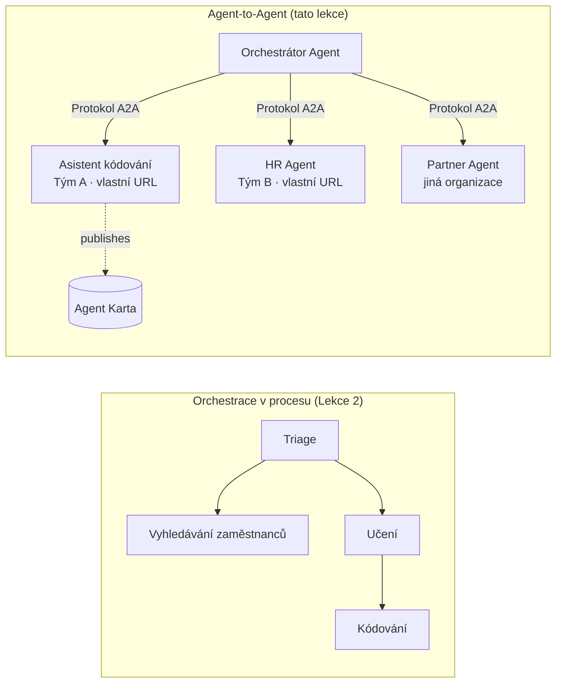

# Lekce 7: Orchestrace více agentů & Agent-to-Agent (A2A)

V [Lekci 6](../lesson-6-toolbox/README.md) jste se naučili vytvářet řízené nástroje a hostované agenty.
Ale skutečné systémy málokdy používají **jednoho** agenta. Při škálování skládáte **mnoho** agentů — některé vlastníte vy,
některé vlastní jiné týmy a některé běží zcela v rámci jiných organizací. Tato lekce je o tom,
jak agenti spolu **pracují**.

Už jste se setkali s jednou formou návrhu více agentů v
[Lekci 2 v `agent-orchestration.py`](../lesson-2-agent-development/README.md): vzor **předání**,
kde agent pro třídění směruje ke specialistům **uvnitř jednoho procesu**. Tato lekce jde
o úroveň výše — ke **Agent-to-Agent (A2A)**, otevřenému protokolu pro agenty, kteří běží jako nezávislé
**síťové služby** a volají se navzájem přes hranice procesů, týmů a organizací.

## Výukové cíle

Na konci této lekce budete schopni:

- Vysvětlit rozdíl mezi **orchestrace uvnitř procesu** (předání/průběhy) a
  komunikací **Agent-to-Agent (A2A)**, a vybrat tu správnou.
- Popsat stavební bloky A2A: **Agent Card**, **dovednosti**, **úkoly** a **objevování**.
- **Zpřístupnit** agenta Microsoft Agent Framework jako A2A službu pomocí `A2AExecutor`.
- **Spotřebovat** vzdáleného agenta jako síťového kolegu s `A2AAgent`.
- Aplikovat podnikové požadavky na A2A: **bezpečnost, identitu, správu, pozorovatelnost a náklady**.

---

## Předpoklady

1. Dokončená [Lekce 2](../lesson-2-agent-development/README.md) (vývoj agenta a orchestrace).
2. Projekt **Microsoft Foundry** s aktuálním nasazením modelu (například `gpt-5.1`, a
   `gpt-5-codex` pro kódovací příklad). Vyhněte se ukončeným verzím GPT-4o / GPT-4.1.
3. Ověřený přístup přes **Azure CLI**: `az login`.
4. **Python 3.12+** s nainstalovanými závislostmi kurzu (`pip install -r ../requirements.txt`).
   Lekce 7 přidává předběžné balíčky `agent-framework-a2a`, `a2a-sdk` a `uvicorn`.
5. Nastavené proměnné `FOUNDRY_PROJECT_ENDPOINT` a `FOUNDRY_MODEL` ve vašem `.env` (viz README kurzu).

---

## 1. Dva způsoby, jak agenti spolupracují

Neexistuje jediný "multi-agentní" vzor. Vyberte ten, který odpovídá vaší **hranici**:

| Vzor | Kde agenti běží | Jak se propojují | Použijte když |
|---------|------------------|------------------|----------|
| **Předání / Průběh** (Lekce 2) | Jeden proces, jedna kódová základna | Graf v paměti (`HandoffBuilder`, `WorkflowBuilder`) | Vlastníte všechny agenty a nasazujete je společně. |
| **Agent-to-Agent (A2A)** (tato lekce) | Samostatné služby, samostatné životní cykly | Otevřený **A2A protokol** přes HTTP, objeven pomocí **Agent Cards** | Agenti jsou vlastněni různými týmy/organizacemi, škálují se nezávisle nebo jsou psáni v různých rámcích. |

Předání je o **směrování uvnitř aplikace**. A2A je o **skládání agentů jako
nezávislých služeb** — agentní ekvivalent přechodu z volání funkcí na mikroslužby.



> **Skládají se.** Orchestrátor, který vybudujete s `HandoffBuilder`, může mít jako účastníky **vzdálené A2A agenty**
> — směrování uvnitř procesu ke službám, které samy běží kdekoli.

---

## 2. Stavební bloky A2A

A2A je **otevřený protokol** (není specifický pro Microsoft), takže A2A agenta může využívat Microsoft
Agent Framework, LangGraph, vlastní kód nebo technologie jiné firmy. Důležité jsou čtyři pojmy:

- **Agent Card** — malý JSON dokument publikovaný na
  `/.well-known/agent-card.json`, který inzeruje **jméno, popis, URL, verzi,
  dovednosti a schopnosti** agenta. Tak klient **objevuje**, co vzdálený agent umí.
- **Dovednosti (Skills)** — deklarované věci, které agent umí (`id`, `name`, `description`, `tags`,
  `examples`). Klienti (i modely) je využívají k rozhodnutí, zda agentovi zavolat.
- **Úkoly (Tasks)** — volání A2A agenta je **úkol** s životním cyklem (odesláno → probíhá →
  dokončeno/selhalo). Server ukládá úkoly do **task store**; jsou podporovány streamingové aktualizace.
- **Objevování (Discovery)** — klient podle URL získá Agent Card a ví, jak agenta volat.

---

## 3. Zpřístupněte agenta jako A2A službu — `a2a_server.py`

Strana **Build/serve** obaluje libovolného agenta Microsoft Agent Framework pomocí `A2AExecutor` a připojí ho
k HTTP aplikaci A2A. Viz [`a2a_server.py`](../../../lesson-7-multi-agent-a2a/a2a_server.py). Klíčové zapojení:

```python
from agent_framework.a2a import A2AExecutor
from a2a.server.apps import A2AStarletteApplication
from a2a.server.request_handlers import DefaultRequestHandler
from a2a.server.tasks import InMemoryTaskStore
from a2a.types import AgentCapabilities, AgentCard, AgentSkill

agent = client.as_agent(name="coding-assistant", instructions="...")

agent_card = AgentCard(
    name="Coding Assistant",
    description="Generates runnable code samples...",
    url="http://localhost:9000/",
    version="1.0.0",
    capabilities=AgentCapabilities(streaming=True),
    default_input_modes=["text"],
    default_output_modes=["text"],
    skills=[AgentSkill(id="generate-code", name="Generate code",
                       description="Write a runnable code snippet.", tags=["code"])],
)

request_handler = DefaultRequestHandler(
    agent_executor=A2AExecutor(agent),
    task_store=InMemoryTaskStore(),
)
app = A2AStarletteApplication(agent_card=agent_card, http_handler=request_handler).build()
# podává se pomocí uvicorn na portu 9000
```

Všimněte si, že kód agenta zůstává **nezměněný** — `A2AExecutor` adaptuje váš existující agent na protokol.
Agent Card z něj dělá **objevitelného** pro jakéhokoli A2A klienta.

---

## 4. Spotřebujte vzdáleného agenta — `a2a_client.py`

Strana **Consume** se připojí k vzdálenému agentovi **pomocí URL**, stáhne jeho Agent Card a volá ho
přesně jako lokálního agenta. Viz [`a2a_client.py`](../../../lesson-7-multi-agent-a2a/a2a_client.py):

```python
from agent_framework.a2a import A2AAgent

remote_agent = A2AAgent(name="remote-coding-assistant", url="http://localhost:9000")
result = await remote_agent.run("Write a Python function that reverses a string.")
print(result.text)
```

To je celý smysl A2A: ze strany volajícího se vzdálený agent chová jako jakýkoliv jiný
`agent_framework` agent, tak ho můžete vložit do workflow nebo mu předat úkol — i když běží
v jiném procesu, na jiném stroji, vlastněný jiným týmem.

### Spusťte ho od začátku do konce

```bash
# Terminál 1 — spusťte službu A2A
python a2a_server.py

# Terminál 2 — zavolejte ji
python a2a_client.py "Write a Python function that reverses a string."
```

Uvidíte odpověď kódovacího asistenta přes A2A protokol. Otevřete
`http://localhost:9000/.well-known/agent-card.json` v prohlížeči a uvidíte publikovanou Agent Card.

---

## 5. Podnikové aspekty

Přeměna agentů na síťové služby přináší stejné výzvy jako jakýkoli distribuovaný systém —
plus několik specifických pro AI:


- **Identita a autentizace.** Nikdy neexponujte agenta A2A bez autentizace. Agent Card obsahuje
  `security` / `security_schemes` a `A2AAgent` přijímá `auth_interceptor`, takže volající mohou připojit
  přihlašovací údaje (OAuth bearer tokeny, API klíče). Použijte Entra ID / spravované identity pro
  autentizaci služba-ke-službě v produkci; umístěte službu za gateway.
- **Governance.** Kombinujte A2A s [Toolboxem Lekce 6](../lesson-6-toolbox/README.md): vzdálený
  agent může být publikován jako **A2A nástroj** uvnitř řízeného toolboxu, aby se centrálně aplikovala pravidla RBAC, injekce pověření
  a zásady ochranných opatření.
- **Pozorovatelnost.** Žádost nyní překračuje hranice procesů, proto propagujte trasování přes celé volání.
  Povzbuďte [Foundry Observability / OpenTelemetry](../lesson-3-agent-evals/README.md) na **obou**
  orchestrátoru i každém vzdáleném agentovi, abyste získali jedno end-to-end trasování.
- **Verzování.** Agent Card má `version`. Zacházejte s tím jako s API: přidávací změny jsou bezpečné;
  zásadní změny smlouvy dovednosti vyžadují novou verzi a migrační okno pro uživatele.
- **Spolehlivost.** Vzdálení agenti mohou selhat nezávisle. Nastavte timeouty (`A2AAgent(timeout=...)`), zvládejte
  částečné selhání a nenechte jednoho pomalého partnera blokovat celou orchestraci.
- **Náklady.** Každé volání vzdáleného agenta je vlastní vyvolání modelu. Fan-out znásobuje výdaje tokenů —
  naplánujte si rozpočet a upřednostněte směrování na **jednoho** nejlepšího agenta namísto vysílání mnoha.

---

## Praktická cvičení

1. **Přidejte druhou službu.** Zkopírujte `a2a_server.py` tak, aby vystavila agenta **employee-search** na portu
   9001 s vlastní Agent Card a dovednostmi. Spusťte obě služby a nechte klienta volat každou z nich.
2. **Orchestrujte vzdálené partnery.** Vytvořte malý `HandoffBuilder` (nebo jednoduchý router), jehož účastníky
   budou dva `A2AAgent`s směřující na vaše dvě služby. Nasměrujte dotaz na správného agenta.
3. **Zabezpečte to.** Přidejte `auth_interceptor` do klienta a vyžadujte bearer token na serveru.
   Co se pokazí, pokud token chybí? Kde byste token uložili v produkci?
4. **Handoff vs A2A.** Napište dva krátké odstavce: kdy byste udržovali předání z Lekce 2 ve stejném procesu
   a kdy se obhajuje komplexnost A2A? Uveďte konkrétní příklad pro každý přístup.

---

## Zdroje

- [Agent-to-Agent (A2A) — Microsoft Agent Framework](https://learn.microsoft.com/agent-framework/user-guide/agent-orchestration/a2a)
- [Víceagentová orchestrace — Microsoft Agent Framework](https://learn.microsoft.com/agent-framework/user-guide/agent-orchestration/)
- [Specifikace protokolu A2A](https://a2a-protocol.org/)
- [A2A Python SDK (`a2a-sdk`)](https://github.com/a2aproject/a2a-python)
- [Foundry Agent Service — vzory více agentů](https://learn.microsoft.com/azure/ai-foundry/agents/concepts/connected-agents)

---

**Předchozí:** [Lekce 6 — Microsoft Toolbox](../lesson-6-toolbox/README.md)

---

<!-- CO-OP TRANSLATOR DISCLAIMER START -->
**Prohlášení o omezení odpovědnosti**:
Tento dokument byl přeložen pomocí AI překladatelské služby [Co-op Translator](https://github.com/Azure/co-op-translator). Přestože usilujeme o co největší přesnost, mějte prosím na paměti, že automatizované překlady mohou obsahovat chyby nebo nepřesnosti. Originální dokument v jeho mateřském jazyce by měl být považován za autoritativní zdroj. Pro kritické informace se doporučuje profesionální lidský překlad. Nejsme odpovědní za jakékoli nedorozumění nebo nesprávné interpretace vzniklé použitím tohoto překladu.
<!-- CO-OP TRANSLATOR DISCLAIMER END -->