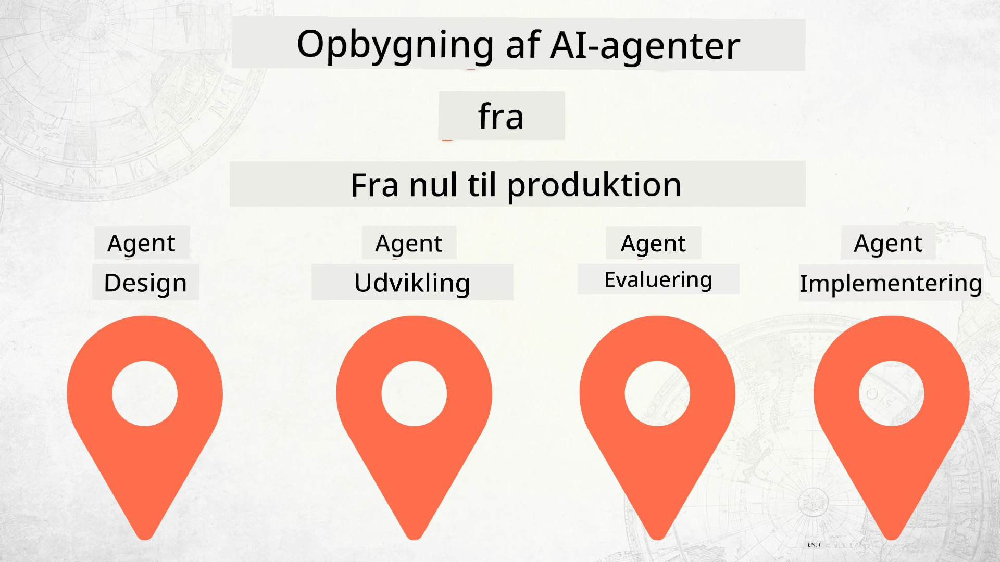

# Bygning af AI-agenter fra nul til produktion



### 🌐 Flersproget support

#### Understøttet via GitHub Action (Automatiseret & Altid Opdateret)

<!-- CO-OP TRANSLATOR LANGUAGES TABLE START -->
[Arabisk](../ar/README.md) | [Bengali](../bn/README.md) | [Bulgarsk](../bg/README.md) | [Burmesisk (Myanmar)](../my/README.md) | [Kinesisk (forenklet)](../zh-CN/README.md) | [Kinesisk (traditionelt, Hong Kong)](../zh-HK/README.md) | [Kinesisk (traditionelt, Macau)](../zh-MO/README.md) | [Kinesisk (traditionelt, Taiwan)](../zh-TW/README.md) | [Kroatisk](../hr/README.md) | [Tjekkisk](../cs/README.md) | [Dansk](./README.md) | [Hollandsk](../nl/README.md) | [Estisk](../et/README.md) | [Finsk](../fi/README.md) | [Fransk](../fr/README.md) | [Tysk](../de/README.md) | [Græsk](../el/README.md) | [Hebraisk](../he/README.md) | [Hindi](../hi/README.md) | [Ungarsk](../hu/README.md) | [Indonesisk](../id/README.md) | [Italiensk](../it/README.md) | [Japansk](../ja/README.md) | [Kannada](../kn/README.md) | [Koreansk](../ko/README.md) | [Litauisk](../lt/README.md) | [Malaysisk](../ms/README.md) | [Malayalam](../ml/README.md) | [Marathi](../mr/README.md) | [Nepali](../ne/README.md) | [Nigeriansk Pidgin](../pcm/README.md) | [Norsk](../no/README.md) | [Persisk (Farsi)](../fa/README.md) | [Polsk](../pl/README.md) | [Portugisisk (Brasilien)](../pt-BR/README.md) | [Portugisisk (Portugal)](../pt-PT/README.md) | [Punjabi (Gurmukhi)](../pa/README.md) | [Rumænsk](../ro/README.md) | [Russisk](../ru/README.md) | [Serbisk (Cyrillisk)](../sr/README.md) | [Slovakisk](../sk/README.md) | [Slovensk](../sl/README.md) | [Spansk](../es/README.md) | [Swahili](../sw/README.md) | [Svensk](../sv/README.md) | [Tagalog (Filippinerne)](../tl/README.md) | [Tamil](../ta/README.md) | [Telugu](../te/README.md) | [Thai](../th/README.md) | [Tyrkisk](../tr/README.md) | [Ukrainsk](../uk/README.md) | [Urdu](../ur/README.md) | [Vietnamesisk](../vi/README.md)

> **Foretrækker du at klone lokalt?**

> Dette repository inkluderer 50+ sprogoversættelser, hvilket betydeligt øger downloadstørrelsen. For at klone uden oversættelser, brug sparse checkout:
> ```bash
> git clone --filter=blob:none --sparse https://github.com/microsoft/Building-AI-Agents-From-Zero-To-Production.git
> cd Building-AI-Agents-From-Zero-To-Production
> git sparse-checkout set --no-cone '/*' '!translations' '!translated_images'
> ```
> Dette giver dig alt, hvad du behøver for at fuldføre kurset med en langt hurtigere download.
<!-- CO-OP TRANSLATOR LANGUAGES TABLE END -->

## Et kursus der lærer dig grundlaget for AI Agent Udviklingslivscyklus

[](https://github.com/microsoft/Building-AI-Agents-From-Zero-To-Production/blob/master/LICENSE?WT.mc_id=academic-105485-koreyst)
[](https://GitHub.com/microsoft/Building-AI-Agents-From-Zero-To-Production/graphs/contributors/?WT.mc_id=academic-105485-koreyst)
[](https://GitHub.com/microsoft/Building-AI-Agents-From-Zero-To-Production/issues/?WT.mc_id=academic-105485-koreyst)
[](https://GitHub.com/microsoft/Building-AI-Agents-From-Zero-To-Production/pulls/?WT.mc_id=academic-105485-koreyst)
[](http://makeapullrequest.com?WT.mc_id=academic-105485-koreyst)

[](https://discord.gg/Kuaw3ktsu6)

## 🌱 Kom godt i gang

Dette kursus har lektioner, der dækker grundlæggende i at bygge og implementere AI-agenter.

Hver lektion bygger videre på den foregående, så vi anbefaler at starte fra begyndelsen og arbejde dig igennem til slutningen.

Hvis du vil udforske mere om AI Agent-emner, kan du tjekke [AI Agents For Beginners Course](https://aka.ms/ai-agents-beginners).

### Mød andre elever, få svar på dine spørgsmål

Hvis du sidder fast eller har spørgsmål om at bygge AI-agenter, kan du deltage i vores dedikerede Discord-kanal i [Microsoft Foundry Discord](https://discord.gg/Kuaw3ktsu6).

### Hvad du behøver

Hver lektion har sit eget kodesample, som du kan køre lokalt. Du kan [forke dette repo](https://github.com/microsoft/Building-AI-Agents-From-Zero-To-Production/fork) for at oprette din egen kopi.

Dette kursus bruger i øjeblikket følgende:

- [Microsoft Agent Framework (MAF)](https://aka.ms/ai-agents-beginners/agent-framework)
- [Microsoft Foundry](https://azure.microsoft.com/products/ai-foundry)
- [Azure OpenAI Service](https://azure.microsoft.com/products/ai-foundry/models/openai)
- [Azure CLI](https://learn.microsoft.com/cli/azure/authenticate-azure-cli?view=azure-cli-latest)

Sørg for, at du har adgang til disse tjenester, inden du går i gang.

Flere muligheder omkring model hosting og tjenester kommer snart.

## 🗃️ Lektioner

| **Lektion**           | **Beskrivelse**                                                                                   |
|-----------------------|--------------------------------------------------------------------------------------------------|
| [Agent Design](./lesson-1-agent-design/README.md)        | En introduktion til vores "Developer Onboarding" Agent Use Case og hvordan man designer effektive agenter  |
| [Agent Development](./lesson-2-agent-development/README.md) | Brug af Microsoft Agent Framework (MAF), opret 3 agenter til at hjælpe nye udviklere i gang.           |
| [Agent Evaluations](./lesson-3-agent-evals/README.md)    | Brug Microsoft Foundry til at finde ud af, hvor godt vores AI-agenter klarer sig, og hvordan de kan forbedres. |
| [Agent Deployment](./lesson-4-agent-deployment/README.md)  | Brug Hosted Agents og OpenAI Chatkit til at se, hvordan man implementerer en AI-agent i produktion.       |

## 🎒 Andre kurser

Vores team producerer andre kurser! Se dem her:

<!-- CO-OP TRANSLATOR OTHER COURSES START -->
### LangChain
[](https://aka.ms/langchain4j-for-beginners)
[](https://aka.ms/langchainjs-for-beginners?WT.mc_id=m365-94501-dwahlin)
[](https://github.com/microsoft/langchain-for-beginners?WT.mc_id=m365-94501-dwahlin)
---

### Azure / Edge / MCP / Agenter
[](https://github.com/microsoft/AZD-for-beginners?WT.mc_id=academic-105485-koreyst)
[](https://github.com/microsoft/edgeai-for-beginners?WT.mc_id=academic-105485-koreyst)
[](https://github.com/microsoft/mcp-for-beginners?WT.mc_id=academic-105485-koreyst)
[](https://github.com/microsoft/ai-agents-for-beginners?WT.mc_id=academic-105485-koreyst)

---
 
### Generativ AI Serie
[](https://github.com/microsoft/generative-ai-for-beginners?WT.mc_id=academic-105485-koreyst)
[-9333EA?style=for-the-badge&labelColor=E5E7EB&color=9333EA)](https://github.com/microsoft/Generative-AI-for-beginners-dotnet?WT.mc_id=academic-105485-koreyst)
[-C084FC?style=for-the-badge&labelColor=E5E7EB&color=C084FC)](https://github.com/microsoft/generative-ai-for-beginners-java?WT.mc_id=academic-105485-koreyst)
[-E879F9?style=for-the-badge&labelColor=E5E7EB&color=E879F9)](https://github.com/microsoft/generative-ai-with-javascript?WT.mc_id=academic-105485-koreyst)

---
 
### Grundlæggende læring
[](https://aka.ms/ml-beginners?WT.mc_id=academic-105485-koreyst)
[](https://aka.ms/datascience-beginners?WT.mc_id=academic-105485-koreyst)
[](https://aka.ms/ai-beginners?WT.mc_id=academic-105485-koreyst)
[](https://github.com/microsoft/Security-101?WT.mc_id=academic-96948-sayoung)
[](https://aka.ms/webdev-beginners?WT.mc_id=academic-105485-koreyst)
[](https://aka.ms/iot-beginners?WT.mc_id=academic-105485-koreyst)
[](https://github.com/microsoft/xr-development-for-beginners?WT.mc_id=academic-105485-koreyst)

---
 
### Copilot Series
[](https://aka.ms/GitHubCopilotAI?WT.mc_id=academic-105485-koreyst)
[](https://github.com/microsoft/mastering-github-copilot-for-dotnet-csharp-developers?WT.mc_id=academic-105485-koreyst)
[](https://github.com/microsoft/CopilotAdventures?WT.mc_id=academic-105485-koreyst)
<!-- CO-OP TRANSLATOR OTHER COURSES END -->

## Bidrag

Dette projekt byder velkommen til bidrag og forslag. De fleste bidrag kræver, at du accepterer en
Contributor License Agreement (CLA), der erklærer, at du har ret til og faktisk giver os
rettighederne til at bruge dit bidrag. For detaljer, se <https://cla.opensource.microsoft.com>.

Når du indsender en pull request, vil en CLA-bot automatisk afgøre, om du skal fremlægge
en CLA og dekorere PR'en passende (fx statuskontrol, kommentar). Følg blot instruktionerne
givet af botten. Du skal kun gøre dette én gang på tværs af alle repos, der bruger vores CLA.

Dette projekt har tilsluttet sig [Microsoft Open Source Code of Conduct](https://opensource.microsoft.com/codeofconduct/).
For mere information se [Code of Conduct FAQ](https://opensource.microsoft.com/codeofconduct/faq/) eller
kontakt [opencode@microsoft.com](mailto:opencode@microsoft.com) med eventuelle yderligere spørgsmål eller kommentarer.

## Varemærker

Dette projekt kan indeholde varemærker eller logoer for projekter, produkter eller tjenester. Autoriseret brug af Microsofts
varemærker eller logoer er underlagt og skal følge
[Microsofts retningslinjer for varemærker og brand](https://www.microsoft.com/legal/intellectualproperty/trademarks/usage/general).
Brug af Microsofts varemærker eller logoer i ændrede versioner af dette projekt må ikke skabe forvirring eller antyde, at Microsoft sponsorerer det.
Enhver brug af tredjepartsvaremærker eller logoer er underlagt de pågældende tredjeparts politikker.

## Få hjælp

Hvis du sidder fast eller har spørgsmål om opbygning af AI-apps, deltag i:

[](https://discord.gg/Kuaw3ktsu6)

Hvis du har produktfeedback eller fejl under opbygning, besøg:

[](https://aka.ms/foundry/forum)

---

<!-- CO-OP TRANSLATOR DISCLAIMER START -->
**Ansvarsfraskrivelse**:
Dette dokument er blevet oversat ved hjælp af AI-oversættelsestjenesten [Co-op Translator](https://github.com/Azure/co-op-translator). Selvom vi bestræber os på nøjagtighed, bedes du være opmærksom på, at automatiserede oversættelser kan indeholde fejl eller unøjagtigheder. Det oprindelige dokument på dets originale sprog bør betragtes som den autoritative kilde. Ved kritisk information anbefales professionel menneskelig oversættelse. Vi påtager os intet ansvar for misforståelser eller fejltolkninger, der måtte opstå ved brug af denne oversættelse.
<!-- CO-OP TRANSLATOR DISCLAIMER END -->