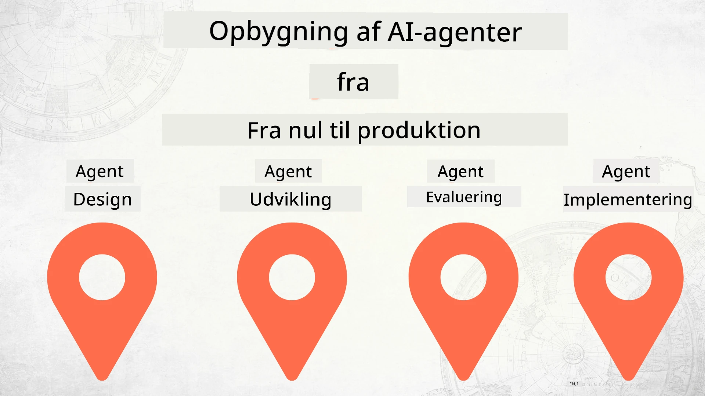

# Bygning af AI-agenter fra nul til produktion



### 🌐 Multisproget support

#### Understøttet via GitHub Action (Automatiseret & altid opdateret)

<!-- CO-OP TRANSLATOR LANGUAGES TABLE START -->
[Arabic](../ar/README.md) | [Bengali](../bn/README.md) | [Bulgarian](../bg/README.md) | [Burmese (Myanmar)](../my/README.md) | [Chinese (Simplified)](../zh-CN/README.md) | [Chinese (Traditional, Hong Kong)](../zh-HK/README.md) | [Chinese (Traditional, Macau)](../zh-MO/README.md) | [Chinese (Traditional, Taiwan)](../zh-TW/README.md) | [Croatian](../hr/README.md) | [Czech](../cs/README.md) | [Danish](./README.md) | [Dutch](../nl/README.md) | [Estonian](../et/README.md) | [Finnish](../fi/README.md) | [French](../fr/README.md) | [German](../de/README.md) | [Greek](../el/README.md) | [Hebrew](../he/README.md) | [Hindi](../hi/README.md) | [Hungarian](../hu/README.md) | [Indonesian](../id/README.md) | [Italian](../it/README.md) | [Japanese](../ja/README.md) | [Kannada](../kn/README.md) | [Khmer](../km/README.md) | [Korean](../ko/README.md) | [Lithuanian](../lt/README.md) | [Malay](../ms/README.md) | [Malayalam](../ml/README.md) | [Marathi](../mr/README.md) | [Nepali](../ne/README.md) | [Nigerian Pidgin](../pcm/README.md) | [Norwegian](../no/README.md) | [Persian (Farsi)](../fa/README.md) | [Polish](../pl/README.md) | [Portuguese (Brazil)](../pt-BR/README.md) | [Portuguese (Portugal)](../pt-PT/README.md) | [Punjabi (Gurmukhi)](../pa/README.md) | [Romanian](../ro/README.md) | [Russian](../ru/README.md) | [Serbian (Cyrillic)](../sr/README.md) | [Slovak](../sk/README.md) | [Slovenian](../sl/README.md) | [Spanish](../es/README.md) | [Swahili](../sw/README.md) | [Swedish](../sv/README.md) | [Tagalog (Filipino)](../tl/README.md) | [Tamil](../ta/README.md) | [Telugu](../te/README.md) | [Thai](../th/README.md) | [Turkish](../tr/README.md) | [Ukrainian](../uk/README.md) | [Urdu](../ur/README.md) | [Vietnamese](../vi/README.md)

> **Foretrækker du at klone lokalt?**
>
> Dette repository inkluderer 50+ sprogoversættelser, som betydeligt øger downloadstørrelsen. For at klone uden oversættelser, brug sparse checkout:
>
> **Bash / macOS / Linux:**
> ```bash
> git clone --filter=blob:none --sparse https://github.com/microsoft/Building-AI-Agents-From-Zero-To-Production.git
> cd Building-AI-Agents-From-Zero-To-Production
> git sparse-checkout set --no-cone '/*' '!translations' '!translated_images'
> ```
>
> **CMD (Windows):**
> ```cmd
> git clone --filter=blob:none --sparse https://github.com/microsoft/Building-AI-Agents-From-Zero-To-Production.git
> cd Building-AI-Agents-From-Zero-To-Production
> git sparse-checkout set --no-cone "/*" "!translations" "!translated_images"
> ```
>
> Dette giver dig alt, hvad du behøver for at gennemføre kurset med en meget hurtigere download.
<!-- CO-OP TRANSLATOR LANGUAGES TABLE END -->

## Et kursus, der lærer dig grundlæggende om AI-agentudviklingslivscyklussen

[](https://github.com/microsoft/Building-AI-Agents-From-Zero-To-Production/blob/master/LICENSE?WT.mc_id=academic-105485-koreyst)
[](https://GitHub.com/microsoft/Building-AI-Agents-From-Zero-To-Production/graphs/contributors/?WT.mc_id=academic-105485-koreyst)
[](https://GitHub.com/microsoft/Building-AI-Agents-From-Zero-To-Production/issues/?WT.mc_id=academic-105485-koreyst)
[](https://GitHub.com/microsoft/Building-AI-Agents-From-Zero-To-Production/pulls/?WT.mc_id=academic-105485-koreyst)
[](http://makeapullrequest.com?WT.mc_id=academic-105485-koreyst)

[](https://discord.gg/Kuaw3ktsu6)

## 🌱 Kom godt i gang

Dette kursus har lektioner, der dækker grundlæggende om opbygning og implementering af AI-agenter.

Hver lektion bygger videre på den forrige, så vi anbefaler at starte fra begyndelsen og arbejde dig igennem til slutningen.

Hvis du ønsker at udforske mere om AI-agentemner, kan du tjekke [AI Agents For Beginners Course](https://aka.ms/ai-agents-beginners).

### Mød andre elever, få svar på dine spørgsmål

Hvis du sidder fast eller har spørgsmål om opbygning af AI-agenter, kan du deltage i vores dedikerede Discord-kanal i [Microsoft Foundry Discord](https://discord.gg/Kuaw3ktsu6).

### Hvad du har brug for

Hver lektion har sit eget kodeeksempel, som du kan køre lokalt. Du kan [fork dette repo](https://github.com/microsoft/Building-AI-Agents-From-Zero-To-Production/fork) for at skabe din egen kopi.

Dette kursus bruger i øjeblikket følgende:

- [Microsoft Agent Framework (MAF)](https://aka.ms/ai-agents-beginners/agent-framework)
- [Microsoft Foundry](https://azure.microsoft.com/products/ai-foundry) — et projekt med en implementeret **GPT-5 serie** model (for eksempel `gpt-5.1`). Brug **ikke** de pensionerede GPT-4o / GPT-4.1 modeller.
- [Azure OpenAI Service](https://azure.microsoft.com/products/ai-foundry/models/openai)
- [Azure CLI](https://learn.microsoft.com/cli/azure/authenticate-azure-cli?view=azure-cli-latest) — log ind med `az login` før du kører nogle eksempler
- **Python 3.12 eller nyere**

Sørg venligst for, at du har adgang til disse tjenester, før du går i gang.

> **💰 Omkostninger & oprydning.** De praktiske lektioner skaber rigtige Azure-ressourcer — et Microsoft Foundry
> projekt, en modelimplementering, en vektorlager og (i lektionerne 4–6) hostede agenter og værktøjskasser.
> Disse kan påføre omkostninger, så længe de eksisterer. Når du er færdig med en lektion — eller kurset — slet de
> ressourcer, du ikke længere har brug for. Den nemmeste måde er at lægge alt i en dedikeret ressourcegruppe
> og slette hele gruppen, når du er færdig:
>
> ```bash
> az group delete --name <your-resource-group> --yes --no-wait
> ```
>
> Du kan også slette individuelle agenter, vektorlager og værktøjskasser fra Foundry-portalen.

> **Note om modeller.** Dette kursus serverer alle modeller gennem **Microsoft Foundry**. Det bruger ikke
> *GitHub Models*, som udfases den **30. juli 2026** — Microsoft Foundry er
> den officielle migrationsvej. Hvis du har ældre kode, der kalder GitHub Models, skal det peges mod en Foundry-
> modelimplementering i stedet.

Flere muligheder for modelhosting og -tjenester kommer snart. 

## 🗃️ Lektioner

| **Lektion**         | **Beskrivelse**                                                                                  |
|--------------------|--------------------------------------------------------------------------------------------------|
| [Agent Design](./lesson-1-agent-design/README.md)       | En introduktion til vores "Developer Onboarding" agent-brugebillede og hvordan man designer effektive agenter  |
| [Agent Development](./lesson-2-agent-development/README.md)  | Brug Microsoft Agent Framework (MAF) til at bygge et sæt specialiserede agenter til at hjælpe nye udviklere med onboarding.       |
| [Agent Evaluations](./lesson-3-agent-evals/README.md)  | Brug Microsoft Foundry til at finde ud af, hvor godt vores AI-agenter præsterer, og hvordan de kan forbedres. |
| [Agent Deployment](./lesson-4-agentdeployment/README.md)   | Brug Microsoft Foundry hostede agenter og OpenAI ChatKit til at se, hvordan man implementerer en AI-agent i produktion.       |
| [Production Hosted Agents](./lesson-5-hosted-agents-production/README.md)   | Tag en hostet agent til enterprise-produktion: Hosted Agents vs Capability Hosts, medbring dit eget lager, hukommelse og styring.       |
| [Microsoft Toolbox](./lesson-6-toolbox/README.md)   | Definer værktøjer én gang og styr dem centralt: byg en værktøjskasse, brug den fra en agent via ét MCP-endpoint, og versionér værktøjer sikkert.       |
| [Multi-Agent & A2A](./lesson-7-multi-agent-a2a/README.md)   | Sammensæt agenter som netværkstjenester: eksponér en agent over det åbne Agent-til-Agent (A2A) protokol og brug en fjernagent som peer.       |


## 🎒 Andre kurser

Vores team producerer andre kurser! Tjek dem ud:

<!-- CO-OP TRANSLATOR OTHER COURSES START -->
### LangChain
[](https://aka.ms/langchain4j-for-beginners)
[](https://aka.ms/langchainjs-for-beginners?WT.mc_id=m365-94501-dwahlin)
[](https://github.com/microsoft/langchain-for-beginners?WT.mc_id=m365-94501-dwahlin)
---

### Azure / Edge / MCP / Agenter
[](https://github.com/microsoft/AZD-for-beginners?WT.mc_id=academic-105485-koreyst)
[](https://github.com/microsoft/edgeai-for-beginners?WT.mc_id=academic-105485-koreyst)
[](https://github.com/microsoft/mcp-for-beginners?WT.mc_id=academic-105485-koreyst)
[](https://github.com/microsoft/ai-agents-for-beginners?WT.mc_id=academic-105485-koreyst)

---
 
### Generative AI-serie

[](https://github.com/microsoft/generative-ai-for-beginners?WT.mc_id=academic-105485-koreyst)
[-9333EA?style=for-the-badge&labelColor=E5E7EB&color=9333EA)](https://github.com/microsoft/Generative-AI-for-beginners-dotnet?WT.mc_id=academic-105485-koreyst)
[-C084FC?style=for-the-badge&labelColor=E5E7EB&color=C084FC)](https://github.com/microsoft/generative-ai-for-beginners-java?WT.mc_id=academic-105485-koreyst)
[-E879F9?style=for-the-badge&labelColor=E5E7EB&color=E879F9)](https://github.com/microsoft/generative-ai-with-javascript?WT.mc_id=academic-105485-koreyst)

---
 
### Kerneindlæring
[](https://aka.ms/ml-beginners?WT.mc_id=academic-105485-koreyst)
[](https://aka.ms/datascience-beginners?WT.mc_id=academic-105485-koreyst)
[](https://aka.ms/ai-beginners?WT.mc_id=academic-105485-koreyst)
[](https://github.com/microsoft/Security-101?WT.mc_id=academic-96948-sayoung)
[](https://aka.ms/webdev-beginners?WT.mc_id=academic-105485-koreyst)
[](https://aka.ms/iot-beginners?WT.mc_id=academic-105485-koreyst)
[](https://github.com/microsoft/xr-development-for-beginners?WT.mc_id=academic-105485-koreyst)

---
 
### Copilot-serien
[](https://aka.ms/GitHubCopilotAI?WT.mc_id=academic-105485-koreyst)
[](https://github.com/microsoft/mastering-github-copilot-for-dotnet-csharp-developers?WT.mc_id=academic-105485-koreyst)
[](https://github.com/microsoft/CopilotAdventures?WT.mc_id=academic-105485-koreyst)
<!-- CO-OP TRANSLATOR OTHER COURSES END -->

## Bidrage

Dette projekt byder velkommen til bidrag og forslag. De fleste bidrag kræver, at du tilslutter dig en
Contributor License Agreement (CLA), som erklærer, at du har ret til, og faktisk gør, at give os
rettighederne til at bruge dit bidrag. For detaljer, besøg <https://cla.opensource.microsoft.com>.

Når du indsender en pull-forespørgsel, vil en CLA-bot automatisk afgøre, om du skal levere
en CLA og dekorere PR'en passende (f.eks. statuskontrol, kommentar). Følg blot instruktionerne
fra botten. Du skal kun gøre dette én gang på tværs af alle repos, der bruger vores CLA.

Dette projekt har taget [Microsofts Open Source Code of Conduct](https://opensource.microsoft.com/codeofconduct/) til sig.
For mere information se [Code of Conduct FAQ](https://opensource.microsoft.com/codeofconduct/faq/) eller
kontakt [opencode@microsoft.com](mailto:opencode@microsoft.com) med eventuelle yderligere spørgsmål eller kommentarer.

## Varemærker

Dette projekt kan indeholde varemærker eller logoer for projekter, produkter eller tjenester. Autoriseret brug af Microsofts
varemærker eller logoer er underlagt og skal følge
[Microsofts varemærke- og brandretningslinjer](https://www.microsoft.com/legal/intellectualproperty/trademarks/usage/general).
Brug af Microsofts varemærker eller logoer i ændrede versioner af dette projekt må ikke skabe forvirring eller antyde Microsoft-sponsorering.
Enhver brug af tredjeparts varemærker eller logoer er underlagt disse tredjeparts politikker.

## Få hjælp

Hvis du sidder fast eller har spørgsmål om at bygge AI-apps, deltag i:

[](https://discord.gg/Kuaw3ktsu6)

Hvis du har produktfeedback eller fejl under udvikling, besøg:

[](https://aka.ms/foundry/forum)

---

<!-- CO-OP TRANSLATOR DISCLAIMER START -->
**Ansvarsfraskrivelse**:
Dette dokument er blevet oversat ved hjælp af AI-oversættelsestjenesten [Co-op Translator](https://github.com/Azure/co-op-translator). Selvom vi bestræber os på nøjagtighed, skal du være opmærksom på, at automatiserede oversættelser kan indeholde fejl eller unøjagtigheder. Det originale dokument på dets oprindelige sprog bør betragtes som den autoritative kilde. For kritisk information anbefales professionel menneskelig oversættelse. Vi påtager os intet ansvar for misforståelser eller fejltolkninger, der opstår som følge af brugen af denne oversættelse.
<!-- CO-OP TRANSLATOR DISCLAIMER END -->