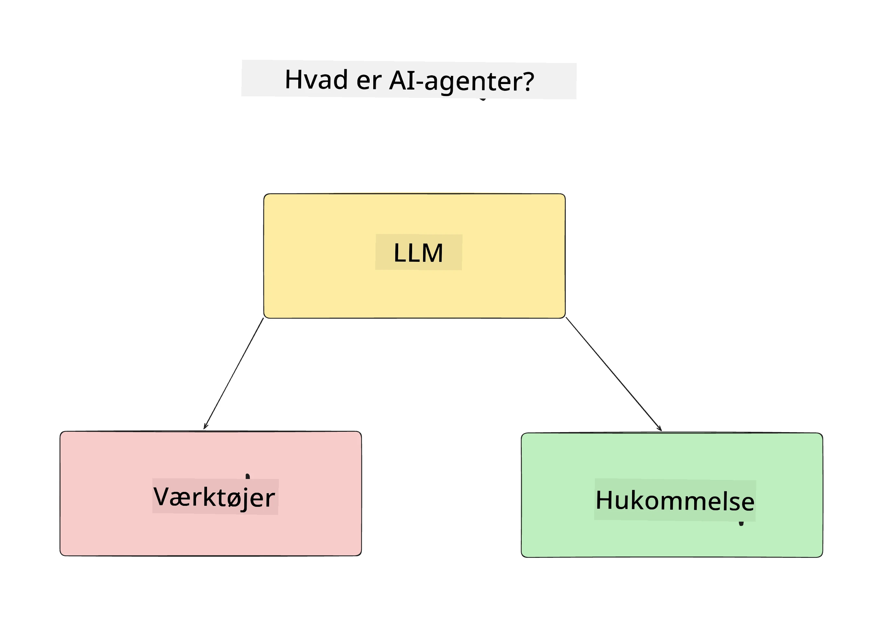
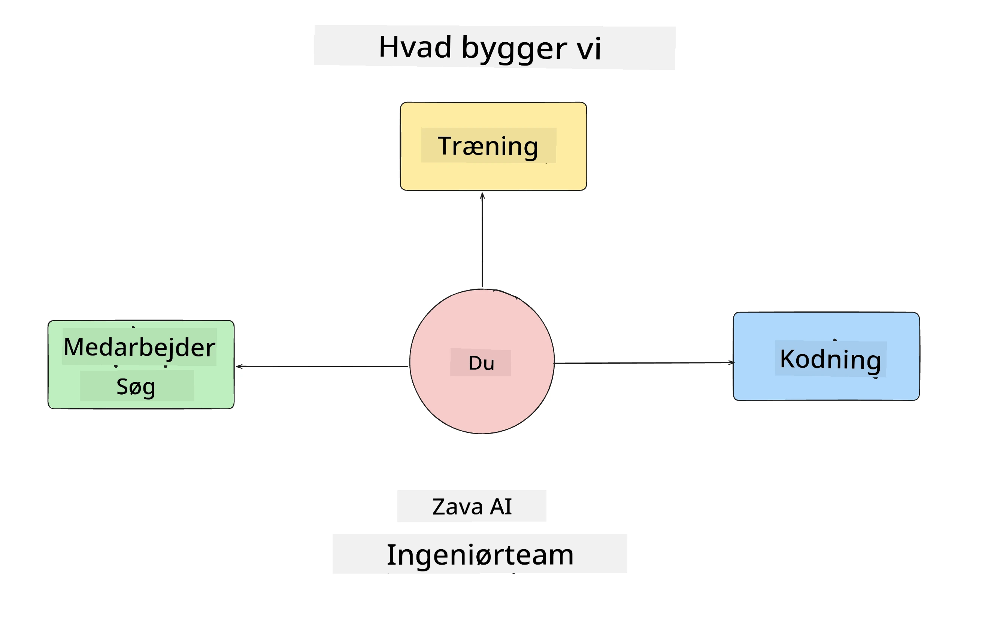
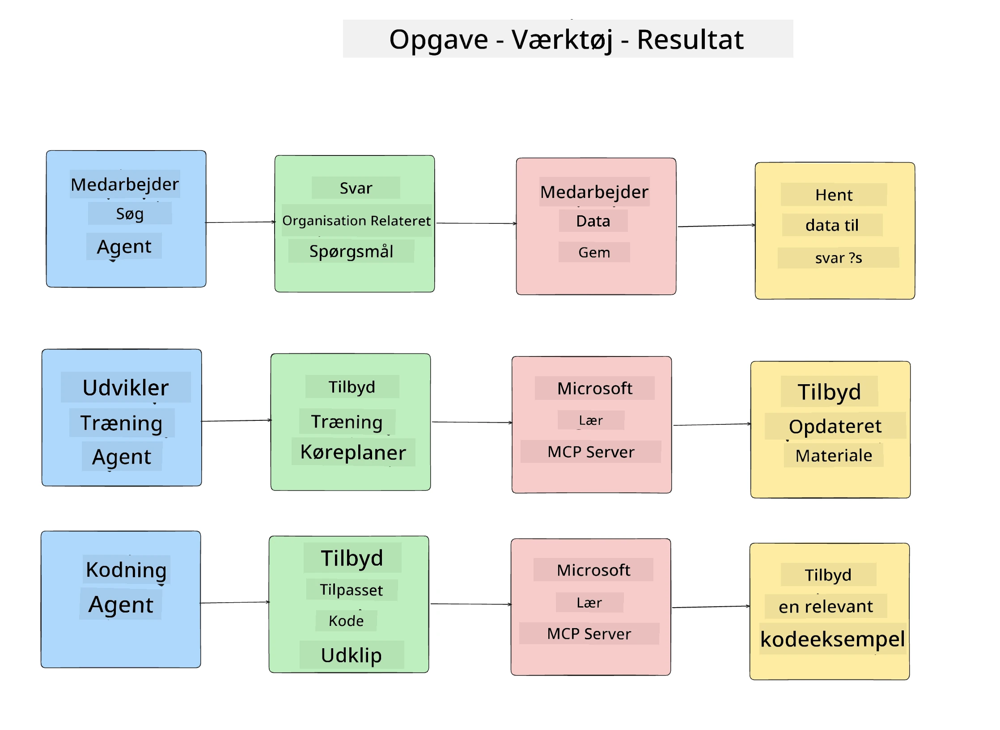
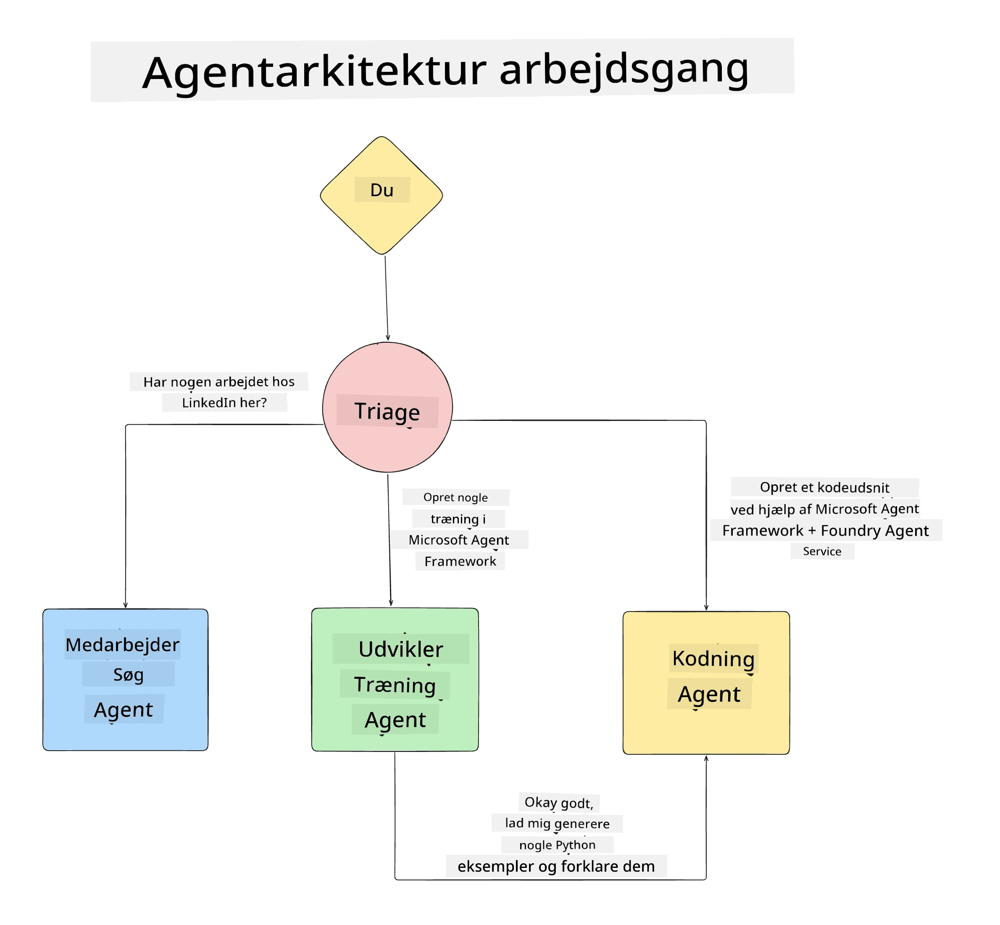

# Lektion 1: AI Agent Design

Velkommen til den første lektion i kursuset "Byg AI Agent fra Start til Produktion"!

I denne lektion vil vi dække:

- Definere hvad AI Agenter er
  
- Diskutere AI Agent Applikationen, som vi bygger  

- Identificere de nødvendige værktøjer og services for hver agent
  
- Arkitektere vores Agent Applikation
  
Lad os starte med at definere, hvad en agent er, og hvorfor vi ville bruge dem inde i en applikation.

> **Før du starter kurset.** Denne første lektion er konceptuel — der er ingen kode at køre.
> Fra [Lektion 2](../lesson-2-agent-development/README.md) og frem har du brug for: et **Azure
> abonnement** med adgang til **Microsoft Foundry**, en deployeret **GPT-5 serie model** (for
> eksempel `gpt-5.1` — undgå den udfasede GPT-4o / GPT-4.1), **Python 3.12+**, og **Azure CLI**
> (`az login`). Se [Hvad du behøver](../README.md#what-you-need) i kursusets README for den fulde
> liste og links.

## Hvad Er AI Agenter?

Hvis det er første gang, du udforsker, hvordan man bygger en AI Agent, kan du have spørgsmål om, hvordan man præcist definerer, hvad en AI Agent er.

En simpel måde at definere, hvad en AI Agent er, er ved de komponenter, der udgør den:

**Stor Sprogmodel** - LLM'en driver både evnen til at behandle naturligt sprog fra brugeren for at fortolke den opgave, de ønsker at udføre, samt fortolke beskrivelserne af de værktøjer, der er tilgængelige for at fuldføre disse opgaver.

**Værktøjer** - Disse vil være funktioner, API'er, datalagre og andre services, som LLM kan vælge at bruge for at fuldføre de opgaver, som brugeren har bedt om.

**Hukommelse** - Dette er, hvordan vi gemmer både kort- og langtidshukommelse af interaktioner mellem AI Agenten og brugeren. At gemme og hente denne information er vigtigt for at lave forbedringer og gemme brugerpræferencer over tid.

## Vores AI Agent Use Case

Til dette kursus skal vi bygge en AI Agent-applikation, der hjælper nye udviklere med at onboarde til vores AI Agent Udviklingsteam!

Før vi går i gang med udviklingsarbejdet, er det første skridt til at skabe en succesfuld AI Agent-applikation at definere klare scenarier for, hvordan vi forventer, at vores brugere skal arbejde med vores AI Agenter.

For denne applikation vil vi arbejde med disse scenarier:

**Scenario 1**: En ny medarbejder starter i vores organisation og ønsker at vide mere om det team, de er kommet til, og hvordan man kan kontakte dem.

**Scenario 2:** En ny medarbejder ønsker at vide, hvad der ville være den bedste første opgave for dem at begynde på.

**Scenario 3:** En ny medarbejder ønsker at samle læringsressourcer og kodeeksempler for at hjælpe dem med at komme i gang med at fuldføre denne opgave.

## Identificering af Værktøjer og Services

Nu hvor vi har disse scenarier oprettet, er det næste skridt at kortlægge dem til de værktøjer og services, som vores AI agenter vil have brug for for at fuldføre disse opgaver.

Denne proces falder under kategorien Kontekstengineering, da vi vil fokusere på at sikre, at vores AI Agenter har den rette kontekst på det rette tidspunkt for at fuldføre opgaverne.

Lad os gøre dette scenarie for scenarie og udføre god agentdesign ved at liste hver agents opgave, værktøjer og ønskede resultater.

### Scenario 1 - Medarbejdersøgningsagent

**Opgave** - Besvare spørgsmål om medarbejdere i organisationen såsom ansættelsesdato, nuværende team, placering og sidste stilling.

**Værktøjer** - Datalager over nuværende medarbejderliste og organisationsdiagram

**Resultater** - I stand til at hente information fra datalageret for at besvare generelle organisatoriske spørgsmål og specifikke spørgsmål om medarbejdere.

### Scenario 2 - Opgaveanbefalingsagent

**Opgave** - Baseret på den nye medarbejders udviklererfaring, finde 1-3 problemer som den nye medarbejder kan arbejde på.

**Værktøjer** - GitHub MCP Server for at få åbne problemer og opbygge en udviklerprofil

**Resultater** - I stand til at læse de sidste 5 commits af en GitHub-profil og åbne problemer på et GitHub-projekt og komme med anbefalinger baseret på et match

### Scenario 3 - Kodeassistentagent

**Opgave** - Baseret på de åbne problemer, der blev anbefalet af "Opgaveanbefalings" agenten, undersøge og levere ressourcer og generere kodeeksempler for at hjælpe medarbejderen.

**Værktøjer** - Microsoft Learn MCP til at finde ressourcer og Code Interpreter til at generere tilpassede kodeeksempler.

**Resultater** - Hvis brugeren beder om yderligere hjælp, skal workflowet bruge Learn MCP Server til at give links og uddrag til ressourcer og derefter overdrage til Code Interpreter agenten for at generere små kodeeksempler med forklaringer.

## Arkitektere vores Agent Applikation

Nu hvor vi har defineret hver af vores Agenter, lad os lave et arkitekturskema, som vil hjælpe os med at forstå, hvordan hver agent vil arbejde sammen og separat afhængigt af opgaven:

## Næste Skridt

Nu hvor vi har designet hver agent og vores agent system, lad os gå videre til den næste lektion, hvor vi vil udvikle hver af disse agenter!

---

<!-- CO-OP TRANSLATOR DISCLAIMER START -->
**Ansvarsfraskrivelse**:
Dette dokument er blevet oversat ved hjælp af AI-oversættelsestjenesten [Co-op Translator](https://github.com/Azure/co-op-translator). Selvom vi bestræber os på nøjagtighed, skal du være opmærksom på, at automatiserede oversættelser kan indeholde fejl eller unøjagtigheder. Det originale dokument på dets oprindelige sprog bør betragtes som den autoritative kilde. For kritisk information anbefales professionel menneskelig oversættelse. Vi påtager os intet ansvar for misforståelser eller fejltolkninger, der opstår som følge af brugen af denne oversættelse.
<!-- CO-OP TRANSLATOR DISCLAIMER END -->