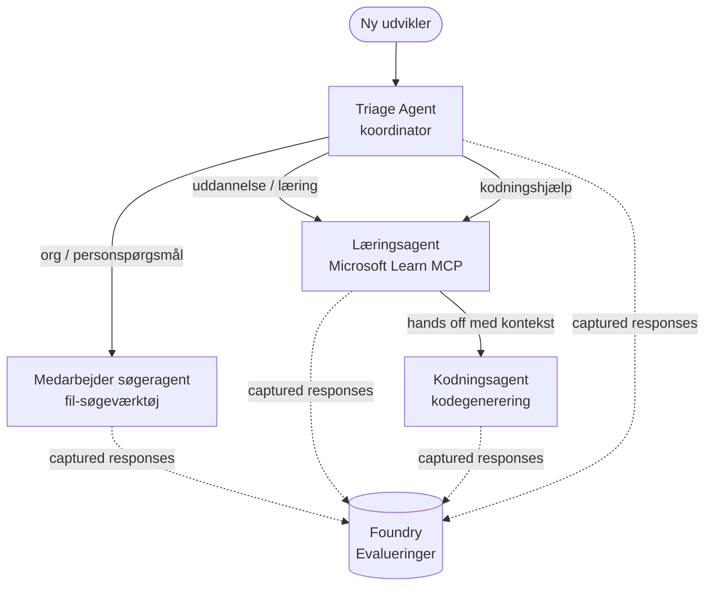

# Lektion 3: Agentvurderinger med Microsoft Foundry

Velkommen til den tredje lektion i **"Bygning af AI-agenter fra nul til produktion"** kurset!

I [Lektion 2](../lesson-2-agent-development/README.md) byggede du agenter. I denne lektion vil du
lære at besvare et meget sværere spørgsmål: **er de gode?** Det er let at levere en agent, der
kører; at vide om den ruter korrekt, forbliver forankret i dine data og bruger sine
værktøjer korrekt, er hvad der adskiller en demo fra et produktionssystem.

I denne lektion gennemgår vi:

- Hvorfor agentvurdering er vigtigt, og hvordan det adskiller sig fra traditionel testning
- Forskellen mellem **observerbarhed**, **røgtest** og **vurderinger**
- Multi-agent arbejdsflowet vi skal måle
- De indbyggede **Microsoft Foundry evaluatorer** (relevans, forankring, værktøjsopkalds nøjagtighed, værktøjs output udnyttelse)
- En trin-for-trin gennemgang af evalueringspipeline i [`agent-evals.py`](../../../lesson-3-agent-evals/agent-evals.py)
- Hvordan man kører det og læser resultaterne

---

## Hvorfor evaluere agenter?

En traditionel enhedstest bekræfter at `add(2, 2) == 4`. Agenter fungerer ikke sådan — det samme
prompt kan producere forskellige formuleringer hver gang, værktøjer kan kaldes i forskellige rækkefølger, og
"korrekt" er ofte et spørgsmål om grad frem for en boolesk værdi. Du kan ikke påstå præcise strenge.

I stedet evaluerer du agenter langs **kvalitetsdimensioner** ved hjælp af modelbaserede *evaluatorer* (også
kaldet "LLM-som-dommer") plus deterministiske kontroller af værktøjsbrug. Det fortæller dig ting som:

- Besvarede svaret faktisk spørgsmålet? (**relevans**)
- Er svaret understøttet af de hentede data, eller hallucinerede agenten? (**forankring**)
- Kaldte agenten det rigtige værktøj med de rigtige argumenter? (**værktøjsopkalds nøjagtighed**)
- Brugte agenten faktisk det, som værktøjet returnerede? (**værktøjsoutput udnyttelse**)

### Tre komplementære lag af kvalitet

Disse er ikke konkurrerende teknikker — en produktionsagent bruger alle tre:

| Lag | Spørgsmål det besvarer | Pris | Hvornår det kører | Dækket i |
|-------|--------------------|------|--------------|------------|
| **Observerbarhed / sporingsdata** | *Hvad gjorde agenten, trin for trin?* | Gratis (altid tændt) | Kontinuerligt i produktion | Denne lektion |
| **Røgtest** | *Er agenten tilgængelig og følger den grundlæggende prompt?* | Billigt, sekunder | Hver deploy | [Lektion 4](../lesson-4-agentdeployment/README.md#smoke-testing-the-hosted-agent-ci-gate) |
| **Evalueringer** | *Hvor **gode** er svarene?* | Langsommere, model-målt | Efter behov / natligt / pre-release | Denne lektion |

Røgtest besvarer "gik det i stykker?"; evalueringer besvarer "er det godt?". Du har brug for begge.

---

## Forudsætninger

1. Gennemført [Lektion 2](../lesson-2-agent-development/README.md) (agenter + vektorbutik).
2. Et **Microsoft Foundry** projekt.
3. **Azure CLI** autentificeret: `az login`.
4. **Python 3.12+** og kursusets afhængigheder installeret:

   ```bash
   pip install -r ../requirements.txt
   ```

5. Miljøvariabler (opret en `.env` fil i denne mappe eller eksporter dem):

   | Variabel | Formål |
   |----------|---------|
   | `FOUNDRY_PROJECT_ENDPOINT` | Dit Foundry projekts endepunkt (`https://<account>.services.ai.azure.com/api/projects/<project>`). Læses af agenternes `FoundryChatClient` **og** evalueringshjælperen. |
   | `FOUNDRY_MODEL` | Modeludrulning, som **agenterne** kører på (f.eks. `gpt-5.1`). |
   | `VECTOR_STORE_ID` | Den medarbejder-direktoriums vektorbutik oprettet i Lektion 2 |
   | `AZURE_AI_MODEL_DEPLOYMENT_NAME` | Modeludrulning brugt **af evaluatorerne** (falder tilbage til `FOUNDRY_MODEL`, derefter `gpt-5.1`) |

> Agenterne bruger `FoundryChatClient`, som læser konfiguration fra `FOUNDRY_`-præfiks
> variabler (`FOUNDRY_PROJECT_ENDPOINT`, `FOUNDRY_MODEL`). Cloud evalueringshjælperen
> bruger `azure-ai-projects` SDK'et og falder tilbage til `FOUNDRY_PROJECT_ENDPOINT` hvis
> `AZURE_AI_PROJECT_ENDPOINT` ikke er sat — så de to `FOUNDRY_` variabler er nok til
> at køre hele lektionen.
>
> Evaluatorerne drives selv af en model, så `AZURE_AI_MODEL_DEPLOYMENT_NAME`
> styrer hvilken udrulning der laver vurderingen — det behøver ikke være den samme model, som
> dine agenter bruger.

---

## Det arbejdsflow vi evaluerer

For at evaluere noget, skal du først køre det. Denne lektion genbruger **Developer Onboarding**
multi-agent arbejdsflow: en **triage** koordinator overlader til tre specialister.



Arbejdsflowet er bygget med Microsoft Agent Frameworks **handoff** orkestrering. Den centrale
idé til evaluering er, at **hvert agenttræk bliver vedvarende på serversiden** og identificeret med en
`response_id`. Disse IDs er det, vi overgiver til evalueringsservicen.

---

## Evalueringspipelinjen, trin for trin

[`agent-evals.py`](../../../lesson-3-agent-evals/agent-evals.py) implementerer en seks-trins pipeline. Her er hvad hvert trin gør
og hvorfor.

### Trin 1 — Kør arbejdsflowet og spor respons IDs

Arbejdsflowet udføres med `run_stream(...)`, og efterhånden som begivenheder strømmer tilbage, registrerer koden
`response_id` og `conversation_id` produceret af hver agent. Vedvarende svar er råt
materiale til evaluering — du bedømmer *ægte* produktionsformede svar, ikke genproducerede
svar.

### Trin 2 — Opsummer hvad der blev fanget

En hurtig opsummering viser, hvor mange svar hver agent producerede, så du kan bekræfte, at arbejdsflowet
faktisk aktiverede de agenter, du har til hensigt at bedømme.

### Trin 3 — Hent de endelige svar

For hver agent hentes den sidste `response_id` gennem projektets OpenAI-kompatible
klient (`project_client.get_openai_client().responses.retrieve(...)`), så du kan forhåndsvise den
tekst, der skal vurderes.

### Trin 4 — Opret evalueringen

En evaluering oprettes med fire **indbyggede Foundry evaluatorer**:

| Evaluator | `evaluator_name` | Hvad den måler |
|-----------|------------------|------------------|
| Relevans | `builtin.relevance` | Adresserer svaret brugerens forespørgsel? |

| Jordethed | `builtin.groundedness` | Er svaret understøttet af hentede/værktøjsdata (ikke hallucineret)? |
| Værktøjsopkaldsnøjagtighed | `builtin.tool_call_accuracy` | Blev de rigtige værktøjer kaldt med de rigtige argumenter? |
| Udnyttelse af værktøjsoutput | `builtin.tool_output_utilization` | Brugte agenten faktisk værktøjets resultater i sit svar? |

Hver evaluator initialiseres med implementeringen navngivet af `AZURE_AI_MODEL_DEPLOYMENT_NAME`.

> **Hvorfor disse fire?** Relevans og jordethed måler *svar kvalitet*; de to værktøj
> evaluatorer måler *agentadfærd* — den del traditionelle NLP-metrikker helt overser. For et
> værktøjsbrugende, multi-agent system gemmer værktøjsmetrikker ofte de virkelige tilbageslag.

### Trin 5 — Kør evalueringen

De optagne `response_id`s sendes til `evals.runs.create(...)` som datakilde. Tjenesten
genkører hvert lagret svar gennem hver evaluator.

### Trin 6 — Overvåg og læs resultater

Koden tjekker kørselen indtil den er `completed` eller `failed`, derefter udskriver den antal resultater og en
**`report_url`** — et dybt link til Foundry-portalen hvor du kan inspicere score pr. metrik,
bestå/ikke-bestå tællinger og individuelle vurderede svar.

---

## Kør den

```bash
cd lesson-3-agent-evals
python agent-evals.py
```

Som standard evaluerer den det første eksempelspørgsmål
(`"Jeg er ny her! Har nogen arbejdet hos Microsoft her?"`). To mere multi-intent eksempelspørgsmål
er inkluderet i `run_evaluation_workflow()` — byt `query`-variablen for at prøve rute-scenarier,
der aktiverer flere agenter i en enkelt kørsel.

Forventet konsolflow:

```
Step 1: Running Developer Onboarding Workflow
Step 2: Response Data Summary
Step 3: Fetching Agent Responses
Step 4: Creating Evaluation
Step 5: Running Evaluation
Step 6: Monitoring Evaluation
  Status: running ...
  Evaluation completed successfully
  Report URL: https://...   <-- open this in the Foundry portal
```

---

## Observerbarhed og sporing

Evalueringer fortæller dig *hvor gode* svarene var; **observerbarhed** fortæller dig *hvad der skete*
for at producere dem — hvert agenthop, værktøjskald, token-tælling og latenstid. I Microsoft Foundry,
sender agent-kørsler OpenTelemetry spor, som du kan se i portalen, og Agent Framework kan
eksportere dem til Azure Monitor / Application Insights med et enkelt kald:

```python
from agent_framework.foundry import FoundryChatClient

client = FoundryChatClient()
client.configure_azure_monitor()   # eksporter spor + metrics til Application Insights
```

Brug sporing til at **fejlsøge** en dårlig evalueringsscore: når jordetheden falder, viser sporet dig
om fil-søgeværktøjet ikke returnerede noget, eller om det returnerede data som agenten så ignorerede (hvilket
netop er hvad udnyttelse af værktøjsoutput scorer).

---

## Fra "kørsler" til "godt": hvordan man bruger dette i praksis

- **Pre-release port.** Kør evalueringer imod et fast sæt repræsentative forespørgsler før
  du promoverer en ny prompt eller model. Sammenlign scorer med den tidligere version — behandl et fald som en
  tilbagegang.
- **Natteligt kvalitetsignal.** Planlæg evalueringen for at fange afvigelser fra data eller afhængighed
  ændringer.
- **Par med røgtests.** [Lesson 4 røgtesten](../lesson-4-agentdeployment/README.md#smoke-testing-the-hosted-agent-ci-gate)
  er din hurtige port pr. implementering; evalueringer er den langsommere, dybere kvalitetsport. Kør den billige
  ved hvert merge og den dyre på et skema eller før udgivelse.

---

## Moderniseringsnote

Dette eksempel migreres til den aktuelle Microsoft Agent Framework Foundry API-overflade
(`agent_framework.foundry`). Hvis du opdaterer koden, se repository-rodets
[`MIGRATION-GUIDE.md`](../MIGRATION-GUIDE.md) for de bekræftede før/efter import- og klient
kortlægninger (for eksempel `AzureAIClient` -> `FoundryChatClient`, og hosted-værktøj konstruktion via
`client.get_file_search_tool(...)` / `client.get_mcp_tool(...)`). Evaluationskoncepterne og den
seks-trins pipeline ovenfor ændres ikke ved denne migration.

---

## Ressourcer

- [Evaluer generative AI-modeller og applikationer (Microsoft Learn)](https://learn.microsoft.com/en-us/azure/ai-foundry/concepts/evaluation-approach-gen-ai)
- [Indbyggede evaluatorer til generativ AI](https://learn.microsoft.com/en-us/azure/ai-foundry/concepts/evaluation-evaluators/agent-evaluators)
- [Observerbarhed i Microsoft Foundry](https://learn.microsoft.com/en-us/azure/ai-foundry/concepts/observability)
- [Microsoft Agent Framework](https://github.com/microsoft/agent-framework)
- [Agent overdragelsesorkestrering](https://learn.microsoft.com/en-us/agent-framework/workflows/orchestrations/handoff)

---

<!-- CO-OP TRANSLATOR DISCLAIMER START -->
**Ansvarsfraskrivelse**:
Dette dokument er blevet oversat ved hjælp af AI-oversættelsestjenesten [Co-op Translator](https://github.com/Azure/co-op-translator). Selvom vi bestræber os på nøjagtighed, skal du være opmærksom på, at automatiserede oversættelser kan indeholde fejl eller unøjagtigheder. Det originale dokument på dets oprindelige sprog bør betragtes som den autoritative kilde. For kritisk information anbefales professionel menneskelig oversættelse. Vi påtager os intet ansvar for misforståelser eller fejltolkninger, der opstår som følge af brugen af denne oversættelse.
<!-- CO-OP TRANSLATOR DISCLAIMER END -->