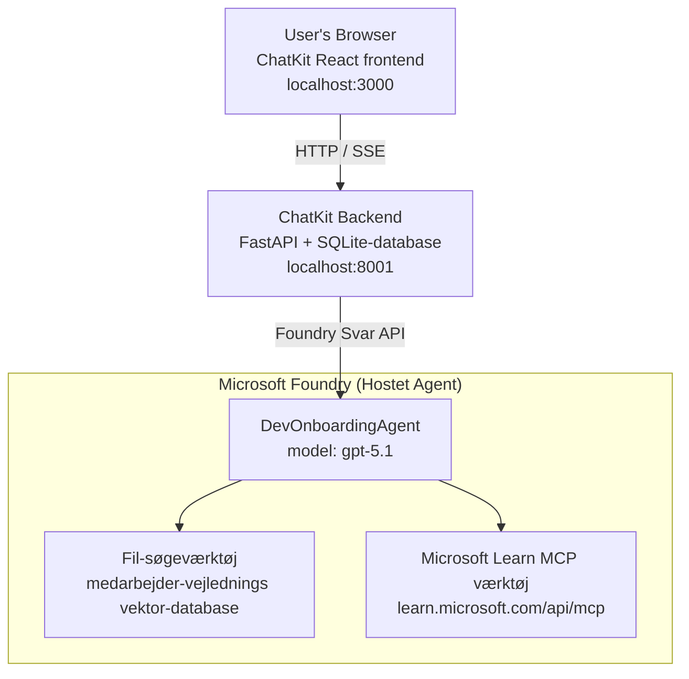

# Lektion 4: Agentudrulning med Microsoft Foundry Hosted Agents + ChatKit

Denne lektion demonstrerer, hvordan man udruller en værktøjsbrugende agent til Microsoft Foundry som en hosted agent og opretter en ChatKit-baseret frontend til at interagere med den.

## Arkitektur

Den hosted agent er en **enkelt `DevOnboardingAgent`** (kørende på `gpt-5.1`), som besvarer spørgsmål om onboarding af udviklere ved hjælp af to hosted værktøjer: et **File Search**-værktøj over medarbejderdirectorys vektorlageret og **Microsoft Learn MCP**-værktøjet. En ChatKit React frontend kommunikerer med en FastAPI backend, som kalder agenten gennem Foundry **Responses API**.



## Forudsætninger

1. **Microsoft Foundry Projekt** i North Central US-regionen
2. **Azure CLI** autentificeret (`az login`)
3. **Azure Developer CLI** (`azd`) installeret
4. **Python 3.12+** og **Node.js 18+**
5. **Vector Store** oprettet med medarbejderdata

## Hurtig start

### 1. Opsæt miljøvariabler

```bash
cd lesson-4-agentdeployment
cp .env.example .env
# Rediger .env med dine Microsoft Foundry projektoplysninger
```

### 2. Udrul den hosted agent

**Mulighed A: Brug Azure Developer CLI (Anbefalet)**

```bash
cd hosted-agent
azd auth login
azd agent deploy
```

**Mulighed B: Brug Docker + Azure Container Registry**

```bash
cd hosted-agent

# Byg containeren
docker build -t developer-onboarding-agent:latest .

# Mærke til ACR
docker tag developer-onboarding-agent:latest <your-acr>.azurecr.io/developer-onboarding-agent:latest

# Skub til ACR
az acr login --name <your-acr>
docker push <your-acr>.azurecr.io/developer-onboarding-agent:latest

# Udrul via Microsoft Foundry-portalen eller SDK'en
```

### 3. Start ChatKit-bagenden

```bash
cd chatkit-server
python -m venv .venv
source .venv/bin/activate  # På Windows: .venv\Scripts\activate
pip install -r requirements.txt
python app.py
```

Serveren starter på `http://localhost:8001`

### 4. Start ChatKit-frontenden

```bash
cd chatkit-server/frontend
npm install
npm run dev
```

Frontenden starter på `http://localhost:3000`

### 5. Test applikationen

Åbn `http://localhost:3000` i din browser og prøv disse forespørgsler:

**Medarbejdersøgning:**
- "Jeg er ny her! Har nogen arbejdet hos Microsoft?"
- "Hvem har erfaring med Azure Functions?"

**Læringsressourcer:**
- "Opret en læringssti for Kubernetes"
- "Hvilke certificeringer bør jeg tage for cloud-arkitektur?"

**Kodehjælp:**
- "Hjælp mig med at skrive Python-kode til at forbinde til CosmosDB"
- "Vis mig, hvordan man opretter en Azure Function"

**Multi-Agent Forespørgsler:**
- "Jeg starter som cloud engineer. Hvem skal jeg forbinde mig med, og hvad skal jeg lære?"

## Projektstruktur

```
lesson-4-agentdeployment/
├── .env.example                 # Environment variables template
├── implementation-plan.md       # Detailed implementation guide
├── README.md                    # This file
├── hosted-agent/               # Microsoft Foundry hosted agent
│   ├── main.py                 # Multi-agent workflow implementation
│   ├── requirements.txt        # Python dependencies
│   ├── Dockerfile              # Container definition
│   └── agent.yaml              # Agent deployment configuration
└── chatkit-server/             # ChatKit server application
    ├── app.py                  # FastAPI backend
    ├── store.py                # SQLite persistence layer
    ├── requirements.txt        # Python dependencies
    └── frontend/               # React frontend
        ├── package.json
        ├── vite.config.ts
        ├── tsconfig.json
        ├── index.html
        └── src/
            ├── main.tsx
            ├── App.tsx
            ├── App.css
            └── index.css
```

## Agenten og dens værktøjer

Den hosted agent er en **enkelt agent** (`DevOnboardingAgent`, defineret i `hosted-agent/main.py`), som håndterer tre onboarding-domæner. I stedet for at orkestrere separate sub-agenter eksponerer den hver kapabilitet som et værktøj (eller bruger modellen direkte):

| Kapabilitet | Hvordan det håndteres | Værktøj |
|-----------|------------------|------|
| **Medarbejdersøgning & forbindelser** | Foundry hosted File Search over medarbejderdirectorys vektorlager | `client.get_file_search_tool(vector_store_ids=[...])` |
| **Læring & træning** | Microsoft Learn MCP-server (hosted MCP-værktøj) | `client.get_mcp_tool(url="https://learn.microsoft.com/api/mcp")` |
| **Kodeassistance** | Håndteres direkte af `gpt-5.1` modellen — intet eksternt værktøj | — |

Agenten oprettes med `client.as_agent(name="DevOnboardingAgent", instructions=..., tools=[file_search_tool, learn_mcp_tool])` og serveres med `from_agent_framework(agent).run()`.

> **Designbemærkning.** Tidligere udkast til denne lektion brugte et `HandoffBuilder` multi-agent workflow (Triage → specialister). Den leverede agent er en enkelt værktøjsbrugende agent, hvilket er nemmere at udrulle og forstå for onboarding-stil Q&A. For et eksempel på multi-agent orkestrering og overdragelser, se Lektion 2 og Lektion 3.

## Røgtest af Hosted Agent (CI-port)

At udrulle en hosted agent "succesfuldt" beviser kun, at kontrolplanet accepterede
definitionen — det beviser **ikke** at agenten faktisk svarer. En manglende afhængighed,
dårlig modelroutning eller en udløbet forbindelse kan lade en grøn-men-tavs agent være.

Denne lektion leverer en letvægts **røgtest**, der fungerer som en hurtig, billig post-udrulningsport.
Den bruger [AI Smoke Test](https://github.com/marketplace/actions/ai-smoke-test)
GitHub Action til at POSTe prompts til agentens Foundry **Responses** endpoint
(`POST {project_endpoint}/agents/{agent_name}/endpoint/protocols/openai/responses`)
og fastslå på den returnerede tekst. Den opfanger ødelagte udrulninger, auth-regressioner,
system-prompt-drift og tråde-brud på sekunder.

> Røgtests er **ikke** en erstatning for de fulde evalueringer i
> [Lektion 3](../lesson-3-agent-evals/README.md) — de er et supplement. Røgtests
> svarer på *"er agenten tilgængelig, svarer og følger grundlæggende promptforventninger?"*;
> evalueringer svarer på *"hvor god er responsen?"*. Kør den billige port ved hver udrulning.

### Hvad testes

Kataloget findes i [`hosted-agent/tests/smoke-tests.json`](../../../lesson-4-agentdeployment/hosted-agent/tests/smoke-tests.json)
og tester agentens tre domæner plus prompt-overholdelse og multi-turn trådning:

| Test | Hvad den verificerer |
|------|------------------|
| `reachability` | Agent svarer med ikke-tom, relevant tekst |
| `employee-search` | File-search domæne returnerer en sund `200` (svaret afhænger af data) |
| `learning-path` | Læringsdomænet gentager emnet og producerer et sti-lignende svar |
| `coding-assistance` | Kodningsdomænet returnerer et kodet Python-svar |
| `prompt-adherence-offtopic` | Off-topic anmodning omdirigeres, ikke besvaret detaljeret |
| `threading-turn-1/2` | Samtaletilstand bevares på tværs af ture via `previous_response_id` |

### Kør det i CI

Workflown i [`.github/workflows/smoke-test-hosted-agent.yml`](../../../.github/workflows/smoke-test-hosted-agent.yml)
har to jobs:

- **`static`** — en hurtig, ingen-Azure port, der kører på alle pull requests og pushes:
  den kompilerer alle Python-kilder (`py_compile`) og kontrollerer Markdown-links. Ingen hemmeligheder
  kræves, så den fungerer på fork PRs.
- **`smoke`** — den Azure-forbundne røgtest nedenfor. Den kører efter behov
  (Actions → **Agent CI (static + smoke)** → Kør workflow) og kan kædes efter din
  udrulningsworkflow.

Konfigurer disse repository **variabler** og **hemmeligheder** for smoke-jobet:

| Type | Navn | Værdi |
|------|------|-------|
| Variabel | `FOUNDRY_PROJECT_ENDPOINT` | `https://<account>.services.ai.azure.com/api/projects/<project>` |
| Variabel | `HOSTED_AGENT_NAME` | Udrullet agentnavn (fx `dev-onboarding` — skal matche din udrulning) |
| Hemmelighed | `AZURE_CLIENT_ID` / `AZURE_TENANT_ID` / `AZURE_SUBSCRIPTION_ID` | OIDC fødereret identitet for `azure/login` |

Runner-identiteten skal have **`Azure AI User`** rollen på **Foundry projektomfang** for at kunne
kalde Responses (og conversations) data-plane endpoints. Giv tilladelsen med:

```bash
az role assignment create \
  --assignee <object-id-or-appId-of-runner-identity> \
  --role "Azure AI User" \
  --scope "/subscriptions/<sub>/resourceGroups/<rg>/providers/Microsoft.CognitiveServices/accounts/<account>/projects/<project>"
```

### Kør det lokalt

Du kan køre det samme katalog før du pusher. Skaff en data-plane token scoped til
`https://ai.azure.com/` og peg runneren på din udrulning:

```bash
# Publikum SKAL være https://ai.azure.com/ (cognitiveservices.azure.com tokens afvises)
export FOUNDRY_TOKEN=$(az account get-access-token --resource https://ai.azure.com/ --query accessToken -o tsv)

git clone https://github.com/JFolberth/ai-smoketest && cd ai-smoketest
python runner.py \
  --project-endpoint "https://<account>.services.ai.azure.com/api/projects/<project>" \
  --agent-name dev-onboarding \
  --tests-file ../lesson-4-agentdeployment/hosted-agent/tests/smoke-tests.json
```

Exit-koder: `0` alle bestået, `1` en assertion mislykkedes, `2` runner-fejl (dårligt katalog / token).

## Fejlfinding

### Agent svarer ikke
- Bekræft at den hosted agent er udrullet og kørende i Microsoft Foundry
- Kontroller at `HOSTED_AGENT_NAME` og `HOSTED_AGENT_VERSION` matcher din udrulning

### Vector store fejl
- Sikre at `VECTOR_STORE_ID` er sat korrekt
- Bekræft at vector store indeholder medarbejderdata

### Autentificeringsfejl
- Kør `az login` for at opdatere legitimationsoplysninger
- Sikre at du har adgang til Microsoft Foundry projektet

## Ressourcer

- [Microsoft Foundry Hosted Agents Dokumentation](https://learn.microsoft.com/en-us/azure/ai-foundry/agents/concepts/hosted-agents)
- [Microsoft Agent Framework](https://github.com/microsoft/agent-framework)
- [ChatKit Integrations Eksempel](https://github.com/microsoft/agent-framework/tree/main/python/samples/demos/chatkit-integration)
- [Azure Developer CLI](https://learn.microsoft.com/en-us/azure/developer/azure-developer-cli/overview)
- [AI Smoke Test GitHub Action](https://github.com/marketplace/actions/ai-smoke-test)
- [Smoke Test Microsoft Foundry Agents med GitHub Actions (blog)](https://techcommunity.microsoft.com/blog/azuredevcommunityblog/smoke-test-microsoft-foundry-agents-with-github-actions/4531912)

---

## Næste Skridt

Din agent kører på Microsoft-administreret infrastruktur. For at tage den i brug i enterprise produktion —
styre hvor dens data befinder sig (datatilhørsforhold, privat netværk, medbring din egen Azure
Cosmos DB / Storage / AI Search) og styre dens værktøjer — fortsæt til
**[Lektion 5: Produktions Hosted Agents](../lesson-5-hosted-agents-production/README.md)**, som
forklarer den afgørende forskel mellem **Hosted Agents** og **Capability Hosts**.

---

<!-- CO-OP TRANSLATOR DISCLAIMER START -->
**Ansvarsfraskrivelse**:
Dette dokument er blevet oversat ved hjælp af AI-oversættelsestjenesten [Co-op Translator](https://github.com/Azure/co-op-translator). Selvom vi bestræber os på nøjagtighed, skal du være opmærksom på, at automatiserede oversættelser kan indeholde fejl eller unøjagtigheder. Det originale dokument på dets oprindelige sprog bør betragtes som den autoritative kilde. For kritisk information anbefales professionel menneskelig oversættelse. Vi påtager os intet ansvar for misforståelser eller fejltolkninger, der opstår som følge af brugen af denne oversættelse.
<!-- CO-OP TRANSLATOR DISCLAIMER END -->