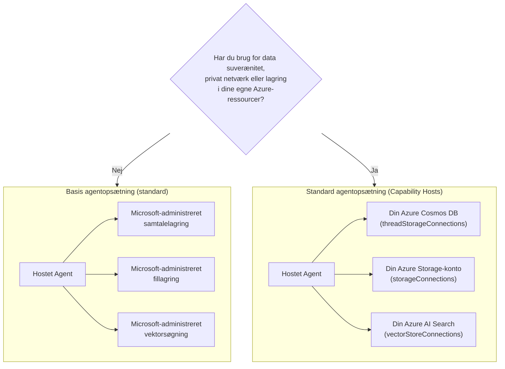

# Lektion 5: Produktions-hostede agenter — Lager, hukommelse & styring

I [Lektion 4](../lesson-4-agentdeployment/README.md) implementerede du Developer Onboarding
Agent som en **Microsoft Foundry Hosted Agent** og satte en ChatKit frontend foran den. Den
lektion svarede på *"hvordan sender jeg en agent?"*. Denne lektion svarer på de næste spørgsmål
i en virksomhed: **Hvor gemmes min agents data? Hvem kontrollerer den? Hvordan opfylder jeg overholdelse,
netværk og governance-krav?**

Den enkelt vigtigste idé i denne lektion er forskellen mellem en **Hosted Agent** og en
**Capability Host** — to begreber, som er lette at forveksle, men som løser helt forskellige
problemer.

## Læringsmål

Når du har gennemført denne lektion, vil du kunne:

- Forklare hvad en **Hosted Agent** giver dig (Microsoft-administreret eksekvering) og hvad den **ikke** gør.
- Forklare hvad en **Capability Host** er, og præcis hvornår du har brug for én.
- Vælge mellem **basal agentopsætning** (Microsoft-administreret lagring) og **standard agentopsætning**
  (bring-your-own Azure-ressourcer).
- Forstå hvordan **samtalehistorik, filuploads og vektorlager** gemmes, og hvordan
  man omdirigerer dem til din egen Azure Cosmos DB, Azure Storage og Azure AI Search.
- Anvende governance-kontroller: datasuverænitet, privat netværk og **godkendelse af Hosted MCP-værktøj**.

---

## Forudsætninger

1. Gennemført [Lektion 4](../lesson-4-agentdeployment/README.md) — du har en hosted agent implementeret.
2. Et **Microsoft Foundry** projekt, og en Azure-konto med tilladelse til at oprette ressourcer
   (Cosmos DB, Storage, Azure AI Search) og tildele roller i abonnementet/resourcegruppen.
3. **Azure CLI** autentificeret: `az login` (og `az account set --subscription <id>` hvis du har
   mere end ét abonnement).
4. **Azure Developer CLI** (`azd`) installeret — anvendes til standard-opsætnings provisionsflowet.
5. **Python 3.12+** med kursusafhængigheder installeret (`pip install -r ../requirements.txt`).
6. En aktuel, ikke-tilbagetrukket modelimplementering (for eksempel `gpt-5.1`). Undgå tilbagetrukne GPT-4o / GPT-4.1.

> Denne lektion er mest konceptuel og fokuseret på kontrolplanet. Du kan læse den fra ende til anden uden
> at provisionere noget, og derefter bruge øvelserne, når du er klar til at konfigurere en
> standardopsætning.

---

## 1. Hosted agenter: hvad Foundry styrer for dig

En **Hosted Agent** er en agent, hvis *eksekveringsmiljø* er fuldt administreret af Microsoft
Foundry Agent Service. Når du implementerer en hosted agent (som du gjorde i Lektion 4), leverer Foundry:

- **Compute** — runtime-miljøet, der eksekverer din agentkode og værktøjer.
- **Skalering** — replikeringer skalerer op og ned med belastningen (se `agent.yaml` `scale` i Lektion 4).
- **Identitet** — en administreret identitet til agenten, så den autentificerer mod Azure uden hemmeligheder.
- **Observabilitet** — sporing og telemetri (se Lektion 3's observabilitetsafsnit).
- **Sessionsstyring** — tråde/samtaler, så multi-turn chats "husker" tidligere runder.

> **Nøglepunkt:** Du behøver **ikke** at konfigurere en Capability Host blot for at *køre* en Hosted
> Agent. En hosted agent fungerer ud af boksen på Microsoft-administreret infrastruktur.

---

## 2. Hosted agenter vs Capability Hosts

**Hosted agenter og Capability Hosts løser forskellige problemer.**

**Hosted agenter** leverer det Microsoft-administrerede eksekveringsmiljø, inklusive compute, skalering,
identitet, observabilitet og sessionsstyring. Du behøver **ikke** Capability Hosts blot for at køre
en Hosted Agent.

**Capability Hosts** er kun nødvendige, når du ønsker Agent Service skal bruge **kundeejede
ressourcer** i stedet for Microsoft-administreret lagring. Hvis du er tilfreds med standard
Microsoft-administreret lagring, vektorsøgning og samtalepersistens, er **ingen Capability Host-
konfiguration nødvendig.**

Hvis din organisation kræver **datasuverænitet, privat netværk, compliance-kontroller eller
lagring i dine egne Azure Cosmos DB, Azure Storage Account og Azure AI Search-ressourcer**, så
konfigurerer du Capability Hosts til at forbinde Agent Service med disse ressourcer.

I én sætning:

> En **Hosted Agent** handler om *hvor din agent kører*. En **Capability Host** handler om *hvor din
> agents data er gemt*.

| Bekymring | Hosted Agent | Capability Host |
|---------|--------------|-----------------|
| Compute / skalering / identitet | ✅ Leveret | — |
| Observabilitet / sporing | ✅ Leveret | — |
| Samtale- & trådsessionsstyring | ✅ Leveret | Omdirigerer *hvor det gemmes* |
| Hvor samtalehistorik gemmes | Microsoft-administreret som standard | Din Azure Cosmos DB |
| Hvor uploadede filer gemmes | Microsoft-administreret som standard | Din Azure Storage Account |
| Hvor vektorindlejringer gemmes | Microsoft-administreret som standard | Din Azure AI Search |
| Krævet for at køre en agent? | ✅ Ja (det *er* agent-værten) | ❌ Nej — valgfrit |
| Krævet for datasuverænitet / BYO-lagring? | ❌ Ikke tilstrækkeligt alene | ✅ Ja |

---

## 3. Basal vs standard agentopsætning

Foundry beskriver de to datakonfigurationer som **basal** og **standard** agentopsætning.



### Hvornår man beholder basal opsætning (ingen Capability Host)

- Udvikling, prototyping og test.
- Interne værktøjer hvor Microsoft-administreret lagring opfylder din datapolitik.
- Du ønsker den hurtigste vej til en fungerende agent med mindst infrastruktur.

### Hvornår du har brug for standard opsætning (Capability Hosts)

- **Datasuverænitet** — alle agentdata skal blive i dit Azure-abonnement/region.
- **Sikkerhedskontrol** — du skal bruge dine egne lagringskonti, databaser og søgetjenester.
- **Overholdelse** — du har regulatoriske eller organisatoriske krav om, hvor data opbevares.
- **Privat netværk** — trafikken skal blive inden for dit virtuelle netværk (BYO virtuelt netværk).

> **Anbefaling fra Microsoft:** brug *separate* Foundry-konti/projekter til standard vs
> basal opsætning. Undgå at blande opsætningstyper i samme Foundry-konto.

---

## 4. Hvordan Capability Hosts fungerer

En **Capability Host** er en under-ressource, du konfigurerer på **to scopes**: Foundry
**konto** og Foundry **projekt**. Den fortæller Agent Service, hvor agentdata skal gemmes og behandles:
samtalehistorik, filuploads og vektorlager.

To regler er vigtigst:

1. **Konto før projekt.** Du kan ikke oprette et projekt capability host, medmindre et
   konto-niveau capability host allerede findes.
2. **Ingen arv af konfiguration.** Det **projekt**-niveau capability host er det, Agent Service
   rent faktisk læser for at bestemme, hvilke lager-/samtale-/vektor-ressourcer der skal bruges. Konto-niveau
   forbindelser anvendes *ikke* automatisk af et projekt — projekt capability host skal
   eksplicit referere til dem.

### Forbindelser en standardopsætning har brug for

Capability hosts refererer til **forbindelser** (oprettet i din Foundry konto/projekt), som peger på
dine Azure-ressourcer:

| Capability host-egenskab | Gemmer | Din Azure-ressource |
|--------------------------|--------|---------------------|
| `threadStorageConnections` | Agentdefinitioner + samtalehistorik | Azure Cosmos DB |
| `storageConnections` | Filuploads / blob-lagring | Azure Storage Account |
| `vectorStoreConnections` | Vektorindlejringer til hentning/søgning | Azure AI Search |
| `aiServicesConnections` *(valgfri)* | Dine egne modelimplementeringer | Azure OpenAI |

Hver forbindelse skal have `authType`, `category`, `target` (servicens **endpoints-URL**, ikke
resource ID) og `metadata.ResourceId` (den fulde Azure resource ID) udfyldt, ellers kan Agent Service
ikke løse ressourcen ved runtime.

### Konfigurering af capability hosts (kontrolplan)

Capability hosts administreres aktuelt via **Azure Resource Manager REST API** (der findes ikke
et SDK til capability host-styring endnu). Først opretter du **konto** capability host:

```http
PUT https://management.azure.com/subscriptions/{subscriptionId}/resourceGroups/{rg}/providers/Microsoft.CognitiveServices/accounts/{account}/capabilityHosts/{name}?api-version=2025-06-01

{
  "properties": { "capabilityHostKind": "Agents" }
}
```

Derefter opretter du **projekt** capability host, som refererer til dine forbindelser:

```http
PUT https://management.azure.com/subscriptions/{subscriptionId}/resourceGroups/{rg}/providers/Microsoft.CognitiveServices/accounts/{account}/projects/{project}/capabilityHosts/{name}?api-version=2025-06-01

{
  "properties": {
    "capabilityHostKind": "Agents",
    "threadStorageConnections": ["my-cosmosdb-connection"],
    "vectorStoreConnections":  ["my-ai-search-connection"],
    "storageConnections":      ["my-storage-connection"]
  }
}
```

> **Begrænsninger at huske:**
> - **Én capability host per scope.** En anden på samme scope returnerer `409 Conflict`.
> - **Ingen opdateringer.** For at ændre konfiguration skal capability host **slettet og oprettes igen**.
> - **Sletning er destruktiv.** Sletning af en capability host fjerner agenters adgang til filer,
>   samtaler og vektorlager den pegede på.

### Bekræft at det virker

Efter konfiguration, kør en test-samtale og bekræft at:

- Samtaler fremstår i **din Azure Cosmos DB**.
- Uploadede filer fremstår i **din Azure Storage-konto**.
- Vektordata fremstår i **dit Azure AI Search-indeks**.

---

## 5. Hukommelse & kontekststyring

"Sessionsstyring" (en Hosted Agent-funktion) og "hvor tråde gemmes" (en Capability Host
bekymring) kombineres for at give din agent **hukommelse**:

- En **tråd** (samtale) indeholder de ordnede chat-runder. Responses API tråder kald
  sammen via `previous_response_id` (du så dette i Lektion 4 røgtestene).
- På **basal opsætning** lever tråd-/samtaletilstand i Microsoft-administreret lagring.
- På **standard opsætning** persisteres samme tilstand til **din Azure Cosmos DB** via
  `threadStorageConnections` — hvilket giver holdbar, forespørgbar, suveræn samtalehistorik.

Dette er forskellen mellem en agent, der "husker inden for en session" og et virksomheds-
system, hvor hver samtale gemmes i din egen compliance-grænse.

---

## 6. Governance & sikkerhedstjekliste

Brug denne tjekliste, når du fremmer en hosted agent fra prototype til produktion:

- [ ] **Beslut basal vs standard opsætning** med spørgsmålene i §3 — dokumentér beslutningen.
- [ ] **Datasuverænitet:** hvis krævet, konfigurer Capability Hosts så samtalehistorik
      (Cosmos DB), filer (Storage) og vektorer (AI Search) forbliver i dit abonnement/region.
- [ ] **Privat netværk:** for standardopsætning, begræns trafik med Bring Your Own Virtual
      Network, så data ikke kan forlade dit netværk (hjælper med at forhindre dataexfiltration).
- [ ] **RBAC:** giv mindst tilladelse. Oprettelse af capability hosts kræver **Contributor** på
      Foundry-kontoen; tildeling af adgang til dine Azure-ressourcer kræver **User Access Administrator**
      eller **Owner**.
- [ ] **Hosted MCP-værktøjsstyring:** gennemgå hver MCP-server din agent kan kalde og sæt en
      **godkendelsestilstand** (se §7). Udsæt aldrig et uanmeldt eksternt værktøj til en produktionsagent.
- [ ] **Observabilitet:** bekræft sporing/telemetri er aktiveret (Lektion 3), så du kan auditere værktøjskald.
- [ ] **Omkostninger:** BYO-ressourcer (Cosmos DB, AI Search, Storage) faktureres til *dit* abonnement —
      vær størrelse og overvåg dem. Basal opsætning indlejrer lagring i den administrerede service.

---

## 7. Hosted MCP-værktøjer & godkendelsesworkflows

Developer Onboarding Agent i Lektion 4 bruger allerede et **Hosted MCP-værktøj** — den
[Microsoft Learn MCP-server](https://learn.microsoft.com/api/mcp) — tilføjet med:

```python
client.get_mcp_tool(
    name="Microsoft Learn MCP",
    url="https://learn.microsoft.com/api/mcp",
    approval_mode="never_require",
)
```

**Model Context Protocol (MCP)** er en åben standard, der lader en agent opdage og kalde
eksterne værktøjer via en ensartet grænseflade. **Hosted MCP-værktøjer** lader Foundry kalde en MCP-server på
agentens vegne. To governance-håndtag er vigtige i produktion:

- **`approval_mode`** — kontrollerer om en menneskelig bruger/caller skal godkende hvert værktøjskald.
  - `never_require` er praktisk for en betroet, read-only server som Microsoft Learn.
  - For servere, der kan **skrive** eller nå følsomme systemer, kræves godkendelse, så kaldet
    gennemgås, før det udføres. Dette er din **godkendelsesworkflow**.
- **Server tilladelsesliste** — tilslut kun MCP-servere, du har gennemgået og har tillid til. Behandl en MCP
  URL som en anden produktionsafhængighed.

> **Prøv det:** ændr `approval_mode` på Lektion 4-agenten til at kræve godkendelse, implementer igen, og
> observer hvordan værktøjskald nu pauser for bekræftelse, før de kører.

---

## Praktiske øvelser

1. **Klassificer et scenarie.** For hver af disse, beslut *basal* eller *standard* opsætning og begrund:
   (a) en hackathon-demo, (b) en onboarding-assistent til sundhedssektoren der håndterer PII, (c) en intern
   FAQ-bot, (d) en bankagent der skal holde alt data inden for regionen.
2. **Kortlæg lagringen.** For Lektion 4-agenten, list hvilken capability-host-egenskab der ville gemme
   dens (a) chat-historik, (b) uploadede medarbejderfiler, (c) vektorindlejringer.
3. **Design en godkendelsesworkflow.** Tilføj et hypotetisk "opret Jira ticket" MCP-værktøj til agenten.
   Hvilken `approval_mode` ville du vælge og hvorfor?
4. **Omkostningsafvejning.** Skriv to eller tre sætninger om omkostningsimplikationerne ved at gå fra basal
   til standard opsætning for en agent med høj trafik.

---

## Ressourcer

- [Capability hosts — Microsoft Foundry](https://learn.microsoft.com/azure/foundry/agents/concepts/capability-hosts)
- [Standard agent setup (indbygget enterprise readiness)](https://learn.microsoft.com/azure/foundry/agents/concepts/standard-agent-setup)
- [Brug dine egne ressourcer](https://learn.microsoft.com/azure/foundry/agents/how-to/use-your-own-resources)

- [Opsæt dit agentmiljø (basis vs standard)](https://learn.microsoft.com/azure/foundry/agents/environment-setup)
- [Opsæt privat netværk for Foundry Agent Service](https://learn.microsoft.com/azure/foundry/agents/how-to/virtual-networks)
- [Tilføj en forbindelse til dit projekt](https://learn.microsoft.com/azure/foundry/how-to/connections-add)
- [Microsoft Learn MCP-server](https://learn.microsoft.com/training/support/mcp)
- [Model Context Protocol](https://modelcontextprotocol.io/)

---

**Forrige:** [Lektion 4 — Agent-implementering](../lesson-4-agentdeployment/README.md) &nbsp;·&nbsp; **Næste:** [Lektion 6 — Microsoft Toolbox](../lesson-6-toolbox/README.md)

---

<!-- CO-OP TRANSLATOR DISCLAIMER START -->
**Ansvarsfraskrivelse**:
Dette dokument er blevet oversat ved hjælp af AI-oversættelsestjenesten [Co-op Translator](https://github.com/Azure/co-op-translator). Selvom vi bestræber os på nøjagtighed, skal du være opmærksom på, at automatiserede oversættelser kan indeholde fejl eller unøjagtigheder. Det originale dokument på dets oprindelige sprog bør betragtes som den autoritative kilde. For kritisk information anbefales professionel menneskelig oversættelse. Vi påtager os intet ansvar for misforståelser eller fejltolkninger, der opstår som følge af brugen af denne oversættelse.
<!-- CO-OP TRANSLATOR DISCLAIMER END -->