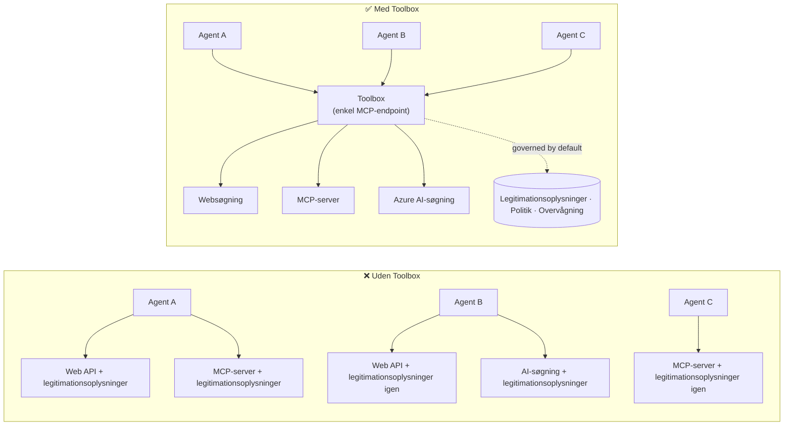

# Lektion 6: Microsoft Toolbox — Styrede værktøjer til agenter

Med [Lektion 5](../lesson-5-hosted-agents-production/README.md) kører din hosted agent i
produktion med den lager- og styrelsesposition, din organisation har brug for. Men kig tilbage på
Lektion 4 agenten: hvert værktøj var **hardcodet** i `main.py` — Microsoft Learn MCP URL'en,
fil-søgnings vektorlageret osv. Det virker for én agent. Det skalerer **ikke** til en
organisation med mange agenter og teams.

Denne lektion introducerer **Microsoft Toolbox**: måden Foundry lader dig definere et kurateret sæt
værktøjer **én gang**, administrere dem **centralt**, og eksponere dem til enhver agent gennem en **enkel,
styret endpoint**.

## Læringsmål

Ved slutningen af denne lektion vil du kunne:

- Forklare værktøjsspredningsproblemet, som Toolbox løser.
- Beskrive **Build** og **Consume** søjlerne samt de værktøjstyper, en toolbox kan indeholde.
- **Bygge** en toolbox-version med Foundry SDK.
- **Forbruge** en toolbox fra en Microsoft Agent Framework hosted agent via en enkelt MCP endpoint.
- Bruge **versionering** til at udsende værktøjsændringer uden kodeændringer eller genudrulning af agenten.
- Anvende **styring**: RBAC, loginoplysninger injection, og guardrail (RAI) politikker.

---

## Forudsætninger

1. Færdiggjort [Lektion 4](../lesson-4-agentdeployment/README.md) og ideelt set
   [Lektion 5](../lesson-5-hosted-agents-production/README.md).
2. Et **Microsoft Foundry** projekt med tilladelse til at oprette og administrere toolbox-ressourcer.
3. **Azure CLI** autentificeret: `az login`. Foundry toolbox API'erne kræver
   `https://ai.azure.com/.default` token scope (vist i koden nedenfor).
4. **Python 3.12+** med kursusafhængigheder installeret (`pip install -r ../requirements.txt`).
5. En aktuel, ikke tilbagetrukket modeludrulning (for eksempel `gpt-5.1`). Undgå tilbagetrukne GPT-4o / GPT-4.1.

---

## 1. Problemet: værktøjsspredning

En enkelt agent kan afhænge af mange værktøjer — REST API'er, MCP servere, connectorer og flows — hver
med sin egen autentificeringsmodel og tilknyttede team. Når du skalerer på tværs af en organisation:

- Teams **implementerer de samme værktøjer igen** uafhængigt.
- **Loginoplysninger bliver duplikeret** over agenter og repositories.
- **Styring bliver inkonsekvent** — hver agent håndhæver (eller glemmer) politik på egen hånd.
- Der er **begrænset indsigt** i hvilke værktøjer, der eksisterer eller hvem der bruger dem.

Udviklere stopper op — ikke fordi modellerne ikke er i stand, men fordi **værktøjsintegration bliver
flaskehalsen**.



Virksomheder har allerede infrastrukturen — gateways, credential vaults, politikker, observabilitet.
Det, der manglede, var en udvikleroplevelse, som pakker det i noget, der er **genbrugeligt,
opdageligt, og styret som standard**. Det er Toolbox.

---

## 2. Hvad en Toolbox er

En **Toolbox** er en **styret Foundry-ressource**. Du definerer ét kurateret sæt værktøjer,
administrerer dem centralt i Foundry, og eksponerer dem gennem **en enkelt MCP-kompatibel endpoint**, som enhver
agent kan bruge. I runtime håndterer platformen **loginoplysninger injection, tokenopdatering, og
virksomheds-politikhåndhævelse**.

Fordi en toolbox er en styret ressource, kan du tilføje, fjerne eller omkonfigurere værktøjer **uden
at ændre kode i din agent** — agenten forbindes altid til den samme endpoint.

Toolbox dækker værktøjslivscyklussen gennem fire søjler; **Build** og **Consume** er tilgængelige
i dag:

| Søjle | Status | Hvad den muliggør |
|--------|--------|-----------------|
| **Build** | Tilgængelig i dag | Vælg værktøjer, konfigurer autentificering centralt, publicer en genanvendelig toolbox som ethvert team kan bruge. |
| **Consume** | Tilgængelig i dag | Forbind enhver agent til én MCP-kompatibel endpoint for dynamisk at finde og anvende alle værktøjer i toolboxen. |

Forbrugsoverfladen er **åben**: enhver MCP-kompatibel runtime eller klient kan bruge en toolbox —
Microsoft Agent Framework, LangGraph, GitHub Copilot, Claude Code, Microsoft Copilot Studio, eller
brugerdefineret kode.

### Værktøjstyper en toolbox kan indeholde

Web Search · MCP · Azure AI Search · Code Interpreter · File Search · OpenAPI · **Agent-til-Agent
(A2A)** · Fabric IQ · Tool Search · Work IQ · Browser Automation · Skill referencer, plus en
**Guardrail (RAI) politik** anvendt på toolboxlaget.

> **Tip:** Tilføj en `description` til **hvert** værktøj, så modellen kan vælge det rette. En toolbox
> tillader maksimalt **ét unavngivet værktøj pr. type** — giv hvert ekstra eksemplar af samme type et
> unikt `name`, ellers får du en `invalid_payload` fejl.

---

## 3. Byg en toolbox

Toolboxes administreres med Foundry SDK’erne (Python/.NET/JavaScript), REST API, `azd`, og
**Microsoft Foundry Toolkit for VS Code**. Her er Python (`azure-ai-projects`) mønstret:

```python
from azure.identity import DefaultAzureCredential
from azure.ai.projects import AIProjectClient
from azure.ai.projects.models import MCPTool, ToolboxSearchPreviewTool, WebSearchTool

endpoint = "https://<your-foundry-account>.services.ai.azure.com/api/projects/<your-project>"
project = AIProjectClient(endpoint=endpoint, credential=DefaultAzureCredential())

toolbox_version = project.toolboxes.create_toolbox_version(
    name="agent-tools",
    description="Web search + an MCP server + tool search",
    tools=[
        WebSearchTool(),
        MCPTool(
            server_label="myserver",
            server_url="https://your-mcp-server.example.com",
            require_approval="never",
            project_connection_id="my-key-auth-connection",  # legitimationsoplysninger findes i Foundry
        ),
        ToolboxSearchPreviewTool(),
    ],
)
print(f"Created toolbox: {toolbox_version.name}, version: {toolbox_version.version}")
```

Læg mærke til hvad du **ikke** gør: ingen hemmeligheder i agenten. Credentials opbevares af en Foundry
**forbindelse** (`project_connection_id`) og indsprøjtes af platformen ved kaldtidspunkt.

> **Preview note.** Toolbox **styring** (oprettelse/opdatering af versioner) er en preview-funktion.
> `project.toolboxes.*` operationerne vist ovenfor findes i preview SDK builds, REST API, `azd`,
> og **Foundry Toolkit for VS Code** — de er **ikke** i den pinnede `azure-ai-projects`, som bruges
> andre steder i dette kursus. Se kodesnippet ovenfor som formen for Build-trinnet; for en
> klik-gennem vej, opret toolboxen i **Foundry portalen** eller **Foundry Toolkit**. 
> **Consume** trinnet nedenfor virker med kursusets pinnede SDK i dag.

---

## 4. Forbrug en toolbox fra din agent

En toolbox eksponerer en **MCP endpoint**. Der er to mønstre:

| Rolle | Endpoint | Hvornår at bruge |
|------|----------|------------------|
| **Toolbox forbruger** | `{project_endpoint}/toolboxes/{name}/mcp?api-version=v1` | Forbind agenter. Server altid **standardversionen**. |
| **Toolbox udvikler** | `{project_endpoint}/toolboxes/{name}/versions/{version}/mcp?api-version=v1` | Test en specifik version før promovering. |

> **Forbind agenter til *forbruger* endpoint.** Fordi den altid server standardversionen, kan du
> promovere nye versioner **uden at ændre agentkode eller genudrulle**.

### Integration med en Microsoft Agent Framework hosted agent

Husk, Lektion 4 agenten tilføjede et enkelt hardcodet MCP værktøj med `client.get_mcp_tool(...)`. Med
Toolbox peger du i stedet **én** `MCPStreamableHTTPTool` mod toolbox endpointet — og agenten
får **alle** værktøjer i toolboxen, styret centralt:

```python
import httpx
from azure.identity import DefaultAzureCredential, get_bearer_token_provider
from agent_framework import MCPStreamableHTTPTool

# Auth: Foundry toolbox kræver https://ai.azure.com/.default scope
credential = DefaultAzureCredential()
token_provider = get_bearer_token_provider(credential, "https://ai.azure.com/.default")
http_client = httpx.AsyncClient(auth=_ToolboxAuth(token_provider), timeout=120.0)

TOOLBOX_ENDPOINT = os.environ["TOOLBOX_ENDPOINT"]  # platform-injiceret ved kørselstidspunktet

mcp_tool = MCPStreamableHTTPTool(
    name="toolbox",
    url=TOOLBOX_ENDPOINT,
    http_client=http_client,
    load_prompts=False,
)

agent = chat_client.as_agent(
    name="my-toolbox-agent",
    instructions="You are a helpful assistant with access to Foundry toolbox tools.",
    tools=[mcp_tool],
)
```

Tilsvarende `.env` (bemærk: brug en **aktuel** model som `gpt-5.1`, **ikke** den tilbagetrukne
`gpt-4o`):

```env
FOUNDRY_PROJECT_ENDPOINT=https://<account>.services.ai.azure.com/api/projects/<project>
TOOLBOX_ENDPOINT=https://<account>.services.ai.azure.com/api/projects/<project>/toolboxes/agent-tools/mcp?api-version=v1
AZURE_AI_MODEL_DEPLOYMENT_NAME=gpt-5.1
```

> **Bekræft først.** Før du forbinder hele agenten, forbind en MCP klient SDK (`pip install mcp`) til
> den **versionsspecifikke** endpoint og list værktøjerne for at bekræfte, at de loader som forventet.

### Kør consume-eksemplet

Denne lektion leveres med et kørbart consume-side eksempel, [`toolbox_agent.py`](../../../lesson-6-toolbox/toolbox_agent.py). Det bruger
det samme `FoundryChatClient.get_mcp_tool(...)` mønster, du lærte i Lektion 2, men peger det ene
MCP værktøj mod din **toolbox** endpoint — så agenten får hvert styret værktøj i toolboxen:

```bash
# I din .env skal du sætte TOOLBOX_ENDPOINT til dit toolbox forbruger-endpoint, og derefter:
python lesson-6-toolbox/toolbox_agent.py
```

Åbn den udskrevne `http://localhost:8096` URL og stil et spørgsmål, der bruger et af dine
toolbox's værktøjer. Tilføj eller opgrader et værktøj i toolboxen og spørg igen — **uden at ændre denne
kode** — for at se central styring og versionering i aktion.

---

## 5. Versionering: udsend værktøjsændringer sikkert

Toolbox versionering giver dig eksplicit kontrol over, hvornår ændringer træder i kraft:

1. **Opret** en ny toolbox version med det opdaterede værktøjssæt.
2. **Test** den mod den versionsspecifikke (udvikler) endpoint.
3. **Promover** den til `default_version`, når du er klar.

Hver agent, der peger på **forbruger** endpoint, får automatisk den promoverede version — **ingen
kodeændringer, ingen genudrulning**. (Den første version, du opretter, promoveres automatisk til standard.)

Dette er værktøjs-styringens svar på blue/green-udrulning: du validerer en ændring isoleret,
og skifter derefter standardversionen for alle forbrugere på én gang.

---

## 6. Styring: hvordan Toolbox forbedrer kontrol

Toolbox er **styret som standard**. De styringsgreb, du bør kende:

- **RBAC.** Tildel **Foundry User**-rollen på projektet til hver identitet: den **udvikler**, der
  administrerer toolbox versioner, **agentens styrede identitet** (for hosted agenter, der kalder værktøjer ved
  runtime), og for OAuth flows, den **slutbruger**, hvis identitet proxieres.
- **Centraliserede loginoplysninger.** Værktøjs loginoplysninger bor i Foundry **forbindelser**, ikke i agentkode
  eller `.env` filer. Platformen indsætter dem og opdaterer tokens ved runtime.
- **Guardrails (RAI politik).** Tilknyt en navngivet ansvarlig AI-politik til en toolbox version via
  `policies.rai_config.rai_policy_name`. Den kører på **toolbox-laget**, uafhængigt af enhver
  modelniveau indholdsfilter, hvor den screen'er værktøjs input og output.
- **MCP godkendelse.** Per-værktøj `require_approval` kontrollerer om et MCP værktøjskald kræver godkendelse —
  det samme godkendelsesworkflow-koncept du så i [Lektion 5 §7](../lesson-5-hosted-agents-production/README.md#7-hosted-mcp-tools--approval-workflows).
- **Privat netværk.** Toolbox understøtter virtuelle netværkskonfigurationer for virksomheder, der
  holder trafik inden for deres netværk.
- **Synlighed.** Fordi værktøjer katalogiseres centralt, får du endelig et overblik over hvad
  der findes, og hvem der bruger det.

---

## Praktiske øvelser

1. **Refaktorér Lektion 4.** Lektion 4 agenten hardcoder Microsoft Learn MCP værktøjet. Lav et skitseforslag til, hvordan du
   flytter det værktøj til en `agent-tools` toolbox og omdirigerer `main.py` til toolbox forbruger
   endpoint. Hvilke ændringer sker i `main.py`? Hvad lever ikke længere der?
2. **Design en versionstigning.** Du skal tilføje et Web Search-værktøj i en live toolbox, som bruges af fem
   agenter. Beskriv create → test → promotér rækkefølgen og forklar, hvorfor ingen af de fem agenter
   behøver genudrulles.
3. **Vælg autentifikationsidentiteterne.** For en hosted agent, der kalder et OAuth-baseret MCP værktøj via en
   toolbox, list hvilke identiteter der har brug for **Foundry User**-rollen og hvorfor.
4. **Guardrail placering.** Forklar forskellen mellem et modelniveau indholdsfilter og en
   toolbox guardrail, og giv et scenarie, hvor du specifikt har brug for toolbox guardrail.

---

## Ressourcer

- [Opret, test og deploy en toolbox i Foundry](https://learn.microsoft.com/azure/foundry/agents/how-to/tools/toolbox)
- [Værktøjskatalog — Foundry Agent Service](https://learn.microsoft.com/azure/foundry/agents/concepts/tool-catalog)
- [Microsoft Agent Framework — Microsoft Foundry provider (værktøjer)](https://learn.microsoft.com/agent-framework/agents/providers/microsoft-foundry)
- [Guardrails oversigt](https://learn.microsoft.com/azure/foundry/guardrails/guardrails-overview)
- [Kom i gang med Foundry i VS Code (Foundry Toolkit)](https://learn.microsoft.com/azure/ai-foundry/how-to/develop/get-started-projects-vs-code)
- [Model Context Protocol](https://modelcontextprotocol.io/)

---

**Forrige:** [Lektion 5 — Produktion Hosted Agents](../lesson-5-hosted-agents-production/README.md)
&nbsp;·&nbsp; **Næste:** [Lektion 7 — Multi-Agent & A2A](../lesson-7-multi-agent-a2a/README.md)

---

<!-- CO-OP TRANSLATOR DISCLAIMER START -->
**Ansvarsfraskrivelse**:
Dette dokument er blevet oversat ved hjælp af AI-oversættelsestjenesten [Co-op Translator](https://github.com/Azure/co-op-translator). Selvom vi bestræber os på nøjagtighed, skal du være opmærksom på, at automatiserede oversættelser kan indeholde fejl eller unøjagtigheder. Det originale dokument på dets oprindelige sprog bør betragtes som den autoritative kilde. For kritisk information anbefales professionel menneskelig oversættelse. Vi påtager os intet ansvar for misforståelser eller fejltolkninger, der opstår som følge af brugen af denne oversættelse.
<!-- CO-OP TRANSLATOR DISCLAIMER END -->