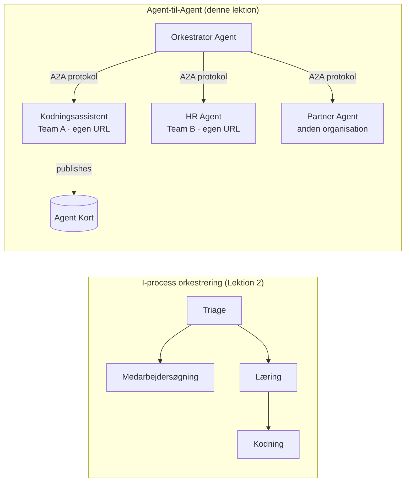

# Lektion 7: Multi-agent Orkestrering & Agent-til-Agent (A2A)

Med [Lektion 6](../lesson-6-toolbox/README.md) kan du bygge styrede værktøjer og hostede agenter.
Men reelle systemer bruger sjældent **én** agent. Når du skalerer, sætter du **mange** agenter sammen — nogle du
ejer, nogle ejet af andre teams, nogle der kører i helt andre organisationer. Denne lektion handler om,
hvordan agenter arbejder **sammen**.

Du mødte allerede en form for multi-agent design i
[Lektion 2's `agent-orchestration.py`](../lesson-2-agent-development/README.md): **handoff**
mønsteret, hvor en triage-agent ruter til specialister **inden for en enkelt proces**. Denne lektion går
et niveau op — til **Agent-til-Agent (A2A)**, den åbne protokol for agenter, der kører som uafhængige
**netværkede tjenester** og kalder hinanden på tværs af proces-, team- og organisationsgrænser.

## Læringsmål

Ved slutningen af denne lektion vil du kunne:

- Forklare forskellen mellem **in-process orkestrering** (handoff/workflows) og
  **Agent-til-Agent (A2A)** kommunikation, og vælge den rette.
- Beskrive A2A byggeklodserne: **Agent Card**, **færdigheder**, **opgaver** og **opdagelse**.
- **Eksponere** en Microsoft Agent Framework agent som en A2A service med `A2AExecutor`.
- **Forbruge** en fjernagent som en netværkspeer med `A2AAgent`.
- Anvende virksomhedshensyn til A2A: **sikkerhed, identitet, styring, observerbarhed og omkostning**.

---

## Forudsætninger

1. Afsluttet [Lektion 2](../lesson-2-agent-development/README.md) (agentudvikling & orkestrering).
2. Et **Microsoft Foundry** projekt med en aktuel modeludrulning (for eksempel `gpt-5.1` og
   `gpt-5-codex` for kodningseksemplet). Undgå pensionerede GPT-4o / GPT-4.1.
3. **Azure CLI** autentificeret: `az login`.
4. **Python 3.12+** med kursusafhængigheder installeret (`pip install -r ../requirements.txt`).
   Lektion 7 tilføjer preview-pakkerne `agent-framework-a2a`, `a2a-sdk` og `uvicorn`.
5. `FOUNDRY_PROJECT_ENDPOINT` og `FOUNDRY_MODEL` sat i din `.env` (se kursus-README).

---

## 1. To måder agenter arbejder sammen på

Der findes ikke ét enkelt "multi-agent" mønster. Vælg det der passer til din **grænse**:

| Mønster | Hvor agenter kører | Hvordan de forbinder | Brug når |
|---------|------------------|------------------|----------|
| **Handoff / Workflow** (Lektion 2) | En proces, én kodebase | In-memory graf (`HandoffBuilder`, `WorkflowBuilder`) | Du ejer alle agenterne og deployer dem sammen. |
| **Agent-til-Agent (A2A)** (denne lektion) | Separate tjenester, separate livscyklusser | Åben **A2A protokol** over HTTP, opdaget via **Agent Cards** | Agenter ejes af forskellige teams/orgs, skalerer uafhængigt, eller er skrevet i forskellige frameworks. |

Handoff handler om **routing inden for en applikation**. A2A handler om **at sammensætte agenter som
uafhængige services** — agent-ækvivalenten til at gå fra funktionskald til mikrotjenester.



> **De sammensætter.** En orkestrator du bygger med `HandoffBuilder` kan have **fjern A2A agenter**
> som deltagere — in-process routing til services, der selv kører hvor som helst.

---

## 2. A2A byggeklodserne

A2A er en **åben protokol** (ikke Microsoft-specifik), så en A2A agent kan forbruges af Microsoft
Agent Framework, LangGraph, custom kode eller en anden virksomheds stack. Fire begreber er vigtige:

- **Agent Card** — et lille JSON-dokument, publiceret på
  `/.well-known/agent-card.json`, der annoncerer agentens **navn, beskrivelse, URL, version,
  færdigheder og kapabiliteter**. Det er sådan en klient **opdager** hvad en fjern agent kan.
- **Færdigheder** — de erklærede ting agenten kan (`id`, `navn`, `beskrivelse`, `tags`,
  `eksempler`). Klienter (og modeller) bruger disse til at afgøre, om de skal kalde den.
- **Opgaver** — et kald til en A2A agent er en **opgave** med livscyklus (indsendt → arbejde →
  fuldført/fejlet). Serveren følger opgaver i et **opgave-lager**; streaming-opdateringer understøttes.
- **Opdagelse** — en klient, der kun får en URL, henter Agent Card og ved, hvordan agenten kaldes.

---

## 3. Eksponer en agent som en A2A service — `a2a_server.py`

**Bygge/serve**-siden pakker enhver Microsoft Agent Framework agent ind med `A2AExecutor` og monterer den
på en A2A HTTP applikation. Se [`a2a_server.py`](../../../lesson-7-multi-agent-a2a/a2a_server.py). Den centrale sammenkobling:

```python
from agent_framework.a2a import A2AExecutor
from a2a.server.apps import A2AStarletteApplication
from a2a.server.request_handlers import DefaultRequestHandler
from a2a.server.tasks import InMemoryTaskStore
from a2a.types import AgentCapabilities, AgentCard, AgentSkill

agent = client.as_agent(name="coding-assistant", instructions="...")

agent_card = AgentCard(
    name="Coding Assistant",
    description="Generates runnable code samples...",
    url="http://localhost:9000/",
    version="1.0.0",
    capabilities=AgentCapabilities(streaming=True),
    default_input_modes=["text"],
    default_output_modes=["text"],
    skills=[AgentSkill(id="generate-code", name="Generate code",
                       description="Write a runnable code snippet.", tags=["code"])],
)

request_handler = DefaultRequestHandler(
    agent_executor=A2AExecutor(agent),
    task_store=InMemoryTaskStore(),
)
app = A2AStarletteApplication(agent_card=agent_card, http_handler=request_handler).build()
# serveret med uvicorn på port 9000
```

Bemærk at agent-koden er **uændret** — `A2AExecutor` tilpasser din eksisterende agent til protokollen.
Agent Card er det, der gør den **opdagelig** for enhver A2A klient.

---

## 4. Forbrug en fjern agent — `a2a_client.py`

**Forbruge**-siden forbinder til en fjern agent **via URL**, henter dens Agent Card og kalder den
præcis som en lokal agent. Se [`a2a_client.py`](../../../lesson-7-multi-agent-a2a/a2a_client.py):

```python
from agent_framework.a2a import A2AAgent

remote_agent = A2AAgent(name="remote-coding-assistant", url="http://localhost:9000")
result = await remote_agent.run("Write a Python function that reverses a string.")
print(result.text)
```

Det er hele pointen med A2A: fra kaldersiden opfører en fjern agent sig som enhver anden
`agent_framework` agent, så du kan droppe den ind i en workflow eller videresende til den — selvom
den kører i en anden proces, på en anden maskine, ejet af et andet team.

### Kør det end-to-end

```bash
# Terminal 1 — start A2A-tjenesten
python a2a_server.py

# Terminal 2 — kald den
python a2a_client.py "Write a Python function that reverses a string."
```

Du vil se svar fra kodningsassistenten ankomme over A2A protokollen. Åbn
`http://localhost:9000/.well-known/agent-card.json` i en browser for at se den publicerede Agent Card.

---

## 5. Virksomhedsbekymringer

At gøre agenter til netværkede tjenester medfører de samme bekymringer som ethvert distribueret system —
plus nogle AI-specifikke:

- **Identitet & autentifikation.** Aldrig eksponer en A2A agent uden autentifikation. Agent Card bærer
  `sikkerhed` / `security_schemes`, og `A2AAgent` accepterer en `auth_interceptor`, så kaldere tilføjer
  legitimationsoplysninger (OAuth bearer tokens, API-nøgler). Brug Entra ID / managed identities til
  service-til-service autentifikation i produktion; sæt servicen bag en gateway.
- **Styring.** Kombiner A2A med [Lektion 6's Toolbox](../lesson-6-toolbox/README.md): en fjern
  agent kan publiceres som et **A2A værktøj** inde i en styret toolbox, så RBAC, legitimationsinjektion
  og guardrail-politikker anvendes centralt.
- **Observerbarhed.** Et kald krydser nu procesgrænser, så propagér tracing over kaldet.
  Aktivér [Foundry Observability / OpenTelemetry](../lesson-3-agent-evals/README.md) på **både**
  orkestratoren og hver fjern agent, så du får et end-to-end trace.
- **Versionering.** Agent Card har en `version`. Behandl det som et API: additive ændringer er sikre;
  at bryde en færdigheds kontrakt kræver en ny version og et migrationsvindue for forbrugere.
- **Pålidelighed.** Fjernagenter kan fejle uafhængigt. Indstil timeouts (`A2AAgent(timeout=...)`), håndtér
  delvise fejl, og lad ikke én langsom peer blokere hele orkestreringen.
- **Omkostning.** Hvert fjernagentkald er et eget modelkald. Fan-out multiplicerer tokenforbruget —
  budgetter til det, og foretræk routing til **én** bedste agent frem for broadcast til mange.

---

## Praktiske øvelser

1. **Tilføj en anden service.** Kopiér `a2a_server.py` for at eksponere **employee-search** agenten på port
   9001 med sit eget Agent Card og færdigheder. Kør begge, og lad en klient kalde hver.
2. **Orkestrer fjernpeers.** Byg en lille `HandoffBuilder` (eller almindelig router), hvis deltagere
   inkluderer to `A2AAgent`s rettet mod dine to services. Ruter en forespørgsel til den rette.
3. **Sikre det.** Tilføj en `auth_interceptor` til klienten og kræv en bearer token på serveren.
   Hvad går i stykker, hvis token mangler? Hvor ville du opbevare token i produktion?
4. **Handoff vs A2A.** Skriv to korte afsnit: hvornår ville du beholde Lektion 2's in-process
   handoff, og hvornår er den ekstra kompleksitet ved A2A berettiget? Giv et konkret eksempel på begge.

---

## Ressourcer

- [Agent-til-Agent (A2A) — Microsoft Agent Framework](https://learn.microsoft.com/agent-framework/user-guide/agent-orchestration/a2a)
- [Multi-agent orkestrering — Microsoft Agent Framework](https://learn.microsoft.com/agent-framework/user-guide/agent-orchestration/)
- [A2A protokol specifikation](https://a2a-protocol.org/)
- [A2A Python SDK (`a2a-sdk`)](https://github.com/a2aproject/a2a-python)
- [Foundry Agent Service — multi-agent mønstre](https://learn.microsoft.com/azure/ai-foundry/agents/concepts/connected-agents)

---

**Forrige:** [Lektion 6 — Microsoft Toolbox](../lesson-6-toolbox/README.md)

---

<!-- CO-OP TRANSLATOR DISCLAIMER START -->
**Ansvarsfraskrivelse**:
Dette dokument er blevet oversat ved hjælp af AI-oversættelsestjenesten [Co-op Translator](https://github.com/Azure/co-op-translator). Selvom vi bestræber os på nøjagtighed, skal du være opmærksom på, at automatiserede oversættelser kan indeholde fejl eller unøjagtigheder. Det originale dokument på dets oprindelige sprog bør betragtes som den autoritative kilde. For kritisk information anbefales professionel menneskelig oversættelse. Vi påtager os intet ansvar for misforståelser eller fejltolkninger, der opstår som følge af brugen af denne oversættelse.
<!-- CO-OP TRANSLATOR DISCLAIMER END -->