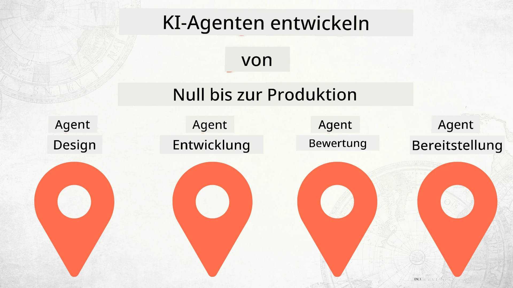

# KI-Agenten von Grund auf bis zur Produktion bauen



### 🌐 Mehrsprachige Unterstützung

#### Unterstützt durch GitHub Action (Automatisiert & Immer Aktuell)

<!-- CO-OP TRANSLATOR LANGUAGES TABLE START -->
[Arabisch](../ar/README.md) | [Bengalisch](../bn/README.md) | [Bulgarisch](../bg/README.md) | [Birmanisch (Myanmar)](../my/README.md) | [Chinesisch (vereinfacht)](../zh-CN/README.md) | [Chinesisch (traditionell, Hongkong)](../zh-HK/README.md) | [Chinesisch (traditionell, Macau)](../zh-MO/README.md) | [Chinesisch (traditionell, Taiwan)](../zh-TW/README.md) | [Kroatisch](../hr/README.md) | [Tschechisch](../cs/README.md) | [Dänisch](../da/README.md) | [Niederländisch](../nl/README.md) | [Estnisch](../et/README.md) | [Finnisch](../fi/README.md) | [Französisch](../fr/README.md) | [Deutsch](./README.md) | [Griechisch](../el/README.md) | [Hebräisch](../he/README.md) | [Hindi](../hi/README.md) | [Ungarisch](../hu/README.md) | [Indonesisch](../id/README.md) | [Italienisch](../it/README.md) | [Japanisch](../ja/README.md) | [Kannada](../kn/README.md) | [Koreanisch](../ko/README.md) | [Litauisch](../lt/README.md) | [Malaiisch](../ms/README.md) | [Malayalam](../ml/README.md) | [Marathi](../mr/README.md) | [Nepalesisch](../ne/README.md) | [Nigerianisches Pidgin](../pcm/README.md) | [Norwegisch](../no/README.md) | [Persisch (Farsi)](../fa/README.md) | [Polnisch](../pl/README.md) | [Portugiesisch (Brasilien)](../pt-BR/README.md) | [Portugiesisch (Portugal)](../pt-PT/README.md) | [Pandschabi (Gurmukhi)](../pa/README.md) | [Rumänisch](../ro/README.md) | [Russisch](../ru/README.md) | [Serbisch (Kyrillisch)](../sr/README.md) | [Slowakisch](../sk/README.md) | [Slowenisch](../sl/README.md) | [Spanisch](../es/README.md) | [Suaheli](../sw/README.md) | [Schwedisch](../sv/README.md) | [Tagalog (Filipino)](../tl/README.md) | [Tamilisch](../ta/README.md) | [Telugu](../te/README.md) | [Thailändisch](../th/README.md) | [Türkisch](../tr/README.md) | [Ukrainisch](../uk/README.md) | [Urdu](../ur/README.md) | [Vietnamesisch](../vi/README.md)

> **Bevorzugen Sie ein lokales Klonen?**
>
> Dieses Repository enthält über 50 Sprachübersetzungen, was die Downloadgröße erheblich erhöht. Um ohne Übersetzungen zu klonen, verwenden Sie Sparse Checkout:
>
> **Bash / macOS / Linux:**
> ```bash
> git clone --filter=blob:none --sparse https://github.com/microsoft/Building-AI-Agents-From-Zero-To-Production.git
> cd Building-AI-Agents-From-Zero-To-Production
> git sparse-checkout set --no-cone '/*' '!translations' '!translated_images'
> ```
>
> **CMD (Windows):**
> ```cmd
> git clone --filter=blob:none --sparse https://github.com/microsoft/Building-AI-Agents-From-Zero-To-Production.git
> cd Building-AI-Agents-From-Zero-To-Production
> git sparse-checkout set --no-cone "/*" "!translations" "!translated_images"
> ```
>
> Damit erhalten Sie alles, was Sie zum Absolvieren des Kurses benötigen, bei einem viel schnelleren Download.
<!-- CO-OP TRANSLATOR LANGUAGES TABLE END -->

## Ein Kurs, der Ihnen die Grundlagen des KI-Agenten-Entwicklungszyklus beibringt

[](https://github.com/microsoft/Building-AI-Agents-From-Zero-To-Production/blob/master/LICENSE?WT.mc_id=academic-105485-koreyst)
[](https://GitHub.com/microsoft/Building-AI-Agents-From-Zero-To-Production/graphs/contributors/?WT.mc_id=academic-105485-koreyst)
[](https://GitHub.com/microsoft/Building-AI-Agents-From-Zero-To-Production/issues/?WT.mc_id=academic-105485-koreyst)
[](https://GitHub.com/microsoft/Building-AI-Agents-From-Zero-To-Production/pulls/?WT.mc_id=academic-105485-koreyst)
[](http://makeapullrequest.com?WT.mc_id=academic-105485-koreyst)

[](https://discord.gg/Kuaw3ktsu6)

## 🌱 Erste Schritte

Dieser Kurs enthält Lektionen, die die Grundlagen des Aufbaus und der Bereitstellung von KI-Agenten abdecken.

Jede Lektion baut auf der vorherigen auf, daher empfehlen wir, am Anfang zu beginnen und bis zum Ende durchzuarbeiten.

Wenn Sie mehr über Themen rund um KI-Agenten erfahren möchten, können Sie den [KI-Agenten für Anfänger-Kurs](https://aka.ms/ai-agents-beginners) ansehen.

### Treffen Sie andere Lernende, erhalten Sie Antworten auf Ihre Fragen

Wenn Sie nicht weiterkommen oder Fragen zum Aufbau von KI-Agenten haben, treten Sie unserem dedizierten Discord-Kanal im [Microsoft Foundry Discord](https://discord.gg/Kuaw3ktsu6) bei.

### Was Sie benötigen

Jede Lektion enthält ein eigenes Codebeispiel, das Sie lokal ausführen können. Sie können [dieses Repository forken](https://github.com/microsoft/Building-AI-Agents-From-Zero-To-Production/fork), um Ihre eigene Kopie zu erstellen.

Dieser Kurs verwendet derzeit Folgendes:

- [Microsoft Agent Framework (MAF)](https://aka.ms/ai-agents-beginners/agent-framework)
- [Microsoft Foundry](https://azure.microsoft.com/products/ai-foundry)
- [Azure OpenAI Service](https://azure.microsoft.com/products/ai-foundry/models/openai)
- [Azure CLI](https://learn.microsoft.com/cli/azure/authenticate-azure-cli?view=azure-cli-latest)

Bitte stellen Sie sicher, dass Sie vor Kursbeginn Zugang zu diesen Diensten haben.

Weitere Optionen zur Modellbereitstellung und Diensten folgen in Kürze.

## 🗃️ Lektionen

| **Lektion**           | **Beschreibung**                                                                                  |
|--------------------|--------------------------------------------------------------------------------------------------|
| [Agent Design](./lesson-1-agent-design/README.md)       | Eine Einführung in unseren "Developer Onboarding"-Agenten-Anwendungsfall und wie man effektive Agenten entwirft  |
| [Agent Development](./lesson-2-agent-development/README.md)  | Mithilfe des Microsoft Agent Framework (MAF) drei Agenten erstellen, die neuen Entwicklern beim Einstieg helfen.       |
| [Agent Evaluations](./lesson-3-agent-evals/README.md)  | Mit Microsoft Foundry herausfinden, wie gut unsere KI-Agenten performen und wie man sie verbessert. |
| [Agent Deployment](./lesson-4-agent-deployment/README.md)   | Mit den Hosted Agents und OpenAI Chatkit sehen, wie ein KI-Agent in die Produktion gebracht wird.       |


## 🎒 Andere Kurse

Unser Team produziert weitere Kurse! Schauen Sie sich folgende an:

<!-- CO-OP TRANSLATOR OTHER COURSES START -->
### LangChain
[](https://aka.ms/langchain4j-for-beginners)
[](https://aka.ms/langchainjs-for-beginners?WT.mc_id=m365-94501-dwahlin)
[](https://github.com/microsoft/langchain-for-beginners?WT.mc_id=m365-94501-dwahlin)
---

### Azure / Edge / MCP / Agents
[](https://github.com/microsoft/AZD-for-beginners?WT.mc_id=academic-105485-koreyst)
[](https://github.com/microsoft/edgeai-for-beginners?WT.mc_id=academic-105485-koreyst)
[](https://github.com/microsoft/mcp-for-beginners?WT.mc_id=academic-105485-koreyst)
[](https://github.com/microsoft/ai-agents-for-beginners?WT.mc_id=academic-105485-koreyst)

---
 
### Generative KI-Serie
[](https://github.com/microsoft/generative-ai-for-beginners?WT.mc_id=academic-105485-koreyst)
[-9333EA?style=for-the-badge&labelColor=E5E7EB&color=9333EA)](https://github.com/microsoft/Generative-AI-for-beginners-dotnet?WT.mc_id=academic-105485-koreyst)
[-C084FC?style=for-the-badge&labelColor=E5E7EB&color=C084FC)](https://github.com/microsoft/generative-ai-for-beginners-java?WT.mc_id=academic-105485-koreyst)
[-E879F9?style=for-the-badge&labelColor=E5E7EB&color=E879F9)](https://github.com/microsoft/generative-ai-with-javascript?WT.mc_id=academic-105485-koreyst)

---
 
### Kernlernen
[](https://aka.ms/ml-beginners?WT.mc_id=academic-105485-koreyst)
[](https://aka.ms/datascience-beginners?WT.mc_id=academic-105485-koreyst)
[](https://aka.ms/ai-beginners?WT.mc_id=academic-105485-koreyst)
[](https://github.com/microsoft/Security-101?WT.mc_id=academic-96948-sayoung)
[](https://aka.ms/webdev-beginners?WT.mc_id=academic-105485-koreyst)
[](https://aka.ms/iot-beginners?WT.mc_id=academic-105485-koreyst)
[](https://github.com/microsoft/xr-development-for-beginners?WT.mc_id=academic-105485-koreyst)

---
 
### Copilot-Serie
[](https://aka.ms/GitHubCopilotAI?WT.mc_id=academic-105485-koreyst)
[](https://github.com/microsoft/mastering-github-copilot-for-dotnet-csharp-developers?WT.mc_id=academic-105485-koreyst)
[](https://github.com/microsoft/CopilotAdventures?WT.mc_id=academic-105485-koreyst)
<!-- CO-OP TRANSLATOR OTHER COURSES END -->

## Mitwirken

Dieses Projekt heißt Beiträge und Vorschläge willkommen. Die meisten Beiträge erfordern, dass Sie einer
Contributor License Agreement (CLA) zustimmen, in dem Sie erklären, dass Sie das Recht haben und tatsächlich
uns die Rechte einräumen, Ihre Beiträge zu verwenden. Für Details besuchen Sie <https://cla.opensource.microsoft.com>.

Wenn Sie eine Pull-Anfrage senden, wird ein CLA-Bot automatisch feststellen, ob Sie
ein CLA bereitstellen müssen, und die PR entsprechend kennzeichnen (z. B. Statusprüfung, Kommentar). Folgen Sie einfach den Anweisungen
des Bots. Dies müssen Sie nur einmal über alle Repositories mit unserem CLA hinweg tun.

Dieses Projekt hat den [Microsoft Open Source Code of Conduct](https://opensource.microsoft.com/codeofconduct/) übernommen.
Für weitere Informationen siehe die [Code of Conduct FAQ](https://opensource.microsoft.com/codeofconduct/faq/) oder
kontaktieren Sie [opencode@microsoft.com](mailto:opencode@microsoft.com) bei weiteren Fragen oder Anmerkungen.

## Marken

Dieses Projekt kann Marken oder Logos für Projekte, Produkte oder Dienstleistungen enthalten. Die autorisierte Verwendung von Microsoft-
Marken oder Logos unterliegt den
[Microsoft Trademark & Brand Guidelines](https://www.microsoft.com/legal/intellectualproperty/trademarks/usage/general).
Die Verwendung von Microsoft-Marken oder Logos in modifizierten Versionen dieses Projekts darf keine Verwirrung stiften oder eine Microsoft-Unterstützung suggerieren.
Die Verwendung von Marken oder Logos Dritter unterliegt den Richtlinien dieser Dritten.

## Hilfe erhalten

Wenn Sie nicht weiterkommen oder Fragen zum Erstellen von KI-Anwendungen haben, treten Sie bei:

[](https://discord.gg/Kuaw3ktsu6)

Wenn Sie Produktfeedback oder Fehler beim Erstellen haben, besuchen Sie:

[](https://aka.ms/foundry/forum)

---

<!-- CO-OP TRANSLATOR DISCLAIMER START -->
**Haftungsausschluss**:
Dieses Dokument wurde mit dem KI-Übersetzungsdienst [Co-op Translator](https://github.com/Azure/co-op-translator) übersetzt. Obwohl wir uns um Genauigkeit bemühen, können automatisierte Übersetzungen Fehler oder Ungenauigkeiten enthalten. Das Originaldokument in seiner Ursprungssprache gilt als maßgebliche Quelle. Für kritische Informationen wird eine professionelle menschliche Übersetzung empfohlen. Wir übernehmen keine Haftung für Missverständnisse oder Fehlinterpretationen, die durch die Nutzung dieser Übersetzung entstehen.
<!-- CO-OP TRANSLATOR DISCLAIMER END -->