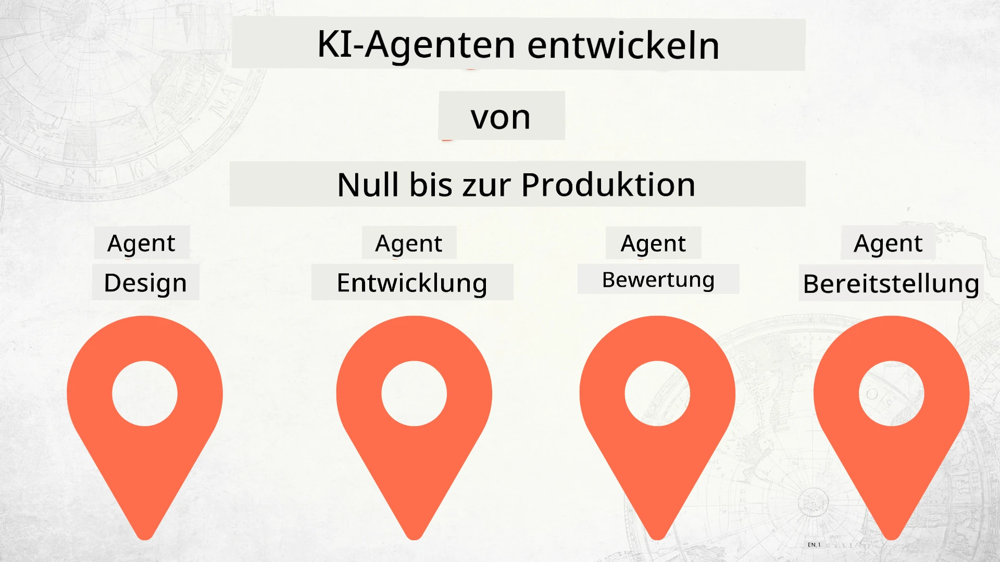

# Aufbau von KI-Agenten von Null bis zur Produktion



### 🌐 Mehrsprachige Unterstützung

#### Unterstützt durch GitHub Action (Automatisiert & Immer Aktuell)

<!-- CO-OP TRANSLATOR LANGUAGES TABLE START -->
[Arabisch](../ar/README.md) | [Bengalisch](../bn/README.md) | [Bulgarisch](../bg/README.md) | [Birmanisch (Myanmar)](../my/README.md) | [Chinesisch (vereinfacht)](../zh-CN/README.md) | [Chinesisch (traditionell, Hongkong)](../zh-HK/README.md) | [Chinesisch (traditionell, Macau)](../zh-MO/README.md) | [Chinesisch (traditionell, Taiwan)](../zh-TW/README.md) | [Kroatisch](../hr/README.md) | [Tschechisch](../cs/README.md) | [Dänisch](../da/README.md) | [Niederländisch](../nl/README.md) | [Estnisch](../et/README.md) | [Finnisch](../fi/README.md) | [Französisch](../fr/README.md) | [Deutsch](./README.md) | [Griechisch](../el/README.md) | [Hebräisch](../he/README.md) | [Hindi](../hi/README.md) | [Ungarisch](../hu/README.md) | [Indonesisch](../id/README.md) | [Italienisch](../it/README.md) | [Japanisch](../ja/README.md) | [Kannada](../kn/README.md) | [Khmer](../km/README.md) | [Koreanisch](../ko/README.md) | [Litauisch](../lt/README.md) | [Malaiisch](../ms/README.md) | [Malayalam](../ml/README.md) | [Marathi](../mr/README.md) | [Nepalesisch](../ne/README.md) | [Nigerianisches Pidgin](../pcm/README.md) | [Norwegisch](../no/README.md) | [Persisch (Farsi)](../fa/README.md) | [Polnisch](../pl/README.md) | [Portugiesisch (Brasilien)](../pt-BR/README.md) | [Portugiesisch (Portugal)](../pt-PT/README.md) | [Punjabi (Gurmukhi)](../pa/README.md) | [Rumänisch](../ro/README.md) | [Russisch](../ru/README.md) | [Serbisch (kyrillisch)](../sr/README.md) | [Slowakisch](../sk/README.md) | [Slowenisch](../sl/README.md) | [Spanisch](../es/README.md) | [Suaheli](../sw/README.md) | [Schwedisch](../sv/README.md) | [Tagalog (Filipino)](../tl/README.md) | [Tamil](../ta/README.md) | [Telugu](../te/README.md) | [Thailändisch](../th/README.md) | [Türkisch](../tr/README.md) | [Ukrainisch](../uk/README.md) | [Urdu](../ur/README.md) | [Vietnamesisch](../vi/README.md)

> **Bevorzugen Sie einen lokalen Klon?**
>
> Dieses Repository enthält Übersetzungen in über 50 Sprachen, was die Downloadgröße erheblich erhöht. Um ohne Übersetzungen zu klonen, verwenden Sie Sparse Checkout:
>
> **Bash / macOS / Linux:**
> ```bash
> git clone --filter=blob:none --sparse https://github.com/microsoft/Building-AI-Agents-From-Zero-To-Production.git
> cd Building-AI-Agents-From-Zero-To-Production
> git sparse-checkout set --no-cone '/*' '!translations' '!translated_images'
> ```
>
> **CMD (Windows):**
> ```cmd
> git clone --filter=blob:none --sparse https://github.com/microsoft/Building-AI-Agents-From-Zero-To-Production.git
> cd Building-AI-Agents-From-Zero-To-Production
> git sparse-checkout set --no-cone "/*" "!translations" "!translated_images"
> ```
>
> Dies gibt Ihnen alles, was Sie benötigen, um den Kurs mit deutlich schnellerem Download abzuschließen.
<!-- CO-OP TRANSLATOR LANGUAGES TABLE END -->

## Ein Kurs, der Ihnen die Grundlagen des Lebenszyklus der KI-Agentenentwicklung vermittelt

[](https://github.com/microsoft/Building-AI-Agents-From-Zero-To-Production/blob/master/LICENSE?WT.mc_id=academic-105485-koreyst)
[](https://GitHub.com/microsoft/Building-AI-Agents-From-Zero-To-Production/graphs/contributors/?WT.mc_id=academic-105485-koreyst)
[](https://GitHub.com/microsoft/Building-AI-Agents-From-Zero-To-Production/issues/?WT.mc_id=academic-105485-koreyst)
[](https://GitHub.com/microsoft/Building-AI-Agents-From-Zero-To-Production/pulls/?WT.mc_id=academic-105485-koreyst)
[](http://makeapullrequest.com?WT.mc_id=academic-105485-koreyst)

[](https://discord.gg/Kuaw3ktsu6)

## 🌱 Erste Schritte

Dieser Kurs enthält Lektionen, die die Grundlagen des Aufbaus und der Bereitstellung von KI-Agenten behandeln.

Jede Lektion baut auf der vorherigen auf, weshalb wir empfehlen, von Anfang an zu beginnen und sich bis zum Ende durchzuarbeiten.

Wenn Sie mehr zu KI-Agenten-Themen erkunden möchten, können Sie sich den [Kurs für Einsteiger zu KI-Agenten](https://aka.ms/ai-agents-beginners) ansehen.

### Lernen Sie andere Lernende kennen, erhalten Sie Antworten auf Ihre Fragen

Wenn Sie nicht weiterkommen oder Fragen zum Aufbau von KI-Agenten haben, treten Sie unserem dedizierten Discord-Kanal im [Microsoft Foundry Discord](https://discord.gg/Kuaw3ktsu6) bei.

### Was Sie benötigen

Jede Lektion enthält ein eigenes Codebeispiel, das Sie lokal ausführen können. Sie können dieses Repository [forken](https://github.com/microsoft/Building-AI-Agents-From-Zero-To-Production/fork), um Ihre eigene Kopie zu erstellen.

Dieser Kurs verwendet derzeit Folgendes:

- [Microsoft Agent Framework (MAF)](https://aka.ms/ai-agents-beginners/agent-framework)
- [Microsoft Foundry](https://azure.microsoft.com/products/ai-foundry) — ein Projekt mit einem bereitgestellten **GPT-5-Serie** Modell (zum Beispiel `gpt-5.1`). Verwenden Sie **nicht** die eingestellten GPT-4o / GPT-4.1 Modelle.
- [Azure OpenAI Service](https://azure.microsoft.com/products/ai-foundry/models/openai)
- [Azure CLI](https://learn.microsoft.com/cli/azure/authenticate-azure-cli?view=azure-cli-latest) — Melden Sie sich mit `az login` an, bevor Sie ein Beispiel ausführen.
- **Python 3.12 oder neuer**

Bitte stellen Sie sicher, dass Sie Zugang zu diesen Diensten haben, bevor Sie beginnen.

> **💰 Kosten & Bereinigung.** Die praktischen Lektionen erstellen echte Azure-Ressourcen — ein Microsoft Foundry
> Projekt, eine Modellbereitstellung, einen Vektorspeicher und (in Lektionen 4–6) gehostete Agenten und Werkzeugkästen.
> Diese können Kosten verursachen, solange sie existieren. Wenn Sie eine Lektion oder den Kurs beenden, löschen Sie
> die Ressourcen, die Sie nicht mehr benötigen. Der einfachste Weg ist, alles in einer dedizierten Ressourcengruppe zu bündeln
> und die gesamte Gruppe zu löschen, wenn Sie fertig sind:
>
> ```bash
> az group delete --name <your-resource-group> --yes --no-wait
> ```
>
> Sie können auch einzelne Agenten, Vektorspeicher und Werkzeugkästen über das Foundry-Portal löschen.

> **Hinweis zu Modellen.** Dieser Kurs stellt alle Modelle über **Microsoft Foundry** bereit. Er verwendet **nicht**
> *GitHub-Modelle*, die am **30. Juli 2026** eingestellt werden — Microsoft Foundry ist der
> offizielle Migrationspfad. Wenn Sie älteren Code haben, der GitHub-Modelle anspricht, richten Sie ihn stattdessen auf eine Foundry
> Modellbereitstellung.

Weitere Optionen zur Modell-Hosting und Diensten folgen in Kürze.

## 🗃️ Lektionen

| **Lektion**         | **Beschreibung**                                                                                  |
|--------------------|--------------------------------------------------------------------------------------------------|
| [Agentendesign](./lesson-1-agent-design/README.md)       | Eine Einführung in unseren Anwendungsfall "Developer Onboarding" und wie man effektive Agenten entwirft  |
| [Agentenentwicklung](./lesson-2-agent-development/README.md)  | Mit dem Microsoft Agent Framework (MAF) eine Reihe spezialisierter Agenten erstellen, um neuen Entwicklern den Einstieg zu erleichtern.       |
| [Agentenbewertungen](./lesson-3-agent-evals/README.md)  | Verwenden Sie Microsoft Foundry, um herauszufinden, wie gut unsere KI-Agenten funktionieren und wie man sie verbessert. |
| [Agentenbereitstellung](./lesson-4-agentdeployment/README.md)   | Verwenden Sie Microsoft Foundry gehostete Agenten und OpenAI ChatKit, um einen KI-Agenten in Produktion zu bringen.       |
| [Produktion gehostete Agenten](./lesson-5-hosted-agents-production/README.md)   | Bringen Sie einen gehosteten Agenten in die Unternehmensproduktion: Gehostete Agenten vs. Fähigkeit Hosts, eigenes Speicher-, Speicher- und Governance-Modell.       |
| [Microsoft Werkzeugkasten](./lesson-6-toolbox/README.md)   | Werkzeuge einmal definieren und zentral verwalten: bauen Sie einen Werkzeugkasten, verwenden Sie ihn von einem Agenten über einen MCP-Endpunkt und versionieren Sie Werkzeuge sicher.       |
| [Multi-Agent & A2A](./lesson-7-multi-agent-a2a/README.md)   | Komponieren Sie Agenten als vernetzte Dienste: setzen Sie einen Agenten über das offene Agent-zu-Agent (A2A)-Protokoll ein und nutzen Sie einen entfernten Agenten als Peer.       |


## 🎒 Weitere Kurse

Unser Team bietet weitere Kurse an! Schauen Sie rein:

<!-- CO-OP TRANSLATOR OTHER COURSES START -->
### LangChain
[](https://aka.ms/langchain4j-for-beginners)
[](https://aka.ms/langchainjs-for-beginners?WT.mc_id=m365-94501-dwahlin)
[](https://github.com/microsoft/langchain-for-beginners?WT.mc_id=m365-94501-dwahlin)
---

### Azure / Edge / MCP / Agenten
[](https://github.com/microsoft/AZD-for-beginners?WT.mc_id=academic-105485-koreyst)
[](https://github.com/microsoft/edgeai-for-beginners?WT.mc_id=academic-105485-koreyst)
[](https://github.com/microsoft/mcp-for-beginners?WT.mc_id=academic-105485-koreyst)
[](https://github.com/microsoft/ai-agents-for-beginners?WT.mc_id=academic-105485-koreyst)

---
 
### Generative KI-Serie

[](https://github.com/microsoft/generative-ai-for-beginners?WT.mc_id=academic-105485-koreyst)
[-9333EA?style=for-the-badge&labelColor=E5E7EB&color=9333EA)](https://github.com/microsoft/Generative-AI-for-beginners-dotnet?WT.mc_id=academic-105485-koreyst)
[-C084FC?style=for-the-badge&labelColor=E5E7EB&color=C084FC)](https://github.com/microsoft/generative-ai-for-beginners-java?WT.mc_id=academic-105485-koreyst)
[-E879F9?style=for-the-badge&labelColor=E5E7EB&color=E879F9)](https://github.com/microsoft/generative-ai-with-javascript?WT.mc_id=academic-105485-koreyst)

---
 
### Kernlernen
[](https://aka.ms/ml-beginners?WT.mc_id=academic-105485-koreyst)
[](https://aka.ms/datascience-beginners?WT.mc_id=academic-105485-koreyst)
[](https://aka.ms/ai-beginners?WT.mc_id=academic-105485-koreyst)
[](https://github.com/microsoft/Security-101?WT.mc_id=academic-96948-sayoung)
[](https://aka.ms/webdev-beginners?WT.mc_id=academic-105485-koreyst)
[](https://aka.ms/iot-beginners?WT.mc_id=academic-105485-koreyst)
[](https://github.com/microsoft/xr-development-for-beginners?WT.mc_id=academic-105485-koreyst)

---
 
### Copilot-Serie
[](https://aka.ms/GitHubCopilotAI?WT.mc_id=academic-105485-koreyst)
[](https://github.com/microsoft/mastering-github-copilot-for-dotnet-csharp-developers?WT.mc_id=academic-105485-koreyst)
[](https://github.com/microsoft/CopilotAdventures?WT.mc_id=academic-105485-koreyst)
<!-- CO-OP TRANSLATOR OTHER COURSES END -->

## Beitragen

Dieses Projekt begrüßt Beiträge und Vorschläge. Die meisten Beiträge erfordern, dass Sie einer
Contributor License Agreement (CLA) zustimmen, die bestätigt, dass Sie das Recht haben und tatsächlich
uns die Rechte zur Nutzung Ihres Beitrags einräumen. Für Details besuchen Sie <https://cla.opensource.microsoft.com>.

Wenn Sie eine Pull-Anfrage einreichen, prüft ein CLA-Bot automatisch, ob Sie eine CLA bereitstellen müssen,
und versieht die PR entsprechend (z. B. Statusprüfung, Kommentar). Folgen Sie einfach den Anweisungen,
die der Bot bereitstellt. Sie müssen dies nur einmal für alle Repositories mit unserer CLA tun.

Dieses Projekt hat den [Microsoft Open Source Verhaltenskodex](https://opensource.microsoft.com/codeofconduct/) übernommen.
Weitere Informationen finden Sie in den [FAQ zum Verhaltenskodex](https://opensource.microsoft.com/codeofconduct/faq/) oder
kontaktieren Sie [opencode@microsoft.com](mailto:opencode@microsoft.com) bei weiteren Fragen oder Anmerkungen.

## Marken

Dieses Projekt kann Marken oder Logos von Projekten, Produkten oder Dienstleistungen enthalten. Die autorisierte Verwendung von Microsoft
Marken oder Logos unterliegt und muss den
[Microsoft Markenschutz- und Markenrichtlinien](https://www.microsoft.com/legal/intellectualproperty/trademarks/usage/general) folgen.
Die Verwendung von Microsoft-Marken oder -Logos in modifizierten Versionen dieses Projekts darf keine Verwirrung stiften oder eine Microsoft-Unterstützung andeuten.
Jede Verwendung von Drittanbieter-Marken oder -Logos unterliegt den Richtlinien dieser Drittanbieter.

## Hilfe erhalten

Wenn Sie nicht weiterkommen oder Fragen zum Erstellen von KI-Anwendungen haben, treten Sie bei:

[](https://discord.gg/Kuaw3ktsu6)

Wenn Sie Produktfeedback oder Fehler beim Erstellen haben, besuchen Sie:

[](https://aka.ms/foundry/forum)

---

<!-- CO-OP TRANSLATOR DISCLAIMER START -->
**Haftungsausschluss**:
Dieses Dokument wurde mit dem KI-Übersetzungsdienst [Co-op Translator](https://github.com/Azure/co-op-translator) übersetzt. Obwohl wir uns um Genauigkeit bemühen, beachten Sie bitte, dass automatisierte Übersetzungen Fehler oder Ungenauigkeiten enthalten können. Das Originaldokument in seiner Ursprungssprache gilt als maßgebliche Quelle. Bei kritischen Informationen wird eine professionelle menschliche Übersetzung empfohlen. Wir übernehmen keine Haftung für Missverständnisse oder Fehlinterpretationen, die aus der Verwendung dieser Übersetzung entstehen.
<!-- CO-OP TRANSLATOR DISCLAIMER END -->