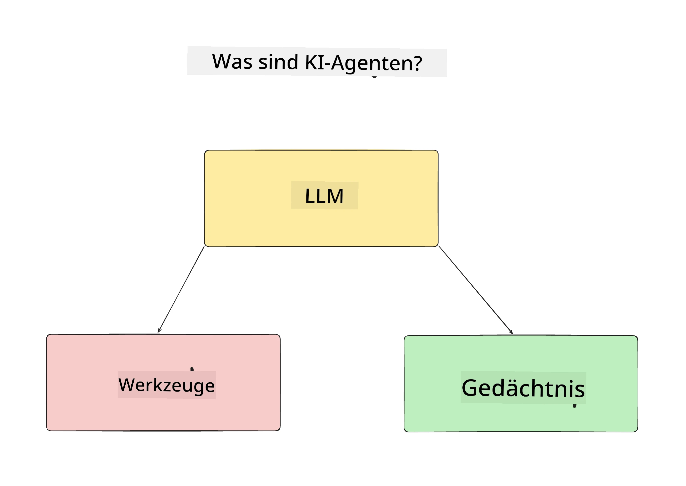
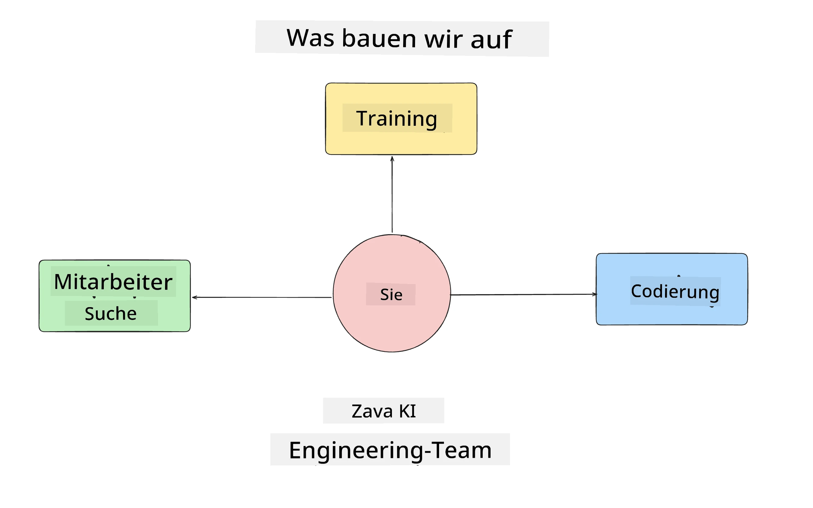
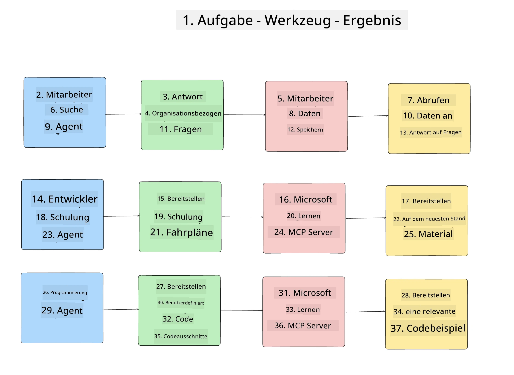
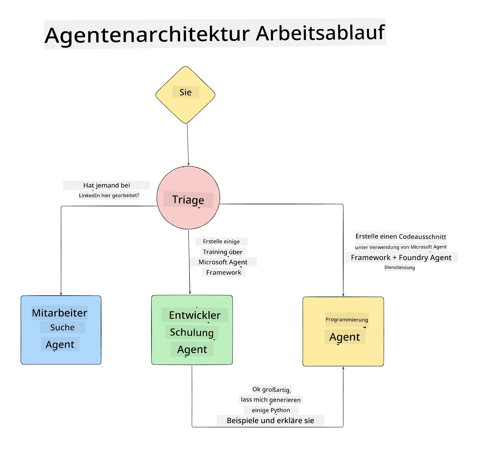

# Lektion 1: Design von KI-Agenten

Willkommen zur ersten Lektion des Kurses "Building AI Agent from Zero to Production"!

In dieser Lektion behandeln wir:

- Definition, was KI-Agenten sind
  
- Diskussion der KI-Agenten-Anwendung, die wir entwickeln  

- Identifizierung der benötigten Werkzeuge und Dienste für jeden Agenten
  
- Architektur unserer Agenten-Anwendung
  
Beginnen wir damit zu definieren, was Agenten sind und warum wir sie in einer Anwendung verwenden würden.

> **Bevor Sie den Kurs starten.** Diese erste Lektion ist konzeptionell — es gibt keinen Code auszuführen.
> Ab [Lektion 2](../lesson-2-agent-development/README.md) benötigen Sie: ein **Azure
> Abonnement** mit Zugriff auf **Microsoft Foundry**, ein bereitgestelltes **GPT-5-Serienmodell** (zum
> Beispiel `gpt-5.1` — vermeiden Sie die eingestellten Modelle GPT-4o / GPT-4.1), **Python 3.12+** und die **Azure CLI**
> (`az login`). Siehe [Was Sie benötigen](../README.md#what-you-need) im Kurs-README für die vollständige
> Liste und Links.

## Was sind KI-Agenten?

Wenn Sie zum ersten Mal erkunden, wie man einen KI-Agenten baut, könnten Sie Fragen haben, wie man einen KI-Agenten genau definiert.

Eine einfache Definition, was ein KI-Agent ist, basiert auf den Komponenten, die ihn ausmachen:

**Großes Sprachmodell** – Das LLM ermöglicht sowohl die Verarbeitung natürlicher Sprache vom Nutzer, um die Aufgabe zu interpretieren, die er erledigen möchte, als auch die Interpretation der Beschreibungen der Werkzeuge, die zur Erfüllung dieser Aufgaben verfügbar sind.

**Werkzeuge** – Dies sind Funktionen, APIs, Datenspeicher und andere Dienste, die das LLM auswählen kann, um die vom Nutzer angeforderten Aufgaben zu erfüllen.

**Speicher** – So speichern wir sowohl kurz- als auch langfristige Interaktionen zwischen dem KI-Agenten und dem Nutzer. Das Speichern und Abrufen dieser Informationen ist wichtig, um Verbesserungen vorzunehmen und Nutzerpräferenzen im Laufe der Zeit zu sichern.

## Unser KI-Agent Anwendungsfall

Für diesen Kurs werden wir eine KI-Agenten-Anwendung bauen, die neuen Entwicklern hilft, sich im KI-Agenten-Entwicklungsteam zurechtzufinden!

Bevor wir Entwicklungsarbeit leisten, ist der erste Schritt zum Erstellen einer erfolgreichen KI-Agenten-Anwendung, klare Szenarien zu definieren, wie wir erwarten, dass unsere Nutzer mit unseren KI-Agenten arbeiten.

Für diese Anwendung arbeiten wir mit folgenden Szenarien:

**Szenario 1**: Ein neuer Mitarbeiter tritt unserer Organisation bei und möchte mehr über das Team erfahren, dem er beigetreten ist, und wie er sich mit ihm verbinden kann.

**Szenario 2:** Ein neuer Mitarbeiter möchte wissen, welche die besten ersten Aufgaben sind, mit denen er anfangen könnte.

**Szenario 3:** Ein neuer Mitarbeiter möchte Lernressourcen und Codebeispiele sammeln, die ihm helfen, diese Aufgaben zu bewältigen.

## Werkzeuge und Dienste identifizieren

Nun, da wir diese Szenarien erstellt haben, ist der nächste Schritt, sie den Werkzeugen und Diensten zuzuordnen, die unsere KI-Agenten benötigen, um diese Aufgaben zu erledigen.

Dieser Prozess fällt unter den Bereich Context Engineering, da wir sicherstellen wollen, dass unsere KI-Agenten zur richtigen Zeit den richtigen Kontext haben, um die Aufgaben zu erfüllen.

Machen wir das szenariobasiert und führen gutes agentenbasiertes Design durch, indem wir die Aufgaben, Werkzeuge und gewünschten Ergebnisse jedes Agenten auflisten.

### Szenario 1 - Mitarbeiter-Such-Agent

**Aufgabe** – Beantworten von Fragen zu Mitarbeitern in der Organisation, wie Eintrittsdatum, aktuellem Team, Standort und letzter Position.

**Werkzeuge** – Datenspeicher mit aktueller Mitarbeiterliste und Organisationsdiagramm

**Ergebnisse** – Fähigkeit, Informationen aus dem Datenspeicher abzurufen, um allgemeine organisatorische Fragen und spezifische Fragen zu Mitarbeitenden zu beantworten.

### Szenario 2 - Aufgaben-Empfehlungs-Agent

**Aufgabe** – Basierend auf der Entwicklererfahrung des neuen Mitarbeiters 1-3 Aufgaben zu finden, an denen der neue Mitarbeiter arbeiten kann.

**Werkzeuge** – GitHub MCP-Server, um offene Issues zu erhalten und ein Entwicklerprofil zu erstellen

**Ergebnisse** – Fähigkeit, die letzten 5 Commits eines GitHub-Profils und offene Issues eines GitHub-Projekts zu lesen und basierend auf einer Übereinstimmung Empfehlungen zu geben

### Szenario 3 - Code-Assistent-Agent

**Aufgabe** – Basierend auf den offenen Issues, die vom "Aufgaben-Empfehlungs"-Agent empfohlen wurden, Ressourcen recherchieren und bereitstellen sowie Code-Snippets generieren, um den Mitarbeiter zu unterstützen.

**Werkzeuge** – Microsoft Learn MCP, um Ressourcen zu finden, und Code-Interpreter, um benutzerdefinierte Code-Snippets zu erstellen.

**Ergebnisse** – Wenn der Nutzer zusätzliche Hilfe anfragt, sollte der Workflow den Learn MCP-Server verwenden, um Links und Ausschnitte zu Ressourcen bereitzustellen und dann an den Code-Interpreter-Agenten übergeben, um kleine Code-Snippets mit Erklärungen zu generieren.

## Architektur unserer Agenten-Anwendung

Nun, da wir jeden unserer Agenten definiert haben, erstellen wir ein Architekturdiagramm, das uns hilft zu verstehen, wie jeder Agent je nach Aufgabe gemeinsam und separat arbeitet:

## Nächste Schritte

Nachdem wir jeden Agenten und unser agentenbasiertes System entworfen haben, gehen wir zur nächsten Lektion über, in der wir jeden dieser Agenten entwickeln werden!

---

<!-- CO-OP TRANSLATOR DISCLAIMER START -->
**Haftungsausschluss**:
Dieses Dokument wurde mit dem KI-Übersetzungsdienst [Co-op Translator](https://github.com/Azure/co-op-translator) übersetzt. Obwohl wir uns um Genauigkeit bemühen, beachten Sie bitte, dass automatisierte Übersetzungen Fehler oder Ungenauigkeiten enthalten können. Das Originaldokument in seiner Ursprungssprache gilt als maßgebliche Quelle. Bei kritischen Informationen wird eine professionelle menschliche Übersetzung empfohlen. Wir übernehmen keine Haftung für Missverständnisse oder Fehlinterpretationen, die aus der Verwendung dieser Übersetzung entstehen.
<!-- CO-OP TRANSLATOR DISCLAIMER END -->