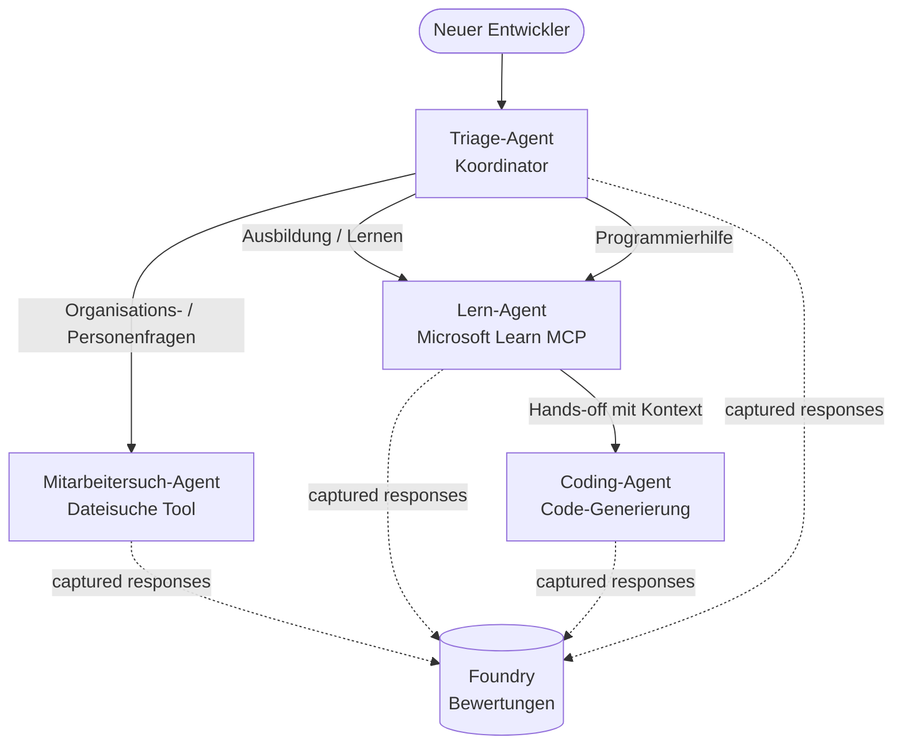

# Lektion 3: Agentenbewertungen mit Microsoft Foundry

Willkommen zur dritten Lektion des **„Building AI Agents from Zero to Production“** Kurses!

In [Lektion 2](../lesson-2-agent-development/README.md) hast du Agenten gebaut. In dieser Lektion wirst du
lernen, wie du eine viel schwierigere Frage beantwortest: **Sind sie gut?** Einen Agenten auszuliefern, der
läuft, ist einfach; zu wissen, ob er richtig weiterleitet, sich an deine Daten hält und seine
Werkzeuge richtig verwendet, ist der Unterschied zwischen einer Demo und einem Produktionssystem.

In dieser Lektion behandeln wir:

- Warum Agentenbewertungen wichtig sind und wie sie sich von herkömmlichen Tests unterscheiden
- Den Unterschied zwischen **Observability**, **Smoke Tests** und **Evaluations**
- Den Multi-Agent-Workflow, den wir messen werden
- Die eingebauten **Microsoft Foundry Evaluatoren** (Relevanz, Groundedness, Tool-Aufrufgenauigkeit, Tool-Ausgabennutzung)
- Eine Schritt-für-Schritt-Durchführung der Evaluierungspipeline in [`agent-evals.py`](../../../lesson-3-agent-evals/agent-evals.py)
- Wie man sie ausführt und die Ergebnisse liest

---

## Warum Agenten bewerten?

Ein traditioneller Unit-Test überprüft, ob `add(2, 2) == 4` gilt. Agenten funktionieren nicht so – derselbe
Prompt kann bei jedem Lauf unterschiedliche Formulierungen erzeugen, Werkzeuge können in unterschiedlicher Reihenfolge aufgerufen werden, und
„korrekt“ ist oft eine Frage des Grades und kein boolescher Wert. Man kann nicht auf exakte Strings prüfen.

Stattdessen bewertest du Agenten entlang **Qualitätsdimensionen** mithilfe modellbasierter *Evaluatoren* (auch
„LLM-als-Richter“ genannt) sowie deterministischer Prüfungen der Werkzeugnutzung. Das sagt dir zum Beispiel:

- Hat die Antwort tatsächlich die Frage adressiert? (**Relevanz**)
- Wird die Antwort durch die abgerufenen Daten gestützt oder hat der Agent halluziniert? (**Groundedness**)
- Hat der Agent das richtige Werkzeug mit den richtigen Argumenten aufgerufen? (**Genauigkeit des Tool-Aufrufs**)
- Hat der Agent tatsächlich das genutzt, was das Werkzeug zurückgegeben hat? (**Nutzung der Tool-Ausgabe**)

### Drei komplementäre Qualitätsebenen

Diese sind keine konkurrierenden Techniken – ein Produktionsagent nutzt alle drei:

| Ebene | Frage, die beantwortet wird | Kosten | Wann sie ausgeführt wird | Behandelt in |
|-------|----------------------------|--------|--------------------------|--------------|
| **Observability / Tracing** | *Was hat der Agent Schritt für Schritt gemacht?* | Kostenlos (immer an) | Kontinuierlich in Produktion | Diese Lektion |
| **Smoke Tests** | *Ist der Agent erreichbar und folgt seinem Grund-Prompt?* | Günstig, Sekunden | Bei jedem Deployment | [Lektion 4](../lesson-4-agentdeployment/README.md#smoke-testing-the-hosted-agent-ci-gate) |
| **Evaluations** | *Wie **gut** sind die Antworten?* | Langsamer, modellabhängig | Auf Anfrage / nachts / vor Veröffentlichung | Diese Lektion |

Smoke Tests beantworten die Frage „Ist etwas kaputt?“, Evaluations beantworten „Ist es gut?“. Du brauchst beides.

---

## Voraussetzungen

1. Abgeschlossene [Lektion 2](../lesson-2-agent-development/README.md) (Agenten + Vektorspeicher).
2. Ein **Microsoft Foundry** Projekt.
3. Authentifiziertes **Azure CLI**: `az login`.
4. **Python 3.12+** und die Kursabhängigkeiten installiert:

   ```bash
   pip install -r ../requirements.txt
   ```


5. Umgebungsvariablen (erstellen Sie eine `.env`-Datei in diesem Ordner oder exportieren Sie sie):

   | Variable | Zweck |
   |----------|---------|
   | `FOUNDRY_PROJECT_ENDPOINT` | Ihr Foundry-Projekt-Endpunkt (`https://<account>.services.ai.azure.com/api/projects/<project>`). Wird vom `FoundryChatClient` der Agenten **und** dem Evaluierungshilfsmittel gelesen. |
   | `FOUNDRY_MODEL` | Modellbereitstellung, auf der die **Agenten** laufen (z.B. `gpt-5.1`). |
   | `VECTOR_STORE_ID` | Der im Lektion 2 erstellte Vektorstore des Mitarbeiterverzeichnisses |
   | `AZURE_AI_MODEL_DEPLOYMENT_NAME` | Modellbereitstellung, die **von den Bewertern** verwendet wird (Standard ist `FOUNDRY_MODEL`, danach `gpt-5.1`) |

> Die Agenten verwenden `FoundryChatClient`, der die Konfiguration aus den Variablen mit dem Präfix `FOUNDRY_` 
> (`FOUNDRY_PROJECT_ENDPOINT`, `FOUNDRY_MODEL`) liest. Das Cloud-Evaluierungshilfsmittel 
> verwendet das `azure-ai-projects` SDK und fällt auf `FOUNDRY_PROJECT_ENDPOINT` zurück, wenn
> `AZURE_AI_PROJECT_ENDPOINT` nicht gesetzt ist — somit reichen die beiden `FOUNDRY_`-Variablen aus, 
> um die gesamte Lektion auszuführen.
>
> Die Bewerter werden selbst von einem Modell angetrieben, daher steuert `AZURE_AI_MODEL_DEPLOYMENT_NAME`,
> welche Bereitstellung das Urteil fällt — es muss nicht dasselbe Modell sein, das Ihre
> Agenten verwenden.

---

## Der Workflow, den wir bewerten

Um etwas zu bewerten, muss man es zuerst ausführen. Diese Lektion verwendet den **Developer Onboarding**
Multi-Agenten-Workflow wieder: Ein **Triage**-Koordinator übergibt an drei Spezialisten.



Der Workflow wird mit der Handoff-Orchestrierung des Microsoft Agent Frameworks erstellt. Die Schlüsselidee
für die Bewertung ist, dass **jeder Agenten-Durchlauf serverseitig gespeichert** und durch eine
`response_id` identifiziert wird. Diese IDs werden an den Evaluierungsdienst übergeben.

---

## Die Bewertungspipeline Schritt für Schritt

[`agent-evals.py`](../../../lesson-3-agent-evals/agent-evals.py) implementiert eine Pipeline mit sechs Schritten. Hier ist, was jeder Schritt tut 
und warum.

### Schritt 1 — Den Workflow ausführen und Antwort-IDs verfolgen

Der Workflow wird mit `run_stream(...)` ausgeführt, und während Ereignisse zurückstromen, zeichnet der Code 
die von jedem Agenten erzeugten `response_id` und `conversation_id` auf. Gespeicherte Antworten sind das rohe
Material zur Bewertung — Sie bewerten *echte*, produktionsnahe Antworten, nicht neu generierte.


### Schritt 2 — Zusammenfassung des Erfassten

Eine schnelle Zusammenfassung zeigt, wie viele Antworten jeder Agent erzeugt hat, so dass Sie bestätigen können, 
dass der Workflow tatsächlich die Agenten genutzt hat, die Sie bewerten möchten.

### Schritt 3 — Abrufen der letzten Antworten

Für jeden Agenten wird die letzte `response_id` über den OpenAI-kompatiblen Client des Projekts 
(`project_client.get_openai_client().responses.retrieve(...)`) abgerufen, so dass Sie die
Textausgabe, die bewertet wird, vorschauen können.

### Schritt 4 — Die Bewertung erstellen

Eine Bewertung wird mit vier **eingebauten Foundry-Bewertern** erstellt:

| Bewerter | `evaluator_name` | Was er misst |
|-----------|------------------|------------------|

| Relevanz | `builtin.relevance` | Geht die Antwort auf die Anfrage des Benutzers ein? |

| Verankerung | `builtin.groundedness` | Wird die Antwort durch abgerufene/Werkzeug-Daten gestützt (nicht halluziniert)? |
| Werkzeugaufrufgenauigkeit | `builtin.tool_call_accuracy` | Wurden die richtigen Werkzeuge mit den richtigen Argumenten aufgerufen? |
| Nutzung der Werkzeugausgabe | `builtin.tool_output_utilization` | Hat der Agent die Werkzeugergebnisse tatsächlich in seiner Antwort verwendet? |

Jeder Evaluator wird mit der Bereitstellung initialisiert, die durch `AZURE_AI_MODEL_DEPLOYMENT_NAME` benannt ist.

> **Warum diese vier?** Relevanz und Verankerung messen die *Antwortqualität*; die beiden Werkzeug-
> evaluatoren messen *agentisches Verhalten* – der Teil, den traditionelle NLP-Metriken komplett übersehen. Für ein
> Werkzeug-benutzendes Multi-Agenten-System verbergen sich echte Rückschritte oft in den Werkzeugmetriken.

### Schritt 5 — Führe die Bewertung aus

Die erfassten `response_id`s werden als Datenquelle an `evals.runs.create(...)` übergeben. Der
Dienst spielt jede gespeicherte Antwort durch jeden Evaluator ab.

### Schritt 6 — Überwachen und Ergebnisse lesen

Der Code pollt den Lauf, bis er `completed` oder `failed` ist, und gibt dann die Ergebnisanzahlen und einen
**`report_url`** aus — einen Deep Link ins Foundry-Portal, in dem Sie pro Metrik Punktzahlen,
Bestehen/Nichtbestehen-Anzahlen und individuell bewertete Antworten einsehen können.

---

## Ausführen

```bash
cd lesson-3-agent-evals
python agent-evals.py
```

Standardmäßig wird die erste Beispielabfrage ausgewertet
(`"Ich bin neu hier! Hat hier jemand bei Microsoft gearbeitet?"`). Zwei weitere Multi-Intent-Beispielabfragen
sind in `run_evaluation_workflow()` enthalten — tauschen Sie die Variable `query` aus, um Routing-Szenarien
zu testen, die mehrere Agenten in einem einzelnen Lauf beanspruchen.

Erwarteter Konsolenablauf:

```
Step 1: Running Developer Onboarding Workflow
Step 2: Response Data Summary
Step 3: Fetching Agent Responses
Step 4: Creating Evaluation
Step 5: Running Evaluation
Step 6: Monitoring Evaluation
  Status: running ...
  Evaluation completed successfully
  Report URL: https://...   <-- open this in the Foundry portal
```

---

## Beobachtbarkeit und Tracing

Bewertungen sagen Ihnen, *wie gut* die Antworten waren; **Beobachtbarkeit** sagt Ihnen, *was passiert ist*,
um sie zu erzeugen — jeder Agentensprung, Werkzeugaufruf, Tokenanzahl und Verzögerung. In Microsoft Foundry
senden Agentenläufe OpenTelemetry-Traces, die Sie im Portal ansehen können, und das Agent Framework
kann sie mit einem einzigen Aufruf nach Azure Monitor / Application Insights exportieren:

```python
from agent_framework.foundry import FoundryChatClient

client = FoundryChatClient()
client.configure_azure_monitor()   # Spuren + Metriken an Application Insights exportieren
```

Benutzen Sie Tracing, um eine schlechte Bewertung zu **debuggen**: Wenn die Verankerung sinkt, zeigt der Trace
Ihnen, ob das Dateisuche-Werkzeug nichts zurückgab oder Daten lieferte, die der Agent dann ignorierte (was
genau die Bewertung der Nutzung der Werkzeugausgabe ist).

---

## Von "Läufen" zu "gut": wie man das in der Praxis verwendet

- **Pre-Release-Gate.** Führen Sie Bewertungen gegen eine feste Menge repräsentativer Abfragen durch, bevor Sie
  einen neuen Prompt oder ein Modell freigeben. Vergleichen Sie die Bewertungen mit der vorherigen Version — behandeln Sie einen Rückgang als
  Regression.
- **Nachtlicher Qualitätssignal.** Planen Sie die Bewertung, um Drift durch Daten- oder Abhängigkeits-
  änderungen zu erfassen.
- **In Kombination mit Smoke-Tests.** Der [Lesson 4 Smoke Test](../lesson-4-agentdeployment/README.md#smoke-testing-the-hosted-agent-ci-gate)
  ist Ihr schnelles Gate pro Bereitstellung; Bewertungen sind das langsamere, tiefgründigere Qualitätsgate. Führen Sie den günstigen
  bei jedem Merge und den teureren nach Zeitplan oder vor der Freigabe aus.

---

## Modernisierungshinweis

Dieses Beispiel wird auf die aktuelle Microsoft Agent Framework Foundry API-Oberfläche
(`agent_framework.foundry`) migriert. Wenn Sie den Code aktualisieren, siehe das Repository-Root

[`MIGRATION-GUIDE.md`](../MIGRATION-GUIDE.md) für die verifizierten Vorher/Nachher-Import- und Client-
Zuordnungen (zum Beispiel `AzureAIClient` -> `FoundryChatClient` und gehosteter Tool-Aufbau über
`client.get_file_search_tool(...)` / `client.get_mcp_tool(...)`). Die Bewertungskonzepte und die
sechsstufige Pipeline oben bleiben von dieser Migration unberührt.

---

## Ressourcen

- [Generative KI-Modelle und Anwendungen bewerten (Microsoft Learn)](https://learn.microsoft.com/en-us/azure/ai-foundry/concepts/evaluation-approach-gen-ai)
- [Eingebaute Evaluatoren für generative KI](https://learn.microsoft.com/en-us/azure/ai-foundry/concepts/evaluation-evaluators/agent-evaluators)
- [Beobachtbarkeit in Microsoft Foundry](https://learn.microsoft.com/en-us/azure/ai-foundry/concepts/observability)
- [Microsoft Agent Framework](https://github.com/microsoft/agent-framework)
- [Agentenübergabe-Orchestrierung](https://learn.microsoft.com/en-us/agent-framework/workflows/orchestrations/handoff)

---

<!-- CO-OP TRANSLATOR DISCLAIMER START -->
**Haftungsausschluss**:
Dieses Dokument wurde mit dem KI-Übersetzungsdienst [Co-op Translator](https://github.com/Azure/co-op-translator) übersetzt. Obwohl wir uns um Genauigkeit bemühen, beachten Sie bitte, dass automatisierte Übersetzungen Fehler oder Ungenauigkeiten enthalten können. Das Originaldokument in seiner Ursprungssprache gilt als maßgebliche Quelle. Bei kritischen Informationen wird eine professionelle menschliche Übersetzung empfohlen. Wir übernehmen keine Haftung für Missverständnisse oder Fehlinterpretationen, die aus der Verwendung dieser Übersetzung entstehen.
<!-- CO-OP TRANSLATOR DISCLAIMER END -->