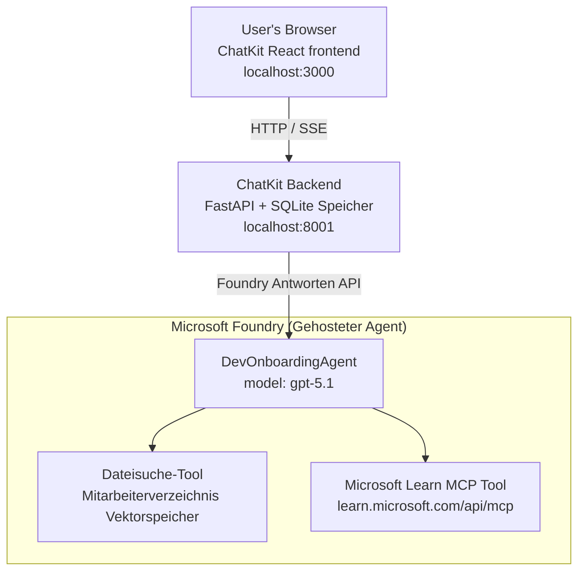

# Lektion 4: Agenteneinsatz mit Microsoft Foundry Hosted Agents + ChatKit

Diese Lektion zeigt, wie ein tool-basiertes Agent an Microsoft Foundry als gehosteter Agent bereitgestellt und ein auf ChatKit basierendes Frontend zur Interaktion damit erstellt wird.

## Architektur

Der gehostete Agent ist ein **einzelner `DevOnboardingAgent`** (läuft auf `gpt-5.1`), der Fragen zum Entwickler-Onboarding mit zwei gehosteten Tools beantwortet: einem **Dateisuche** Tool über den Employee-Directory-Vektorstore und dem **Microsoft Learn MCP** Tool. Ein ChatKit React-Frontend kommuniziert mit einem FastAPI-Backend, das den Agenten über die Foundry **Responses API** aufruft.



## Voraussetzungen

1. **Microsoft Foundry Projekt** in der Region Nord-Zentral USA
2. **Azure CLI** authentifiziert (`az login`)
3. **Azure Developer CLI** (`azd`) installiert
4. **Python 3.12+** und **Node.js 18+**
5. **Vektorstore** mit Mitarbeiterdaten erstellt

## Schnellstart

### 1. Umgebungsvariablen setzen

```bash
cd lesson-4-agentdeployment
cp .env.example .env
# Bearbeiten Sie die .env mit Ihren Microsoft Foundry-Projektdetails
```

### 2. Bereitstellen des gehosteten Agents

**Option A: Verwendung der Azure Developer CLI (empfohlen)**

```bash
cd hosted-agent
azd auth login
azd agent deploy
```

**Option B: Verwendung von Docker + Azure Container Registry**

```bash
cd hosted-agent

# Container bauen
docker build -t developer-onboarding-agent:latest .

# Tag für ACR
docker tag developer-onboarding-agent:latest <your-acr>.azurecr.io/developer-onboarding-agent:latest

# Zu ACR pushen
az acr login --name <your-acr>
docker push <your-acr>.azurecr.io/developer-onboarding-agent:latest

# Über das Microsoft Foundry-Portal oder SDK bereitstellen
```

### 3. Starten des ChatKit-Backends

```bash
cd chatkit-server
python -m venv .venv
source .venv/bin/activate  # Unter Windows: .venv\Scripts\activate
pip install -r requirements.txt
python app.py
```

Der Server startet unter `http://localhost:8001`

### 4. Starten des ChatKit-Frontends

```bash
cd chatkit-server/frontend
npm install
npm run dev
```

Das Frontend startet unter `http://localhost:3000`

### 5. Anwendung testen

Öffnen Sie `http://localhost:3000` in Ihrem Browser und probieren Sie folgende Abfragen aus:

**Mitarbeitersuche:**
- "Ich bin neu hier! Hat schon jemand bei Microsoft gearbeitet?"
- "Wer hat Erfahrung mit Azure Functions?"

**Lernressourcen:**
- "Erstelle einen Lernpfad für Kubernetes"
- "Welche Zertifizierungen sollte ich für Cloud-Architektur anstreben?"

**Programmierungshilfe:**
- "Hilf mir, Python-Code für die Verbindung zu CosmosDB zu schreiben"
- "Zeig mir, wie man eine Azure Function erstellt"

**Multi-Agent-Anfragen:**
- "Ich fange als Cloud Engineer an. Mit wem sollte ich mich verbinden und was sollte ich lernen?"

## Projektstruktur

```
lesson-4-agentdeployment/
├── .env.example                 # Environment variables template
├── implementation-plan.md       # Detailed implementation guide
├── README.md                    # This file
├── hosted-agent/               # Microsoft Foundry hosted agent
│   ├── main.py                 # Multi-agent workflow implementation
│   ├── requirements.txt        # Python dependencies
│   ├── Dockerfile              # Container definition
│   └── agent.yaml              # Agent deployment configuration
└── chatkit-server/             # ChatKit server application
    ├── app.py                  # FastAPI backend
    ├── store.py                # SQLite persistence layer
    ├── requirements.txt        # Python dependencies
    └── frontend/               # React frontend
        ├── package.json
        ├── vite.config.ts
        ├── tsconfig.json
        ├── index.html
        └── src/
            ├── main.tsx
            ├── App.tsx
            ├── App.css
            └── index.css
```

## Der Agent und seine Tools

Der gehostete Agent ist ein **einzelner Agent** (`DevOnboardingAgent`, definiert in `hosted-agent/main.py`), der drei Onboarding-Domänen abdeckt. Anstatt separate Sub-Agenten zu orchestrieren, stellt er jede Fähigkeit als Tool bereit (oder nutzt direkt das Modell):

| Fähigkeit | Wie sie gehandhabt wird | Tool |
|-----------|--------------------|------|
| **Mitarbeitersuche & Verbindungen** | Foundry-gehostete Dateisuche über den Employee-Directory-Vektorstore | `client.get_file_search_tool(vector_store_ids=[...])` |
| **Lernen & Training** | Microsoft Learn MCP Server (gehostetes MCP Tool) | `client.get_mcp_tool(url="https://learn.microsoft.com/api/mcp")` |
| **Programmierhilfen** | Wird direkt vom Modell `gpt-5.1` gehandhabt — kein externes Tool | — |

Der Agent wird mit `client.as_agent(name="DevOnboardingAgent", instructions=..., tools=[file_search_tool, learn_mcp_tool])` erstellt und mit `from_agent_framework(agent).run()` bereitgestellt.

> **Designanmerkung.** Frühere Entwürfe dieser Lektion nutzten einen `HandoffBuilder` Multi-Agenten-Workflow (Triage → Spezialisten). Der bereitgestellte Agent ist ein einzelner tool-nutzender Agent, der sich einfacher bereitstellen und beim Onboarding-Fragen-Antworten besser nachvollziehen lässt. Für ein Beispiel zur Multi-Agent-Orchestrierung und Übergaben siehe Lektion 2 und Lektion 3.

## Smoke Testing des gehosteten Agents (CI-Gate)

Das erfolgreiche Bereitstellen eines gehosteten Agents beweist nur, dass die Steuer-Ebene die
Definition akzeptiert hat — es beweist **nicht**, dass der Agent tatsächlich antwortet. Eine fehlende Abhängigkeit,
schlechte Modellweiterleitung oder eine abgelaufene Verbindung können einen grünen, aber stillen Agenten ergeben.

Diese Lektion enthält einen leichtgewichtigen **Smoke Test**, der als schneller, günstiger Post-Deploy-Gate fungiert. Er nutzt die [AI Smoke Test](https://github.com/marketplace/actions/ai-smoke-test)
GitHub Action, um Prompts an den Foundry **Responses** Endpunkt des Agenten zu POSTen
(`POST {project_endpoint}/agents/{agent_name}/endpoint/protocols/openai/responses`)
und anhand des zurückgegebenen Textes zu prüfen. Er erkennt kaputte Deployments, Authentifizierungsfehler,
System-Prompt-Abweichungen und Threading-Fehler in Sekunden.


> Smoke Tests sind **kein** Ersatz für die vollständigen Bewertungen in
> [Lektion 3](../lesson-3-agent-evals/README.md) — sie sind eine Ergänzung. Smoke Tests
> beantworten die Frage *"Ist der Agent erreichbar, reagiert er und folgt er den grundlegenden Prompt-Erwartungen?"*;
> Bewertungen sagen *"Wie gut ist die Antwort?"*. Führen Sie das günstige Gate bei jedem Deployment aus.

### Was getestet wird

Der Katalog befindet sich unter [`hosted-agent/tests/smoke-tests.json`](../../../lesson-4-agentdeployment/hosted-agent/tests/smoke-tests.json)
und prüft die drei Domänen des Agenten sowie Prompt-Einhaltung und Multi-Turn-Threading:

| Test | Was geprüft wird |
|------|------------------|
| `reachability` | Agent antwortet mit nicht-leerem, themenbezogenem Text |
| `employee-search` | File-Search-Domäne gibt einen gesunden `200` (Antwort ist datenabhängig) zurück |
| `learning-path` | Lern-Domäne gibt das Thema wieder und liefert eine Pfad-artige Antwort |
| `coding-assistance` | Programmier-Domäne liefert eine Python-Antwort im Code-Format |
| `prompt-adherence-offtopic` | Off-Topic-Anfrage wird umgeleitet, nicht detailliert beantwortet |
| `threading-turn-1/2` | Gesprächszustand wird über `previous_response_id` über die Züge hinweg erhalten |

### Im CI ausführen

Der Workflow unter [`.github/workflows/smoke-test-hosted-agent.yml`](../../../.github/workflows/smoke-test-hosted-agent.yml)
hat zwei Jobs:

- **`static`** — ein schnelles, Azure-freies Gate, das bei jedem Pull Request und Push ausgeführt wird:
  Es kompiliert alle Python-Quellen (`py_compile`) und prüft Markdown-Links. Keine Geheimnisse
  erforderlich, funktioniert also bei Fork-PRs.
- **`smoke`** — der unten beschriebene, Azure-verbundene Smoke Test. Wird auf Abruf ausgeführt
  (Actions → **Agent CI (static + smoke)** → Workflow ausführen) und kann nach Ihrem
  Deploy-Workflow verkettet werden.

Konfigurieren Sie diese Repository-**Variablen** und **Secrets** für den Smoke-Job:

| Art | Name | Wert |
|------|------|-------|

| Variable | `FOUNDRY_PROJECT_ENDPOINT` | `https://<account>.services.ai.azure.com/api/projects/<project>` |
| Variable | `HOSTED_AGENT_NAME` | Bereitgestellter Agentenname (z. B. `dev-onboarding` — muss mit Ihrer Bereitstellung übereinstimmen) |
| Secret | `AZURE_CLIENT_ID` / `AZURE_TENANT_ID` / `AZURE_SUBSCRIPTION_ID` | OIDC föderierte Identität für `azure/login` |

Die Runner-Identität benötigt die **Rolle `Azure AI User`** auf **Foundry-Projektbereich**, damit sie
die Data-Plane-Endpunkte für Responses (und Konversationen) aufrufen kann. Gewähren Sie sie mit:

```bash
az role assignment create \
  --assignee <object-id-or-appId-of-runner-identity> \
  --role "Azure AI User" \
  --scope "/subscriptions/<sub>/resourceGroups/<rg>/providers/Microsoft.CognitiveServices/accounts/<account>/projects/<project>"
```

### Lokal ausführen

Sie können denselben Katalog lokal ausführen, bevor Sie ihn bereitstellen. Erhalten Sie ein Data-Plane-Token mit dem Geltungsbereich
`https://ai.azure.com/` und zeigen Sie den Runner auf Ihre Bereitstellung:

```bash
# Audience MUSS https://ai.azure.com/ sein (cognitiveservices.azure.com Tokens werden abgelehnt)
export FOUNDRY_TOKEN=$(az account get-access-token --resource https://ai.azure.com/ --query accessToken -o tsv)

git clone https://github.com/JFolberth/ai-smoketest && cd ai-smoketest
python runner.py \
  --project-endpoint "https://<account>.services.ai.azure.com/api/projects/<project>" \
  --agent-name dev-onboarding \
  --tests-file ../lesson-4-agentdeployment/hosted-agent/tests/smoke-tests.json
```

Exit-Codes: `0` alle bestanden, `1` eine Assertion fehlgeschlagen, `2` Runner-Fehler (schlechter Katalog / Token).

## Fehlerbehebung

### Agent antwortet nicht
- Überprüfen Sie, ob der gehostete Agent in Microsoft Foundry bereitgestellt und ausgeführt wird
- Prüfen Sie, ob `HOSTED_AGENT_NAME` und `HOSTED_AGENT_VERSION` mit Ihrer Bereitstellung übereinstimmen

### Fehler beim Vektor-Speicher
- Stellen Sie sicher, dass `VECTOR_STORE_ID` richtig gesetzt ist
- Vergewissern Sie sich, dass der Vektor-Speicher die Mitarbeiterdaten enthält

### Authentifizierungsfehler
- Führen Sie `az login` aus, um die Anmeldeinformationen zu aktualisieren
- Stellen Sie sicher, dass Sie Zugriff auf das Microsoft Foundry-Projekt haben

## Ressourcen

- [Microsoft Foundry Hosted Agents Documentation](https://learn.microsoft.com/en-us/azure/ai-foundry/agents/concepts/hosted-agents)
- [Microsoft Agent Framework](https://github.com/microsoft/agent-framework)
- [ChatKit Integration Sample](https://github.com/microsoft/agent-framework/tree/main/python/samples/demos/chatkit-integration)
- [Azure Developer CLI](https://learn.microsoft.com/en-us/azure/developer/azure-developer-cli/overview)
- [AI Smoke Test GitHub Action](https://github.com/marketplace/actions/ai-smoke-test)
- [Smoke Test Microsoft Foundry Agents with GitHub Actions (Blog)](https://techcommunity.microsoft.com/blog/azuredevcommunityblog/smoke-test-microsoft-foundry-agents-with-github-actions/4531912)

---

## Nächste Schritte

Ihr Agent läuft auf Microsoft-verwalteter Infrastruktur. Um ihn für den Unternehmenseinsatz
vorzubereiten — indem Sie steuern, wo seine Daten liegen (Datensouveränität, privates Netzwerk, Bring-your-own Azure
Cosmos DB / Storage / AI Search) und seine Tools verwalten — fahren Sie fort mit
**[Lektion 5: Produktionsfähige Hosted Agents](../lesson-5-hosted-agents-production/README.md)**, die
den entscheidenden Unterschied zwischen **Hosted Agents** und **Capability Hosts** erklärt.

---

<!-- CO-OP TRANSLATOR DISCLAIMER START -->
**Haftungsausschluss**:
Dieses Dokument wurde mit dem KI-Übersetzungsdienst [Co-op Translator](https://github.com/Azure/co-op-translator) übersetzt. Obwohl wir uns um Genauigkeit bemühen, beachten Sie bitte, dass automatisierte Übersetzungen Fehler oder Ungenauigkeiten enthalten können. Das Originaldokument in seiner Ursprungssprache gilt als maßgebliche Quelle. Bei kritischen Informationen wird eine professionelle menschliche Übersetzung empfohlen. Wir übernehmen keine Haftung für Missverständnisse oder Fehlinterpretationen, die aus der Verwendung dieser Übersetzung entstehen.
<!-- CO-OP TRANSLATOR DISCLAIMER END -->