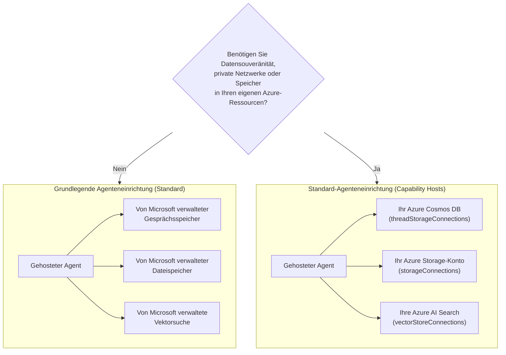

# Lektion 5: Produktions-gehostete Agents — Speicher, Arbeitsspeicher & Governance

In [Lektion 4](../lesson-4-agentdeployment/README.md) hast du den Developer Onboarding
Agent als **Microsoft Foundry Hosted Agent** bereitgestellt und ein ChatKit-Frontend davor gesetzt. Diese
Lektion beantwortete die Frage *„Wie stelle ich einen Agent bereit?“*. Diese Lektion beantwortet die nächsten
Fragen in einem Unternehmen: **Wo werden die Daten meines Agents gespeichert? Wer kontrolliert sie? Wie erfülle ich Compliance-,**
**Netzwerk- und Governance-Anforderungen?**

Die wichtigste Idee dieser Lektion ist der Unterschied zwischen einem **Hosted Agent** und einem
**Capability Host** — zwei Konzepte, die leicht zu verwechseln sind, aber völlig unterschiedliche
Probleme lösen.

## Lernziele

Am Ende dieser Lektion wirst du in der Lage sein:

- Zu erklären, was dir ein **Hosted Agent** bietet (von Microsoft verwaltete Ausführung) und was nicht.
- Zu erklären, was ein **Capability Host** ist und genau wann du einen brauchst.
- Zwischen **einfacher Agenteneinrichtung** (von Microsoft verwalteter Speicher) und **Standard-Agenteneinrichtung**
  (Bring-your-own Azure Ressourcen) zu wählen.
- Zu verstehen, wie **Konversationshistorie, Datei-Uploads und Vektorenspeicher** persistiert werden und wie du
  sie auf deine eigene Azure Cosmos DB, Azure Storage und Azure AI Search umleiten kannst.
- Governance-Kontrollen anzuwenden: Datenhoheit, private Netzwerke und **Hosted MCP Tool Genehmigung**.

---

## Voraussetzungen

1. Abgeschlossene [Lektion 4](../lesson-4-agentdeployment/README.md) — du hast einen gehosteten Agent bereitgestellt.
2. Ein **Microsoft Foundry** Projekt und ein Azure-Konto mit Berechtigung zur Ressourcenerstellung
   (Cosmos DB, Storage, Azure AI Search) und zum Zuweisen von Rollen in der Subscription/Ressourcengruppe.
3. **Azure CLI** authentifiziert: `az login` (und `az account set --subscription <id>` falls du
   mehr als eine Subscription hast).
4. **Azure Developer CLI** (`azd`) installiert — wird für den Standard-Setup Bereitstellungsprozess verwendet.
5. **Python 3.12+** mit den Kursabhängigkeiten installiert (`pip install -r ../requirements.txt`).
6. Eine aktuelle, nicht eingestellte Modelldeployment-Version (z. B. `gpt-5.1`). Vermeide eingestellte GPT-4o / GPT-4.1.

> Diese Lektion ist hauptsächlich konzeptionell und auf die Steuerungsebene fokussiert. Du kannst sie komplett lesen, ohne
> irgendetwas bereitzustellen, und dann die praktischen Übungen machen, wenn du bereit bist, eine
> Standard-Einrichtung zu konfigurieren.

---

## 1. Hosted Agents: Was Foundry für dich verwaltet

Ein **Hosted Agent** ist ein Agent, dessen *Ausführungsumgebung* vollständig vom Microsoft
Foundry Agent Service verwaltet wird. Wenn du einen gehosteten Agent bereitstellst (wie in Lektion 4),


- **Compute** — die Laufzeit, die deinen Agent-Code und deine Tools ausführt.
- **Skalierung** — Replikas skalieren je nach Last hoch oder runter (siehe `agent.yaml` `scale` in Lektion 4).
- **Identität** — eine verwaltete Identität für den Agent, damit er sich ohne Geheimnisse bei Azure authentifiziert.
- **Beobachtbarkeit** — Tracing und Telemetrie (siehe den Beobachtbarkeitsabschnitt in Lektion 3).


> **Wichtiger Punkt:** Du musst **keinen** Capability Host konfigurieren, nur um einen gehosteten


**Hosted Agents** bieten die von Microsoft verwaltete Ausführungsumgebung inklusive Compute, Skalierung,
Identität, Beobachtbarkeit und Sitzungsverwaltung. Du benötigst **keine** Capability Hosts, nur um


**Capability Hosts** werden nur benötigt, wenn du möchtest, dass der Agent Service **kunden-eigene
Ressourcen** statt Microsoft-verwalten Speicher verwendet. Wenn du mit dem Standard-
Microsoft-verwalteten Speicher, Vektorensuche und Konversationspersistenz zufrieden bist, ist


Wenn deine Organisation **Datenhoheit, private Netzwerke, Compliance-Kontrollen oder
Speicherung in deiner eigenen Azure Cosmos DB, Azure Storage Account und Azure AI Search Ressourcen** erfordert,


> Ein **Hosted Agent** bezieht sich darauf, *wo dein Agent läuft*. Ein **Capability Host** bezieht sich darauf, *wo die


| Anliegen | Hosted Agent | Capability Host |
|---------|--------------|-----------------|
| Compute / Skalierung / Identität | ✅ Bereitgestellt | — |
| Beobachtbarkeit / Tracing | ✅ Bereitgestellt | — |
| Verwaltung von Konversation & Thread-Sitzung | ✅ Bereitgestellt | Leitet um, *wo es gespeichert wird* |
| Wo die Konversationshistorie gespeichert wird | Standardmäßig Microsoft-verwaltet | Deine Azure Cosmos DB |
| Wo hochgeladene Dateien gespeichert werden | Standardmäßig Microsoft-verwaltet | Dein Azure Storage Account |
| Wo Vektor-Einbettungen gespeichert werden | Standardmäßig Microsoft-verwaltet | Deine Azure AI Search |
| Für das Ausführen eines Agents erforderlich? | ✅ Ja (es *ist* der Agent-Host) | ❌ Nein — optional |





- Entwicklung, Prototyping und Tests.
- Interne Tools, bei denen der Microsoft-verwaltete Speicher deine Datenhandhabungsrichtlinie erfüllt.


- **Datenhoheit** — alle Agentendaten müssen in deinem Azure-Abonnement/Region verbleiben.
- **Sicherheitskontrolle** — du musst deine eigenen Storage Accounts, Datenbanken und Suchdienste verwenden.
- **Compliance** — du hast regulatorische oder organisatorische Vorschriften, wo Daten gespeichert werden dürfen.


> **Empfehlung von Microsoft:** Verwende *separate* Foundry-Accounts/Projekte für Standard- und


Ein **Capability Host** ist eine Unterressource, die du auf **zwei Ebenen** konfigurierst: das Foundry
**Konto** und das Foundry **Projekt**. Er gibt dem Agent Service an, wo er Agentendaten speichern und verarbeiten soll:


1. **Konto vor Projekt.** Du kannst keinen Projekt-Capability Host erstellen, wenn nicht bereits ein
   Konto-Capability Host existiert.
2. **Keine Vererbung der Konfiguration.** Der **Projekt-Capability Host** ist der, den der Agent Service
   tatsächlich liest, um zu entscheiden, welche Speicher/Konversation/Vektor-Ressourcen verwendet werden.
   Konto-Ebenenverbindungen werden *nicht* automatisch vom Projekt verwendet — der Projekt-Capability Host muss


Capability Hosts referenzieren **Verbindungen** (erstellt in deinem Foundry Konto/Projekt), die auf


| Fähigkeit-Host Eigenschaft | Speichert | Deine Azure-Ressource |
|--------------------------|-----------|---------------------|
| `threadStorageConnections` | Agent-Definitionen + Konversationshistorie | Azure Cosmos DB |
| `storageConnections` | Datei-Uploads / Blob-Speicher | Azure Storage Account |
| `vectorStoreConnections` | Vektor-Einbettungen für Retrieval/Suche | Azure AI Search |


Jede Verbindung muss `authType`, `category`, `target` (der Service **Endpunkt-URL**, nicht die
Ressourcen-ID) und `metadata.ResourceId` (die vollständige Azure-Ressourcen-ID) enthalten,


Capability Hosts werden derzeit über die **Azure Resource Manager REST API** verwaltet (es gibt noch kein


```http
PUT https://management.azure.com/subscriptions/{subscriptionId}/resourceGroups/{rg}/providers/Microsoft.CognitiveServices/accounts/{account}/capabilityHosts/{name}?api-version=2025-06-01

{
  "properties": { "capabilityHostKind": "Agents" }
}
```


```http
PUT https://management.azure.com/subscriptions/{subscriptionId}/resourceGroups/{rg}/providers/Microsoft.CognitiveServices/accounts/{account}/projects/{project}/capabilityHosts/{name}?api-version=2025-06-01

{
  "properties": {
    "capabilityHostKind": "Agents",
    "threadStorageConnections": ["my-cosmosdb-connection"],
    "vectorStoreConnections":  ["my-ai-search-connection"],
    "storageConnections":      ["my-storage-connection"]
  }
}
```

> **Beschränkungen, die du beachten solltest:**
> - **Ein Capability Host pro Ebene.** Ein zweiter am gleichen Scope gibt den Fehler `409 Conflict` zurück.
> - **Keine Updates.** Um die Konfiguration zu ändern, musst du den Capability Host **löschen und neu erstellen**.
> - **Löschen ist destruktiv.** Durch das Löschen eines Capability Hosts verlieren Agenten den Zugriff auf die Dateien,


- Konversationen erscheinen in **deiner Azure Cosmos DB**.
- Hochgeladene Dateien erscheinen in **deinem Azure Storage Account**.


„Sitzungsverwaltung“ (ein Feature des Hosted Agent) und „wo Threads gespeichert werden“ (ein Anliegen des Capability Host)


- Ein **Thread** (Konversation) hält die geordneten Runden eines Chats. Die Responses API verknüpft
  Aufrufe über `previous_response_id` (das hast du in den Smoke Tests in Lektion 4 gesehen).
- Bei der **einfachen Einrichtung** lebt der Thread-/Konversationsstatus in Microsoft-verwaltem Speicher.
- Bei der **Standard-Einrichtung** wird derselbe Status in **deiner Azure Cosmos DB** über


Das ist der Unterschied zwischen einem Agent, der „sich innerhalb einer Sitzung erinnert“, und einem Unternehmens-


- [ ] **Entscheide dich für einfache oder Standard-Einrichtung** anhand der Fragen in §3 — dokumentiere die Entscheidung.
- [ ] **Datenhoheit:** falls erforderlich, konfiguriere Capability Hosts so, dass Konversationshistorie
      (Cosmos DB), Dateien (Storage) und Vektoren (AI Search) in deinem Abonnement/Region bleiben.
- [ ] **Privates Netzwerk:** bei Standard-Einrichtung beschränke den Verkehr mit Bring Your Own Virtual
      Network, damit Daten dein Netzwerk nicht verlassen (verhindert Datenabfluss).
- [ ] **RBAC:** gewähre minimale Rechte. Capability Hosts erstellen erfordert **Contributor** auf dem
      Foundry-Konto; Zugriff auf deine Azure-Ressourcen zuweisen erfordert **User Access Administrator**
      oder **Owner**.
- [ ] **Hosted MCP Tool Governance:** überprüfe jeden MCP-Server, den dein Agent aufrufen kann, und stelle einen
      **Genehmigungsmodus** ein (siehe §7). Setze niemals ein unüberprüftes externes Tool einem Produktionsagenten aus.
- [ ] **Beobachtbarkeit:** bestätige, dass Tracing/Telemetrie aktiviert ist (Lektion 3), damit du Toolaufrufe auditieren kannst.
- [ ] **Kosten:** BYO Ressourcen (Cosmos DB, AI Search, Storage) werden deinem Abonnement belastet — überwache und skaliere sie.


Der Developer Onboarding Agent aus Lektion 4 verwendet bereits ein **Hosted MCP Tool** — den


```python
client.get_mcp_tool(
    name="Microsoft Learn MCP",
    url="https://learn.microsoft.com/api/mcp",
    approval_mode="never_require",
)
```

Das **Model Context Protocol (MCP)** ist ein offener Standard, der einem Agenten ermöglicht, externe Tools
über eine einheitliche Schnittstelle zu entdecken und aufzurufen. **Hosted MCP Tools** erlauben Foundry, im Auftrag


- **`approval_mode`** — steuert, ob ein Mensch/Aufrufer jeden Toolaufruf genehmigen muss.
  - `never_require` ist praktisch für einen vertrauenswürdigen, schreibgeschützten Server wie Microsoft Learn.
  - Für Server, die **schreiben** oder sensible Systeme erreichen können, erfordert eine Genehmigung, dass ein Aufruf
    vor der Ausführung überprüft wird. Das ist dein **Genehmigungs-Workflow**.
- **Server-Whitelisting** — verbinde nur MCP-Server, die du überprüft und denen du vertraut hast. Behandle eine MCP


> **Probiere es aus:** Ändere den `approval_mode` des Agenten aus Lektion 4, sodass eine Genehmigung erforderlich ist,


1. **Klassifiziere ein Szenario.** Entscheide bei jedem der folgenden Fälle, ob *einfache* oder *Standard* Einrichtung vorzuziehen ist und begründe es:
   (a) eine Hackathon-Demo, (b) ein Gesundheits-Onboarding-Assistent, der PII verarbeitet, (c) ein interner
   FAQ-Bot, (d) ein Bankagent, der alle Daten regional speichern muss.
2. **Mappe den Speicher.** Wähle für den Agenten aus Lektion 4 die Capability-Host-Eigenschaft, die speichern würde:
   (a) den Chatverlauf, (b) hochgeladene Mitarbeiterdateien, (c) Vektor-Einbettungen.
3. **Entwirf einen Genehmigungs-Workflow.** Füge dem Agenten hypothetisch ein „Jira-Ticket erstellen“-MCP-Tool hinzu.
   Welchen `approval_mode` würdest du verwenden und warum?
4. **Kosten-Abwägung.** Schreibe zwei oder drei Sätze zu den Kostenfolgen des Wechsels von einfacher zu Standard-Einrichtung für einen stark frequentierten Agenten.

---

## Ressourcen

- [Capability Hosts — Microsoft Foundry](https://learn.microsoft.com/azure/foundry/agents/concepts/capability-hosts)
- [Standard-Agenteneinrichtung (integrierte Unternehmensreife)](https://learn.microsoft.com/azure/foundry/agents/concepts/standard-agent-setup)
- [Eigene Ressourcen verwenden](https://learn.microsoft.com/azure/foundry/agents/how-to/use-your-own-resources)

- [Richten Sie Ihre Agent-Umgebung ein (basic vs standard)](https://learn.microsoft.com/azure/foundry/agents/environment-setup)
- [Richten Sie privates Networking für den Foundry Agent Service ein](https://learn.microsoft.com/azure/foundry/agents/how-to/virtual-networks)
- [Fügen Sie eine Verbindung zu Ihrem Projekt hinzu](https://learn.microsoft.com/azure/foundry/how-to/connections-add)
- [Microsoft Learn MCP-Server](https://learn.microsoft.com/training/support/mcp)
- [Model Context Protocol](https://modelcontextprotocol.io/)

---

**Zurück:** [Lektion 4 — Agent Deployment](../lesson-4-agentdeployment/README.md) &nbsp;·&nbsp; **Weiter:** [Lektion 6 — Microsoft Toolbox](../lesson-6-toolbox/README.md)

---

<!-- CO-OP TRANSLATOR DISCLAIMER START -->
**Haftungsausschluss**:
Dieses Dokument wurde mit dem KI-Übersetzungsdienst [Co-op Translator](https://github.com/Azure/co-op-translator) übersetzt. Obwohl wir uns um Genauigkeit bemühen, beachten Sie bitte, dass automatisierte Übersetzungen Fehler oder Ungenauigkeiten enthalten können. Das Originaldokument in seiner Ursprungssprache gilt als maßgebliche Quelle. Bei kritischen Informationen wird eine professionelle menschliche Übersetzung empfohlen. Wir übernehmen keine Haftung für Missverständnisse oder Fehlinterpretationen, die aus der Verwendung dieser Übersetzung entstehen.
<!-- CO-OP TRANSLATOR DISCLAIMER END -->