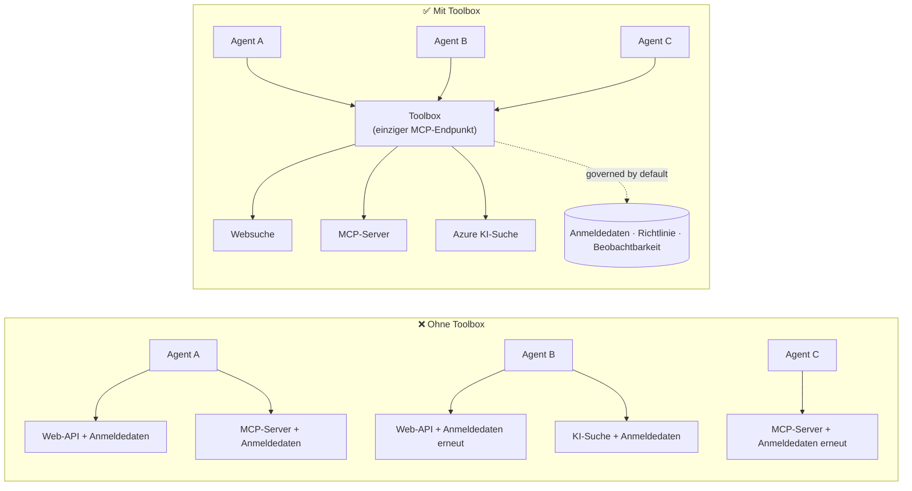

# Lektion 6: Microsoft Toolbox — Kontrollierte Werkzeuge für Agenten

In [Lektion 5](../lesson-5-hosted-agents-production/README.md) wird Ihr gehosteter Agent
produktiv mit der Speicher- und Verwaltungskonfiguration ausgeführt, die Ihre Organisation benötigt.
Werfen Sie jedoch einen Blick zurück auf den Agenten aus Lektion 4: Jedes Werkzeug war **hartkodiert**
in `main.py` — die Microsoft Learn MCP-URL, der File-Search-Vektor-Speicher und so weiter. Das
funktioniert für einen Agenten. Für eine Organisation mit Dutzenden von Agenten und Teams ist


Diese Lektion stellt **Microsoft Toolbox** vor: Die Art und Weise, wie Foundry Ihnen erlaubt,
einen kuratierten Satz von Werkzeugen **einmal** zu definieren, sie **zentral** zu verwalten und


- Das Problem der Werkzeugvermehrung erklären, das Toolbox löst.
- Die Säulen **Build** und **Consume** sowie die Werkzeugtypen, die eine Toolbox enthalten kann, beschreiben.
- Eine Toolbox-Version mit dem Foundry SDK **erstellen**.
- Eine Toolbox von einem Microsoft Agent Framework gehosteten Agenten über einen einzigen MCP-Endpunkt **nutzen**.
- **Versionierung** verwenden, um Werkzeugänderungen ohne Änderungen im Agentencode oder Neu-Bereitstellungen auszuliefern.


1. Abgeschlossene [Lektion 4](../lesson-4-agentdeployment/README.md) und idealerweise
   [Lektion 5](../lesson-5-hosted-agents-production/README.md).
2. Ein **Microsoft Foundry**-Projekt mit Berechtigung zum Erstellen und Verwalten von Toolbox-Ressourcen.
3. **Azure CLI** authentifiziert: `az login`. Die Foundry Toolbox-APIs benötigen den
   Tokenbereich `https://ai.azure.com/.default` (im folgenden Code gezeigt).
4. **Python 3.12+** mit den Kursabhängigkeiten installiert (`pip install -r ../requirements.txt`).


Ein einzelner Agent kann von vielen Werkzeugen abhängen – REST-APIs, MCP-Server, Connectoren und Abläufe – jeweils


- Teams **implementieren dieselben Werkzeuge mehrfach** unabhängig voneinander neu.
- **Zugangsdaten werden vervielfältigt** über Agenten und Repositories hinweg.
- **Governance wird inkonsistent** — jeder Agent setzt Politik eigenständig durch oder vergisst sie.


Entwickler stoßen an Grenzen — nicht, weil die Modelle unfähig wären, sondern weil **die Integration der




Unternehmen verfügen bereits über die Infrastruktur — Gateways, Credential Vaults, Richtlinien, Observability.
Was fehlte, war eine Entwicklererfahrung, die das zu etwas **Wiederverwendbarem,


Eine **Toolbox** ist eine **verwaltete Foundry-Ressource**. Sie definieren einmal einen kuratierten Werkzeugsatz, verwalten
ihn zentral in Foundry und bieten ihn über **einen einzigen MCP-kompatiblen Endpunkt** an,
den jeder Agent nutzen kann. Zur Laufzeit übernimmt die Plattform **Credential Injection, Token-Aktualisierung und


Da eine Toolbox eine verwaltete Ressource ist, können Sie Werkzeuge **hinzufügen, entfernen oder neu konfigurieren, ohne


Toolbox deckt den Werkzeug-Lebenszyklus durch vier Säulen ab; **Build** und **Consume** sind heute verfügbar:

| Säule | Status | Was es ermöglicht |
|--------|--------|-----------------|
| **Build** | Heute verfügbar | Werkzeuge auswählen, Authentifizierung zentral konfigurieren, eine wiederverwendbare Toolbox veröffentlichen, die jedes Team nutzen kann. |
| **Consume** | Heute verfügbar | Jeden Agenten an einen MCP-kompatiblen Endpunkt anbinden, um alle Werkzeuge in der Toolbox dynamisch zu entdecken und aufzurufen. |

Die Nutzungsschnittstelle ist **offen**: Jeder MCP-kompatible Runtime oder Client kann eine Toolbox verwenden —
Microsoft Agent Framework, LangGraph, GitHub Copilot, Claude Code, Microsoft Copilot Studio oder
eigener Code.

### Werkzeugtypen, die eine Toolbox enthalten kann

Web Search · MCP · Azure AI Search · Code Interpreter · File Search · OpenAPI · **Agent-to-Agent
(A2A)** · Fabric IQ · Tool Search · Work IQ · Browser Automation · Skill-Referenzen, sowie eine
**Guardrail (RAI)-Richtlinie**, die auf Toolbox-Ebene angewandt wird.

> **Tipp:** Fügen Sie **jedem** Werkzeug eine `description` hinzu, damit das Modell das richtige auswählen kann.
> Eine Toolbox erlaubt höchstens **ein unbenanntes Werkzeug pro Typ** — jedem weiteren Exemplar desselben Typs
> geben Sie einen einzigartigen `name`, sonst erhalten Sie einen `invalid_payload`-Fehler.

---

## 3. Eine Toolbox erstellen

Toolboxes werden mit den Foundry SDKs (Python/.NET/JavaScript), der REST-API, `azd` und dem
**Microsoft Foundry Toolkit für VS Code** verwaltet. Hier ist das Python (`azure-ai-projects`) Muster:

```python
from azure.identity import DefaultAzureCredential
from azure.ai.projects import AIProjectClient
from azure.ai.projects.models import MCPTool, ToolboxSearchPreviewTool, WebSearchTool

endpoint = "https://<your-foundry-account>.services.ai.azure.com/api/projects/<your-project>"
project = AIProjectClient(endpoint=endpoint, credential=DefaultAzureCredential())

toolbox_version = project.toolboxes.create_toolbox_version(
    name="agent-tools",
    description="Web search + an MCP server + tool search",
    tools=[
        WebSearchTool(),
        MCPTool(
            server_label="myserver",
            server_url="https://your-mcp-server.example.com",
            require_approval="never",
            project_connection_id="my-key-auth-connection",  # Anmeldeinformationen befinden sich in Foundry
        ),
        ToolboxSearchPreviewTool(),
    ],
)
print(f"Created toolbox: {toolbox_version.name}, version: {toolbox_version.version}")
```

Beachten Sie, was Sie **nicht** tun: keine Geheimnisse im Agenten. Credentials werden von einer Foundry
**Verbindung** (`project_connection_id`) gehalten und von der Plattform zur Aufrufzeit injiziert.

> **Hinweis zur Vorschau.** Toolbox-**Verwaltung** (Erstellen/Aktualisieren von Versionen) ist eine Vorschau-Funktion.
> Die `project.toolboxes.*`-Operationen oben sind in Vorschau-SDK-Builds enthalten, in der REST-API, in `azd`
> und im **Foundry Toolkit für VS Code** — sie sind **nicht** im festgesetzten `azure-ai-projects`, das
> andernorts in diesem Kurs verwendet wird. Betrachten Sie den Ausschnitt oben als Form des Build-Schritts;
> für einen Klick-durch Pfad erstellen Sie die Toolbox im **Foundry-Portal** oder mit dem **Foundry Toolkit**.
> Der **Consume**-Schritt unten funktioniert heute mit dem festgesetzten SDK des Kurses.

---

## 4. Eine Toolbox von Ihrem Agenten nutzen

Eine Toolbox stellt einen **MCP-Endpunkt** bereit. Es gibt zwei Muster:

| Rolle | Endpunkt | Wann zu verwenden |
|------|----------|-------------|
| **Toolbox-Nutzer** | `{project_endpoint}/toolboxes/{name}/mcp?api-version=v1` | Agenten verbinden. Dient immer die **Standardversion** aus. |
| **Toolbox-Entwickler** | `{project_endpoint}/toolboxes/{name}/versions/{version}/mcp?api-version=v1` | Eine spezifische Version testen, bevor sie beworben wird. |

> **Verbinden Sie Agenten mit dem *Nutzer*-Endpunkt.** Weil dieser immer die Standardversion ausliefert, verbinden Sie

> kann neue Versionen **freigeben, ohne Agentencode zu ändern oder neu bereitzustellen**.

### Integration mit einem gehosteten Microsoft Agent Framework Agent

Denken Sie daran, dass der Agent aus Lektion 4 ein einzelnes hartkodiertes MCP-Tool mit `client.get_mcp_tool(...)` hinzugefügt hat. Mit
Toolbox zeigen Sie stattdessen auf **ein** `MCPStreamableHTTPTool`-Tool am Toolbox-Endpunkt – und der Agent
erhält **jedes** Tool in der Toolbox, zentral gesteuert:

```python
import httpx
from azure.identity import DefaultAzureCredential, get_bearer_token_provider
from agent_framework import MCPStreamableHTTPTool

# Auth: Foundry-Toolbox benötigt den https://ai.azure.com/.default-Bereich
credential = DefaultAzureCredential()
token_provider = get_bearer_token_provider(credential, "https://ai.azure.com/.default")
http_client = httpx.AsyncClient(auth=_ToolboxAuth(token_provider), timeout=120.0)

TOOLBOX_ENDPOINT = os.environ["TOOLBOX_ENDPOINT"]  # Plattform-injiziert zur Laufzeit

mcp_tool = MCPStreamableHTTPTool(
    name="toolbox",
    url=TOOLBOX_ENDPOINT,
    http_client=http_client,
    load_prompts=False,
)

agent = chat_client.as_agent(
    name="my-toolbox-agent",
    instructions="You are a helpful assistant with access to Foundry toolbox tools.",
    tools=[mcp_tool],
)
```

Entsprechende `.env` (Hinweis: Verwenden Sie ein **aktuelles** Modell wie `gpt-5.1`, **nicht** das eingestellte
`gpt-4o`):

```env
FOUNDRY_PROJECT_ENDPOINT=https://<account>.services.ai.azure.com/api/projects/<project>
TOOLBOX_ENDPOINT=https://<account>.services.ai.azure.com/api/projects/<project>/toolboxes/agent-tools/mcp?api-version=v1
AZURE_AI_MODEL_DEPLOYMENT_NAME=gpt-5.1
```

> **Zunächst verifizieren.** Bevor Sie den vollständigen Agent verdrahten, verbinden Sie ein MCP Client SDK (`pip install mcp`) mit
> dem **versionsspezifischen** Endpunkt und listen die Tools auf, um zu bestätigen, dass sie erwartungsgemäß geladen werden.

### Führen Sie das Consume-Beispiel aus

Diese Lektion enthält ein ausführbares Consume-Seiten-Beispiel, [`toolbox_agent.py`](../../../lesson-6-toolbox/toolbox_agent.py). Es verwendet
dasselbe `FoundryChatClient.get_mcp_tool(...)`-Muster, das Sie in Lektion 2 gelernt haben, zeigt aber das eine
MCP-Tool auf Ihren **Toolbox**-Endpunkt – sodass der Agent jedes zentral gesteuerte Tool in der Toolbox erhält:

```bash
# Setzen Sie in Ihrer .env TOOLBOX_ENDPOINT auf Ihren Toolbox-Verbraucherendpunkt, dann:
python lesson-6-toolbox/toolbox_agent.py
```

Öffnen Sie die ausgegebene URL `http://localhost:8096` und stellen Sie eine Frage, die eines Ihrer
Toolbox-Tools verwendet. Fügen Sie ein Tool hinzu oder aktualisieren Sie ein Tool in der Toolbox und fragen Sie erneut – **ohne diesen
Code zu ändern** –, um zentrale Steuerung und Versionierung in Aktion zu sehen.

---

## 5. Versionierung: Tool-Änderungen sicher bereitstellen

Die Versionierung von Toolbox gibt Ihnen explizite Kontrolle darüber, wann Änderungen wirksam werden:

1. **Erstellen** Sie eine neue Toolbox-Version mit dem aktualisierten Toolsatz.
2. **Testen** Sie diese gegen den versionsspezifischen (Entwickler-) Endpunkt.
3. **Führen** Sie sie als `default_version` ein, wenn Sie bereit sind.

Jeder Agent, der auf den **Consumer**-Endpunkt zeigt, übernimmt die eingestellte Version automatisch — **keine
Codeänderungen, keine Neu-Bereitstellung**. (Die erste Version, die Sie erstellen, wird automatisch zur Standardversion.)

Dies ist das Tool-Governance-Äquivalent eines Blue/Green-Deployments: Sie validieren eine Änderung isoliert,
und schalten dann die Standardversion für alle Verbraucher gleichzeitig um.

---

## 6. Governance: wie Toolbox die Kontrolle verbessert

Toolbox ist **standardmäßig gesteuert**. Die Steuerungshebel, die Sie kennen sollten:

- **RBAC.** Weisen Sie jeder Identität die **Foundry User**-Rolle im Projekt zu: dem **Entwickler**, der
  Toolbox-Versionen verwaltet, der **Managed Identity des Agents** (für gehostete Agenten, die zur Laufzeit Tools aufrufen),
  und bei OAuth-Flows dem **Endnutzer**, dessen Identität vertreten wird.
- **Zentralisierte Anmeldeinformationen.** Tool-Zugangsdaten befinden sich in Foundry **Connections**, nicht im Agentencode
  oder `.env`-Dateien. Die Plattform injiziert sie und aktualisiert Tokens zur Laufzeit.
- **Guardrails (RAI-Richtlinie).** Hängen Sie eine benannte Responsible-AI-Richtlinie an eine Toolbox-Version über
  `policies.rai_config.rai_policy_name` an. Sie läuft auf der **Toolbox-Ebene**, unabhängig von jeglichem
  modellbasierten Inhaltsfilter und filtert Tool-Eingaben und -Ausgaben.
- **MCP-Zulassung.** Pro Tool steuert `require_approval`, ob ein MCP-Tool-Aufruf genehmigt werden muss —
  dasselbe Genehmigungs-Workflow-Konzept, das Sie in [Lektion 5 §7](../lesson-5-hosted-agents-production/README.md#7-hosted-mcp-tools--approval-workflows) gesehen haben.
- **Private Netzwerke.** Toolbox unterstützt virtuelle Netzwerk-Konfigurationen für Unternehmen, die
  den Datenverkehr innerhalb ihres Netzwerks halten.
- **Sichtbarkeit.** Da Tools zentral katalogisiert sind, erhalten Sie endlich einen Überblick darüber, was
  existiert und wer es verwendet.

---

## Praxisübungen

1. **Refaktorieren Sie Lektion 4.** Der Agent aus Lektion 4 kodiert das Microsoft Learn MCP-Tool hart. Skizzieren Sie, wie Sie
   dieses Tool in eine `agent-tools`-Toolbox verschieben und `main.py` auf den Toolbox-Consumer-Endpunkt umstellen würden.
   Was ändert sich in `main.py`? Was ist dort nicht mehr enthalten?
2. **Planen Sie ein Versions-Upgrade.** Sie müssen einen Web Search-Tool zu einer aktiven Toolbox hinzufügen, die von fünf
   Agenten verwendet wird. Beschreiben Sie die create → test → promote-Sequenz und erklären Sie, warum keiner der fünf Agenten
   neu bereitgestellt werden muss.
3. **Wählen Sie die Auth-Identitäten.** Für einen gehosteten Agenten, der über die Toolbox ein OAuth-basiertes MCP-Tool aufruft,
   listen Sie auf, welche Identitäten die **Foundry User**-Rolle benötigen und warum.
4. **Guardrail-Platzierung.** Erklären Sie den Unterschied zwischen einem modellbasierten Inhaltsfilter und einer
   Toolbox-Guardrail, und geben Sie ein Szenario an, in dem Sie speziell die Toolbox-Guardrail benötigen.

---

## Ressourcen

- [Erstellen, testen und bereitstellen einer Toolbox in Foundry](https://learn.microsoft.com/azure/foundry/agents/how-to/tools/toolbox)
- [Tool-Katalog — Foundry Agent Service](https://learn.microsoft.com/azure/foundry/agents/concepts/tool-catalog)
- [Microsoft Agent Framework — Microsoft Foundry Anbieter (Tools)](https://learn.microsoft.com/agent-framework/agents/providers/microsoft-foundry)
- [Guardrails Übersicht](https://learn.microsoft.com/azure/foundry/guardrails/guardrails-overview)
- [Erste Schritte mit Foundry in VS Code (Foundry Toolkit)](https://learn.microsoft.com/azure/ai-foundry/how-to/develop/get-started-projects-vs-code)
- [Model Context Protocol](https://modelcontextprotocol.io/)

---

**Vorherige:** [Lektion 5 — Produktions-Hosted Agents](../lesson-5-hosted-agents-production/README.md)
&nbsp;·&nbsp; **Nächste:** [Lektion 7 — Multi-Agent & A2A](../lesson-7-multi-agent-a2a/README.md)

---

<!-- CO-OP TRANSLATOR DISCLAIMER START -->
**Haftungsausschluss**:
Dieses Dokument wurde mit dem KI-Übersetzungsdienst [Co-op Translator](https://github.com/Azure/co-op-translator) übersetzt. Obwohl wir uns um Genauigkeit bemühen, beachten Sie bitte, dass automatisierte Übersetzungen Fehler oder Ungenauigkeiten enthalten können. Das Originaldokument in seiner Ursprungssprache gilt als maßgebliche Quelle. Bei kritischen Informationen wird eine professionelle menschliche Übersetzung empfohlen. Wir übernehmen keine Haftung für Missverständnisse oder Fehlinterpretationen, die aus der Verwendung dieser Übersetzung entstehen.
<!-- CO-OP TRANSLATOR DISCLAIMER END -->