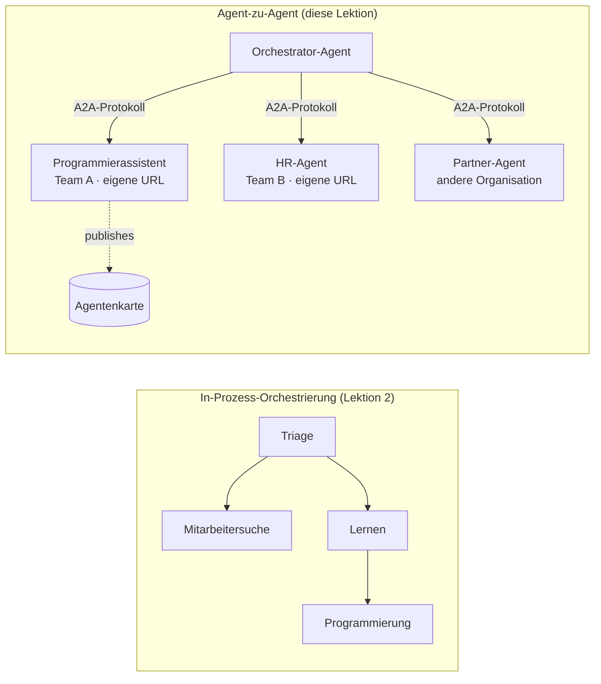

# Lektion 7: Multi-Agent-Orchestrierung & Agent-to-Agent (A2A)

Ab [Lektion 6](../lesson-6-toolbox/README.md) kannst du gesteuerte Tools und gehostete Agenten erstellen.
Aber in echten Systemen wird selten **ein** Agent verwendet. Mit zunehmender Skalierung setzt man **viele** Agenten zusammen – einige gehören dir,
einige anderen Teams, andere laufen komplett in anderen Organisationen. Diese Lektion behandelt,
wie Agenten **zusammenarbeiten**.

Du hast bereits eine Form von Multi-Agent-Design in
[Lektion 2 mit `agent-orchestration.py`](../lesson-2-agent-development/README.md) kennengelernt: das **Handoff-**
muster, bei dem ein Triage-Agent **innerhalb eines einzelnen Prozesses** an Spezialisten weiterleitet.
Diese Lektion geht eine Ebene höher — zu **Agent-to-Agent (A2A)**, dem offenen Protokoll für Agenten, die als unabhängige
**netzwerkgebundene Dienste** laufen und sich über Prozess-, Team- und Organisationsgrenzen hinweg aufrufen.

## Lernziele

Am Ende dieser Lektion wirst du in der Lage sein:

- Den Unterschied zwischen **in-process-Orchestrierung** (Handoff/Workflows) und
  **Agent-to-Agent (A2A)** Kommunikation zu erklären und die richtige Variante zu wählen.
- Die Bausteine von A2A zu beschreiben: **Agent Card**, **Skills**, **Tasks** und **Discovery**.
- Einen Microsoft Agent Framework Agent als A2A-Dienst mit `A2AExecutor` **bereitstellen**.
- Einen entfernten Agenten als netzwerkgebundenen Peer mit `A2AAgent` **nutzen**.
- Unternehmensrelevante Anforderungen an A2A anzuwenden: **Sicherheit, Identität, Governance, Observability und Kosten**.

---

## Voraussetzungen

1. Abgeschlossene [Lektion 2](../lesson-2-agent-development/README.md) (Agentenentwicklung & Orchestrierung).
2. Ein **Microsoft Foundry** Projekt mit einer aktuellen Modellbereitstellung (z.B. `gpt-5.1` und
   `gpt-5-codex` für das Codierungsbeispiel). Vermeide veraltete GPT-4o / GPT-4.1 Modelle.
3. **Azure CLI** authentifiziert: `az login`.
4. **Python 3.12+** mit den Kursabhängigkeiten installiert (`pip install -r ../requirements.txt`).
   Lektion 7 fügt die Preview-Pakete `agent-framework-a2a`, `a2a-sdk` und `uvicorn` hinzu.
5. `FOUNDRY_PROJECT_ENDPOINT` und `FOUNDRY_MODEL` in deiner `.env` gesetzt (siehe Kurs-README).

---

## 1. Zwei Arten, wie Agenten zusammenarbeiten

Es gibt kein einzelnes „Multi-Agent“-Muster. Wähle dasjenige, das zu deiner **Grenze** passt:

| Muster | Wo Agenten laufen | Wie sie verbunden sind | Anwendungsfall |
|---------|------------------|------------------|----------|
| **Handoff / Workflow** (Lektion 2) | Ein Prozess, eine Codebasis | In-Memory-Graph (`HandoffBuilder`, `WorkflowBuilder`) | Du besitzt alle Agenten und setzt sie gemeinsam ein. |
| **Agent-to-Agent (A2A)** (diese Lektion) | Separate Dienste, separate Lebenszyklen | Offenes **A2A-Protokoll** über HTTP, entdeckt via **Agent Cards** | Agenten gehören verschiedenen Teams/Organisationen, skalieren unabhängig oder sind in unterschiedlichen Frameworks geschrieben. |

Handoff dreht sich um **Routing innerhalb einer Anwendung**. A2A bedeutet **Zusammensetzung von Agenten als
unabhängige Dienste** — das Agenten-Pendant zum Wechsel von Funktionsaufrufen zu Microservices.



> **Sie fügen sich zusammen.** Ein Orchestrator, den du mit `HandoffBuilder` baust, kann **remote A2A Agenten**
> als Teilnehmer haben — In-Process-Routing zu Diensten, die selbst irgendwo anders laufen.

---

## 2. Die Bausteine von A2A

A2A ist ein **offenes Protokoll** (nicht Microsoft-spezifisch), deshalb kann ein A2A Agent vom Microsoft Agent Framework,
LangGraph, eigenem Code oder dem Stack eines anderen Unternehmens genutzt werden. Vier Konzepte sind wichtig:

- **Agent Card** — ein kleines JSON-Dokument, veröffentlicht unter
  `/.well-known/agent-card.json`, das den Agenten mit **Name, Beschreibung, URL, Version,
  Skills und Fähigkeiten** beschreibt. So entdeckt ein Client, was ein entfernter Agent kann.
- **Skills** — die deklarierten Dinge, die der Agent kann (`id`, `name`, `description`, `tags`,
  `examples`). Clients (und Modelle) nutzen sie, um zu entscheiden, ob sie den Agenten aufrufen.
- **Tasks** — ein Aufruf an einen A2A Agenten ist eine **Task** mit Lebenszyklus (eingereicht → arbeitet →
  abgeschlossen/fehlgeschlagen). Der Server verwaltet Tasks in einem **Task-Speicher**; Streaming-Updates werden unterstützt.
- **Discovery** — ein Client, der nur eine URL hat, lädt die Agent Card und weiß, wie der Agent aufgerufen wird.

---

## 3. Einen Agenten als A2A-Dienst bereitstellen — `a2a_server.py`

Die **Build/Serve**-Seite wickelt jeden Microsoft Agent Framework Agent mit `A2AExecutor` ab und hängt ihn
an eine A2A HTTP-Anwendung an. Siehe [`a2a_server.py`](../../../lesson-7-multi-agent-a2a/a2a_server.py). Die zentrale Verbindung:

```python
from agent_framework.a2a import A2AExecutor
from a2a.server.apps import A2AStarletteApplication
from a2a.server.request_handlers import DefaultRequestHandler
from a2a.server.tasks import InMemoryTaskStore
from a2a.types import AgentCapabilities, AgentCard, AgentSkill

agent = client.as_agent(name="coding-assistant", instructions="...")

agent_card = AgentCard(
    name="Coding Assistant",
    description="Generates runnable code samples...",
    url="http://localhost:9000/",
    version="1.0.0",
    capabilities=AgentCapabilities(streaming=True),
    default_input_modes=["text"],
    default_output_modes=["text"],
    skills=[AgentSkill(id="generate-code", name="Generate code",
                       description="Write a runnable code snippet.", tags=["code"])],
)

request_handler = DefaultRequestHandler(
    agent_executor=A2AExecutor(agent),
    task_store=InMemoryTaskStore(),
)
app = A2AStarletteApplication(agent_card=agent_card, http_handler=request_handler).build()
# bereitgestellt mit uvicorn auf Port 9000
```

Beachte, dass der Agenten-Code **unverändert bleibt** — `A2AExecutor` passt deinen bestehenden Agenten an das Protokoll an.
Die Agent Card macht ihn **entdeckbar** für jeden A2A-Client.

---

## 4. Einen entfernten Agenten nutzen — `a2a_client.py`

Die **Consume**-Seite verbindet sich mit einem entfernten Agenten **per URL**, lädt die Agent Card und ruft ihn
genau wie einen lokalen Agenten auf. Siehe [`a2a_client.py`](../../../lesson-7-multi-agent-a2a/a2a_client.py):

```python
from agent_framework.a2a import A2AAgent

remote_agent = A2AAgent(name="remote-coding-assistant", url="http://localhost:9000")
result = await remote_agent.run("Write a Python function that reverses a string.")
print(result.text)
```

Genau das ist der Sinn von A2A: Von der Anrufer-Seite verhält sich ein entfernter Agent wie jeder andere
`agent_framework` Agent, so dass du ihn in einen Workflow integrieren oder an ihn weiterleiten kannst —
auch wenn er in einem anderen Prozess läuft, auf einem anderen Rechner, in einer anderen Team-Verantwortung.

### Führe es durchgängig aus

```bash
# Terminal 1 — starte den A2A-Dienst
python a2a_server.py

# Terminal 2 — rufe ihn auf
python a2a_client.py "Write a Python function that reverses a string."
```

Du wirst sehen, wie die Antwort des Coding-Assistenten über das A2A-Protokoll ankommt. Öffne
`http://localhost:9000/.well-known/agent-card.json` im Browser, um die veröffentlichte Agent Card anzuschauen.

---

## 5. Unternehmensanforderungen

Agenten zu netzwerkgebundenen Diensten zu machen bringt dieselben Herausforderungen mit sich wie jedes verteilte System —
plus einige KI-spezifische:

- **Identität & Authentifizierung.** Ein A2A Agent darf niemals unauthentifiziert offen sein. Die Agent Card enthält
  `security` / `security_schemes`, und `A2AAgent` akzeptiert einen `auth_interceptor`, damit Anrufer
  Zugangsdaten anhängen (OAuth Bearer Tokens, API-Schlüssel). Verwende Entra ID / verwaltete Identitäten für
  Service-zu-Service-Auth in der Produktion; setze den Dienst hinter eine Gateway.
- **Governance.** Kombiniere A2A mit [Lektion 6's Toolbox](../lesson-6-toolbox/README.md): ein entfernter
  Agent kann als **A2A-Tool** in einer gesteuerten Toolbox veröffentlicht werden, sodass RBAC, Credential Injection
  und Guardrail-Richtlinien zentral gelten.
- **Observability.** Eine Anfrage überschreitet nun Prozessgrenzen, also propagiert Tracing über den Aufruf hinweg.
  Aktiviere [Foundry Observability / OpenTelemetry](../lesson-3-agent-evals/README.md) sowohl auf dem
  Orchestrator als auch auf jedem entfernten Agenten, um einen End-to-End-Trace zu erhalten.
- **Versionierung.** Die Agent Card besitzt eine `version`. Behandle sie wie eine API: additive Änderungen sind sicher;
  das Brechen eines Skill-Vertrags erfordert eine neue Version und eine Migrationsphase für Konsumenten.
- **Zuverlässigkeit.** Entfernte Agenten können unabhängig ausfallen. Setze Timeouts (`A2AAgent(timeout=...)`), handhabe
  Teilfehler und verhindere, dass ein langsamer Peer die gesamte Orchestrierung blockiert.
- **Kosten.** Jeder Remote-Agentenaufruf ist ein eigener Modellaufruf. Fan-out vervielfacht den Token-Verbrauch —
  kalkuliere dafür dein Budget und bevorzuge Routing zu **einem** besten Agenten statt Broadcasting an viele.

---

## Praxisübungen

1. **Füge einen zweiten Dienst hinzu.** Kopiere `a2a_server.py`, um den **employee-search** Agenten auf Port
   9001 mit eigener Agent Card und Skills bereitzustellen. Starte beide und lass einen Client beide aufrufen.
2. **Orchestrierung von entfernten Peers.** Baue einen kleinen `HandoffBuilder` (oder einfachen Router), dessen Teilnehmer
   zwei `A2AAgent`s sind, die auf deine beiden Dienste zeigen. Leite eine Abfrage an den richtigen weiter.
3. **Sichere es ab.** Füge dem Client einen `auth_interceptor` hinzu und erfordere auf dem Server ein Bearer-Token.
   Was fällt aus, wenn das Token fehlt? Wo würdest du das Token in Produktion speichern?
4. **Handoff vs. A2A.** Schreibe zwei kurze Absätze: Wann behältst du das In-Process-Handoff aus Lektion 2 bei,
   und wann rechtfertigt die zusätzliche Komplexität von A2A? Nenne jeweils ein konkretes Beispiel.

---

## Ressourcen

- [Agent-to-Agent (A2A) — Microsoft Agent Framework](https://learn.microsoft.com/agent-framework/user-guide/agent-orchestration/a2a)
- [Multi-Agent-Orchestrierung — Microsoft Agent Framework](https://learn.microsoft.com/agent-framework/user-guide/agent-orchestration/)
- [A2A Protokoll-Spezifikation](https://a2a-protocol.org/)
- [A2A Python SDK (`a2a-sdk`)](https://github.com/a2aproject/a2a-python)
- [Foundry Agent Service — Multi-Agent Muster](https://learn.microsoft.com/azure/ai-foundry/agents/concepts/connected-agents)

---

**Vorherige:** [Lektion 6 — Microsoft Toolbox](../lesson-6-toolbox/README.md)

---

<!-- CO-OP TRANSLATOR DISCLAIMER START -->
**Haftungsausschluss**:
Dieses Dokument wurde mit dem KI-Übersetzungsdienst [Co-op Translator](https://github.com/Azure/co-op-translator) übersetzt. Obwohl wir uns um Genauigkeit bemühen, beachten Sie bitte, dass automatisierte Übersetzungen Fehler oder Ungenauigkeiten enthalten können. Das Originaldokument in seiner Ursprungssprache gilt als maßgebliche Quelle. Bei kritischen Informationen wird eine professionelle menschliche Übersetzung empfohlen. Wir übernehmen keine Haftung für Missverständnisse oder Fehlinterpretationen, die aus der Verwendung dieser Übersetzung entstehen.
<!-- CO-OP TRANSLATOR DISCLAIMER END -->