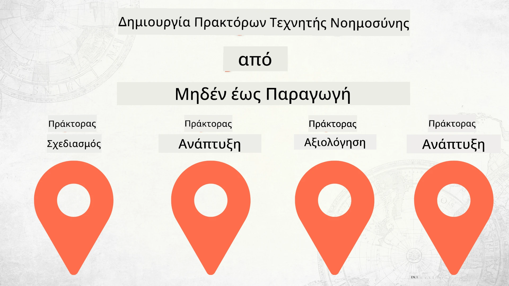

# Δημιουργία Πρακτόρων AI από το Μηδέν μέχρι την Παραγωγή



### 🌐 Υποστήριξη Πολλών Γλωσσών

#### Υποστηρίζεται μέσω GitHub Action (Αυτοματοποιημένο & Πάντα Ενημερωμένο)

<!-- CO-OP TRANSLATOR LANGUAGES TABLE START -->
[Αραβικά](../ar/README.md) | [Βεγγαλικά](../bn/README.md) | [Βουλγαρικά](../bg/README.md) | [Βιρμανικά (Myanmar)](../my/README.md) | [Κινέζικα (Απλοποιημένα)](../zh-CN/README.md) | [Κινέζικα (Παραδοσιακά, Χονγκ Κονγκ)](../zh-HK/README.md) | [Κινέζικα (Παραδοσιακά, Μακάο)](../zh-MO/README.md) | [Κινέζικα (Παραδοσιακά, Ταϊβάν)](../zh-TW/README.md) | [Κροατικά](../hr/README.md) | [Τσέχικα](../cs/README.md) | [Δανέζικα](../da/README.md) | [Ολλανδικά](../nl/README.md) | [Εσθονικά](../et/README.md) | [Φινλανδικά](../fi/README.md) | [Γαλλικά](../fr/README.md) | [Γερμανικά](../de/README.md) | [Ελληνικά](./README.md) | [Εβραϊκά](../he/README.md) | [Χίντι](../hi/README.md) | [Ουγγρικά](../hu/README.md) | [Ινδονησιακά](../id/README.md) | [Ιταλικά](../it/README.md) | [Ιαπωνικά](../ja/README.md) | [Κανάντα](../kn/README.md) | [Κορεατικά](../ko/README.md) | [Λιθουανικά](../lt/README.md) | [Μαλαΐικα](../ms/README.md) | [Μαλαγιαλάν](../ml/README.md) | [Μαράθι](../mr/README.md) | [Νεπάλι](../ne/README.md) | [Νιγηριανά Πίνγκιν](../pcm/README.md) | [Νορβηγικά](../no/README.md) | [Περσικά (Φαρσί)](../fa/README.md) | [Πολωνικά](../pl/README.md) | [Πορτογαλικά (Βραζιλία)](../pt-BR/README.md) | [Πορτογαλικά (Πορτογαλία)](../pt-PT/README.md) | [Πουντζάμπι (Γκουρμούκι)](../pa/README.md) | [Ρουμανικά](../ro/README.md) | [Ρωσικά](../ru/README.md) | [Σερβικά (Κυριλλικά)](../sr/README.md) | [Σλοβακικά](../sk/README.md) | [Σλοβενικά](../sl/README.md) | [Ισπανικά](../es/README.md) | [Σουαχίλι](../sw/README.md) | [Σουηδικά](../sv/README.md) | [Ταγκαλόγκ (Φιλιππινέζικα)](../tl/README.md) | [Ταμίλ](../ta/README.md) | [Τελούγκου](../te/README.md) | [Ταϊλανδικά](../th/README.md) | [Τούρκικα](../tr/README.md) | [Ουκρανικά](../uk/README.md) | [Ουρντού](../ur/README.md) | [Βιετναμέζικα](../vi/README.md)

> **Προτιμάτε να Κλωνοποιήσετε Τοπικά;**

> Αυτό το αποθετήριο περιλαμβάνει μεταφράσεις σε περισσότερες από 50 γλώσσες, γεγονός που αυξάνει σημαντικά το μέγεθος λήψης. Για να κλωνοποιήσετε χωρίς μεταφράσεις, χρησιμοποιήστε sparse checkout:
> ```bash
> git clone --filter=blob:none --sparse https://github.com/microsoft/Building-AI-Agents-From-Zero-To-Production.git
> cd Building-AI-Agents-From-Zero-To-Production
> git sparse-checkout set --no-cone '/*' '!translations' '!translated_images'
> ```
> Αυτό σας δίνει τα πάντα που χρειάζεστε για να ολοκληρώσετε το μάθημα με πολύ πιο γρήγορη λήψη.
<!-- CO-OP TRANSLATOR LANGUAGES TABLE END -->

## Ένα μάθημα που διδάσκει τα βασικά της διαδικασίας ανάπτυξης Πρακτόρων AI

[](https://github.com/microsoft/Building-AI-Agents-From-Zero-To-Production/blob/master/LICENSE?WT.mc_id=academic-105485-koreyst)
[](https://GitHub.com/microsoft/Building-AI-Agents-From-Zero-To-Production/graphs/contributors/?WT.mc_id=academic-105485-koreyst)
[](https://GitHub.com/microsoft/Building-AI-Agents-From-Zero-To-Production/issues/?WT.mc_id=academic-105485-koreyst)
[](https://GitHub.com/microsoft/Building-AI-Agents-From-Zero-To-Production/pulls/?WT.mc_id=academic-105485-koreyst)
[](http://makeapullrequest.com?WT.mc_id=academic-105485-koreyst)

[](https://discord.gg/Kuaw3ktsu6)

## 🌱 Ξεκινώντας

Αυτό το μάθημα περιλαμβάνει μαθήματα που καλύπτουν τα βασικά για την κατασκευή και ανάπτυξη Πρακτόρων AI.

Κάθε μάθημα βασίζεται στο προηγούμενο, οπότε προτείνουμε να ξεκινήσετε από την αρχή και να προχωρήσετε μέχρι το τέλος.

Αν θέλετε να εξερευνήσετε περισσότερα γύρω από θέματα Πρακτόρων AI, μπορείτε να δείτε το [Μάθημα για Αρχάριους στους Πράκτορες AI](https://aka.ms/ai-agents-beginners).

### Γνωρίστε Άλλους Μαθητές, Λάβετε Απαντήσεις στις Ερωτήσεις σας

Αν κολλήσετε ή έχετε οποιεσδήποτε ερωτήσεις σχετικά με τη δημιουργία Πρακτόρων AI, μπείτε στο αποκλειστικό μας κανάλι Discord στο [Microsoft Foundry Discord](https://discord.gg/Kuaw3ktsu6).

### Τι Χρειάζεστε

Κάθε μάθημα διαθέτει το δικό του παράδειγμα κώδικα που μπορείτε να εκτελέσετε τοπικά. Μπορείτε να [αναπαράγετε αυτό το αποθετήριο](https://github.com/microsoft/Building-AI-Agents-From-Zero-To-Production/fork) για να δημιουργήσετε το δικό σας αντίγραφο.

Αυτό το μάθημα χρησιμοποιεί προς το παρόν τα εξής:

- [Microsoft Agent Framework (MAF)](https://aka.ms/ai-agents-beginners/agent-framework)
- [Microsoft Foundry](https://azure.microsoft.com/products/ai-foundry)
- [Υπηρεσία Azure OpenAI](https://azure.microsoft.com/products/ai-foundry/models/openai)
- [Azure CLI](https://learn.microsoft.com/cli/azure/authenticate-azure-cli?view=azure-cli-latest)

Παρακαλούμε βεβαιωθείτε ότι έχετε πρόσβαση σε αυτές τις υπηρεσίες πριν ξεκινήσετε.

Περισσότερες επιλογές σχετικά με τη φιλοξενία μοντέλων και υπηρεσίες έρχονται σύντομα.

## 🗃️ Μαθήματα

| **Μάθημα**         | **Περιγραφή**                                                                                      |
|--------------------|--------------------------------------------------------------------------------------------------|
| [Σχεδιασμός Πράκτορα](./lesson-1-agent-design/README.md)       | Μια εισαγωγή στο "Onboarding" για τους προγραμματιστές που αφορά την περίπτωση χρήσης Πράκτορα και πώς να σχεδιάσετε αποτελεσματικούς πράκτορες  |
| [Ανάπτυξη Πράκτορα](./lesson-2-agent-development/README.md)  | Χρησιμοποιώντας το Microsoft Agent Framework (MAF), δημιουργήστε 3 πράκτορες για να βοηθήσετε νέους προγραμματιστές στο onboarding.       |
| [Αξιολογήσεις Πράκτορα](./lesson-3-agent-evals/README.md)  | Χρησιμοποιώντας το Microsoft Foundry, μάθετε πόσο καλά αποδίδουν οι Πράκτορες AI μας και πώς να τους βελτιώσετε. |
| [Ανάπτυξη Πράκτορα](./lesson-4-agent-deployment/README.md)   | Χρησιμοποιώντας τους Hosted Agents και το OpenAI Chatkit, δείτε πώς να αναπτύξετε έναν Πράκτορα AI στην παραγωγή.       |


## 🎒 Άλλα Μαθήματα

Η ομάδα μας παράγει και άλλα μαθήματα! Δείτε:

<!-- CO-OP TRANSLATOR OTHER COURSES START -->
### LangChain
[](https://aka.ms/langchain4j-for-beginners)
[](https://aka.ms/langchainjs-for-beginners?WT.mc_id=m365-94501-dwahlin)
[](https://github.com/microsoft/langchain-for-beginners?WT.mc_id=m365-94501-dwahlin)
---

### Azure / Edge / MCP / Πράκτορες
[](https://github.com/microsoft/AZD-for-beginners?WT.mc_id=academic-105485-koreyst)
[](https://github.com/microsoft/edgeai-for-beginners?WT.mc_id=academic-105485-koreyst)
[](https://github.com/microsoft/mcp-for-beginners?WT.mc_id=academic-105485-koreyst)
[](https://github.com/microsoft/ai-agents-for-beginners?WT.mc_id=academic-105485-koreyst)

---
 
### Σειρά Generative AI
[](https://github.com/microsoft/generative-ai-for-beginners?WT.mc_id=academic-105485-koreyst)
[-9333EA?style=for-the-badge&labelColor=E5E7EB&color=9333EA)](https://github.com/microsoft/Generative-AI-for-beginners-dotnet?WT.mc_id=academic-105485-koreyst)
[-C084FC?style=for-the-badge&labelColor=E5E7EB&color=C084FC)](https://github.com/microsoft/generative-ai-for-beginners-java?WT.mc_id=academic-105485-koreyst)
[-E879F9?style=for-the-badge&labelColor=E5E7EB&color=E879F9)](https://github.com/microsoft/generative-ai-with-javascript?WT.mc_id=academic-105485-koreyst)

---
 
### Κύρια Μάθηση
[](https://aka.ms/ml-beginners?WT.mc_id=academic-105485-koreyst)
[](https://aka.ms/datascience-beginners?WT.mc_id=academic-105485-koreyst)
[](https://aka.ms/ai-beginners?WT.mc_id=academic-105485-koreyst)
[](https://github.com/microsoft/Security-101?WT.mc_id=academic-96948-sayoung)
[](https://aka.ms/webdev-beginners?WT.mc_id=academic-105485-koreyst)
[](https://aka.ms/iot-beginners?WT.mc_id=academic-105485-koreyst)
[](https://github.com/microsoft/xr-development-for-beginners?WT.mc_id=academic-105485-koreyst)

---

### Σειρά Copilot
[](https://aka.ms/GitHubCopilotAI?WT.mc_id=academic-105485-koreyst)
[](https://github.com/microsoft/mastering-github-copilot-for-dotnet-csharp-developers?WT.mc_id=academic-105485-koreyst)
[](https://github.com/microsoft/CopilotAdventures?WT.mc_id=academic-105485-koreyst)
<!-- CO-OP TRANSLATOR OTHER COURSES END -->

## Συνεισφορά

Αυτό το έργο καλωσορίζει συνεισφορές και προτάσεις. Οι περισσότερες συνεισφορές απαιτούν να συμφωνήσετε σε μια
Συμφωνία Άδειας Συνεισφέροντος (CLA) που δηλώνει ότι έχετε το δικαίωμα και πραγματικά παραχωρείτε
τα δικαιώματα να χρησιμοποιήσουμε τη συνεισφορά σας. Για λεπτομέρειες, επισκεφθείτε <https://cla.opensource.microsoft.com>.

Όταν υποβάλετε ένα pull request, ένα bot CLA θα καθορίσει αυτόματα αν χρειάζεται να παράσχετε
CLA και θα διακοσμήσει κατάλληλα το PR (π.χ., έλεγχος κατάστασης, σχόλιο). Απλώς ακολουθήστε τις οδηγίες
που παρέχονται από το bot. Θα χρειαστεί να το κάνετε μόνο μία φορά σε όλα τα αποθετήρια που χρησιμοποιούν το CLA μας.

Αυτό το έργο έχει υιοθετήσει την [Πολιτική Συμπεριφοράς Ανοιχτού Κώδικα της Microsoft](https://opensource.microsoft.com/codeofconduct/).
Για περισσότερες πληροφορίες δείτε το [Συχνές Ερωτήσεις της Πολιτικής Συμπεριφοράς](https://opensource.microsoft.com/codeofconduct/faq/) ή
επικοινωνήστε στο [opencode@microsoft.com](mailto:opencode@microsoft.com) για επιπλέον απορίες ή σχόλια.

## Εμπορικά Σήματα

Αυτό το έργο μπορεί να περιέχει εμπορικά σήματα ή λογότυπα για έργα, προϊόντα ή υπηρεσίες. Η εξουσιοδοτημένη χρήση των εμπορικών σημάτων ή λογοτύπων της Microsoft
υπόκειται στους και πρέπει να ακολουθεί τις
[Οδηγίες Χρήσης Εμπορικών Σημάτων & Επωνυμιών της Microsoft](https://www.microsoft.com/legal/intellectualproperty/trademarks/usage/general).
Η χρήση των εμπορικών σημάτων ή λογοτύπων της Microsoft σε τροποποιημένες εκδόσεις αυτού του έργου δεν πρέπει να προκαλεί σύγχυση ή να υπονοεί χορηγία από τη Microsoft.
Οποιαδήποτε χρήση εμπορικών σημάτων ή λογοτύπων τρίτων υπόκειται στις πολιτικές αυτών των τρίτων.

## Λήψη Βοήθειας

Αν κολλήσετε ή έχετε ερωτήσεις σχετικά με την ανάπτυξη εφαρμογών Τεχνητής Νοημοσύνης, ενώστε το:

[](https://discord.gg/Kuaw3ktsu6)

Αν έχετε σχόλια για προϊόν ή σφάλματα κατά την ανάπτυξη επισκεφθείτε:

[](https://aka.ms/foundry/forum)

---

<!-- CO-OP TRANSLATOR DISCLAIMER START -->
**Αποποίηση Ευθυνών**:
Αυτό το έγγραφο έχει μεταφραστεί χρησιμοποιώντας την υπηρεσία αυτόματης μετάφρασης AI [Co-op Translator](https://github.com/Azure/co-op-translator). Αν και προσπαθούμε για ακρίβεια, παρακαλούμε λάβετε υπόψη ότι οι αυτοματοποιημένες μεταφράσεις ενδέχεται να περιέχουν λάθη ή ανακρίβειες. Το πρωτότυπο έγγραφο στη γλώσσα του θεωρείται η αυθεντική πηγή. Για κρίσιμες πληροφορίες, συνιστάται η επαγγελματική μετάφραση από ανθρώπους. Δεν φέρουμε ευθύνη για τυχόν παρεξηγήσεις ή παρανοήσεις που προκύπτουν από τη χρήση αυτής της μετάφρασης.
<!-- CO-OP TRANSLATOR DISCLAIMER END -->