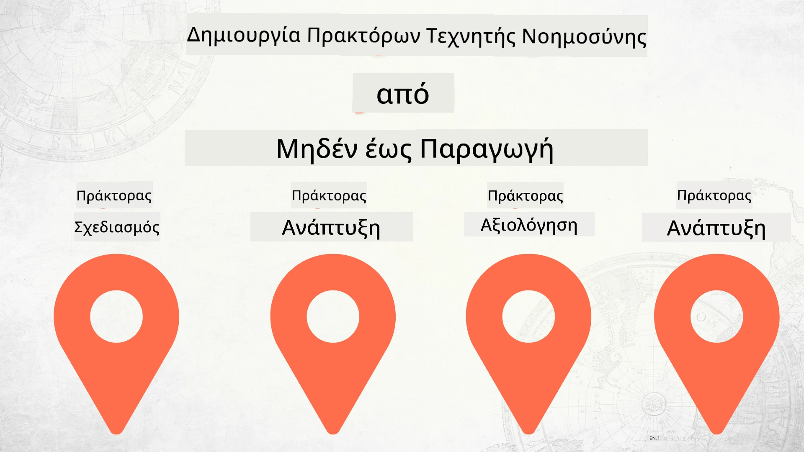

# Δημιουργία Πρακτόρων AI από το Μηδέν έως την Παραγωγή



### 🌐 Υποστήριξη σε Πολλαπλές Γλώσσες

#### Υποστηρίζεται μέσω GitHub Action (Αυτοματοποιημένο & Πάντα Ενημερωμένο)

<!-- CO-OP TRANSLATOR LANGUAGES TABLE START -->
[Arabic](../ar/README.md) | [Bengali](../bn/README.md) | [Bulgarian](../bg/README.md) | [Burmese (Myanmar)](../my/README.md) | [Chinese (Simplified)](../zh-CN/README.md) | [Chinese (Traditional, Hong Kong)](../zh-HK/README.md) | [Chinese (Traditional, Macau)](../zh-MO/README.md) | [Chinese (Traditional, Taiwan)](../zh-TW/README.md) | [Croatian](../hr/README.md) | [Czech](../cs/README.md) | [Danish](../da/README.md) | [Dutch](../nl/README.md) | [Estonian](../et/README.md) | [Finnish](../fi/README.md) | [French](../fr/README.md) | [German](../de/README.md) | [Greek](./README.md) | [Hebrew](../he/README.md) | [Hindi](../hi/README.md) | [Hungarian](../hu/README.md) | [Indonesian](../id/README.md) | [Italian](../it/README.md) | [Japanese](../ja/README.md) | [Kannada](../kn/README.md) | [Khmer](../km/README.md) | [Korean](../ko/README.md) | [Lithuanian](../lt/README.md) | [Malay](../ms/README.md) | [Malayalam](../ml/README.md) | [Marathi](../mr/README.md) | [Nepali](../ne/README.md) | [Nigerian Pidgin](../pcm/README.md) | [Norwegian](../no/README.md) | [Persian (Farsi)](../fa/README.md) | [Polish](../pl/README.md) | [Portuguese (Brazil)](../pt-BR/README.md) | [Portuguese (Portugal)](../pt-PT/README.md) | [Punjabi (Gurmukhi)](../pa/README.md) | [Romanian](../ro/README.md) | [Russian](../ru/README.md) | [Serbian (Cyrillic)](../sr/README.md) | [Slovak](../sk/README.md) | [Slovenian](../sl/README.md) | [Spanish](../es/README.md) | [Swahili](../sw/README.md) | [Swedish](../sv/README.md) | [Tagalog (Filipino)](../tl/README.md) | [Tamil](../ta/README.md) | [Telugu](../te/README.md) | [Thai](../th/README.md) | [Turkish](../tr/README.md) | [Ukrainian](../uk/README.md) | [Urdu](../ur/README.md) | [Vietnamese](../vi/README.md)

> **Προτιμάτε να κάνετε το Αντίγραφο τοπικά;**
>
> Αυτό το αποθετήριο περιλαμβάνει πάνω από 50 μεταφράσεις γλωσσών που αυξάνουν σημαντικά το μέγεθος λήψης. Για να αντιγράψετε χωρίς μεταφράσεις, χρησιμοποιήστε sparse checkout:
>
> **Bash / macOS / Linux:**
> ```bash
> git clone --filter=blob:none --sparse https://github.com/microsoft/Building-AI-Agents-From-Zero-To-Production.git
> cd Building-AI-Agents-From-Zero-To-Production
> git sparse-checkout set --no-cone '/*' '!translations' '!translated_images'
> ```
>
> **CMD (Windows):**
> ```cmd
> git clone --filter=blob:none --sparse https://github.com/microsoft/Building-AI-Agents-From-Zero-To-Production.git
> cd Building-AI-Agents-From-Zero-To-Production
> git sparse-checkout set --no-cone "/*" "!translations" "!translated_images"
> ```
>
> Αυτό σας παρέχει όλα όσα χρειάζεστε για να ολοκληρώσετε το μάθημα με πολύ πιο γρήγορη λήψη.
<!-- CO-OP TRANSLATOR LANGUAGES TABLE END -->

## Ένα μάθημα που σας διδάσκει τις βασικές αρχές του κύκλου ζωής ανάπτυξης Πρακτόρων AI

[](https://github.com/microsoft/Building-AI-Agents-From-Zero-To-Production/blob/master/LICENSE?WT.mc_id=academic-105485-koreyst)
[](https://GitHub.com/microsoft/Building-AI-Agents-From-Zero-To-Production/graphs/contributors/?WT.mc_id=academic-105485-koreyst)
[](https://GitHub.com/microsoft/Building-AI-Agents-From-Zero-To-Production/issues/?WT.mc_id=academic-105485-koreyst)
[](https://GitHub.com/microsoft/Building-AI-Agents-From-Zero-To-Production/pulls/?WT.mc_id=academic-105485-koreyst)
[](http://makeapullrequest.com?WT.mc_id=academic-105485-koreyst)

[](https://discord.gg/Kuaw3ktsu6)

## 🌱 Ξεκινώντας

Αυτό το μάθημα περιλαμβάνει μαθήματα που καλύπτουν τα βασικά της δημιουργίας και ανάπτυξης Πρακτόρων AI.

Κάθε μάθημα χτίζει πάνω στο προηγούμενο, οπότε συνιστούμε να ξεκινήσετε από την αρχή και να προχωρήσετε μέχρι το τέλος.

Αν θέλετε να εξερευνήσετε περισσότερα για τα θέματα των Πρακτόρων AI, μπορείτε να δείτε το [Μάθημα Πρακτόρων AI για Αρχάριους](https://aka.ms/ai-agents-beginners).

### Γνωρίστε Άλλους Μαθητές, Λάβετε Απαντήσεις στις Ερωτήσεις σας

Αν κολλήσετε ή έχετε ερωτήσεις σχετικά με τη δημιουργία Πρακτόρων AI, συμμετάσχετε στο ειδικό μας κανάλι Discord στο [Microsoft Foundry Discord](https://discord.gg/Kuaw3ktsu6).

### Τι Χρειάζεστε

Κάθε μάθημα έχει το δικό του δείγμα κώδικα που μπορείτε να εκτελέσετε τοπικά. Μπορείτε να [κάνετε fork αυτό το αποθετήριο](https://github.com/microsoft/Building-AI-Agents-From-Zero-To-Production/fork) για να δημιουργήσετε το δικό σας αντίγραφο.

Αυτό το μάθημα αυτή τη στιγμή χρησιμοποιεί τα εξής:

- [Microsoft Agent Framework (MAF)](https://aka.ms/ai-agents-beginners/agent-framework)
- [Microsoft Foundry](https://azure.microsoft.com/products/ai-foundry) — ένα έργο με αναπτυγμένο μοντέλο **σειράς GPT-5** (για παράδειγμα `gpt-5.1`). Μην χρησιμοποιείτε τα αποσυρμένα μοντέλα GPT-4o / GPT-4.1.
- [Azure OpenAI Service](https://azure.microsoft.com/products/ai-foundry/models/openai)
- [Azure CLI](https://learn.microsoft.com/cli/azure/authenticate-azure-cli?view=azure-cli-latest) — συνδεθείτε με `az login` πριν τρέξετε οποιοδήποτε δείγμα
- **Python 3.12 ή νεότερο**

Βεβαιωθείτε ότι έχετε πρόσβαση σε αυτές τις υπηρεσίες πριν ξεκινήσετε.

> **💰 Κόστος & καθαρισμός.** Τα πρακτικά μαθήματα δημιουργούν πραγματικούς πόρους Azure — ένα έργο Microsoft Foundry,
> αναπτύξεις μοντέλων, αποθήκη διανυσμάτων και (στα Μαθήματα 4–6) φιλοξενούμενους πράκτορες και εργαλειοθήκες.
> Αυτοί μπορούν να επιφέρουν κόστος όσο υπάρχουν. Όταν ολοκληρώσετε ένα μάθημα — ή το μάθημα — διαγράψτε
> τους πόρους που δεν χρειάζεστε πλέον. Η απλούστερη μέθοδος είναι να βάλετε τα πάντα σε μια αφιερωμένη ομάδα πόρων
> και να διαγράψετε ολόκληρη την ομάδα όταν τελειώσετε:
>
> ```bash
> az group delete --name <your-resource-group> --yes --no-wait
> ```
>
> Μπορείτε επίσης να διαγράψετε μεμονωμένους πράκτορες, αποθήκες διανυσμάτων και εργαλειοθήκες από την πύλη Foundry.

> **Σημείωση για τα μοντέλα.** Αυτό το μάθημα σερβίρει όλα τα μοντέλα μέσω **Microsoft Foundry**. Δεν
> χρησιμοποιεί *GitHub Models*, τα οποία αποσύρονται στις **30 Ιουλίου 2026** — το Microsoft Foundry είναι
> η επίσημη διαδρομή μετανάστευσης. Αν έχετε παλαιότερο κώδικα που καλεί GitHub Models, δείξτε τον σε μια
> ανάπτυξη μοντέλου Foundry αντίστοιχα.

Περισσότερες επιλογές για φιλοξενία μοντέλων και υπηρεσίες έρχονται σύντομα. 

## 🗃️ Μαθήματα

| **Μάθημα**         | **Περιγραφή**                                                                                    |
|--------------------|--------------------------------------------------------------------------------------------------|
| [Agent Design](./lesson-1-agent-design/README.md)       | Μια εισαγωγή στη χρήση περίπτωσης "Εισαγωγή Προγραμματιστή" και πώς να σχεδιάζετε αποτελεσματικούς πράκτορες  |
| [Agent Development](./lesson-2-agent-development/README.md)  | Χρησιμοποιώντας το Microsoft Agent Framework (MAF), δημιουργήστε μια σειρά εξειδικευμένων πρακτόρων για να βοηθήσουν νέους προγραμματιστές στην εισαγωγή.       |
| [Agent Evaluations](./lesson-3-agent-evals/README.md)  | Χρησιμοποιώντας το Microsoft Foundry, μάθετε πόσο καλά αποδίδουν οι Πράκτορες AI μας και πώς να τους βελτιώσετε. |
| [Agent Deployment](./lesson-4-agentdeployment/README.md)   | Χρησιμοποιώντας το Microsoft Foundry φιλοξενούμενους πράκτορες και το OpenAI ChatKit, δείτε πώς να αναπτύξετε ένα Πράκτορα AI σε παραγωγή.       |
| [Production Hosted Agents](./lesson-5-hosted-agents-production/README.md)   | Μεταφέρετε έναν φιλοξενούμενο πράκτορα σε παραγωγή επιχειρήσεων: Φιλοξενούμενοι Πράκτορες έναντι Κεντρικών Φιλοξενητών, φέρε-το-δικό-σου αποθήκευση, μνήμη και διακυβέρνηση.       |
| [Microsoft Toolbox](./lesson-6-toolbox/README.md)   | Καθορίστε εργαλεία μία φορά και ελέγξτε τα κεντρικά: δημιουργήστε μια εργαλειοθήκη, χρησιμοποιήστε την μέσω ενός σημείου πρόσβασης MCP από έναν πράκτορα, και διαχειριστείτε τις εκδόσεις με ασφάλεια.       |
| [Multi-Agent & A2A](./lesson-7-multi-agent-a2a/README.md)   | Συνθέστε πράκτορες ως δικτυακές υπηρεσίες: εκθέστε έναν πράκτορα μέσω του ανοικτού πρωτοκόλλου Agent-to-Agent (A2A) και χρησιμοποιήστε έναν απομακρυσμένο πράκτορα ως συνομήλικο.       |


## 🎒 Άλλα Μαθήματα

Η ομάδα μας παράγει και άλλα μαθήματα! Δείτε:

<!-- CO-OP TRANSLATOR OTHER COURSES START -->
### LangChain
[](https://aka.ms/langchain4j-for-beginners)
[](https://aka.ms/langchainjs-for-beginners?WT.mc_id=m365-94501-dwahlin)
[](https://github.com/microsoft/langchain-for-beginners?WT.mc_id=m365-94501-dwahlin)
---

### Azure / Edge / MCP / Πράκτορες
[](https://github.com/microsoft/AZD-for-beginners?WT.mc_id=academic-105485-koreyst)
[](https://github.com/microsoft/edgeai-for-beginners?WT.mc_id=academic-105485-koreyst)
[](https://github.com/microsoft/mcp-for-beginners?WT.mc_id=academic-105485-koreyst)
[](https://github.com/microsoft/ai-agents-for-beginners?WT.mc_id=academic-105485-koreyst)

---
 
### Σειρά για Γενετική Τεχνητή Νοημοσύνη

[](https://github.com/microsoft/generative-ai-for-beginners?WT.mc_id=academic-105485-koreyst)
[-9333EA?style=for-the-badge&labelColor=E5E7EB&color=9333EA)](https://github.com/microsoft/Generative-AI-for-beginners-dotnet?WT.mc_id=academic-105485-koreyst)
[-C084FC?style=for-the-badge&labelColor=E5E7EB&color=C084FC)](https://github.com/microsoft/generative-ai-for-beginners-java?WT.mc_id=academic-105485-koreyst)
[-E879F9?style=for-the-badge&labelColor=E5E7EB&color=E879F9)](https://github.com/microsoft/generative-ai-with-javascript?WT.mc_id=academic-105485-koreyst)

---
 
### Βασική Μάθηση
[](https://aka.ms/ml-beginners?WT.mc_id=academic-105485-koreyst)
[](https://aka.ms/datascience-beginners?WT.mc_id=academic-105485-koreyst)
[](https://aka.ms/ai-beginners?WT.mc_id=academic-105485-koreyst)
[](https://github.com/microsoft/Security-101?WT.mc_id=academic-96948-sayoung)
[](https://aka.ms/webdev-beginners?WT.mc_id=academic-105485-koreyst)
[](https://aka.ms/iot-beginners?WT.mc_id=academic-105485-koreyst)
[](https://github.com/microsoft/xr-development-for-beginners?WT.mc_id=academic-105485-koreyst)

---
 
### Σειρά Copilot
[](https://aka.ms/GitHubCopilotAI?WT.mc_id=academic-105485-koreyst)
[](https://github.com/microsoft/mastering-github-copilot-for-dotnet-csharp-developers?WT.mc_id=academic-105485-koreyst)
[](https://github.com/microsoft/CopilotAdventures?WT.mc_id=academic-105485-koreyst)
<!-- CO-OP TRANSLATOR OTHER COURSES END -->

## Συνεισφορά

Αυτό το έργο καλωσορίζει συνεισφορές και προτάσεις. Οι περισσότερες συνεισφορές απαιτούν να συμφωνήσετε με μια
Συμφωνία Άδειας Συνεισφέροντος (CLA) που δηλώνει ότι έχετε το δικαίωμα, και όντως παρέχετε, τα δικαιώματα για
τη χρήση της συνεισφοράς σας. Για λεπτομέρειες, επισκεφθείτε <https://cla.opensource.microsoft.com>.

Όταν υποβάλετε ένα αίτημα έλξης (pull request), ένα bot για το CLA θα καθορίσει αυτόματα αν χρειάζεται να παρέχετε
ένα CLA και θα διακοσμήσει το PR αναλόγως (π.χ., έλεγχος κατάστασης, σχόλιο). Απλώς ακολουθήστε τις οδηγίες
που παρέχει το bot. Θα χρειαστεί να το κάνετε μόνο μία φορά σε όλα τα αποθετήρια που χρησιμοποιούν το CLA μας.

Αυτό το έργο έχει υιοθετήσει τον [Κώδικα Δεοντολογίας Ανοικτού Κώδικα της Microsoft](https://opensource.microsoft.com/codeofconduct/).
Για περισσότερες πληροφορίες, δείτε τις [Συχνές Ερωτήσεις για τον Κώδικα Δεοντολογίας](https://opensource.microsoft.com/codeofconduct/faq/) ή
επικοινωνήστε με [opencode@microsoft.com](mailto:opencode@microsoft.com) για επιπλέον ερωτήσεις ή σχόλια.

## Εμπορικά Σήματα

Αυτό το έργο μπορεί να περιέχει εμπορικά σήματα ή λογότυπα για έργα, προϊόντα ή υπηρεσίες. Η εξουσιοδοτημένη χρήση των εμπορικών σημάτων ή λογότυπων της Microsoft
υπόκειται και πρέπει να ακολουθεί
[Τις Οδηγίες Χρήσης Εμπορικών Σημάτων & Μάρκας της Microsoft](https://www.microsoft.com/legal/intellectualproperty/trademarks/usage/general).
Η χρήση εμπορικών σημάτων ή λογότυπων της Microsoft σε τροποποιημένες εκδόσεις αυτού του έργου δεν πρέπει να προκαλεί σύγχυση ή να υπονοεί χορηγία από τη Microsoft.
Οποιαδήποτε χρήση εμπορικών σημάτων ή λογότυπων τρίτων υπόκειται στις πολιτικές αυτών των τρίτων.

## Λήψη Βοήθειας

Εάν κολλήσετε ή έχετε ερωτήσεις σχετικά με την κατασκευή εφαρμογών AI, συμμετάσχετε σε:

[](https://discord.gg/Kuaw3ktsu6)

Εάν έχετε σχόλια για το προϊόν ή σφάλματα κατά την κατασκευή, επισκεφθείτε:

[](https://aka.ms/foundry/forum)

---

<!-- CO-OP TRANSLATOR DISCLAIMER START -->
**Αποποίηση ευθυνών**:
Αυτό το έγγραφο έχει μεταφραστεί χρησιμοποιώντας την υπηρεσία μετάφρασης με τεχνητή νοημοσύνη [Co-op Translator](https://github.com/Azure/co-op-translator). Ενώ επιδιώκουμε την ακρίβεια, παρακαλούμε να έχετε υπόψη ότι οι αυτοματοποιημένες μεταφράσεις ενδέχεται να περιέχουν λάθη ή ανακρίβειες. Το πρωτότυπο έγγραφο στη μητρική του γλώσσα πρέπει να θεωρείται η αυθεντική πηγή. Για κρίσιμες πληροφορίες, συνιστάται επαγγελματική ανθρώπινη μετάφραση. Δεν φέρουμε ευθύνη για τυχόν παρεξηγήσεις ή λανθασμένες ερμηνείες που προκύπτουν από τη χρήση αυτής της μετάφρασης.
<!-- CO-OP TRANSLATOR DISCLAIMER END -->