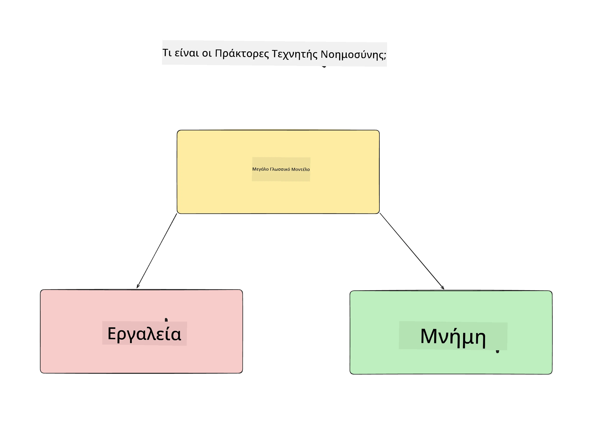
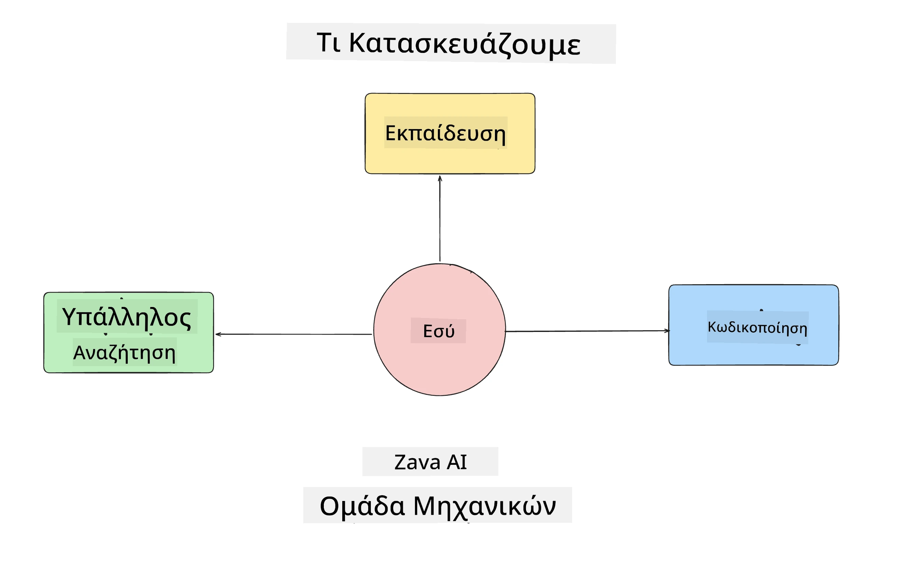
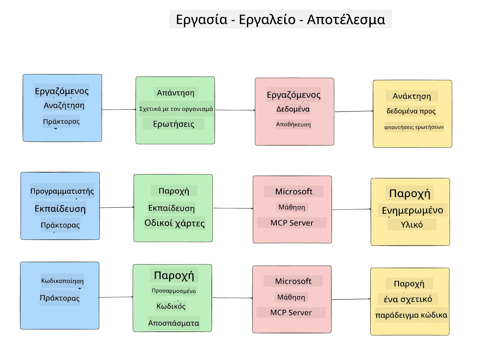
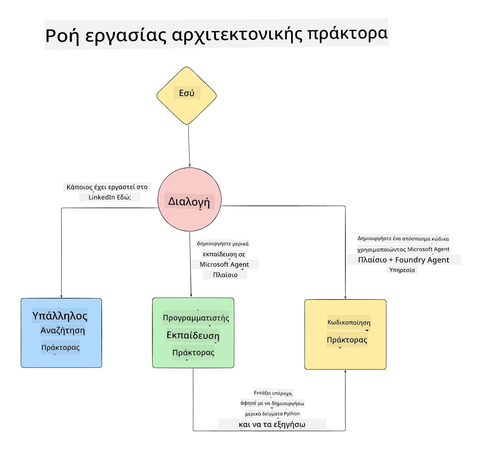

# Μάθημα 1: Σχεδίαση Πράκτορα AI

Καλωσορίσατε στο πρώτο μάθημα του "Μαθήματος Κατασκευής Πράκτορα AI από το Μηδέν έως την Παραγωγή"!

Σε αυτό το μάθημα θα καλύψουμε:

- Ορισμός του τι είναι οι Πράκτορες AI
  
- Συζήτηση για την Εφαρμογή Πράκτορα AI που κατασκευάζουμε  

- Αναγνώριση των απαραίτητων εργαλείων και υπηρεσιών για κάθε πράκτορα
  
- Αρχιτεκτονική της Εφαρμογής Πράκτορά μας
  
Ας ξεκινήσουμε ορίζοντας τι είναι ο πράκτορας και γιατί θα τον χρησιμοποιούσαμε μέσα σε μια εφαρμογή.

> **Πριν ξεκινήσετε το μάθημα.** Αυτό το πρώτο μάθημα είναι εννοιολογικό — δεν υπάρχει κώδικας προς εκτέλεση.
> Από το [Μάθημα 2](../lesson-2-agent-development/README.md) και μετά θα χρειαστείτε: μια **συνδρομή Azure**
> με πρόσβαση στο **Microsoft Foundry**, ένα αναπτυγμένο **μοντέλο σειράς GPT-5** (για
> παράδειγμα `gpt-5.1` — αποφύγετε τα αποσυρθέντα GPT-4o / GPT-4.1), **Python 3.12+**, και το **Azure CLI**
> (`az login`). Δείτε το [Τι Χρειάζεστε](../README.md#what-you-need) στο README του μαθήματος για την πλήρη
> λίστα και συνδέσμους.

## Τι Είναι οι Πράκτορες AI;

Εάν εξερευνάτε για πρώτη φορά πώς να κατασκευάσετε έναν Πράκτορα AI, ίσως έχετε απορίες πώς να ορίσετε ακριβώς τι είναι ένας Πράκτορας AI.

Ένας απλός τρόπος να ορίσετε τι είναι ένας Πράκτορας AI είναι από τα συστατικά που τον αποτελούν:

**Μεγάλο Μοντέλο Γλώσσας (LLM)** - Το LLM θα τροφοδοτεί τόσο την ικανότητα επεξεργασίας φυσικής γλώσσας από τον χρήστη για την ερμηνεία του καθήκοντος που θέλει να ολοκληρώσει όσο και την ερμηνεία των περιγραφών των εργαλείων που είναι διαθέσιμα για να ολοκληρωθούν αυτά τα καθήκοντα.

**Εργαλεία** - Αυτά θα είναι λειτουργίες, APIs, αποθήκες δεδομένων και άλλες υπηρεσίες που το LLM μπορεί να επιλέξει να χρησιμοποιήσει για να ολοκληρώσει τα καθήκοντα που ζήτησε ο χρήστης.

**Μνήμη** - Έτσι αποθηκεύουμε τόσο τις βραχυπρόθεσμες όσο και τις μακροπρόθεσμες αλληλεπιδράσεις μεταξύ του Πράκτορα AI και του χρήστη. Η αποθήκευση και ανάκτηση αυτών των πληροφοριών είναι σημαντική για τη βελτίωση και την αποθήκευση προτιμήσεων του χρήστη με την πάροδο του χρόνου.

## Η Περίπτωση Χρήσης του Πράκτορα AI μας

Για αυτό το μάθημα, θα κατασκευάσουμε μια εφαρμογή Πράκτορα AI που βοηθά νέους προγραμματιστές να ενταχθούν στην Ομάδα Ανάπτυξης Πρακτόρων AI μας!

Πριν κάνουμε οποιαδήποτε ανάπτυξη, το πρώτο βήμα για τη δημιουργία μιας επιτυχημένης εφαρμογής Πράκτορα AI, είναι να ορίσουμε σαφή σενάρια για το πώς περιμένουμε οι χρήστες μας να συνεργαστούν με τους Πράκτορες AI μας.

Για αυτή την εφαρμογή, θα δουλέψουμε με αυτά τα σενάρια:

**Σενάριο 1**: Ένας νέος υπάλληλος εντάσσεται στον οργανισμό μας και θέλει να μάθει περισσότερα για την ομάδα που εντάχθηκε και πώς να συνδεθεί μαζί τους.

**Σενάριο 2:** Ένας νέος υπάλληλος θέλει να μάθει ποιο θα ήταν το καλύτερο πρώτο καθήκον για να ξεκινήσει να δουλεύει.

**Σενάριο 3:** Ένας νέος υπάλληλος θέλει να συγκεντρώσει πόρους εκμάθησης και δείγματα κώδικα για να τον βοηθήσουν να ξεκινήσει την ολοκλήρωση αυτού του καθήκοντος.

## Αναγνώριση των Εργαλείων και Υπηρεσιών

Τώρα που έχουμε δημιουργήσει αυτά τα σενάρια, το επόμενο βήμα είναι να τα αντιστοιχίσουμε στα εργαλεία και υπηρεσίες που οι Πράκτορες AI μας θα χρειαστούν για να ολοκληρώσουν αυτά τα καθήκοντα.

Αυτή η διαδικασία ανήκει στην κατηγορία της Μηχανικής Συμφραζομένων καθώς θα εστιάσουμε στο να διασφαλίσουμε ότι οι Πράκτορες AI μας έχουν το σωστό πλαίσιο τη σωστή στιγμή για να ολοκληρώσουν τα καθήκοντα.

Ας το κάνουμε σενάριο σενάριο και να εκτελέσουμε καλή σχεδίαση πρακτόρων σημειώνοντας το καθήκον του κάθε πράκτορα, τα εργαλεία και τα επιθυμητά αποτελέσματα.

### Σενάριο 1 - Πράκτορας Αναζήτησης Υπαλλήλων

**Καθήκον** - Απαντά σε ερωτήσεις σχετικά με υπαλλήλους στον οργανισμό όπως ημερομηνία ένταξης, τρέχουσα ομάδα, τοποθεσία και τελευταία θέση.

**Εργαλεία** - Αποθήκη δεδομένων με τη λίστα των τρεχόντων υπαλλήλων και τον οργανόγραμμα

**Αποτελέσματα** - Μπορεί να ανακτήσει πληροφορίες από την αποθήκη δεδομένων για να απαντήσει γενικές οργανωσιακές ερωτήσεις και συγκεκριμένες ερωτήσεις για υπαλλήλους.

### Σενάριο 2 - Πράκτορας Πρότασης Καθήκοντος

**Καθήκον** - Βάσει της εμπειρίας του νέου υπαλλήλου ως προγραμματιστής, προτείνει 1-3 ζητήματα στα οποία ο νέος υπάλληλος μπορεί να εργαστεί.

**Εργαλεία** - GitHub MCP Server για λήψη ανοιχτών ζητημάτων και δημιουργία προφίλ προγραμματιστή

**Αποτελέσματα** - Μπορεί να διαβάσει τις τελευταίες 5 δεσμεύσεις ενός Προφίλ GitHub και τα ανοιχτά ζητήματα σε ένα έργο GitHub και να κάνει προτάσεις βάσει ταύτισης

### Σενάριο 3 - Πράκτορας Βοηθού Κώδικα

**Καθήκον** - Βάσει των Ανοιχτών Ζητημάτων που πρότεινε ο “Πράκτορας Πρότασης Καθήκοντος,” ερευνά και παρέχει πόρους και δημιουργεί αποσπάσματα κώδικα για να βοηθήσει τον υπάλληλο.

**Εργαλεία** - Microsoft Learn MCP για εύρεση πόρων και Code Interpreter για δημιουργία προσαρμοσμένων αποσπασμάτων κώδικα.

**Αποτελέσματα** - Εάν ο χρήστης ζητήσει επιπλέον βοήθεια, η ροή εργασίας θα χρησιμοποιήσει τον Learn MCP Server για να παρέχει συνδέσμους και αποσπάσματα σε πόρους και στη συνέχεια θα παραδώσει στον πράκτορα Code Interpreter να δημιουργήσει μικρά αποσπάσματα κώδικα με εξηγήσεις.

## Αρχιτεκτονική της Εφαρμογής Πράκτορά μας

Τώρα που έχουμε ορίσει τους Πράκτορές μας, ας δημιουργήσουμε ένα διάγραμμα αρχιτεκτονικής που θα μας βοηθήσει να κατανοήσουμε πώς κάθε πράκτορας θα συνεργάζεται και θα λειτουργεί ξεχωριστά ανάλογα με το καθήκον:

## Επόμενα Βήματα

Τώρα που σχεδιάσαμε κάθε πράκτορα και το πρακτορικό μας σύστημα, ας προχωρήσουμε στο επόμενο μάθημα όπου θα αναπτύξουμε καθέναν από αυτούς τους πράκτορες!

---

<!-- CO-OP TRANSLATOR DISCLAIMER START -->
**Αποποίηση ευθυνών**:
Αυτό το έγγραφο έχει μεταφραστεί χρησιμοποιώντας την υπηρεσία μετάφρασης με τεχνητή νοημοσύνη [Co-op Translator](https://github.com/Azure/co-op-translator). Ενώ επιδιώκουμε την ακρίβεια, παρακαλούμε να έχετε υπόψη ότι οι αυτοματοποιημένες μεταφράσεις ενδέχεται να περιέχουν λάθη ή ανακρίβειες. Το πρωτότυπο έγγραφο στη μητρική του γλώσσα πρέπει να θεωρείται η αυθεντική πηγή. Για κρίσιμες πληροφορίες, συνιστάται επαγγελματική ανθρώπινη μετάφραση. Δεν φέρουμε ευθύνη για τυχόν παρεξηγήσεις ή λανθασμένες ερμηνείες που προκύπτουν από τη χρήση αυτής της μετάφρασης.
<!-- CO-OP TRANSLATOR DISCLAIMER END -->