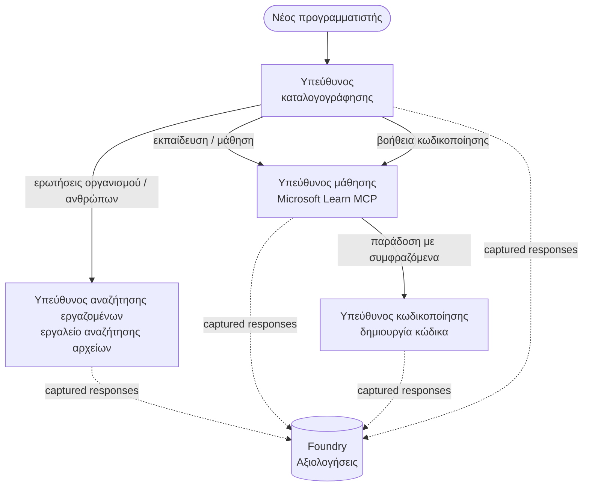

# Μάθημα 3: Αξιολογήσεις Πρακτόρων με το Microsoft Foundry

Καλωσορίσατε στο τρίτο μάθημα του μαθήματος **"Κατασκευή Πρακτόρων Τεχνητής Νοημοσύνης από το Μηδέν έως την Παραγωγή"**!

Στο [Μάθημα 2](../lesson-2-agent-development/README.md) κατασκευάσατε πράκτορες. Σε αυτό το μάθημα θα
μάθετε πώς να απαντήσετε σε μια πολύ πιο δύσκολη ερώτηση: **είναι καλοί;** Η αποστολή ενός πράκτορα που
τρέχει είναι εύκολη· το να ξέρετε αν δρομολογεί σωστά, παραμένει εδρασμένος στα δεδομένα σας και χρησιμοποιεί
σωστά τα εργαλεία του είναι αυτό που ξεχωρίζει μια επίδειξη από ένα σύστημα παραγωγής.

Σε αυτό το μάθημα θα καλύψουμε:

- Γιατί έχει σημασία η αξιολόγηση πρακτόρων και πώς διαφέρει από τις παραδοσιακές δοκιμές
- Η διαφορά μεταξύ **παρατηρησιμότητας**, **δοκιμών καπνού** και **αξιολογήσεων**
- Τη ροή εργασίας πολλαπλών πρακτόρων που πρόκειται να μετρήσουμε
- Τους ενσωματωμένους **αξιολογητές του Microsoft Foundry** (σχετικότητα, εδραίωση, ακρίβεια κλήσης εργαλείων, αξιοποίηση εξόδου εργαλείων)
- Μια βήμα προς βήμα περιήγηση στην αλυσίδα αξιολόγησης στο [`agent-evals.py`](../../../lesson-3-agent-evals/agent-evals.py)
- Πώς να το εκτελέσετε και να διαβάσετε τα αποτελέσματα

---

## Γιατί να αξιολογούμε πράκτορες;

Μια παραδοσιακή μονάδα δοκιμής επιβεβαιώνει ότι `add(2, 2) == 4`. Οι πράκτορες δεν λειτουργούν έτσι — η ίδια
προτροπή μπορεί να παράγει διαφορετική διατύπωση κάθε εκτέλεση, τα εργαλεία μπορεί να καλούνται σε διαφορετικές σειρές, και
το "σωστό" είναι συχνά θέμα βαθμού αντί για boolean. Δεν μπορείτε να κάνετε επαλήθευση σε ακριβείς συμβολοσειρές.

Αντ' αυτού, αξιολογείτε τους πράκτορες κατά μήκος **διαστάσεων ποιότητας** χρησιμοποιώντας αξιολογητές βασισμένους σε μοντέλα (επίσης
λεγόμενοι "LLM ως κριτής") συν ντετερμινιστικούς ελέγχους στη χρήση εργαλείων. Αυτό σας λέει πράγματα όπως:

- Αν η απάντηση πραγματικά απάντησε στην ερώτηση; (**σχετικότητα**)
- Αν η απάντηση υποστηρίζεται από τα ανακτημένα δεδομένα ή αν ο πράκτορας έκανε παραισθήσεις; (**εδραίωση**)
- Αν ο πράκτορας κάλεσε το σωστό εργαλείο με τα σωστά επιχειρήματα; (**ακρίβεια κλήσης εργαλείου**)
- Αν ο πράκτορας χρησιμοποίησε πραγματικά αυτό που επέστρεψε το εργαλείο; (**αξιοποίηση εξόδου εργαλείου**)

### Τρία συμπληρωματικά στρώματα ποιότητας

Αυτές δεν είναι ανταγωνιστικές τεχνικές — ένας παραγωγικός πράκτορας χρησιμοποιεί και τα τρία:

| Στρώμα | Ερώτηση που απαντά | Κόστος | Πότε εκτελείται | Καλύπτεται στο |
|-------|--------------------|--------|--------------|------------|
| **Παρατηρησιμότητα / ιχνηλάτηση** | *Τι έκανε ο πράκτορας, βήμα-βήμα;* | Δωρεάν (πάντα ενεργό) | Συνεχώς στην παραγωγή | Αυτό το μάθημα |
| **Δοκιμές καπνού** | *Είναι ο πράκτορας προσβάσιμος και ακολουθεί την βασική του προτροπή;* | Φθηνό, δευτερόλεπτα | Κάθε ανάπτυξη | [Μάθημα 4](../lesson-4-agentdeployment/README.md#smoke-testing-the-hosted-agent-ci-gate) |
| **Αξιολογήσεις** | *Πόσο **καλές** είναι οι απαντήσεις;* | Πιο αργό, μετριέται από μοντέλο | Κατ' απαίτηση / νυχτερινές / πριν από κυκλοφορία | Αυτό το μάθημα |

Οι δοκιμές καπνού απαντούν "έσπασε;"· οι αξιολογήσεις απαντούν "είναι καλό;". Θέλετε και τα δύο.

---

## Προαπαιτούμενα

1. Ολοκληρωμένο το [Μάθημα 2](../lesson-2-agent-development/README.md) (πράκτορες + αποθήκη διανυσμάτων).
2. Ένα έργο **Microsoft Foundry**.
3. Επαληθευμένη η **Azure CLI**: `az login`.
4. Εγκατεστημένα **Python 3.12+** και οι εξαρτήσεις του μαθήματος:

   ```bash
   pip install -r ../requirements.txt
   ```


5. Μεταβλητές περιβάλλοντος (δημιουργήστε ένα αρχείο `.env` σε αυτόν τον φάκελο ή εξάγετέ τες):

   | Μεταβλητή | Σκοπός |
   |----------|---------|
   | `FOUNDRY_PROJECT_ENDPOINT` | Το endpoint του έργου Foundry σας (`https://<account>.services.ai.azure.com/api/projects/<project>`). Διαβάζεται από τον `FoundryChatClient` των πρακτόρων **και** από τον βοηθό αξιολόγησης. |
   | `FOUNDRY_MODEL` | Η ανάπτυξη μοντέλου στην οποία εκτελούνται οι **πράκτορες** (π.χ. `gpt-5.1`). |
   | `VECTOR_STORE_ID` | Ο vector store του καταλόγου υπαλλήλων που δημιουργήθηκε στο Μάθημα 2 |
   | `AZURE_AI_MODEL_DEPLOYMENT_NAME` | Η ανάπτυξη μοντέλου που χρησιμοποιούν **οι αξιολογητές** (προεπιλογή `FOUNDRY_MODEL`, μετά `gpt-5.1`) |

> Οι πράκτορες χρησιμοποιούν τον `FoundryChatClient`, που διαβάζει την κονφίγκ από τις μεταβλητές με πρόθεμα `FOUNDRY_`
> (`FOUNDRY_PROJECT_ENDPOINT`, `FOUNDRY_MODEL`). Ο βοηθός αξιολόγησης στο cloud
> χρησιμοποιεί το SDK `azure-ai-projects` και θα επιστρέψει στο `FOUNDRY_PROJECT_ENDPOINT` αν
> δεν έχει οριστεί το `AZURE_AI_PROJECT_ENDPOINT` — συνεπώς οι δύο μεταβλητές `FOUNDRY_` είναι αρκετές
> για να εκτελεστεί ολόκληρο το μάθημα.
>
> Οι αξιολογητές λειτουργούν οι ίδιοι με μοντέλο, οπότε το `AZURE_AI_MODEL_DEPLOYMENT_NAME`
> καθορίζει ποια ανάπτυξη κάνει την κρίση — δεν χρειάζεται να είναι το ίδιο μοντέλο με αυτό που χρησιμοποιούν οι
> πράκτορές σας.

---

## Η ροή εργασίας που αξιολογούμε

Για να αξιολογήσετε κάτι, πρέπει πρώτα να το εκτελέσετε. Αυτό το μάθημα επαναχρησιμοποιεί τη ροή εργασίας πολλαπλών πρακτόρων **Developer Onboarding**: ένας συντονιστής **διαλογής** παραδίδει σε τρεις ειδικούς.




Η ροή εργασίας είναι φτιαγμένη με το πλαίσιο Microsoft Agent Framework και την ορχήστρα **handoff**. Η βασική
ιδέα για την αξιολόγηση είναι ότι **κάθε στροφή πράκτορα διατηρείται στον server** και ταυτοποιείται με `response_id`.
Αυτά τα ID είναι αυτά που δίνουμε στην υπηρεσία αξιολόγησης.

---

## Η διαδικασία αξιολόγησης, βήμα προς βήμα

Το [`agent-evals.py`](../../../lesson-3-agent-evals/agent-evals.py) υλοποιεί μια διαδικασία έξι βημάτων. Να τι κάνει το κάθε βήμα
και γιατί.

### Βήμα 1 — Εκτελέστε τη ροή εργασίας και καταγράψτε τα response IDs

Η ροή εργασίας εκτελείται με `run_stream(...)`, και καθώς έρχονται γεγονότα, ο κώδικας καταγράφει τα
`response_id` και `conversation_id` που παράγει κάθε πράκτορας. Οι αποθηκευμένες απαντήσεις είναι το
ακατέργαστο υλικό για αξιολόγηση — βαθμολογείτε *αληθινές* απαντήσεις σε παραγωγικό περιβάλλον, όχι αναδημιουργημένες.


### Βήμα 2 — Συνοψίστε όσα καταγράφηκαν

Μια γρήγορη σύνοψη τυπώνει πόσες απαντήσεις παρήγαγε κάθε πράκτορας, ώστε να επιβεβαιώσετε ότι η ροή εργασίας
χρησιμοποίησε τους πράκτορες που σκοπεύετε να αξιολογήσετε.

### Βήμα 3 — Ανάκτηση των τελικών απαντήσεων

Για κάθε πράκτορα, το τελευταίο `response_id` ανακτάται μέσω του OpenAI-συμβατού
πελάτη του έργου (`project_client.get_openai_client().responses.retrieve(...)`) ώστε να μπορείτε να προβάλετε το
κείμενο που θα αξιολογηθεί.

### Βήμα 4 — Δημιουργία της αξιολόγησης

Δημιουργείται μια αξιολόγηση με τέσσερις **ενσωματωμένους αξιολογητές Foundry**:

| Αξιολογητής | `evaluator_name` | Τι μετράει |
|-----------|------------------|------------------|

| Σχετικότητα | `builtin.relevance` | Η απάντηση ανταποκρίνεται στο αίτημα του χρήστη; |

| Βασιμότητα | `builtin.groundedness` | Η απάντηση υποστηρίζεται από ανακτημένα/εργαλειακά δεδομένα (όχι παραισθήσεις); |
| Ακρίβεια κλήσης εργαλείου | `builtin.tool_call_accuracy` | Κλήθηκαν τα σωστά εργαλεία με τα σωστά επιχειρήματα; |
| Χρήση εξόδου εργαλείου | `builtin.tool_output_utilization` | Χρησιμοποίησε ο πράκτορας πράγματι τα αποτελέσματα του εργαλείου στην απάντησή του; |

Κάθε αξιολογητής αρχικοποιείται με την ανάπτυξη που ονομάζεται από το `AZURE_AI_MODEL_DEPLOYMENT_NAME`.

> **Γιατί αυτοί οι τέσσερις;** Η συνάφεια και η βασιμότητα μετρούν την *ποιότητα της απάντησης*· οι δύο αξιολογητές εργαλείων μετρούν το *συμπεριφορικό πρότυπο του πράκτορα* — το τμήμα που οι παραδοσιακοί μετρικοί NLP παραλείπουν εντελώς. Για ένα σύστημα πολλαπλών πρακτόρων που χρησιμοποιεί εργαλεία, οι μετρικές εργαλείων είναι συχνά όπου κρύβονται οι πραγματικές υστερήσεις.


### Βήμα 5 — Εκτέλεση αξιολόγησης

Τα καταγεγραμμένα `response_id`s περνάνε στο `evals.runs.create(...)` ως πηγή δεδομένων. Η υπηρεσία επαναπαίζει κάθε αποθηκευμένη απάντηση μέσα από κάθε αξιολογητή.


### Βήμα 6 — Παρακολούθηση και ανάγνωση αποτελεσμάτων

Ο κώδικας αναμένει την εκτέλεση μέχρι να έχει κατάσταση `completed` ή `failed`, και μετά εμφανίζει τους αριθμούς αποτελεσμάτων και ένα
**`report_url`** — έναν σύνδεσμο βαθιά μέσα στο portal Foundry όπου μπορείτε να ελέγξετε τις βαθμολογίες ανά μετρική,
τους αριθμούς επιτυχίας/αποτυχίας, και τις μεμονωμένες αξιολογημένες απαντήσεις.

---

## Εκτέλεση

```bash
cd lesson-3-agent-evals
python agent-evals.py
```

Από προεπιλογή αξιολογεί το πρώτο παράδειγμα ερώτησης
(`"Είμαι καινούριος εδώ! Έχει δουλέψει κανείς στη Microsoft εδώ;"`). Δύο ακόμα παραδείγματα πολλαπλής πρόθεσης είναι
συμπεριλημμένα στη `run_evaluation_workflow()` — αλλάξτε τη μεταβλητή `query` για να δοκιμάσετε σενάρια δρομολόγησης
που ενεργοποιούν περισσότερους πράκτορες σε μία εκτέλεση.

Αναμενόμενη ροή κονσόλας:

```
Step 1: Running Developer Onboarding Workflow
Step 2: Response Data Summary
Step 3: Fetching Agent Responses
Step 4: Creating Evaluation
Step 5: Running Evaluation
Step 6: Monitoring Evaluation
  Status: running ...
  Evaluation completed successfully
  Report URL: https://...   <-- open this in the Foundry portal
```

---

## Παρατηρησιμότητα και ιχνηλασιμότητα

Οι αξιολογήσεις σας δείχνουν *πόσο καλές* ήταν οι απαντήσεις· η **παρατηρησιμότητα** σας δείχνει *τι συνέβη*
για να τις παραχθούν — κάθε βήμα πράκτορα, κλήση εργαλείου, μέτρηση token, και καθυστέρηση. Στο Microsoft Foundry,
οι εκτελέσεις πράκτορα εκπέμπουν ιχνηλασίες OpenTelemetry που μπορείτε να δείτε στο portal, και το Agent Framework μπορεί
να τις εξάγει στο Azure Monitor / Application Insights με μία μόνο κλήση:

```python
from agent_framework.foundry import FoundryChatClient

client = FoundryChatClient()
client.configure_azure_monitor()   # εξαγωγή ιχνών + μετρικών στο Application Insights
```

Χρησιμοποιήστε την ιχνηλασιμότητα για να **εντοπίσετε σφάλματα** σε κακή βαθμολογία αξιολόγησης: όταν η βασιμότητα πέφτει, η ιχνηλασία σας δείχνει
αν το εργαλείο αναζήτησης αρχείων δεν επέστρεψε τίποτα, ή επέστρεψε δεδομένα που ο πράκτορας αγνόησε (δηλαδή
ακριβώς αυτό που μετρά η χρησιμοποίηση εξόδου εργαλείου).

---

## Από "εκτελέσεις" σε "καλό": πως να το χρησιμοποιήσετε στην πράξη

- **Προ-κυκλοφορία φραγμός.** Εκτελέστε αξιολογήσεις σε ένα σταθερό σύνολο αντιπροσωπευτικών ερωτήσεων πριν
  προωθήσετε ένα νέο prompt ή μοντέλο. Συγκρίνετε τις βαθμολογίες με την προηγούμενη έκδοση — αντιμετωπίστε μια πτώση ως
  υστέρηση.
- **Νυχτερινό σήμα ποιότητας.** Προγραμματίστε την αξιολόγηση για να εντοπίσετε απόκλιση από δεδομένα ή αλλαγές εξαρτήσεων.
- **Σε συνδυασμό με δοκιμές smoke.** Η [Δοκιμή smoke μάθημα 4](../lesson-4-agentdeployment/README.md#smoke-testing-the-hosted-agent-ci-gate)
  είναι η γρήγορη πύλη ανά ανάπτυξη· οι αξιολογήσεις είναι η πιο αργή, βαθιά πύλη ποιότητας. Εκτελέστε την φθηνή
  σε κάθε συγχώνευση και την ακριβή προγραμματισμένα ή πριν από κυκλοφορία.


---

## Σημείωση εκσυγχρονισμού

Αυτό το δείγμα μεταφέρεται στο τρέχον API επιφάνειας Microsoft Agent Framework Foundry
(`agent_framework.foundry`). Αν ενημερώνετε τον κώδικα, δείτε το ριζικό αποθετήριο

[`MIGRATION-GUIDE.md`](../MIGRATION-GUIDE.md) για τις επαληθευμένες αντιστοιχίσεις εισαγωγής πριν/μετά και πελάτη
(για παράδειγμα `AzureAIClient` -> `FoundryChatClient`, και κατασκευή εργαλείου φιλοξενίας μέσω
`client.get_file_search_tool(...)` / `client.get_mcp_tool(...)`). Οι έννοιες αξιολόγησης και η
εξαμελής γραμμή επεξεργασίας παραπάνω παραμένουν αμετάβλητες από αυτή τη μετανάστευση.

---

## Πόροι

- [Αξιολογήστε μοντέλα και εφαρμογές γεννητικής τεχνητής νοημοσύνης (Microsoft Learn)](https://learn.microsoft.com/en-us/azure/ai-foundry/concepts/evaluation-approach-gen-ai)
- [Ενσωματωμένοι αξιολογητές για γεννητική τεχνητή νοημοσύνη](https://learn.microsoft.com/en-us/azure/ai-foundry/concepts/evaluation-evaluators/agent-evaluators)
- [Παρατηρησιμότητα στο Microsoft Foundry](https://learn.microsoft.com/en-us/azure/ai-foundry/concepts/observability)
- [Πλαίσιο Πράκτορα Microsoft](https://github.com/microsoft/agent-framework)
- [Ορχήστρωση μεταβίβασης πράκτορα](https://learn.microsoft.com/en-us/agent-framework/workflows/orchestrations/handoff)

---

<!-- CO-OP TRANSLATOR DISCLAIMER START -->
**Αποποίηση ευθυνών**:
Αυτό το έγγραφο έχει μεταφραστεί χρησιμοποιώντας την υπηρεσία μετάφρασης με τεχνητή νοημοσύνη [Co-op Translator](https://github.com/Azure/co-op-translator). Ενώ επιδιώκουμε την ακρίβεια, παρακαλούμε να έχετε υπόψη ότι οι αυτοματοποιημένες μεταφράσεις ενδέχεται να περιέχουν λάθη ή ανακρίβειες. Το πρωτότυπο έγγραφο στη μητρική του γλώσσα πρέπει να θεωρείται η αυθεντική πηγή. Για κρίσιμες πληροφορίες, συνιστάται επαγγελματική ανθρώπινη μετάφραση. Δεν φέρουμε ευθύνη για τυχόν παρεξηγήσεις ή λανθασμένες ερμηνείες που προκύπτουν από τη χρήση αυτής της μετάφρασης.
<!-- CO-OP TRANSLATOR DISCLAIMER END -->