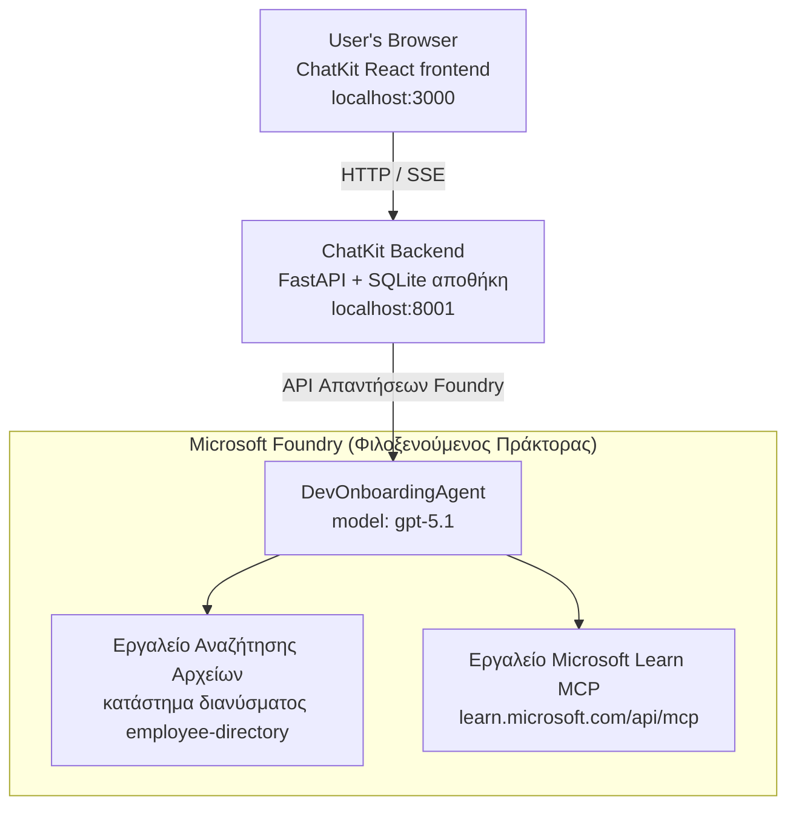

# Μάθημα 4: Ανάπτυξη Agent με Microsoft Foundry Hosted Agents + ChatKit

Αυτό το μάθημα δείχνει πώς να αναπτύξετε έναν agent που χρησιμοποιεί εργαλεία στο Microsoft Foundry ως hosted agent και να δημιουργήσετε ένα frontend βασισμένο σε ChatKit για αλληλεπίδραση μαζί του.

## Αρχιτεκτονική

Ο hosted agent είναι ένα **μοναδικό `DevOnboardingAgent`** (τρέχοντας στο `gpt-5.1`) που απαντά σε ερωτήσεις εισαγωγής προγραμματιστών χρησιμοποιώντας δύο hosted εργαλεία: ένα εργαλείο **Αναζήτησης Αρχείων** πάνω στο vector store του καταλόγου εργαζομένων, και το εργαλείο **Microsoft Learn MCP**. Ένα frontend React με ChatKit επικοινωνεί με ένα backend FastAPI, που καλεί τον agent μέσω του Foundry **Responses API**.



## Προαπαιτούμενα

1. **Microsoft Foundry Project** στην περιοχή North Central US
2. **Azure CLI** αυθεντικοποιημένο (`az login`)
3. **Azure Developer CLI** (`azd`) εγκατεστημένο
4. **Python 3.12+** και **Node.js 18+**
5. **Vector Store** δημιουργημένο με δεδομένα εργαζομένων

## Γρήγορη Εκκίνηση

### 1. Ορισμός Μεταβλητών Περιβάλλοντος

```bash
cd lesson-4-agentdeployment
cp .env.example .env
# Επεξεργαστείτε το .env με τις λεπτομέρειες του έργου σας στο Microsoft Foundry
```

### 2. Ανάπτυξη Hosted Agent

**Επιλογή Α: Χρήση Azure Developer CLI (Συνιστάται)**

```bash
cd hosted-agent
azd auth login
azd agent deploy
```

**Επιλογή Β: Χρήση Docker + Azure Container Registry**

```bash
cd hosted-agent

# Δημιουργήστε το κοντέινερ
docker build -t developer-onboarding-agent:latest .

# Ετικέτα για ACR
docker tag developer-onboarding-agent:latest <your-acr>.azurecr.io/developer-onboarding-agent:latest

# Αποστολή σε ACR
az acr login --name <your-acr>
docker push <your-acr>.azurecr.io/developer-onboarding-agent:latest

# Ανάπτυξη μέσω της πύλης ή του SDK του Microsoft Foundry
```

### 3. Εκκίνηση Backend ChatKit

```bash
cd chatkit-server
python -m venv .venv
source .venv/bin/activate  # Στα Windows: .venv\Scripts\activate
pip install -r requirements.txt
python app.py
```

Ο διακομιστής θα ξεκινήσει στο `http://localhost:8001`

### 4. Εκκίνηση Frontend ChatKit

```bash
cd chatkit-server/frontend
npm install
npm run dev
```

Το frontend θα ξεκινήσει στο `http://localhost:3000`

### 5. Δοκιμή Εφαρμογής

Ανοίξτε το `http://localhost:3000` στον περιηγητή σας και δοκιμάστε αυτές τις ερωτήσεις:

**Αναζήτηση Εργαζομένων:**
- "Είμαι καινούριος εδώ! Έχει δουλέψει κανείς στη Microsoft;"
- "Ποιος έχει εμπειρία με Azure Functions;"

**Πόροι Μάθησης:**
- "Δημιουργήστε μια διαδρομή μάθησης για Kubernetes"
- "Ποιες πιστοποιήσεις πρέπει να ακολουθήσω για αρχιτεκτονική cloud;"

**Βοήθεια στην Κωδικοποίηση:**
- "Βοηθήστε με να γράψω κώδικα Python για σύνδεση με CosmosDB"
- "Δείξε μου πώς να δημιουργήσω μια Azure Function"

**Ερωτήσεις Πολλαπλών Agents:**
- "Ξεκινάω ως μηχανικός cloud. Με ποιους πρέπει να συνδεθώ και τι πρέπει να μάθω;"

## Δομή Έργου

```
lesson-4-agentdeployment/
├── .env.example                 # Environment variables template
├── implementation-plan.md       # Detailed implementation guide
├── README.md                    # This file
├── hosted-agent/               # Microsoft Foundry hosted agent
│   ├── main.py                 # Multi-agent workflow implementation
│   ├── requirements.txt        # Python dependencies
│   ├── Dockerfile              # Container definition
│   └── agent.yaml              # Agent deployment configuration
└── chatkit-server/             # ChatKit server application
    ├── app.py                  # FastAPI backend
    ├── store.py                # SQLite persistence layer
    ├── requirements.txt        # Python dependencies
    └── frontend/               # React frontend
        ├── package.json
        ├── vite.config.ts
        ├── tsconfig.json
        ├── index.html
        └── src/
            ├── main.tsx
            ├── App.tsx
            ├── App.css
            └── index.css
```

## Ο Agent και τα Εργαλεία του

Ο hosted agent είναι ένας **μοναδικός agent** (`DevOnboardingAgent`, ορισμένος στο `hosted-agent/main.py`) που διαχειρίζεται τρεις τομείς εισαγωγής. Αντί να οργανώνει χωριστούς υπο-agent, εκθέτει κάθε ικανότητα ως εργαλείο (ή βασίζεται άμεσα στο μοντέλο):

| Ικανότητα | Πώς διαχειρίζεται | Εργαλείο |
|-----------|------------------|------|
| **Αναζήτηση & συνδέσεις εργαζομένων** | Αναζήτηση Αρχείων hosted στο Foundry πάνω στο vector store του καταλόγου | `client.get_file_search_tool(vector_store_ids=[...])` |
| **Μάθηση & εκπαίδευση** | Microsoft Learn MCP server (hosted εργαλείο MCP) | `client.get_mcp_tool(url="https://learn.microsoft.com/api/mcp")` |
| **Βοήθεια στην κωδικοποίηση** | Διαχειρίζεται άμεσα το μοντέλο `gpt-5.1` — χωρίς εξωτερικό εργαλείο | — |

Ο agent δημιουργείται με `client.as_agent(name="DevOnboardingAgent", instructions=..., tools=[file_search_tool, learn_mcp_tool])` και εξυπηρετείται με `from_agent_framework(agent).run()`.

> **Σημείωση σχεδιασμού.** Προηγούμενα σχέδια αυτού του μαθήματος χρησιμοποιούσαν ένα workflow πολλαπλών agents `HandoffBuilder` (Triage → ειδικοί). Ο τρέχων agent είναι ένας μοναδικός agent που χρησιμοποιεί εργαλεία, πιο απλός στην ανάπτυξη και ερμηνεία για Q&A εισαγωγής. Για παράδειγμα πολλαπλών agents και handoffs, δείτε τα Μαθήματα 2 και 3.

## Έλεγχος Smoke του Hosted Agent (CI Gate)

Η επιτυχημένη ανάπτυξη ενός hosted agent αποδεικνύει μόνο ότι το control plane αποδέχθηκε τον
ορισμό — **δεν** αποδεικνύει ότι ο agent απαντάει πραγματικά. Μια ελλιπής εξάρτηση,
κακή δρομολόγηση μοντέλου ή ληγμένη σύνδεση μπορεί να αφήσει έναν πράσινο αλλά σιωπηλό agent.

Αυτό το μάθημα παρέχει ένα ελαφρύ **smoke test** που λειτουργεί ως γρήγορος, φθηνός έλεγχος μετά την ανάπτυξη.
Χρησιμοποιεί το GitHub Action [AI Smoke Test](https://github.com/marketplace/actions/ai-smoke-test)
για να στείλει POST αιτήματα στο endpoint **Responses** του agent
(`POST {project_endpoint}/agents/{agent_name}/endpoint/protocols/openai/responses`)
και ελέγχει το κείμενο απάντησης. Εντοπίζει σπασμένες αναπτύξεις, προβλήματα αυθεντικοποίησης,
απόκλιση prompt του συστήματος, και σφάλματα στην αλληλουχία συζητήσεων μέσα σε λίγα δευτερόλεπτα.

> Οι smoke tests **δεν** αντικαθιστούν τις πλήρεις αξιολογήσεις στο
> [Μάθημα 3](../lesson-3-agent-evals/README.md) — αποτελούν συμπλήρωμα. Οι smoke tests
> απαντούν *"είναι ο agent προσβάσιμος, απαντά και ακολουθεί βασικά πρότυπα prompt;"*·
> οι αξιολογήσεις απαντούν *"πόσο καλή είναι η απάντηση;"*. Εκτελέστε το φθηνό έλεγχο σε κάθε ανάπτυξη.

### Τι ελέγχεται

Ο κατάλογος βρίσκεται στο [`hosted-agent/tests/smoke-tests.json`](../../../lesson-4-agentdeployment/hosted-agent/tests/smoke-tests.json)
και καλύπτει τους τρεις τομείς του agent καθώς και την τήρηση των prompt και τη διαχείριση πολλαπλών γύρων συζήτησης:

| Έλεγχος | Τι επαληθεύει |
|------|------------------|
| `reachability` | Ο agent απαντά με μη κενό, σχετικό κείμενο |
| `employee-search` | Ο τομέας αναζήτησης αρχείων επιστρέφει υγιές `200` (η απάντηση εξαρτάται από τα δεδομένα) |
| `learning-path` | Ο τομέας μάθησης αναπαράγει το θέμα και παράγει απάντηση τύπου διαδρομής |
| `coding-assistance` | Ο τομέας κωδικοποίησης επιστρέφει απάντηση σε μορφή κώδικα Python |
| `prompt-adherence-offtopic` | Αίτημα εκτός θέματος ανακατευθύνεται, δεν απαντάται με λεπτομέρεια |
| `threading-turn-1/2` | Κατάσταση συζήτησης διατηρείται ανάμεσα σε γύρους μέσω `previous_response_id` |

### Εκτέλεση στο CI

Το workflow στο [`.github/workflows/smoke-test-hosted-agent.yml`](../../../.github/workflows/smoke-test-hosted-agent.yml)
περιλαμβάνει δύο εργασίες:

- **`static`** — ένας γρήγορος, χωρίς Azure έλεγχος που τρέχει σε κάθε pull request και push:
  μεταγλωττίζει όλο τον πηγαίο κώδικα Python (`py_compile`) και ελέγχει τους συνδέσμους Markdown. Δεν απαιτούνται κλειδιά,
  οπότε δουλεύει σε fork PRs.
- **`smoke`** — ο connected με Azure smoke test παρακάτω. Τρέχει κατά απαίτηση
  (Actions → **Agent CI (static + smoke)** → Run workflow) και μπορεί να προστεθεί μετά το
  deployment workflow σας.

Ρυθμίστε αυτές τις αποθετηριακές **μεταβλητές** και **μυστικά** για την εργασία smoke:

| Τύπος | Όνομα | Τιμή |
|------|------|-------|

| Μεταβλητή | `FOUNDRY_PROJECT_ENDPOINT` | `https://<account>.services.ai.azure.com/api/projects/<project>` |
| Μεταβλητή | `HOSTED_AGENT_NAME` | Όνομα αναπτυγμένου πράκτορα (π.χ. `dev-onboarding` — πρέπει να ταιριάζει με την ανάπτυξή σας) |
| Μυστικό | `AZURE_CLIENT_ID` / `AZURE_TENANT_ID` / `AZURE_SUBSCRIPTION_ID` | Διαμοιρασμένη ταυτότητα OIDC για `azure/login` |

Η ταυτότητα του runner χρειάζεται το ρόλο **`Azure AI User`** στο **Foundry project scope** ώστε να
μπορεί να καλεί τα endpoints δεδομένων Responses (και συνομιλιών). Παρακινείστε το δίνοντάς το με:

```bash
az role assignment create \
  --assignee <object-id-or-appId-of-runner-identity> \
  --role "Azure AI User" \
  --scope "/subscriptions/<sub>/resourceGroups/<rg>/providers/Microsoft.CognitiveServices/accounts/<account>/projects/<project>"
```

### Εκτέλεση τοπικά

Μπορείτε να εκτελέσετε τον ίδιο κατάλογο πριν την ώθηση. Αποκτήστε ένα token δεδομένων με scope
`https://ai.azure.com/` και δείξτε τον runner στην ανάπτυξή σας:

```bash
# Το Audience ΠΡΕΠΕΙ να είναι https://ai.azure.com/ (τα tokens cognitiveservices.azure.com απορρίπτονται)
export FOUNDRY_TOKEN=$(az account get-access-token --resource https://ai.azure.com/ --query accessToken -o tsv)

git clone https://github.com/JFolberth/ai-smoketest && cd ai-smoketest
python runner.py \
  --project-endpoint "https://<account>.services.ai.azure.com/api/projects/<project>" \
  --agent-name dev-onboarding \
  --tests-file ../lesson-4-agentdeployment/hosted-agent/tests/smoke-tests.json
```

Κωδικοί εξόδου: `0` όλα πέρασαν, `1` μια επιβεβαίωση απέτυχε, `2` σφάλμα runner (κακός κατάλογος / token).

## Επίλυση προβλημάτων

### Ο πράκτορας δεν ανταποκρίνεται
- Επιβεβαιώστε ότι ο φιλοξενούμενος πράκτορας είναι αναπτυγμένος και λειτουργεί στο Microsoft Foundry
- Ελέγξτε ότι το `HOSTED_AGENT_NAME` και το `HOSTED_AGENT_VERSION` ταιριάζουν με την ανάπτυξή σας

### Σφάλματα αποθήκευσης διανυσμάτων (Vector store)
- Διασφαλίστε ότι το `VECTOR_STORE_ID` έχει οριστεί σωστά
- Επιβεβαιώστε ότι η αποθήκη διανυσμάτων περιέχει τα δεδομένα υπαλλήλων

### Σφάλματα πιστοποίησης
- Εκτελέστε `az login` για ανανέωση διαπιστευτηρίων
- Βεβαιωθείτε ότι έχετε πρόσβαση στο έργο Microsoft Foundry

## Πόροι

- [Τεκμηρίωση Microsoft Foundry Hosted Agents](https://learn.microsoft.com/en-us/azure/ai-foundry/agents/concepts/hosted-agents)
- [Microsoft Agent Framework](https://github.com/microsoft/agent-framework)
- [Παράδειγμα ενσωμάτωσης ChatKit](https://github.com/microsoft/agent-framework/tree/main/python/samples/demos/chatkit-integration)
- [Azure Developer CLI](https://learn.microsoft.com/en-us/azure/developer/azure-developer-cli/overview)
- [AI Smoke Test GitHub Action](https://github.com/marketplace/actions/ai-smoke-test)
- [Smoke Test Microsoft Foundry Agents with GitHub Actions (blog)](https://techcommunity.microsoft.com/blog/azuredevcommunityblog/smoke-test-microsoft-foundry-agents-with-github-actions/4531912)

---

## Επόμενα Βήματα

Ο πράκτοράς σας τρέχει σε υποδομή που διαχειρίζεται η Microsoft. Για να τον φέρετε σε παραγωγή σε εταιρικό επίπεδο —
ελέγχοντας πού αποθηκεύονται τα δεδομένα του (κυριαρχία δεδομένων, ιδιωτικό δίκτυο, bring-your-own Azure
Cosmos DB / Storage / AI Search) και ρυθμίζοντας τα εργαλεία του — συνεχίστε στο
**[Μάθημα 5: Production Hosted Agents](../lesson-5-hosted-agents-production/README.md)**, που
εξηγεί τη σημαντική διαφορά μεταξύ **Hosted Agents** και **Capability Hosts**.

---

<!-- CO-OP TRANSLATOR DISCLAIMER START -->
**Αποποίηση ευθυνών**:
Αυτό το έγγραφο έχει μεταφραστεί χρησιμοποιώντας την υπηρεσία μετάφρασης με τεχνητή νοημοσύνη [Co-op Translator](https://github.com/Azure/co-op-translator). Ενώ επιδιώκουμε την ακρίβεια, παρακαλούμε να έχετε υπόψη ότι οι αυτοματοποιημένες μεταφράσεις ενδέχεται να περιέχουν λάθη ή ανακρίβειες. Το πρωτότυπο έγγραφο στη μητρική του γλώσσα πρέπει να θεωρείται η αυθεντική πηγή. Για κρίσιμες πληροφορίες, συνιστάται επαγγελματική ανθρώπινη μετάφραση. Δεν φέρουμε ευθύνη για τυχόν παρεξηγήσεις ή λανθασμένες ερμηνείες που προκύπτουν από τη χρήση αυτής της μετάφρασης.
<!-- CO-OP TRANSLATOR DISCLAIMER END -->