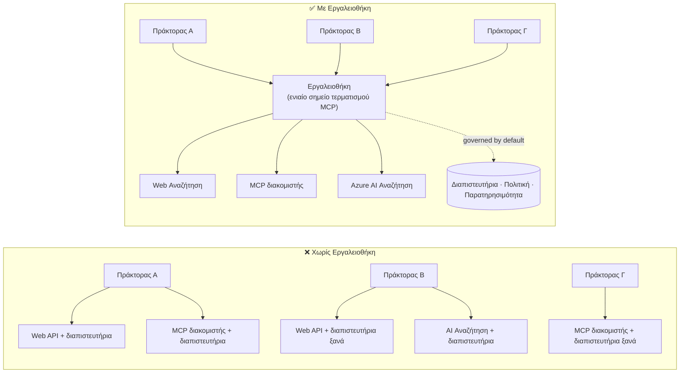

# Μάθημα 6: Microsoft Toolbox — Ελεγχόμενα Εργαλεία για Πρακτορείς

Με το [Μάθημα 5](../lesson-5-hosted-agents-production/README.md) ο φιλοξενούμενος πράκτοράς σας εκτελείται σε
παραγωγή με την αποθήκευση και την πολιτική διακυβέρνησης που χρειάζεται ο οργανισμός σας. Αλλά κοιτάξτε ξανά τον
πράκτορα του Μαθήματος 4: κάθε εργαλείο ήταν **ενσωματωμένο** μέσα στο `main.py` — η διεύθυνση URL της Microsoft Learn MCP,
η αποθήκη αναζήτησης αρχείων, και ούτω καθεξής. Αυτό λειτουργεί για έναν πράκτορα. Δεν κλιμακώνεται σε έναν
οργανισμό με δεκάδες πράκτορες και ομάδες.

Αυτό το μάθημα παρουσιάζει το **Microsoft Toolbox**: τον τρόπο που το Foundry σας επιτρέπει να ορίσετε μια επιλεγμένη σειρά
εργαλείων **μια φορά**, να τα διαχειρίζεστε **κεντρικά**, και να τα εκθέσετε σε οποιονδήποτε πράκτορα μέσω ενός **ενός,
ελεγχόμενου σημείου τερματισμού**.

## Μαθησιακοί Στόχοι

Μέχρι το τέλος αυτού του μαθήματος θα μπορείτε:

- Να εξηγήσετε το πρόβλημα πολλαπλών εργαλείων που επιλύει το Toolbox.
- Να περιγράψετε τους πυλώνες **Build** και **Consume** και τους τύπους εργαλείων που μπορεί να περιέχει ένα toolbox.
- Να **Κατασκευάσετε** μια έκδοση toolbox με το Foundry SDK.
- Να **Καταναλώνετε** ένα toolbox από έναν φιλοξενούμενο πράκτορα Microsoft Agent Framework μέσω ενός μοναδικού MCP endpoint.
- Να χρησιμοποιήσετε **έκδοση** για να στέλνετε αλλαγές εργαλείων χωρίς αλλαγές ή επαναεγκαταστάσεις κώδικα πράκτορα.
- Να εφαρμόσετε **διακυβέρνηση**: RBAC, εισαγωγή διαπιστευτηρίων, και πολιτικές φραγμού (RAI).

---

## Προαπαιτούμενα

1. Ολοκληρωμένα το [Μάθημα 4](../lesson-4-agentdeployment/README.md) και κατά προτίμηση
   το [Μάθημα 5](../lesson-5-hosted-agents-production/README.md).
2. Ένα **Microsoft Foundry** έργο με άδεια για δημιουργία και διαχείριση πόρων toolbox.
3. **Azure CLI** πιστοποιημένο: `az login`. Οι API του Foundry toolbox απαιτούν το
   `https://ai.azure.com/.default` scope token (όπως φαίνεται στον κώδικα πιο κάτω).
4. **Python 3.12+** με εγκατεστημένες τις εξαρτήσεις του μαθήματος (`pip install -r ../requirements.txt`).
5. Τρέχουσα μη-αποσυρμένη ανάπτυξη μοντέλου (για παράδειγμα `gpt-5.1`). Αποφύγετε τα απόσυρμένα GPT-4o / GPT-4.1.

---

## 1. Το πρόβλημα: πολλαπλά εργαλεία

Ένας μεμονωμένος πράκτορας μπορεί να βασίζεται σε πολλά εργαλεία — REST APIs, MCP διακομιστές, συνδέσμους και ροές — καθένα
με το δικό του μοντέλο πιστοποίησης και την ομάδα ιδιοκτησίας του. Καθώς κλιμακώνεστε σε όλο τον οργανισμό:

- Οι ομάδες **επαναδημιουργούν τα ίδια εργαλεία** ανεξάρτητα.
- **Τα διαπιστευτήρια διπλασιάζονται** μεταξύ πρακτόρων και αποθετηρίων.
- Η **διακυβέρνηση γίνεται ασυνέπεια** — κάθε πράκτορας εφαρμόζει (ή ξεχνά) την πολιτική μόνος του.
- Υπάρχει **λίγη ορατότητα** σε ποια εργαλεία υπάρχουν ή ποιος τα χρησιμοποιεί.

Οι προγραμματιστές καθυστερούν — όχι επειδή τα μοντέλα δεν είναι ικανά, αλλά επειδή **η ενσωμάτωση εργαλείων γίνεται το εμπόδιο**.




Οι επιχειρήσεις έχουν ήδη την υποδομή — πύλες, θησαυροφυλάκια διαπιστευτηρίων, πολιτικές, παρατηρησιμότητα.
Αυτό που έλλειπε ήταν μια εμπειρία προγραμματιστή που να την πακετάρει σε κάτι **επαναχρησιμοποιήσιμο,
ανακαλύψιμο, και ελεγχόμενο από προεπιλογή**. Αυτή είναι η Toolbox.

---

## 2. Τι είναι ένα Toolbox

Ένα **Toolbox** είναι μια **διαχειριζόμενη Foundry πόρος**. Ορίζετε μια επιλεγμένη σειρά εργαλείων μια φορά, τα διαχειρίζεστε
κεντρικά στο Foundry, και τα εκθέτετε μέσω **ενός μόνο MCP συμβατού σημείου τερματισμού** που μπορεί να καταναλωθεί από οποιονδήποτε
πράκτορα. Την ώρα εκτέλεσης η πλατφόρμα διαχειρίζεται **εισαγωγή διαπιστευτηρίων, ανανέωση token, και
εφαρμογή πολιτικών επιχείρησης**.

Επειδή το toolbox είναι διαχειριζόμενος πόρος, μπορείτε να προσθέσετε, αφαιρέσετε ή επαναδιαμορφώσετε εργαλεία **χωρίς να
αλλάξετε κώδικα στον πράκτορα σας** — ο πράκτορας πάντα συνδέεται στο ίδιο σημείο τερματισμού.

Η Toolbox καλύπτει τον κύκλο ζωής του εργαλείου μέσα από τέσσερις πυλώνες· **Build** και **Consume** είναι διαθέσιμοι
σήμερα:

| Πυλώνας | Κατάσταση | Τι επιτρέπει |
|--------|---------|---------------|
| **Build** | Διαθέσιμο σήμερα | Επιλογή εργαλείων, κεντρική ρύθμιση πιστοποίησης, δημοσίευση επαναχρησιμοποιήσιμου toolbox που μπορεί να καταναλωθεί από οποιαδήποτε ομάδα. |
| **Consume** | Διαθέσιμο σήμερα | Σύνδεση οποιουδήποτε πράκτορα σε ένα MCP-συμβατό σημείο τερματισμού για δυναμική ανακάλυψη και εκτέλεση όλων των εργαλείων του toolbox. |

Η επιφάνεια κατανάλωσης είναι **ανοιχτή**: οποιοδήποτε MCP-συμβατό runtime ή πελάτης μπορεί να χρησιμοποιήσει ένα toolbox —
Microsoft Agent Framework, LangGraph, GitHub Copilot, Claude Code, Microsoft Copilot Studio, ή
προσαρμοσμένο κώδικα.

### Τύποι εργαλείων που μπορεί να περιέχει ένα toolbox

Αναζήτηση Web · MCP · Azure AI Search · Code Interpreter · File Search · OpenAPI · **Agent-to-Agent
(A2A)** · Fabric IQ · Tool Search · Work IQ · Browser Automation · Αναφορές δεξιοτήτων, συν μια
**πολιτική φραγμού (RAI)** εφαρμοσμένη στο επίπεδο του toolbox.

> **Συμβουλή:** Προσθέστε μια `περιγραφή` σε **κάθε** εργαλείο ώστε το μοντέλο να επιλέξει το σωστό. Ένα toolbox
> επιτρέπει το πολύ **ένα μη ονομαζόμενο εργαλείο ανά τύπο** — δώστε σε κάθε πρόσθετο παράδειγμα του ίδιου τύπου ένα
> μοναδικό `όνομα`, ή θα λάβετε σφάλμα `invalid_payload`.

---

## 3. Δημιουργία toolbox

Τα toolbox διαχειρίζονται με τα Foundry SDKs (Python/.NET/JavaScript), το REST API, `azd`, και το
**Microsoft Foundry Toolkit για VS Code**. Εδώ είναι το μοτίβο Python (`azure-ai-projects`):

```python
from azure.identity import DefaultAzureCredential
from azure.ai.projects import AIProjectClient
from azure.ai.projects.models import MCPTool, ToolboxSearchPreviewTool, WebSearchTool

endpoint = "https://<your-foundry-account>.services.ai.azure.com/api/projects/<your-project>"
project = AIProjectClient(endpoint=endpoint, credential=DefaultAzureCredential())

toolbox_version = project.toolboxes.create_toolbox_version(
    name="agent-tools",
    description="Web search + an MCP server + tool search",
    tools=[
        WebSearchTool(),
        MCPTool(
            server_label="myserver",
            server_url="https://your-mcp-server.example.com",
            require_approval="never",
            project_connection_id="my-key-auth-connection",  # τα διαπιστευτήρια βρίσκονται στο Foundry
        ),
        ToolboxSearchPreviewTool(),
    ],
)
print(f"Created toolbox: {toolbox_version.name}, version: {toolbox_version.version}")
```

Παρατηρήστε τι **δεν** κάνετε: δεν υπάρχουν μυστικά στον πράκτορα. Τα διαπιστευτήρια κατέχονται από μια
**σύνδεση** Foundry (`project_connection_id`) και εισάγονται από την πλατφόρμα κατά την κλήση.

> **Σημείωση προεπισκόπησης.** Η **διαχείριση** toolbox (δημιουργία/ενημέρωση εκδόσεων) είναι λειτουργία σε προεπισκόπηση.
> Οι λειτουργίες `project.toolboxes.*` που εμφανίζονται παραπάνω αποστέλλονται σε προεπισκόπηση SDK, στο REST API, `azd`,
> και στο **Foundry Toolkit για VS Code** — δεν είναι παρούσες στην καρφιτσωμένη έκδοση `azure-ai-projects` που
> χρησιμοποιείται αλλού σε αυτό το μάθημα. Θεωρήστε αυτό το απόσπασμα ως τη δομή του βήματος Build· για
> πλήρη ροή, δημιουργήστε το toolbox μέσω της **πύλης Foundry** ή του **Foundry Toolkit**. Το
> βήμα **Consume** παρακάτω λειτουργεί με το καρφιτσωμένο SDK του μαθήματος σήμερα.

---

## 4. Κατανάλωση toolbox από τον πράκτορά σας

Ένα toolbox εκθέτει ένα **MCP endpoint**. Υπάρχουν δύο μοτίβα:

| Ρόλος | Σημείο τερματισμού | Πότε να χρησιμοποιηθεί |
|------|-----------------|---------------------|
| **Καταναλωτής toolbox** | `{project_endpoint}/toolboxes/{name}/mcp?api-version=v1` | Συνδέστε πράκτορες. Πάντα εξυπηρετεί την **προεπιλεγμένη έκδοση**. |
| **Προγραμματιστής toolbox** | `{project_endpoint}/toolboxes/{name}/versions/{version}/mcp?api-version=v1` | Δοκιμάστε μια συγκεκριμένη έκδοση πριν την προωθήσετε. |

> **Συνδέστε πράκτορες στο σημείο τερματισμού *κατανάλωσης*.** Επειδή πάντα σερβίρει την προεπιλεγμένη έκδοση, εσείς

> μπορούν να προωθήσουν νέες εκδόσεις **χωρίς να αλλάξουν τον κώδικα του πράκτορα ή να ξανααναπτύξουν**.

### Ενσωμάτωση με έναν πράκτορα Microsoft Agent Framework που φιλοξενείται

Θυμηθείτε ότι ο πράκτορας του Μαθήματος 4 πρόσθεσε ένα μόνο σκληροκωδικοποιημένο εργαλείο MCP με το `client.get_mcp_tool(...)`. Με
το Toolbox, αντίθετα, δείχνετε **ένα** `MCPStreamableHTTPTool` στο endpoint του toolbox — και ο πράκτορας
παίρνει **όλα** τα εργαλεία στο toolbox, που ελέγχονται κεντρικά:

```python
import httpx
from azure.identity import DefaultAzureCredential, get_bearer_token_provider
from agent_framework import MCPStreamableHTTPTool

# Auth: Η εργαλειοθήκη Foundry απαιτεί το πεδίο https://ai.azure.com/.default
credential = DefaultAzureCredential()
token_provider = get_bearer_token_provider(credential, "https://ai.azure.com/.default")
http_client = httpx.AsyncClient(auth=_ToolboxAuth(token_provider), timeout=120.0)

TOOLBOX_ENDPOINT = os.environ["TOOLBOX_ENDPOINT"]  # platform-injected κατά την εκτέλεση

mcp_tool = MCPStreamableHTTPTool(
    name="toolbox",
    url=TOOLBOX_ENDPOINT,
    http_client=http_client,
    load_prompts=False,
)

agent = chat_client.as_agent(
    name="my-toolbox-agent",
    instructions="You are a helpful assistant with access to Foundry toolbox tools.",
    tools=[mcp_tool],
)
```

Το αντίστοιχο `.env` (σημείωση: χρησιμοποιήστε ένα **ενεργό** μοντέλο όπως το `gpt-5.1`, **όχι** το αποσυρθέν
`gpt-4o`):

```env
FOUNDRY_PROJECT_ENDPOINT=https://<account>.services.ai.azure.com/api/projects/<project>
TOOLBOX_ENDPOINT=https://<account>.services.ai.azure.com/api/projects/<project>/toolboxes/agent-tools/mcp?api-version=v1
AZURE_AI_MODEL_DEPLOYMENT_NAME=gpt-5.1
```

> **Επαληθεύστε πρώτα.** Πριν συνδέσετε τον πλήρη πράκτορα, συνδέστε ένα MCP client SDK (`pip install mcp`) στο
> **κατά εκδόση** endpoint και απαριθμήστε τα εργαλεία για να επιβεβαιώσετε ότι φορτώνονται όπως αναμένεται.

### Εκτέλεση του δείγματος κατανάλωσης

Το παρόν μάθημα συνοδεύεται από ένα εκτελέσιμο δείγμα στην πλευρά κατανάλωσης, το [`toolbox_agent.py`](../../../lesson-6-toolbox/toolbox_agent.py). Χρησιμοποιεί
την ίδια προσέγγιση `FoundryChatClient.get_mcp_tool(...)` που μάθατε στο Μάθημα 2, αλλά κατευθύνει το μοναδικό
εργαλείο MCP στο endpoint του **toolbox** — έτσι ο πράκτορας παίρνει κάθε ελεγχόμενο εργαλείο στο toolbox:

```bash
# Στο αρχείο .env σας, ορίστε το TOOLBOX_ENDPOINT στη διεύθυνση endpoint του καταναλωτή toolbox σας, στη συνέχεια:
python lesson-6-toolbox/toolbox_agent.py
```

Ανοίξτε το τυπωμένο URL `http://localhost:8096` και κάντε μια ερώτηση που να χρησιμοποιεί ένα από τα
εργαλεία του toolbox σας. Προσθέστε ή αναβαθμίστε ένα εργαλείο στο toolbox και ρωτήστε ξανά — **χωρίς να αλλάξετε αυτόν
τον κώδικα** — για να δείτε τη κεντρική διακυβέρνηση και τη διαχείριση εκδόσεων σε δράση.

---

## 5. Διαχείριση εκδόσεων: ασφαλείς αλλαγές εργαλείων

Η διαχείριση εκδόσεων του Toolbox σας δίνει ρητό έλεγχο για το πότε εφαρμόζονται οι αλλαγές:

1. **Δημιουργήστε** μια νέα έκδοση toolbox με το ενημερωμένο σύνολο εργαλείων.
2. **Δοκιμάστε** την στο κατά εκδόση (για προγραμματιστές) endpoint.
3. **Προωθήστε** τη στο `default_version` όταν είστε έτοιμοι.

Κάθε πράκτορας που δείχνει στο **καταναλωτικό** endpoint παίρνει αυτόματα την προωθημένη έκδοση — **χωρίς αλλαγές κώδικα, χωρίς επαναανάπτυξη**. (Η πρώτη έκδοση που δημιουργείτε προωθείται αυτόματα ως η προεπιλεγμένη.)


Αυτό είναι το ισοδύναμο της διαχείρισης εργαλείων ενός μπλε/πράσινου ανέβασματος: επικυρώνετε μια αλλαγή ξεχωριστά,
και μετά αλλάζετε την προεπιλογή για κάθε καταναλωτή ταυτόχρονα.

---

## 6. Διακυβέρνηση: πώς το Toolbox βελτιώνει τον έλεγχο

Το Toolbox είναι **διακυβερνώμενο εξ ορισμού**. Οι μοχλοί διακυβέρνησης που πρέπει να γνωρίζετε:

- **RBAC.** Χορηγήστε τον ρόλο **Foundry User** στο έργο σε κάθε ταυτότητα: τον **προγραμματιστή** που
  διαχειρίζεται τις εκδόσεις του toolbox, την **διαχειριζόμενη ταυτότητα του πράκτορα** (για πράκτορες που καλούν εργαλεία κατά την εκτέλεση),
  και, για ροές OAuth, τον **τελικό χρήστη** του οποίου η ταυτότητα προωθείται.
- **Κεντρικά διαχειριζόμενες διαπιστευτήριες.** Οι διαπιστεύσεις εργαλείων ζουν στις **συνδέσεις** του Foundry, όχι στον κώδικα του πράκτορα
  ή στα αρχεία `.env`. Η πλατφόρμα τα εγχέει και ανανεώνει τα διαπιστευτήρια κατά την εκτέλεση.
- **Οδοί προστασίας (RAI policy).** Συνδέστε μια ονομασμένη πολιτική υπεύθυνης AI σε μια έκδοση toolbox μέσω
  `policies.rai_config.rai_policy_name`. Λειτουργεί στο **επίπεδο toolbox**, ανεξάρτητα από οποιοδήποτε
  φιλτράρισμα περιεχομένου μοντέλου, ελέγχοντας τις εισόδους και εξόδους εργαλείων.
- **Έγκριση MCP.** Ο έλεγχος `require_approval` ανά εργαλείο ορίζει αν μια κλήση εργαλείου MCP χρειάζεται έγκριση —
  την ίδια ροή εργασίας έγκρισης που είδατε στο [Μάθημα 5 §7](../lesson-5-hosted-agents-production/README.md#7-hosted-mcp-tools--approval-workflows).
- **Ιδιωτικά δίκτυα.** Το Toolbox υποστηρίζει διαμορφώσεις εικονικών δικτύων για επιχειρήσεις που
  κρατούν την κίνηση εντός του δικτύου τους.
- **Ορατότητα.** Επειδή τα εργαλεία καταλογίζονται κεντρικά, τελικά έχετε μια απογραφή του τι
  υπάρχει και ποιος το καταναλώνει.

---

## Πρακτικές ασκήσεις

1. **Ανασχεδιάστε το Μάθημα 4.** Ο πράκτορας του Μαθήματος 4 σκληροκωδικοποιεί το εργαλείο Microsoft Learn MCP. Σχεδιάστε πώς
   θα μεταφέρατε αυτό το εργαλείο σε ένα `agent-tools` toolbox και θα κατευθύνατε το `main.py` στο καταναλωτικό
   endpoint του toolbox. Τι αλλαγές χρειάζονται στο `main.py`; Τι πλέον δεν υπάρχει εκεί;
2. **Σχεδιάστε μια αύξηση έκδοσης.** Χρειάζεται να προσθέσετε ένα εργαλείο Web Search σε ένα ενεργό toolbox που χρησιμοποιούν πέντε
   πράκτορες. Περιγράψτε την ακολουθία δημιουργίας → δοκιμής → προώθησης και εξηγήστε γιατί κανένας από τους πέντε πράκτορες
   δεν χρειάζεται επαναανάπτυξη.
3. **Επιλέξτε τις ταυτότητες αυθεντικοποίησης.** Για έναν φιλοξενούμενο πράκτορα που καλεί ένα εργαλείο MCP βασισμένο σε OAuth μέσω
   του toolbox, απαριθμήστε ποιες ταυτότητες χρειάζονται τον ρόλο **Foundry User** και γιατί.
4. **Τοποθέτηση οδών προστασίας.** Εξηγήστε τη διαφορά ανάμεσα σε ένα φιλτράρισμα περιεχομένου σε επίπεδο μοντέλου και ένα
   οδό προστασίας toolbox, και δώστε ένα παράδειγμα όπου χρειάζεστε ειδικά την οδό προστασίας του toolbox.

---

## Πόροι

- [Δημιουργία, δοκιμή και ανάπτυξη ενός toolbox στο Foundry](https://learn.microsoft.com/azure/foundry/agents/how-to/tools/toolbox)
- [Κατάλογος εργαλείων — Foundry Agent Service](https://learn.microsoft.com/azure/foundry/agents/concepts/tool-catalog)
- [Microsoft Agent Framework — Πάροχος Microsoft Foundry (εργαλεία)](https://learn.microsoft.com/agent-framework/agents/providers/microsoft-foundry)
- [Επισκόπηση Οδών Προστασίας](https://learn.microsoft.com/azure/foundry/guardrails/guardrails-overview)
- [Ξεκινήστε με το Foundry στο VS Code (Foundry Toolkit)](https://learn.microsoft.com/azure/ai-foundry/how-to/develop/get-started-projects-vs-code)
- [Πρωτόκολλο Πλαισίου Μοντέλου](https://modelcontextprotocol.io/)

---

**Προηγούμενο:** [Μάθημα 5 — Παραγωγή Φιλοξενούμενων Πρακτόρων](../lesson-5-hosted-agents-production/README.md)
&nbsp;·&nbsp; **Επόμενο:** [Μάθημα 7 — Πολλαπλοί Πράκτορες & A2A](../lesson-7-multi-agent-a2a/README.md)

---

<!-- CO-OP TRANSLATOR DISCLAIMER START -->
**Αποποίηση ευθυνών**:
Αυτό το έγγραφο έχει μεταφραστεί χρησιμοποιώντας την υπηρεσία μετάφρασης με τεχνητή νοημοσύνη [Co-op Translator](https://github.com/Azure/co-op-translator). Ενώ επιδιώκουμε την ακρίβεια, παρακαλούμε να έχετε υπόψη ότι οι αυτοματοποιημένες μεταφράσεις ενδέχεται να περιέχουν λάθη ή ανακρίβειες. Το πρωτότυπο έγγραφο στη μητρική του γλώσσα πρέπει να θεωρείται η αυθεντική πηγή. Για κρίσιμες πληροφορίες, συνιστάται επαγγελματική ανθρώπινη μετάφραση. Δεν φέρουμε ευθύνη για τυχόν παρεξηγήσεις ή λανθασμένες ερμηνείες που προκύπτουν από τη χρήση αυτής της μετάφρασης.
<!-- CO-OP TRANSLATOR DISCLAIMER END -->