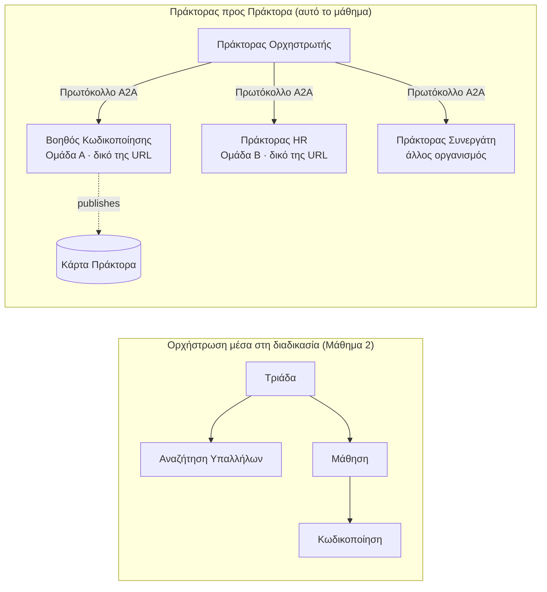

# Μάθημα 7: Ορχήστρωση Πολλαπλών Πρακτόρων & Agent-to-Agent (A2A)

Με το [Μάθημα 6](../lesson-6-toolbox/README.md) μπορείτε να δημιουργείτε ελεγχόμενα εργαλεία και φιλοξενούμενους πράκτορες.
Αλλά τα πραγματικά συστήματα σπάνια χρησιμοποιούν **έναν** πράκτορα. Καθώς κλιμακώνεστε, συνθέτετε **πολλούς** πράκτορες — μερικούς που έχετε εσείς,
μερικούς που ανήκουν σε άλλες ομάδες, μερικούς που λειτουργούν σε άλλες οργανώσεις εντελώς. Αυτό το μάθημα αφορά
το πώς οι πράκτορες λειτουργούν **μαζί**.

Έχετε ήδη γνωρίσει μια μορφή σχεδίασης πολλαπλών πρακτόρων στο
[Μάθημα 2's `agent-orchestration.py`](../lesson-2-agent-development/README.md): το πρότυπο **handoff**
όπου ένας πράκτορας διαλογής δρομολογεί σε ειδικούς **μέσα σε μια μονή διεργασία**. Αυτό το μάθημα ανεβαίνει
ένα επίπεδο παραπάνω — στο **Agent-to-Agent (A2A)**, το ανοιχτό πρωτόκολλο για πράκτορες που εκτελούνται ως ανεξάρτητες
**δικτυωμένες υπηρεσίες** και καλούν ο ένας τον άλλον πέρα από διεργασίες, ομάδες και οργανωτικά όρια.

## Στόχοι Μαθημάτων

Μέχρι το τέλος αυτού του μαθήματος θα μπορείτε να:

- Εξηγήσετε τη διαφορά μεταξύ **ορχήστρωσης μέσα στη διεργασία** (handoff/workflows) και
  επικοινωνίας **Agent-to-Agent (A2A)**, και να επιλέξετε το σωστό.
- Περιγράψετε τα δομικά στοιχεία του A2A: **Agent Card**, **δεξιότητες**, **εργασίες**, και **ανίχνευση**.
- **Εκθέσετε** έναν πράκτορα Microsoft Agent Framework ως υπηρεσία A2A με το `A2AExecutor`.
- **Καταναλώσετε** έναν απομακρυσμένο πράκτορα ως δικτυωμένο ομότιμο με `A2AAgent`.
- Εφαρμόσετε επιχειρηματικές ανησυχίες στο A2A: **ασφάλεια, ταυτότητα, διακυβέρνηση, παρατηρησιμότητα, και κόστος**.

---

## Προαπαιτούμενα

1. Ολοκληρωμένο το [Μάθημα 2](../lesson-2-agent-development/README.md) (ανάπτυξη πράκτορα & ορχήστρωση).
2. Ένα έργο **Microsoft Foundry** με τρέχουσα ανάπτυξη μοντέλου (π.χ. `gpt-5.1`, και
   `gpt-5-codex` για το δείγμα κώδικα). Αποφύγετε τα αποσυρμένα GPT-4o / GPT-4.1.
3. **Azure CLI** αυθεντικοποιημένο: `az login`.
4. **Python 3.12+** με τις εξαρτήσεις του μαθήματος εγκατεστημένες (`pip install -r ../requirements.txt`).
   Το Μάθημα 7 προσθέτει τα προεπισκοπούμενα πακέτα `agent-framework-a2a`, `a2a-sdk`, και `uvicorn`.
5. `FOUNDRY_PROJECT_ENDPOINT` και `FOUNDRY_MODEL` ρυθμισμένα στο `.env` σας (δείτε το README του μαθήματος).

---

## 1. Δύο τρόποι που οι πράκτορες συνεργάζονται

Δεν υπάρχει ένα μοναδικό πρότυπο "πολλαπλών πρακτόρων". Επιλέξτε αυτό που ταιριάζει στα **όριά** σας:

| Πρότυπο | Πού εκτελούνται οι πράκτορες | Πώς συνδέονται | Χρήση όταν |
|---------|------------------------------|---------------|------------|
| **Handoff / Workflow** (Μάθημα 2) | Μια διαδικασία, ένας κώδικας | Γράφος στη μνήμη (`HandoffBuilder`, `WorkflowBuilder`) | Κατέχετε όλους τους πράκτορες και τους αναπτύσσετε μαζί. |
| **Agent-to-Agent (A2A)** (αυτό το μάθημα) | Ξεχωριστές υπηρεσίες, ξεχωριστός κύκλος ζωής | Ανοιχτό **πρωτόκολλο A2A** μέσω HTTP, ανιχνεύσιμο μέσω **Agent Cards** | Οι πράκτορες ανήκουν σε διαφορετικές ομάδες/οργανώσεις, κλιμακώνονται ανεξάρτητα, ή γράφονται σε διαφορετικά πλαίσια. |

Το handoff αφορά το **δρομολόγηση μέσα σε μια εφαρμογή**. Το A2A αφορά το **σύνθεση πρακτόρων ως
ανεξάρτητες υπηρεσίες** — την ισοδύναμη μετάβαση των πρακτόρων από κλήσεις συναρτήσεων σε μικρο-υπηρεσίες.



> **Συνθέτουν.** Ένας ορχηστρωτής που φτιάχνετε με `HandoffBuilder` μπορεί να έχει **απομακρυσμένους πράκτορες A2A**
> ως συμμετέχοντες — δρομολόγηση μέσα στη διεργασία προς υπηρεσίες που οι ίδιες εκτελούνται παντού.

---

## 2. Τα δομικά στοιχεία του A2A

Το A2A είναι ένα **ανοιχτό πρωτόκολλο** (όχι αποκλειστικά Microsoft), οπότε ένας πράκτορας A2A μπορεί να καταναλωθεί από το Microsoft
Agent Framework, LangGraph, προσαρμοσμένο κώδικα, ή το στοίβ ενός άλλου κατασκευαστή. Τέσσερις έννοιες είναι σημαντικές:

- **Agent Card** — ένα μικρό έγγραφο JSON, δημοσιευμένο στο
  `/.well-known/agent-card.json`, που διαφημίζει το **όνομα, περιγραφή, URL, έκδοση,
  δεξιότητες, και δυνατότητες** του πράκτορα. Έτσι ένας πελάτης **ανιχνεύει** τι μπορεί να κάνει ένας απομακρυσμένος πράκτορας.
- **Δεξιότητες** — αυτά που δηλώνονται ότι μπορεί να κάνει ο πράκτορας (`id`, `name`, `description`, `tags`,
  `examples`). Οι πελάτες (και μοντέλα) τα χρησιμοποιούν για να αποφασίσουν εάν θα κάνουν κλήση.
- **Εργασίες** — μια κλήση σε έναν πράκτορα A2A είναι μια **εργασία** με κύκλο ζωής (υποβλήθηκε → σε εξέλιξη →
  ολοκληρώθηκε/απέτυχε). Ο διακομιστής παρακολουθεί τις εργασίες σε ένα **task store**· υποστηρίζονται ροές ενημερώσεων.
- **Ανίχνευση** — ένας πελάτης που έχει μόνο ένα URL τραβά την Agent Card και ξέρει πώς να καλέσει τον πράκτορα.

---

## 3. Εκθέστε έναν πράκτορα ως A2A υπηρεσία — `a2a_server.py`

Η πλευρά **Κατασκευής/υπηρέτησης** τυλίγει οποιονδήποτε πράκτορα Microsoft Agent Framework με το `A2AExecutor` και τον τοποθετεί
σε μια HTTP εφαρμογή A2A. Δείτε το [`a2a_server.py`](../../../lesson-7-multi-agent-a2a/a2a_server.py). Η κεντρική σύνδεση:

```python
from agent_framework.a2a import A2AExecutor
from a2a.server.apps import A2AStarletteApplication
from a2a.server.request_handlers import DefaultRequestHandler
from a2a.server.tasks import InMemoryTaskStore
from a2a.types import AgentCapabilities, AgentCard, AgentSkill

agent = client.as_agent(name="coding-assistant", instructions="...")

agent_card = AgentCard(
    name="Coding Assistant",
    description="Generates runnable code samples...",
    url="http://localhost:9000/",
    version="1.0.0",
    capabilities=AgentCapabilities(streaming=True),
    default_input_modes=["text"],
    default_output_modes=["text"],
    skills=[AgentSkill(id="generate-code", name="Generate code",
                       description="Write a runnable code snippet.", tags=["code"])],
)

request_handler = DefaultRequestHandler(
    agent_executor=A2AExecutor(agent),
    task_store=InMemoryTaskStore(),
)
app = A2AStarletteApplication(agent_card=agent_card, http_handler=request_handler).build()
# σερβίρεται με uvicorn στη θύρα 9000
```

Παρατηρήστε ότι ο κώδικας του πράκτορα είναι **αμετάβλητος** — το `A2AExecutor` προσαρμόζει τον υπάρχοντα πράκτορά σας στο πρωτόκολλο.
Η Agent Card είναι αυτή που τον καθιστά **ανιχνεύσιμο** σε οποιονδήποτε πελάτη A2A.

---

## 4. Καταναλώστε έναν απομακρυσμένο πράκτορα — `a2a_client.py`

Η πλευρά **Κατανάλωσης** συνδέεται σε απομακρυσμένο πράκτορα **μέσω URL**, τραβά την Agent Card του, και τον καλεί
ακριβώς σαν τοπικό πράκτορα. Δείτε το [`a2a_client.py`](../../../lesson-7-multi-agent-a2a/a2a_client.py):

```python
from agent_framework.a2a import A2AAgent

remote_agent = A2AAgent(name="remote-coding-assistant", url="http://localhost:9000")
result = await remote_agent.run("Write a Python function that reverses a string.")
print(result.text)
```

Αυτός είναι ολόκληρος ο σκοπός του A2A: από την πλευρά του καλούντος ένας απομακρυσμένος πράκτορας συμπεριφέρεται όπως κάθε άλλος
πράκτορας `agent_framework`, οπότε μπορείτε να τον εντάξετε σε μια ροή εργασίας ή να του μεταβιβάσετε εργασία — παρόλο που τρέχει
σε διαφορετική διεργασία, σε διαφορετικό μηχάνημα, που ανήκει σε διαφορετική ομάδα.

### Τρέξτε το από την αρχή ως το τέλος

```bash
# Τερματικό 1 — ξεκινήστε την υπηρεσία A2A
python a2a_server.py

# Τερματικό 2 — καλέστε το
python a2a_client.py "Write a Python function that reverses a string."
```

Θα δείτε την απάντηση του βοηθού κωδικοποίησης να φτάνει μέσω του πρωτοκόλλου A2A. Ανοίξτε
`http://localhost:9000/.well-known/agent-card.json` σε έναν περιηγητή για να δείτε την δημοσιευμένη Agent Card.

---

## 5. Επιχειρησιακές ανησυχίες

Η μετατροπή των πρακτόρων σε δικτυωμένες υπηρεσίες επιφέρει τις ίδιες ανησυχίες με οποιοδήποτε κατανεμημένο σύστημα —
συν κάποιες ειδικές για την ΤΝ:

- **Ταυτότητα & αυθεντικοποίηση.** Ποτέ μην εκθέτετε έναν πράκτορα A2A χωρίς αυθεντικοποίηση. Η Agent Card μεταφέρει
  τα `security` / `security_schemes`, και το `A2AAgent` δέχεται έναν `auth_interceptor` ώστε οι καλούντες να επισυνάπτουν
  διαπιστευτήρια (OAuth bearer tokens, API keys). Χρησιμοποιήστε Entra ID / managed identities για
  τη διαπίστευση υπηρεσίας-προς-υπηρεσία στην παραγωγή· τοποθετήστε την υπηρεσία πίσω από πύλη.
- **Διακυβέρνηση.** Συνδυάστε το A2A με το [Μάθημα 6's Toolbox](../lesson-6-toolbox/README.md): ένας απομακρυσμένος
  πράκτορας μπορεί να δημοσιευτεί ως **εργαλείο A2A** μέσα σε ελεγχόμενο toolbox ώστε RBAC, έγχυση διαπιστευτηρίων,
  και πολιτικές φρουράς να εφαρμόζονται κεντρικά.
- **Παρατηρησιμότητα.** Ένα αίτημα περνά τώρα μεταξύ διεργασιών, οπότε προωθήστε την παρακολούθηση εντός της κλήσης.
  Ενεργοποιήστε το [Foundry Observability / OpenTelemetry](../lesson-3-agent-evals/README.md) και για τους
  ορχηστρωτές και για κάθε απομακρυσμένο πράκτορα ώστε να έχετε ένα ενιαίο trace από άκρο σε άκρο.
- **Έκδοση.** Η Agent Card έχει `version`. Αντιμετωπίστε το όπως ένα API: οι προσθετικές αλλαγές είναι ασφαλείς·
  σπάσιμο συμβολαίου μιας δεξιότητας χρειάζεται νέα έκδοση και παράθυρο μετανάστευσης για τους καταναλωτές.
- **Αξιοπιστία.** Οι απομακρυσμένοι πράκτορες αποτυγχάνουν ανεξάρτητα. Ορίστε χρονικά όρια (`A2AAgent(timeout=...)`), διαχειριστείτε
  μερική αποτυχία, και μην αφήνετε έναν αργό ομότιμο να μπλοκάρει την ορχήστρωση.
- **Κόστος.** Κάθε κλήση σε απομακρυσμένο πράκτορα είναι δική της πρόσκληση μοντέλου. Η διασπορά πολλαπλασιάζει την δαπάνη tokens —
  προϋπολογίστε την, και προτιμήστε δρομολόγηση προς **έναν** καλύτερο πράκτορα παρά εκπομπή σε πολλούς.

---

## Ασκήσεις πρακτικής

1. **Προσθέστε μια δεύτερη υπηρεσία.** Αντιγράψτε το `a2a_server.py` για να εκθέσετε τον πράκτορα **employee-search** στη θύρα
   9001 με δική του Agent Card και δεξιότητες. Τρέξτε και τις δύο, και κάντε έναν πελάτη να καλέσει και τις δύο.
2. **Ορχηστρώστε απομακρυσμένους ομότιμους.** Φτιάξτε ένα μικρό `HandoffBuilder` (ή απλό δρομολογητή) του οποίου οι συμμετέχοντες
   να περιλαμβάνουν δύο `A2AAgent`s που δείχνουν στις δύο υπηρεσίες σας. Δρομολογήστε έναν ερώτημα στον σωστό.
3. **Ασφαλίστε το.** Προσθέστε έναν `auth_interceptor` στον πελάτη και απαιτήστε bearer token στον server.
   Τι σπάει αν λείπει το token; Πού θα αποθηκεύατε το token στην παραγωγή;
4. **Handoff vs A2A.** Γράψτε δύο σύντομα παραγράφους: πότε θα κρατούσατε το handoff εντός διεργασίας στο Μάθημα 2,
   και πότε δικαιολογείται η επιπλέον πολυπλοκότητα του A2A; Δώστε μια συγκεκριμένη περίπτωση για το καθένα.

---

## Πόροι

- [Agent-to-Agent (A2A) — Microsoft Agent Framework](https://learn.microsoft.com/agent-framework/user-guide/agent-orchestration/a2a)
- [Ορχήστρωση πολλαπλών πρακτόρων — Microsoft Agent Framework](https://learn.microsoft.com/agent-framework/user-guide/agent-orchestration/)
- [Προδιαγραφή πρωτοκόλλου A2A](https://a2a-protocol.org/)
- [A2A Python SDK (`a2a-sdk`)](https://github.com/a2aproject/a2a-python)
- [Foundry Agent Service — πρότυπα πολλαπλών πρακτόρων](https://learn.microsoft.com/azure/ai-foundry/agents/concepts/connected-agents)

---

**Προηγούμενο:** [Μάθημα 6 — Microsoft Toolbox](../lesson-6-toolbox/README.md)

---

<!-- CO-OP TRANSLATOR DISCLAIMER START -->
**Αποποίηση ευθυνών**:
Αυτό το έγγραφο έχει μεταφραστεί χρησιμοποιώντας την υπηρεσία μετάφρασης με τεχνητή νοημοσύνη [Co-op Translator](https://github.com/Azure/co-op-translator). Ενώ επιδιώκουμε την ακρίβεια, παρακαλούμε να έχετε υπόψη ότι οι αυτοματοποιημένες μεταφράσεις ενδέχεται να περιέχουν λάθη ή ανακρίβειες. Το πρωτότυπο έγγραφο στη μητρική του γλώσσα πρέπει να θεωρείται η αυθεντική πηγή. Για κρίσιμες πληροφορίες, συνιστάται επαγγελματική ανθρώπινη μετάφραση. Δεν φέρουμε ευθύνη για τυχόν παρεξηγήσεις ή λανθασμένες ερμηνείες που προκύπτουν από τη χρήση αυτής της μετάφρασης.
<!-- CO-OP TRANSLATOR DISCLAIMER END -->