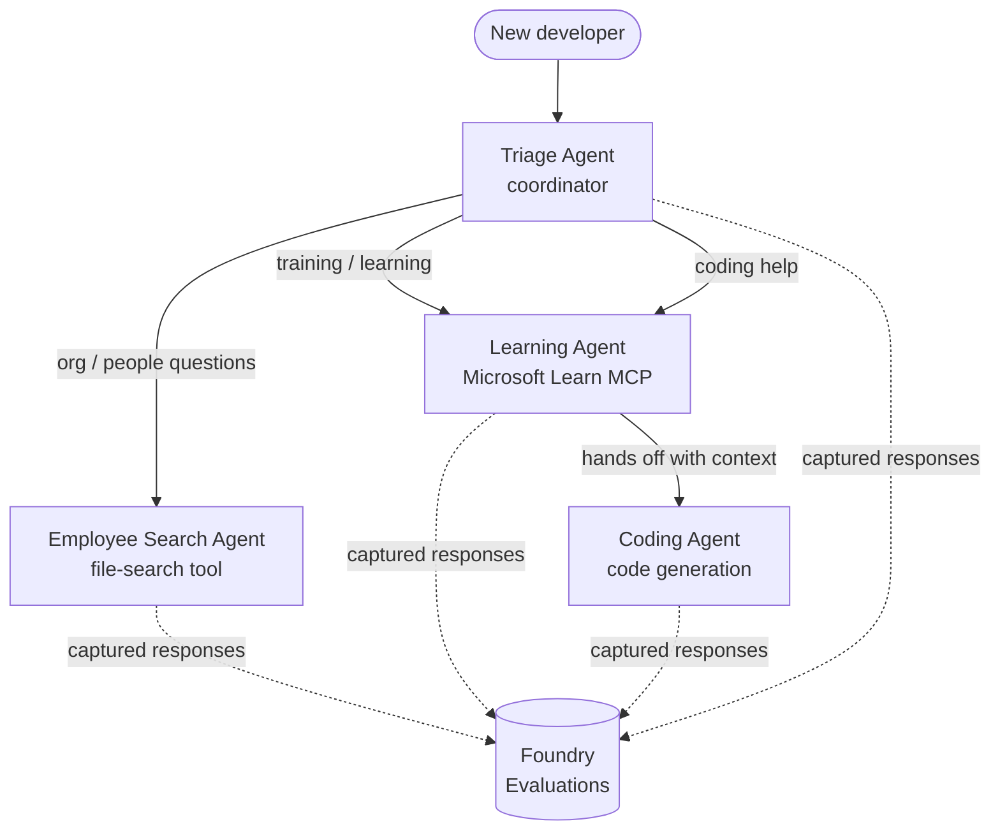

# Lesson 3: Agent Evaluations with Microsoft Foundry

Welcome to the third lesson of the **"Building AI Agents from Zero to Production"** course!

In [Lesson 2](../lesson-2-agent-development/README.md) you built agents. In this lesson you
will learn how to answer a much harder question: **are they any good?** Shipping an agent that
runs is easy; knowing whether it routes correctly, stays grounded in your data, and uses its
tools properly is what separates a demo from a production system.

In this lesson we will cover:

- Why agent evaluation matters and how it differs from traditional testing
- The difference between **observability**, **smoke tests**, and **evaluations**
- The multi-agent workflow we are going to measure
- The built-in **Microsoft Foundry evaluators** (relevance, groundedness, tool-call accuracy, tool-output utilization)
- A step-by-step walkthrough of the evaluation pipeline in [`agent-evals.py`](../../../lesson-3-agent-evals/agent-evals.py)
- How to run it and read the results

---

## Why evaluate agents?

A traditional unit test asserts that `add(2, 2) == 4`. Agents don't work that way — the same
prompt can produce different wording every run, tools can be called in different orders, and
"correct" is often a matter of degree rather than a boolean. You cannot assert on exact strings.

Instead, you evaluate agents along **quality dimensions** using model-based *evaluators* (also
called "LLM-as-a-judge") plus deterministic checks on tool usage. This tells you things like:

- Did the answer actually address the question? (**relevance**)
- Is the answer supported by the retrieved data, or did the agent hallucinate? (**groundedness**)
- Did the agent call the right tool with the right arguments? (**tool-call accuracy**)
- Did the agent actually use what the tool returned? (**tool-output utilization**)

### Three complementary layers of quality

These are not competing techniques — a production agent uses all three:

| Layer | Question it answers | Cost | When it runs | Covered in |
|-------|--------------------|------|--------------|------------|
| **Observability / tracing** | *What did the agent do, step by step?* | Free (always on) | Continuously in prod | This lesson |
| **Smoke tests** | *Is the agent reachable and following its basic prompt?* | Cheap, seconds | Every deploy | [Lesson 4](../lesson-4-agentdeployment/README.md#smoke-testing-the-hosted-agent-ci-gate) |
| **Evaluations** | *How **good** are the responses?* | Slower, model-metered | On demand / nightly / pre-release | This lesson |

Smoke tests answer "did it break?"; evaluations answer "is it good?". You want both.

---

## Prerequisites

1. Completed [Lesson 2](../lesson-2-agent-development/README.md) (agents + vector store).
2. A **Microsoft Foundry** project.
3. **Azure CLI** authenticated: `az login`.
4. **Python 3.12+** and the course dependencies installed:

   ```bash
   pip install -r ../requirements.txt
   ```

5. Environment variables (create a `.env` file in this folder or export them):

   | Variable | Purpose |
   |----------|---------|
   | `FOUNDRY_PROJECT_ENDPOINT` | Your Foundry project endpoint (`https://<account>.services.ai.azure.com/api/projects/<project>`). Read by the agents' `FoundryChatClient` **and** the evaluation helper. |
   | `FOUNDRY_MODEL` | Model deployment the **agents** run on (e.g. `gpt-5.1`). |
   | `VECTOR_STORE_ID` | The employee-directory vector store created in Lesson 2 |
   | `AZURE_AI_MODEL_DEPLOYMENT_NAME` | Model deployment used **by the evaluators** (defaults to `FOUNDRY_MODEL`, then `gpt-5.1`) |

> The agents use `FoundryChatClient`, which reads config from the `FOUNDRY_`-prefixed
> variables (`FOUNDRY_PROJECT_ENDPOINT`, `FOUNDRY_MODEL`). The cloud evaluation helper
> uses the `azure-ai-projects` SDK and will fall back to `FOUNDRY_PROJECT_ENDPOINT` if
> `AZURE_AI_PROJECT_ENDPOINT` is not set — so the two `FOUNDRY_` variables are enough to
> run the whole lesson.
>
> The evaluators are themselves powered by a model, so `AZURE_AI_MODEL_DEPLOYMENT_NAME`
> controls which deployment does the judging — it does not have to be the same model your
> agents use.

---

## The workflow we are evaluating

To evaluate something, you first have to run it. This lesson reuses the **Developer Onboarding**
multi-agent workflow: a **triage** coordinator hands off to three specialists.



The workflow is built with the Microsoft Agent Framework's **handoff** orchestration. The key
idea for evaluation is that **every agent turn is persisted server-side** and identified by a
`response_id`. Those IDs are what we hand to the evaluation service.

---

## The evaluation pipeline, step by step

[`agent-evals.py`](../../../lesson-3-agent-evals/agent-evals.py) implements a six-step pipeline. Here is what each step does
and why.

### Step 1 — Run the workflow and track response IDs

The workflow is executed with `run_stream(...)`, and as events stream back the code records the
`response_id` and `conversation_id` produced by each agent. Persisted responses are the raw
material for evaluation — you are grading *real* production-shaped responses, not re-generated
ones.

### Step 2 — Summarise what was captured

A quick summary prints how many responses each agent produced, so you can confirm the workflow
actually exercised the agents you intend to grade.

### Step 3 — Fetch the final responses

For each agent, the last `response_id` is retrieved through the project's OpenAI-compatible
client (`project_client.get_openai_client().responses.retrieve(...)`) so you can preview the
text that will be judged.

### Step 4 — Create the evaluation

An evaluation is created with four **built-in Foundry evaluators**:

| Evaluator | `evaluator_name` | What it measures |
|-----------|------------------|------------------|
| Relevance | `builtin.relevance` | Does the response address the user's request? |
| Groundedness | `builtin.groundedness` | Is the response supported by retrieved/tool data (not hallucinated)? |
| Tool-call accuracy | `builtin.tool_call_accuracy` | Were the right tools called with the right arguments? |
| Tool-output utilization | `builtin.tool_output_utilization` | Did the agent actually use the tool results in its answer? |

Each evaluator is initialised with the deployment named by `AZURE_AI_MODEL_DEPLOYMENT_NAME`.

> **Why these four?** Relevance and groundedness measure *answer quality*; the two tool
> evaluators measure *agentic behaviour* — the part traditional NLP metrics miss entirely. For a
> tool-using, multi-agent system, tool metrics are often where the real regressions hide.

### Step 5 — Run the evaluation

The captured `response_id`s are passed to `evals.runs.create(...)` as the data source. The
service replays each stored response through every evaluator.

### Step 6 — Monitor and read results

The code polls the run until it is `completed` or `failed`, then prints the result counts and a
**`report_url`** — a deep link into the Foundry portal where you can inspect per-metric scores,
pass/fail counts, and individual judged responses.

---

## Run it

```bash
cd lesson-3-agent-evals
python agent-evals.py
```

By default it evaluates the first example query
(`"I'm new here! Has anyone worked at Microsoft here?"`). Two more multi-intent example queries
are included in `run_evaluation_workflow()` — swap the `query` variable to try routing scenarios
that exercise more agents in a single run.

Expected console flow:

```
Step 1: Running Developer Onboarding Workflow
Step 2: Response Data Summary
Step 3: Fetching Agent Responses
Step 4: Creating Evaluation
Step 5: Running Evaluation
Step 6: Monitoring Evaluation
  Status: running ...
  Evaluation completed successfully
  Report URL: https://...   <-- open this in the Foundry portal
```

---

## Observability and tracing

Evaluations tell you *how good* the responses were; **observability** tells you *what happened*
to produce them — every agent hop, tool call, token count, and latency. In Microsoft Foundry,
agent runs emit OpenTelemetry traces you can view in the portal, and the Agent Framework can
export them to Azure Monitor / Application Insights with a single call:

```python
from agent_framework.foundry import FoundryChatClient

client = FoundryChatClient()
client.configure_azure_monitor()   # export traces + metrics to Application Insights
```

Use tracing to **debug** a bad evaluation score: when groundedness drops, the trace shows you
whether the file-search tool returned nothing, or returned data the agent then ignored (which is
exactly what tool-output utilization is scoring).

---

## From "runs" to "good": how to use this in practice

- **Pre-release gate.** Run evaluations against a fixed set of representative queries before
  promoting a new prompt or model. Compare scores to the previous version — treat a drop as a
  regression.
- **Nightly quality signal.** Schedule the evaluation to catch drift from data or dependency
  changes.
- **Pair with smoke tests.** The [Lesson 4 smoke test](../lesson-4-agentdeployment/README.md#smoke-testing-the-hosted-agent-ci-gate)
  is your fast per-deploy gate; evaluations are the slower, deeper quality gate. Run the cheap
  one on every merge and the expensive one on a schedule or before release.

---

## Modernisation note

This sample is being migrated to the current Microsoft Agent Framework Foundry API surface
(`agent_framework.foundry`). If you are updating the code, see the repository-root
[`MIGRATION-GUIDE.md`](../MIGRATION-GUIDE.md) for the verified before/after import and client
mappings (for example `AzureAIClient` -> `FoundryChatClient`, and hosted-tool construction via
`client.get_file_search_tool(...)` / `client.get_mcp_tool(...)`). The evaluation concepts and the
six-step pipeline above are unchanged by that migration.

---

## Resources

- [Evaluate generative AI models and applications (Microsoft Learn)](https://learn.microsoft.com/en-us/azure/ai-foundry/concepts/evaluation-approach-gen-ai)
- [Built-in evaluators for generative AI](https://learn.microsoft.com/en-us/azure/ai-foundry/concepts/evaluation-evaluators/agent-evaluators)
- [Observability in Microsoft Foundry](https://learn.microsoft.com/en-us/azure/ai-foundry/concepts/observability)
- [Microsoft Agent Framework](https://github.com/microsoft/agent-framework)
- [Agent handoff orchestration](https://learn.microsoft.com/en-us/agent-framework/workflows/orchestrations/handoff)

---

<!-- CO-OP TRANSLATOR DISCLAIMER START -->
**Disclaimer**:
This document has been translated using AI translation service [Co-op Translator](https://github.com/Azure/co-op-translator). While we strive for accuracy, please be aware that automated translations may contain errors or inaccuracies. The original document in its native language should be considered the authoritative source. For critical information, professional human translation is recommended. We are not liable for any misunderstandings or misinterpretations arising from the use of this translation.
<!-- CO-OP TRANSLATOR DISCLAIMER END -->