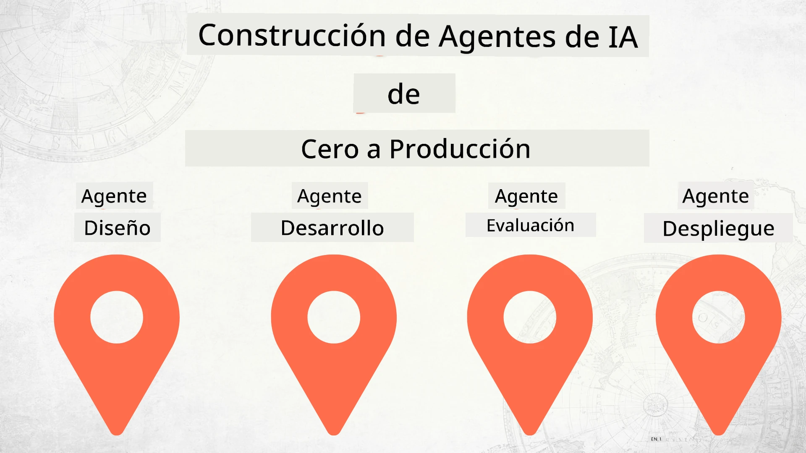

# Construyendo Agentes de IA desde Cero hasta Producción



### 🌐 Soporte Multilingüe

#### Soportado a través de GitHub Action (Automatizado y Siempre Actualizado)

<!-- CO-OP TRANSLATOR LANGUAGES TABLE START -->
[Árabe](../ar/README.md) | [Bengalí](../bn/README.md) | [Búlgaro](../bg/README.md) | [Birmano (Myanmar)](../my/README.md) | [Chino (Simplificado)](../zh-CN/README.md) | [Chino (Tradicional, Hong Kong)](../zh-HK/README.md) | [Chino (Tradicional, Macao)](../zh-MO/README.md) | [Chino (Tradicional, Taiwán)](../zh-TW/README.md) | [Croata](../hr/README.md) | [Checo](../cs/README.md) | [Danés](../da/README.md) | [Holandés](../nl/README.md) | [Estonio](../et/README.md) | [Finlandés](../fi/README.md) | [Francés](../fr/README.md) | [Alemán](../de/README.md) | [Griego](../el/README.md) | [Hebreo](../he/README.md) | [Hindi](../hi/README.md) | [Húngaro](../hu/README.md) | [Indonesio](../id/README.md) | [Italiano](../it/README.md) | [Japonés](../ja/README.md) | [Kannada](../kn/README.md) | [Jemer](../km/README.md) | [Coreano](../ko/README.md) | [Lituano](../lt/README.md) | [Malayo](../ms/README.md) | [Malayalam](../ml/README.md) | [Maratí](../mr/README.md) | [Nepalí](../ne/README.md) | [Pidgin Nigeriano](../pcm/README.md) | [Noruego](../no/README.md) | [Persa (Farsi)](../fa/README.md) | [Polaco](../pl/README.md) | [Portugués (Brasil)](../pt-BR/README.md) | [Portugués (Portugal)](../pt-PT/README.md) | [Punyabí (Gurmukhi)](../pa/README.md) | [Rumano](../ro/README.md) | [Ruso](../ru/README.md) | [Serbio (Cirílico)](../sr/README.md) | [Eslovaco](../sk/README.md) | [Esloveno](../sl/README.md) | [Español](./README.md) | [Swahili](../sw/README.md) | [Sueco](../sv/README.md) | [Tagalo (Filipino)](../tl/README.md) | [Tamil](../ta/README.md) | [Telugu](../te/README.md) | [Tailandés](../th/README.md) | [Turco](../tr/README.md) | [Ucraniano](../uk/README.md) | [Urdu](../ur/README.md) | [Vietnamita](../vi/README.md)

> **¿Prefieres Clonar Localmente?**
>
> Este repositorio incluye más de 50 traducciones de idiomas que aumentan significativamente el tamaño de descarga. Para clonar sin traducciones, utiliza checkout disperso:
>
> **Bash / macOS / Linux:**
> ```bash
> git clone --filter=blob:none --sparse https://github.com/microsoft/Building-AI-Agents-From-Zero-To-Production.git
> cd Building-AI-Agents-From-Zero-To-Production
> git sparse-checkout set --no-cone '/*' '!translations' '!translated_images'
> ```
>
> **CMD (Windows):**
> ```cmd
> git clone --filter=blob:none --sparse https://github.com/microsoft/Building-AI-Agents-From-Zero-To-Production.git
> cd Building-AI-Agents-From-Zero-To-Production
> git sparse-checkout set --no-cone "/*" "!translations" "!translated_images"
> ```
>
> Esto te ofrece todo lo necesario para completar el curso con una descarga mucho más rápida.
<!-- CO-OP TRANSLATOR LANGUAGES TABLE END -->

## Un curso que te enseña los fundamentos del Ciclo de Vida del Desarrollo de Agentes de IA

[](https://github.com/microsoft/Building-AI-Agents-From-Zero-To-Production/blob/master/LICENSE?WT.mc_id=academic-105485-koreyst)
[](https://GitHub.com/microsoft/Building-AI-Agents-From-Zero-To-Production/graphs/contributors/?WT.mc_id=academic-105485-koreyst)
[](https://GitHub.com/microsoft/Building-AI-Agents-From-Zero-To-Production/issues/?WT.mc_id=academic-105485-koreyst)
[](https://GitHub.com/microsoft/Building-AI-Agents-From-Zero-To-Production/pulls/?WT.mc_id=academic-105485-koreyst)
[](http://makeapullrequest.com?WT.mc_id=academic-105485-koreyst)

[](https://discord.gg/Kuaw3ktsu6)

## 🌱 Comenzando

Este curso tiene lecciones que cubren los fundamentos de construir y desplegar Agentes de IA.

Cada lección se construye sobre la anterior, por lo que recomendamos empezar desde el principio y avanzar hasta el final.

Si quieres explorar más sobre temas de Agentes de IA, puedes consultar el [Curso de Agentes de IA para Principiantes](https://aka.ms/ai-agents-beginners).

### Conoce a Otros Estudiantes, Obtén Respuestas a Tus Preguntas

Si te quedas atascado o tienes alguna pregunta sobre cómo construir Agentes de IA, únete a nuestro canal dedicado de Discord en el [Microsoft Foundry Discord](https://discord.gg/Kuaw3ktsu6).

### Lo que Necesitas

Cada lección tiene su propio ejemplo de código que puedes ejecutar localmente. Puedes [hacer un fork de este repositorio](https://github.com/microsoft/Building-AI-Agents-From-Zero-To-Production/fork) para crear tu propia copia.

Actualmente este curso usa lo siguiente:

- [Microsoft Agent Framework (MAF)](https://aka.ms/ai-agents-beginners/agent-framework)
- [Microsoft Foundry](https://azure.microsoft.com/products/ai-foundry)
- [Azure OpenAI Service](https://azure.microsoft.com/products/ai-foundry/models/openai)
- [Azure CLI](https://learn.microsoft.com/cli/azure/authenticate-azure-cli?view=azure-cli-latest)

Por favor asegúrate de tener acceso a estos servicios antes de comenzar.

Más opciones sobre alojamiento de modelos y servicios próximamente.

## 🗃️ Lecciones

| **Lección**         | **Descripción**                                                                                  |
|--------------------|--------------------------------------------------------------------------------------------------|
| [Diseño de Agente](./lesson-1-agent-design/README.md)       | Una introducción a nuestro caso de uso "Incorporación de Desarrolladores" y cómo diseñar agentes efectivos  |
| [Desarrollo de Agente](./lesson-2-agent-development/README.md)  | Usando Microsoft Agent Framework (MAF), crea 3 agentes para ayudar a los nuevos desarrolladores a incorporarse.       |
| [Evaluaciones de Agente](./lesson-3-agent-evals/README.md)  | Usando Microsoft Foundry, descubre qué tan bien están funcionando nuestros Agentes de IA y cómo mejorarlos. |
| [Despliegue de Agente](./lesson-4-agent-deployment/README.md)   | Utilizando los Agentes Hospedados y OpenAI Chatkit, ve cómo desplegar un Agente de IA en producción.       |


## 🎒 Otros Cursos

¡Nuestro equipo produce otros cursos! Mira:

<!-- CO-OP TRANSLATOR OTHER COURSES START -->
### LangChain
[](https://aka.ms/langchain4j-for-beginners)
[](https://aka.ms/langchainjs-for-beginners?WT.mc_id=m365-94501-dwahlin)
[](https://github.com/microsoft/langchain-for-beginners?WT.mc_id=m365-94501-dwahlin)
---

### Azure / Edge / MCP / Agentes
[](https://github.com/microsoft/AZD-for-beginners?WT.mc_id=academic-105485-koreyst)
[](https://github.com/microsoft/edgeai-for-beginners?WT.mc_id=academic-105485-koreyst)
[](https://github.com/microsoft/mcp-for-beginners?WT.mc_id=academic-105485-koreyst)
[](https://github.com/microsoft/ai-agents-for-beginners?WT.mc_id=academic-105485-koreyst)

---
 
### Serie de IA Generativa
[](https://github.com/microsoft/generative-ai-for-beginners?WT.mc_id=academic-105485-koreyst)
[-9333EA?style=for-the-badge&labelColor=E5E7EB&color=9333EA)](https://github.com/microsoft/Generative-AI-for-beginners-dotnet?WT.mc_id=academic-105485-koreyst)
[-C084FC?style=for-the-badge&labelColor=E5E7EB&color=C084FC)](https://github.com/microsoft/generative-ai-for-beginners-java?WT.mc_id=academic-105485-koreyst)
[-E879F9?style=for-the-badge&labelColor=E5E7EB&color=E879F9)](https://github.com/microsoft/generative-ai-with-javascript?WT.mc_id=academic-105485-koreyst)

---
 
### Aprendizaje Básico
[](https://aka.ms/ml-beginners?WT.mc_id=academic-105485-koreyst)
[](https://aka.ms/datascience-beginners?WT.mc_id=academic-105485-koreyst)
[](https://aka.ms/ai-beginners?WT.mc_id=academic-105485-koreyst)
[](https://github.com/microsoft/Security-101?WT.mc_id=academic-96948-sayoung)
[](https://aka.ms/webdev-beginners?WT.mc_id=academic-105485-koreyst)
[](https://aka.ms/iot-beginners?WT.mc_id=academic-105485-koreyst)
[](https://github.com/microsoft/xr-development-for-beginners?WT.mc_id=academic-105485-koreyst)

---
 
### Serie Copilot
[](https://aka.ms/GitHubCopilotAI?WT.mc_id=academic-105485-koreyst)
[](https://github.com/microsoft/mastering-github-copilot-for-dotnet-csharp-developers?WT.mc_id=academic-105485-koreyst)
[](https://github.com/microsoft/CopilotAdventures?WT.mc_id=academic-105485-koreyst)
<!-- CO-OP TRANSLATOR OTHER COURSES END -->

## Contribuciones

Este proyecto acepta contribuciones y sugerencias. La mayoría de las contribuciones requieren que aceptes un 
Acuerdo de Licencia de Contribuyente (CLA) declarando que tienes el derecho y realmente otorgas 
los derechos para usar tu contribución. Para más detalles, visita <https://cla.opensource.microsoft.com>.

Cuando envíes una solicitud de extracción, un bot CLA determinará automáticamente si necesitas proporcionar 
una CLA y decorará la PR apropiadamente (por ejemplo, verificación de estado, comentario). Simplemente sigue las instrucciones 
proporcionadas por el bot. Solo necesitarás hacer esto una vez en todos los repositorios que usan nuestro CLA.

Este proyecto ha adoptado el [Código de Conducta de Código Abierto de Microsoft](https://opensource.microsoft.com/codeofconduct/).
Para más información, consulta las [Preguntas frecuentes sobre el Código de Conducta](https://opensource.microsoft.com/codeofconduct/faq/) o 
contacta [opencode@microsoft.com](mailto:opencode@microsoft.com) con cualquier pregunta o comentario adicional.

## Marcas registradas

Este proyecto puede contener marcas registradas o logotipos de proyectos, productos o servicios. El uso autorizado de las marcas o logotipos de Microsoft está sujeto y debe seguir
las [Directrices de marcas y marcas comerciales de Microsoft](https://www.microsoft.com/legal/intellectualproperty/trademarks/usage/general).
El uso de marcas o logotipos de Microsoft en versiones modificadas de este proyecto no debe causar confusión ni implicar patrocinio de Microsoft.
Cualquier uso de marcas o logotipos de terceros está sujeto a las políticas de esos terceros.

## Obtener ayuda

Si te quedas atascado o tienes alguna pregunta sobre cómo crear aplicaciones de IA, únete a:

[](https://discord.gg/Kuaw3ktsu6)

Si tienes comentarios sobre el producto o errores durante la creación, visita:

[](https://aka.ms/foundry/forum)

---

<!-- CO-OP TRANSLATOR DISCLAIMER START -->
**Descargo de responsabilidad**:  
Este documento ha sido traducido utilizando el servicio de traducción AI [Co-op Translator](https://github.com/Azure/co-op-translator). Aunque nos esforzamos por la exactitud, tenga en cuenta que las traducciones automáticas pueden contener errores o inexactitudes. El documento original en su idioma nativo debe considerarse la fuente autorizada. Para información crítica, se recomienda traducción profesional humana. No nos hacemos responsables por malentendidos o interpretaciones erróneas derivadas del uso de esta traducción.
<!-- CO-OP TRANSLATOR DISCLAIMER END -->