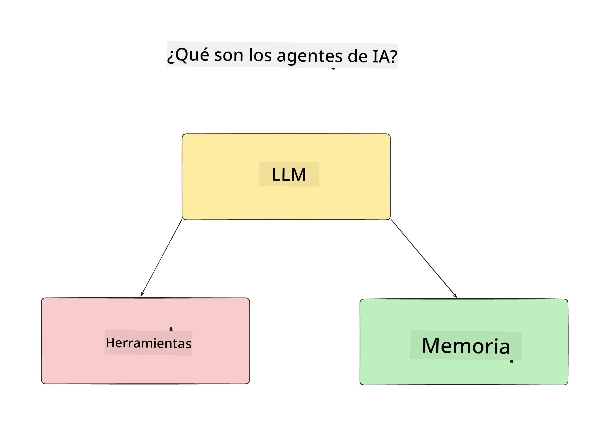
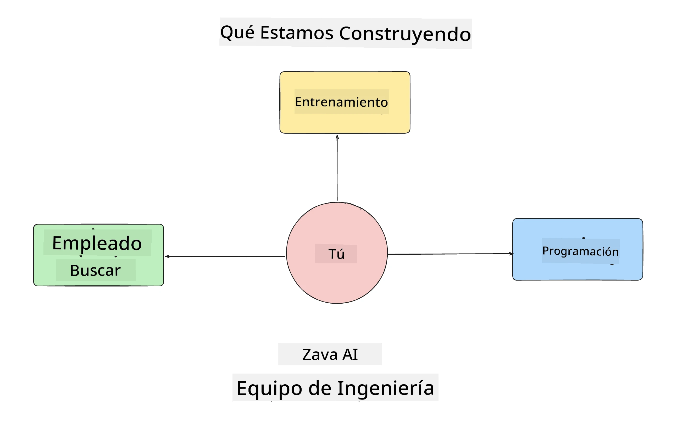
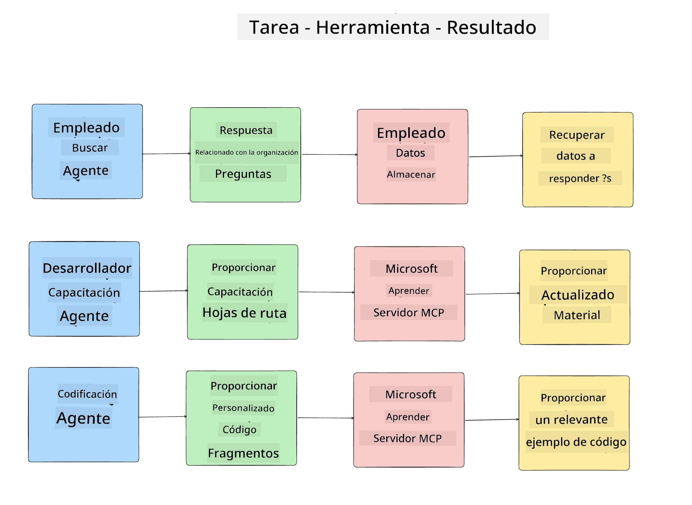
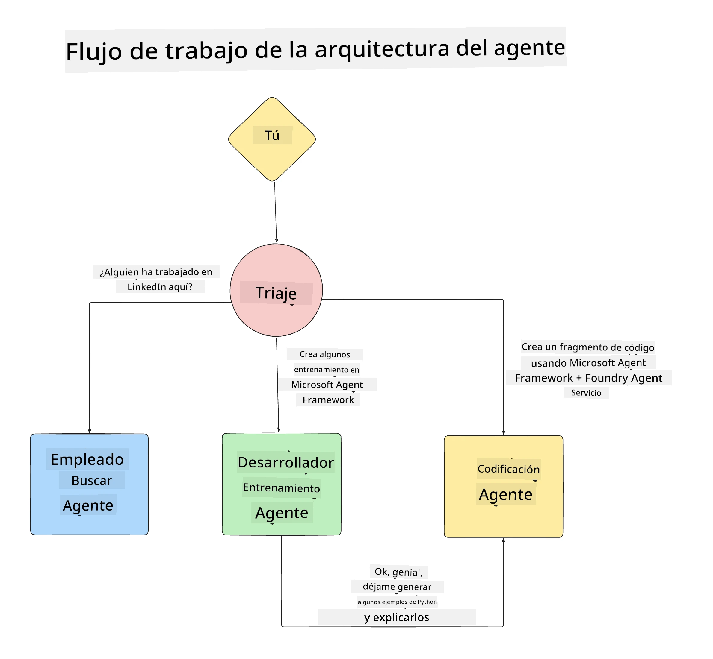

# Lección 1: Diseño de Agentes de IA

¡Bienvenido a la primera lección del curso "Construyendo un Agente de IA desde Cero hasta Producción"!

En esta lección cubriremos:

- Definir qué son los Agentes de IA
  
- Discutir la Aplicación de Agente de IA que estamos construyendo  

- Identificar las herramientas y servicios requeridos para cada agente
  
- Arquitectar nuestra Aplicación de Agente
  
Comencemos definiendo qué es un agente y por qué lo usaríamos dentro de una aplicación.

> **Antes de comenzar el curso.** Esta primera lección es conceptual — no hay código para ejecutar.
> Desde la [Lección 2](../lesson-2-agent-development/README.md) en adelante necesitarás: una **suscripción de Azure** con acceso a **Microsoft Foundry**, un modelo **GPT-5 series** desplegado (por ejemplo `gpt-5.1` — evita los modelos retirados GPT-4o / GPT-4.1), **Python 3.12+**, y la **CLI de Azure** (`az login`). Consulta [Qué Necesitas](../README.md#what-you-need) en el README del curso para la lista completa y enlaces.

## ¿Qué Son los Agentes de IA?

Si es la primera vez que exploras cómo construir un Agente de IA, puede que tengas preguntas sobre cómo definir exactamente qué es un Agente de IA.

Una forma simple de definir qué es un Agente de IA es por los componentes que lo constituyen:

**Modelo de Lenguaje Grande (LLM)** - El LLM impulsará tanto la capacidad de procesar lenguaje natural del usuario para interpretar la tarea que quiere realizar, como interpretar las descripciones de las herramientas disponibles para completar esas tareas.

**Herramientas** - Estas serán funciones, APIs, almacenes de datos y otros servicios que el LLM puede elegir usar para completar las tareas solicitadas por el usuario.

**Memoria** - Así almacenamos tanto las interacciones a corto plazo como a largo plazo entre el Agente de IA y el usuario. Almacenar y recuperar esta información es importante para hacer mejoras y guardar las preferencias del usuario con el tiempo.

## Nuestro Caso de Uso de Agentes de IA

Para este curso, vamos a construir una aplicación de Agente de IA que ayude a nuevos desarrolladores a incorporarse a nuestro Equipo de Desarrollo de Agentes de IA.

Antes de hacer cualquier trabajo de desarrollo, el primer paso para crear una aplicación de Agente de IA exitosa es definir escenarios claros sobre cómo esperamos que nuestros usuarios interactúen con nuestros Agentes de IA.

Para esta aplicación, trabajaremos con estos escenarios:

**Escenario 1**: Un nuevo empleado se une a nuestra organización y quiere saber más sobre el equipo al que se unió y cómo conectarse con ellos.

**Escenario 2:** Un nuevo empleado quiere saber cuál sería la mejor primera tarea para comenzar a trabajar.

**Escenario 3:** Un nuevo empleado quiere recopilar recursos de aprendizaje y ejemplos de código que le ayuden a comenzar a completar esta tarea.

## Identificando las Herramientas y Servicios

Ahora que tenemos estos escenarios establecidos, el siguiente paso es mapearlos a las herramientas y servicios que nuestros agentes de IA necesitarán para completar estas tareas.

Este proceso es parte de la Ingeniería de Contexto, ya que nos enfocaremos en asegurarnos de que nuestros Agentes de IA tengan el contexto correcto en el momento justo para completar las tareas.

Hagamos esto escenario por escenario y realicemos un buen diseño agente listando para cada agente su tarea, herramientas y resultados deseados.

### Escenario 1 - Agente de Búsqueda de Empleados

**Tarea** - Responder preguntas sobre empleados en la organización como fecha de ingreso, equipo actual, ubicación y último puesto.

**Herramientas** - Almacén de datos con la lista actual de empleados y el organigrama

**Resultados** - Ser capaz de recuperar información del almacén de datos para responder preguntas generales sobre la organización y preguntas específicas sobre empleados.

### Escenario 2 - Agente de Recomendación de Tareas

**Tarea** - Basándose en la experiencia del desarrollador nuevo, sugerir de 1 a 3 problemas con los que el nuevo empleado pueda trabajar.

**Herramientas** - Servidor MCP de GitHub para obtener issues abiertos y construir un perfil del desarrollador

**Resultados** - Ser capaz de leer los últimos 5 commits de un perfil de GitHub y los issues abiertos en un proyecto de GitHub y hacer recomendaciones basadas en coincidencias

### Escenario 3 - Agente Asistente de Código

**Tarea** - Basándose en los Issues Abiertos recomendados por el Agente de “Recomendación de Tareas”, investigar y proporcionar recursos y generar fragmentos de código para ayudar al empleado.

**Herramientas** - Microsoft Learn MCP para encontrar recursos y Code Interpreter para generar fragmentos de código personalizados.

**Resultados** - Si el usuario solicita ayuda adicional, el flujo de trabajo debe usar el Servidor Learn MCP para proporcionar enlaces y fragmentos de recursos y luego transferir al agente Code Interpreter para generar pequeños fragmentos de código con explicaciones.

## Arquitecturando nuestra Aplicación de Agente

Ahora que definimos cada uno de nuestros Agentes, creemos un diagrama de arquitectura que nos ayude a comprender cómo cada agente trabajará junto y por separado dependiendo de la tarea:

## Próximos Pasos

Ahora que diseñamos cada agente y nuestro sistema agente, pasemos a la siguiente lección donde desarrollaremos cada uno de estos agentes.

---

<!-- CO-OP TRANSLATOR DISCLAIMER START -->
**Descargo de responsabilidad**:
Este documento ha sido traducido utilizando el servicio de traducción automática [Co-op Translator](https://github.com/Azure/co-op-translator). Aunque nos esforzamos por la precisión, tenga en cuenta que las traducciones automatizadas pueden contener errores o inexactitudes. El documento original en su idioma nativo debe considerarse la fuente autorizada. Para información crítica, se recomienda una traducción profesional humana. No somos responsables de cualquier malentendido o interpretación errónea que surja del uso de esta traducción.
<!-- CO-OP TRANSLATOR DISCLAIMER END -->