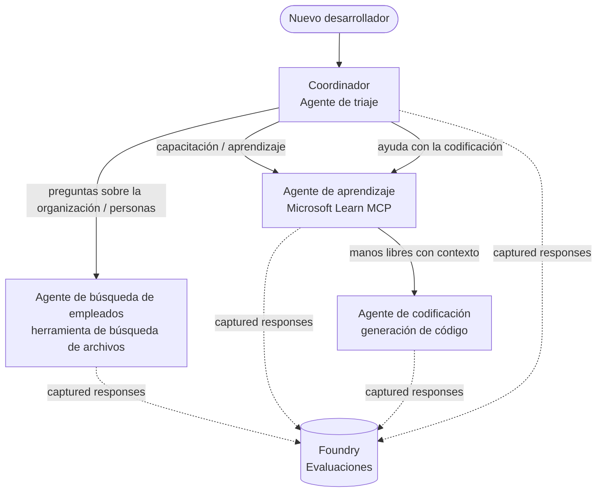

# Lección 3: Evaluaciones de Agentes con Microsoft Foundry

¡Bienvenido a la tercera lección del curso **"Construyendo Agentes de IA desde Cero hasta Producción"**!

En la [Lección 2](../lesson-2-agent-development/README.md) construiste agentes. En esta lección
aprenderás a responder una pregunta mucho más difícil: **¿son realmente buenos?** Enviar un agente que
funcione es fácil; saber si enruta correctamente, se mantiene fundamentado en tus datos y usa sus
herramientas correctamente es lo que separa una demo de un sistema de producción.

En esta lección cubriremos:

- Por qué la evaluación de agentes importa y cómo se diferencia de las pruebas tradicionales
- La diferencia entre **observabilidad**, **pruebas de humo** y **evaluaciones**
- El flujo de trabajo multiagente que vamos a medir
- Los **evaluadores integrados de Microsoft Foundry** (relevancia, fundamentación, precisión en llamadas a herramientas, utilización de salidas de herramientas)
- Un recorrido paso a paso por la canalización de evaluación en [`agent-evals.py`](../../../lesson-3-agent-evals/agent-evals.py)
- Cómo ejecutarlo y leer los resultados

---

## ¿Por qué evaluar agentes?

Una prueba unitaria tradicional afirma que `add(2, 2) == 4`. Los agentes no funcionan así: el mismo
prompt puede producir diferentes formulaciones cada vez, las herramientas pueden ser llamadas en
órdenes distintos, y lo "correcto" a menudo es una cuestión de grado, no un booleano. No puedes


En lugar de eso, evalúas a los agentes a lo largo de **dimensiones de calidad** usando *evaluadores*

herramientas. Esto te dice cosas como:

- ¿La respuesta realmente abordó la pregunta? (**relevancia**)
- ¿La respuesta está respaldada por los datos recuperados o el agente alucinó? (**fundamentación**)

- ¿El agente realmente utilizó lo que la herramienta devolvió? (**utilización de salida de herramienta**)

### Tres capas complementarias de calidad

Estas no son técnicas en competencia: un agente de producción usa las tres:

| Capa | Pregunta que responde | Costo | Cuándo se ejecuta | Cubierto en |
|-------|--------------------|------|--------------|------------|
| **Observabilidad / rastreo** | *¿Qué hizo el agente, paso a paso?* | Gratis (siempre activado) | Continuamente en producción | Esta lección |

| **Evaluaciones** | *¿Qué tan **buenas** son las respuestas?* | Más lento, medido por modelo | A demanda / nocturno / pre-lanzamiento | Esta lección |

Las pruebas de humo responden "¿se rompió?"; las evaluaciones responden "¿es bueno?". Necesitas ambas.

---

## Requisitos previos

1. Haber completado la [Lección 2](../lesson-2-agent-development/README.md) (agentes + almacén vectorial).
2. Un proyecto de **Microsoft Foundry**.

4. **Python 3.12+** y las dependencias del curso instaladas:


5. Variables de entorno (crea un archivo `.env` en esta carpeta o expórtalas):

   | Variable | Propósito |
   |----------|---------|
   | `FOUNDRY_PROJECT_ENDPOINT` | El endpoint del proyecto Foundry (`https://<account>.services.ai.azure.com/api/projects/<project>`). Leído por `FoundryChatClient` de los agentes **y** el ayudante de evaluación. |
   | `FOUNDRY_MODEL` | Despliegue de modelo en el que corren los **agentes** (p. ej. `gpt-5.1`). |

   | `AZURE_AI_MODEL_DEPLOYMENT_NAME` | Despliegue del modelo usado **por los evaluadores** (por defecto `FOUNDRY_MODEL`, luego `gpt-5.1`) |

> Los agentes usan `FoundryChatClient`, que lee la configuración de las variables
> prefijadas con `FOUNDRY_` (`FOUNDRY_PROJECT_ENDPOINT`, `FOUNDRY_MODEL`). El ayudante de evaluación en la nube
> usa el SDK `azure-ai-projects` y recurrirá a `FOUNDRY_PROJECT_ENDPOINT` si
> `AZURE_AI_PROJECT_ENDPOINT` no está configurado — así que las dos variables `FOUNDRY_`
> son suficientes para ejecutar toda la lección.
>
> Los evaluadores usan un modelo, por lo que `AZURE_AI_MODEL_DEPLOYMENT_NAME`


Para evaluar algo, primero tienes que ejecutarlo. Esta lección reutiliza el flujo de trabajo




El flujo está construido con la orquestación de **handoff** del Microsoft Agent Framework. La idea
clave para evaluación es que **cada turno del agente se persiste del lado del servidor** e


[`agent-evals.py`](../../../lesson-3-agent-evals/agent-evals.py) implementa una canalización de seis pasos. Aquí está lo que hace cada paso


El flujo se ejecuta con `run_stream(...)`, y a medida que los eventos regresan,
el código registra el `response_id` y `conversation_id` producido por cada agente. Las respuestas persistidas
son el material bruto para evaluación — estás calificando respuestas *reales* con forma de producción,


Un resumen rápido imprime cuántas respuestas produjo cada agente, para que puedas confirmar que


Para cada agente, se recupera el último `response_id` mediante el cliente compatible con OpenAI del proyecto
(`project_client.get_openai_client().responses.retrieve(...)`) para que puedas previsualizar el texto que será juzgado.

### Paso 4 — Crear la evaluación

Se crea una evaluación con cuatro **evaluadores integrados de Foundry**:

| Evaluador | `evaluator_name` | Lo que mide |
|-----------|------------------|-------------|
| Relevancia | `builtin.relevance` | ¿La respuesta aborda la solicitud del usuario? |

| Fundamentación | `builtin.groundedness` | ¿Está la respuesta respaldada por datos recuperados/herramientas (no es una alucinación)? |
| Precisión en llamadas a herramientas | `builtin.tool_call_accuracy` | ¿Se llamaron las herramientas correctas con los argumentos correctos? |
| Utilización de resultados de herramientas | `builtin.tool_output_utilization` | ¿Usó realmente el agente los resultados de la herramienta en su respuesta? |

Cada evaluador se inicializa con el despliegue nombrado por `AZURE_AI_MODEL_DEPLOYMENT_NAME`.

> **¿Por qué estos cuatro?** La relevancia y fundamentación miden la *calidad de la respuesta*; los dos evaluadores de herramientas miden el *comportamiento agéntico* — la parte que las métricas tradicionales de PLN pasan por alto completamente. Para un sistema multiagente que usa herramientas, las métricas de herramientas suelen ser donde realmente se esconden las regresiones.


### Paso 5 — Ejecutar la evaluación

Los `response_id` capturados se pasan a `evals.runs.create(...)` como fuente de datos. El servicio reproduce cada respuesta almacenada a través de cada evaluador.


### Paso 6 — Monitorizar y leer resultados

El código interroga la ejecución hasta que esté `completed` o `failed`, luego imprime el conteo de resultados y una
**`report_url`** — un enlace directo al portal Foundry donde puedes inspeccionar puntajes por métrica,
conteos de aprobado/fallado y respuestas juzgadas individualmente.

---

## Ejecutarlo

```bash
cd lesson-3-agent-evals
python agent-evals.py
```

Por defecto evalúa la primera consulta de ejemplo
(`"¡Soy nuevo aquí! ¿Alguien ha trabajado en Microsoft aquí?"`). Dos consultas más con múltiples intenciones
se incluyen en `run_evaluation_workflow()` — cambia la variable `query` para probar escenarios de enrutamiento
que ejercitan más agentes en una sola ejecución.

Flujo esperado en consola:

```
Step 1: Running Developer Onboarding Workflow
Step 2: Response Data Summary
Step 3: Fetching Agent Responses
Step 4: Creating Evaluation
Step 5: Running Evaluation
Step 6: Monitoring Evaluation
  Status: running ...
  Evaluation completed successfully
  Report URL: https://...   <-- open this in the Foundry portal
```

---

## Observabilidad y trazabilidad

Las evaluaciones te dicen *qué tan buenas* fueron las respuestas; la **observabilidad** te dice *qué pasó*
para producirlas — cada salto de agente, llamada de herramienta, conteo de tokens y latencia. En Microsoft Foundry,
las ejecuciones de agentes emiten trazas OpenTelemetry que puedes ver en el portal, y el Agent Framework puede
exportarlas a Azure Monitor / Application Insights con una sola llamada:

```python
from agent_framework.foundry import FoundryChatClient

client = FoundryChatClient()
client.configure_azure_monitor()   # exportar trazas + métricas a Application Insights
```

Usa la trazabilidad para **depurar** un mal puntaje de evaluación: cuando la fundamentación cae, la traza muestra
si la herramienta de búsqueda de archivos no devolvió nada o si devolvió datos que el agente luego ignoró (que es
exactamente lo que la métrica de utilización de salida de herramienta está evaluando).

---

## De "ejecuciones" a "buenas": cómo usar esto en la práctica

- **Puerta previa al lanzamiento.** Ejecuta evaluaciones con un conjunto fijo de consultas representativas antes de
  promover un nuevo prompt o modelo. Compara los puntajes con la versión anterior — trata una caída como una
  regresión.
- **Señal de calidad nocturna.** Programa la evaluación para detectar desviaciones por cambios en datos o dependencias.
- **Combínalo con pruebas rápidas (smoke tests).** La [Prueba rápida Lección 4](../lesson-4-agentdeployment/README.md#smoke-testing-the-hosted-agent-ci-gate)
  es tu puerta rápida para cada despliegue; las evaluaciones son la puerta de calidad más lenta y profunda. Ejecuta la barata
  en cada fusión y la costosa en un horario o antes del lanzamiento.


(`agent_framework.foundry`). Si estás actualizando el código, consulta la raíz del repositorio
[`MIGRATION-GUIDE.md`](../MIGRATION-GUIDE.md) para las importaciones y mapeos de clientes verificados antes y después (por ejemplo `AzureAIClient` -> `FoundryChatClient`, y construcción de herramientas hospedadas vía
`client.get_file_search_tool(...)` / `client.get_mcp_tool(...)`). Los conceptos de evaluación y el
pipeline de seis pasos arriba permanecen sin cambios por esta migración.


---

## Recursos

- [Evalúa modelos y aplicaciones de IA generativa (Microsoft Learn)](https://learn.microsoft.com/en-us/azure/ai-foundry/concepts/evaluation-approach-gen-ai)
- [Evaluadores incorporados para IA generativa](https://learn.microsoft.com/en-us/azure/ai-foundry/concepts/evaluation-evaluators/agent-evaluators)
- [Observabilidad en Microsoft Foundry](https://learn.microsoft.com/en-us/azure/ai-foundry/concepts/observability)
- [Microsoft Agent Framework](https://github.com/microsoft/agent-framework)
- [Orquestación de transferencia de agentes](https://learn.microsoft.com/en-us/agent-framework/workflows/orchestrations/handoff)

---

<!-- CO-OP TRANSLATOR DISCLAIMER START -->
**Descargo de responsabilidad**:
Este documento ha sido traducido utilizando el servicio de traducción automática [Co-op Translator](https://github.com/Azure/co-op-translator). Aunque nos esforzamos por la precisión, tenga en cuenta que las traducciones automatizadas pueden contener errores o inexactitudes. El documento original en su idioma nativo debe considerarse la fuente autorizada. Para información crítica, se recomienda una traducción profesional humana. No somos responsables de cualquier malentendido o interpretación errónea que surja del uso de esta traducción.
<!-- CO-OP TRANSLATOR DISCLAIMER END -->