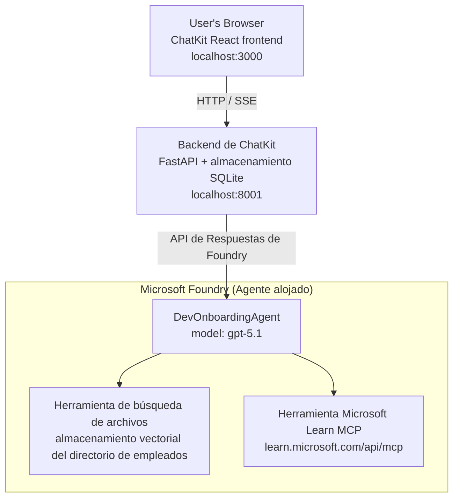

# Lección 4: Despliegue de Agentes con Microsoft Foundry Hosted Agents + ChatKit

Esta lección demuestra cómo desplegar un agente que usa herramientas en Microsoft Foundry como un agente alojado y crear una interfaz frontend basada en ChatKit para interactuar con él.

## Arquitectura

El agente alojado es un **único `DevOnboardingAgent`** (ejecutándose en `gpt-5.1`) que responde preguntas de incorporación de desarrolladores usando dos herramientas alojadas: una herramienta de **Búsqueda de Archivos** sobre el almacén vectorial del directorio de empleados y la herramienta **Microsoft Learn MCP**. Un frontend React de ChatKit se comunica con un backend FastAPI, que llama al agente a través de la **API de Respuestas** de Foundry.



## Requisitos Previos

1. **Proyecto Microsoft Foundry** en la región Norte Central de EE.UU.
2. **Azure CLI** autenticado (`az login`)
3. **CLI de Desarrollador de Azure** (`azd`) instalado
4. **Python 3.12+** y **Node.js 18+**
5. **Almacén Vectorial** creado con datos de empleados

## Inicio Rápido

### 1. Configurar Variables de Entorno

```bash
cd lesson-4-agentdeployment
cp .env.example .env
# Edita .env con los detalles de tu proyecto Microsoft Foundry
```

### 2. Desplegar el Agente Alojado

**Opción A: Usando Azure Developer CLI (Recomendado)**

```bash
cd hosted-agent
azd auth login
azd agent deploy
```

**Opción B: Usando Docker + Azure Container Registry**

```bash
cd hosted-agent

# Construir el contenedor
docker build -t developer-onboarding-agent:latest .

# Etiqueta para ACR
docker tag developer-onboarding-agent:latest <your-acr>.azurecr.io/developer-onboarding-agent:latest

# Enviar a ACR
az acr login --name <your-acr>
docker push <your-acr>.azurecr.io/developer-onboarding-agent:latest

# Implementar a través del portal o SDK de Microsoft Foundry
```

### 3. Iniciar el Backend de ChatKit

```bash
cd chatkit-server
python -m venv .venv
source .venv/bin/activate  # En Windows: .venv\Scripts\activate
pip install -r requirements.txt
python app.py
```

El servidor iniciará en `http://localhost:8001`

### 4. Iniciar el Frontend de ChatKit

```bash
cd chatkit-server/frontend
npm install
npm run dev
```

El frontend iniciará en `http://localhost:3000`

### 5. Probar la Aplicación

Abre `http://localhost:3000` en tu navegador y prueba estas consultas:

**Búsqueda de Empleados:**
- "¡Soy nuevo aquí! ¿Alguien ha trabajado en Microsoft?"
- "¿Quién tiene experiencia con Azure Functions?"

**Recursos de Aprendizaje:**
- "Crea un camino de aprendizaje para Kubernetes"
- "¿Qué certificaciones debería seguir para arquitectura en la nube?"

**Ayuda con Codificación:**
- "Ayúdame a escribir código Python para conectarme a CosmosDB"
- "Muéstrame cómo crear una Azure Function"

**Consultas Multi-Agente:**
- "Estoy comenzando como ingeniero de nube. ¿Con quién debería conectarme y qué debería aprender?"

## Estructura del Proyecto

```
lesson-4-agentdeployment/
├── .env.example                 # Environment variables template
├── implementation-plan.md       # Detailed implementation guide
├── README.md                    # This file
├── hosted-agent/               # Microsoft Foundry hosted agent
│   ├── main.py                 # Multi-agent workflow implementation
│   ├── requirements.txt        # Python dependencies
│   ├── Dockerfile              # Container definition
│   └── agent.yaml              # Agent deployment configuration
└── chatkit-server/             # ChatKit server application
    ├── app.py                  # FastAPI backend
    ├── store.py                # SQLite persistence layer
    ├── requirements.txt        # Python dependencies
    └── frontend/               # React frontend
        ├── package.json
        ├── vite.config.ts
        ├── tsconfig.json
        ├── index.html
        └── src/
            ├── main.tsx
            ├── App.tsx
            ├── App.css
            └── index.css
```

## El Agente y Sus Herramientas

El agente alojado es un **agente único** (`DevOnboardingAgent`, definido en `hosted-agent/main.py`) que maneja tres dominios de incorporación. En lugar de orquestar subagentes separados, expone cada capacidad como una herramienta (o depende del modelo directamente):

| Capacidad | Cómo se maneja | Herramienta |
|-----------|----------------|------------|
| **Búsqueda y conexiones de empleados** | Búsqueda alojada en Foundry sobre el almacén vectorial del directorio de empleados | `client.get_file_search_tool(vector_store_ids=[...])` |
| **Aprendizaje y formación** | Servidor Microsoft Learn MCP (herramienta MCP alojada) | `client.get_mcp_tool(url="https://learn.microsoft.com/api/mcp")` |
| **Asistencia de codificación** | Manejada directamente por el modelo `gpt-5.1` — sin herramienta externa | — |

El agente se crea con `client.as_agent(name="DevOnboardingAgent", instructions=..., tools=[file_search_tool, learn_mcp_tool])` y se sirve con `from_agent_framework(agent).run()`.

> **Nota de diseño.** Borradores anteriores de esta lección usaban un flujo multi-agente con `HandoffBuilder` (Triaje → especialistas). El agente entregado es un agente único que usa herramientas, lo que es más simple de desplegar y entender para preguntas y respuestas de incorporación. Para un ejemplo de orquestación multi-agente y transferencias, ve la Lección 2 y la Lección 3.

## Prueba de Humo del Agente Alojado (Puerta CI)

Desplegar un agente alojado "con éxito" solo prueba que el plano de control aceptó la
definición — no prueba que el agente realmente responda. Una dependencia faltante,
mal enrutamiento del modelo, o una conexión expirada pueden dejar un agente verde pero silencioso.

Esta lección entrega una **prueba de humo** ligera que actúa como una puerta rápida y económica post-despliegue. Usa la Acción de Github [AI Smoke Test](https://github.com/marketplace/actions/ai-smoke-test)
para enviar solicitudes POST al endpoint de **Respuestas** del agente en Foundry
(`POST {project_endpoint}/agents/{agent_name}/endpoint/protocols/openai/responses`)
y verificar el texto retornado. Detecta despliegues rotos, regresiones de autenticación,
desviación en la indicación del sistema y errores de encadenamiento en segundos.


> Las pruebas de humo **no** reemplazan las evaluaciones completas en
> [Lección 3](../lesson-3-agent-evals/README.md) — son un complemento. Las pruebas de humo
> responden *"¿el agente es accesible, responde y sigue expectativas básicas del prompt?"*;
> las evaluaciones responden *"¿qué tan buena es la respuesta?"*. Ejecuta esta puerta económica en cada despliegue.

### Qué se prueba

El catálogo está en [`hosted-agent/tests/smoke-tests.json`](../../../lesson-4-agentdeployment/hosted-agent/tests/smoke-tests.json)
y ejerce los tres dominios del agente más la adherencia a prompts y el manejo de conversaciones multi-turno:

| Prueba | Qué verifica |
|-------|-------------|
| `reachability` | El agente responde con texto no vacío y dentro del alcance |
| `employee-search` | El dominio de búsqueda de archivos retorna un `200` saludable (la respuesta depende de datos) |
| `learning-path` | El dominio de aprendizaje repite el tema y produce una respuesta estilo camino |
| `coding-assistance` | El dominio de codificación retorna una respuesta en Python con forma de código |
| `prompt-adherence-offtopic` | La solicitud fuera de tema se redirige, no se responde en detalle |
| `threading-turn-1/2` | El estado de la conversación se mantiene a través de turnos usando `previous_response_id` |

### Ejecutarlo en CI

El flujo de trabajo en [`.github/workflows/smoke-test-hosted-agent.yml`](../../../.github/workflows/smoke-test-hosted-agent.yml)
contiene dos trabajos:

- **`static`** — una puerta rápida sin Azure que se ejecuta en cada pull request y push:
  compila todas las fuentes Python (`py_compile`) y verifica enlaces Markdown. No requiere secretos,
  por lo que funciona en PRs de forks.
- **`smoke`** — la prueba de humo conectada a Azure abajo. Se ejecuta a demanda
  (Actions → **Agent CI (static + smoke)** → Ejecutar flujo) y puede encadenarse tras tu
  flujo de despliegue.

Configura estas **variables** y **secretos** del repositorio para el trabajo de prueba de humo:

| Tipo | Nombre | Valor |
|------|--------|-------|
| Variable | `FOUNDRY_PROJECT_ENDPOINT` | `https://<account>.services.ai.azure.com/api/projects/<project>` |
| Variable | `HOSTED_AGENT_NAME` | Nombre del agente desplegado (ej. `dev-onboarding` — debe coincidir con tu despliegue) |
| Secreto | `AZURE_CLIENT_ID` / `AZURE_TENANT_ID` / `AZURE_SUBSCRIPTION_ID` | Identidad federada OIDC para `azure/login` |

La identidad del runner necesita el rol **`Usuario IA de Azure`** en el **ámbito del proyecto Foundry** para poder
llamar a los endpoints del plano de datos de Respuestas (y conversaciones). Concedelo con:

```bash
az role assignment create \
  --assignee <object-id-or-appId-of-runner-identity> \
  --role "Azure AI User" \
  --scope "/subscriptions/<sub>/resourceGroups/<rg>/providers/Microsoft.CognitiveServices/accounts/<account>/projects/<project>"
```

### Ejecutarlo localmente

Puedes ejecutar el mismo catálogo antes de hacer push. Obtén un token del plano de datos con alcance
`https://ai.azure.com/` y señala el runner a tu despliegue:

```bash
# El público DEBE ser https://ai.azure.com/ (los tokens de cognitiveservices.azure.com son rechazados)
export FOUNDRY_TOKEN=$(az account get-access-token --resource https://ai.azure.com/ --query accessToken -o tsv)

git clone https://github.com/JFolberth/ai-smoketest && cd ai-smoketest
python runner.py \
  --project-endpoint "https://<account>.services.ai.azure.com/api/projects/<project>" \
  --agent-name dev-onboarding \
  --tests-file ../lesson-4-agentdeployment/hosted-agent/tests/smoke-tests.json
```

Códigos de salida: `0` todo pasó, `1` falló una aserción, `2` error del runner (catálogo/token incorrecto).

## Solución de Problemas

### El agente no responde
- Verifica que el agente alojado esté desplegado y en ejecución en Microsoft Foundry
- Revisa que `HOSTED_AGENT_NAME` y `HOSTED_AGENT_VERSION` coincidan con tu despliegue

### Errores del almacén vectorial
- Asegúrate de que `VECTOR_STORE_ID` esté configurado correctamente
- Verifica que el almacén vectorial contenga los datos de empleados

### Errores de autenticación
- Ejecuta `az login` para refrescar credenciales
- Asegúrate de tener acceso al proyecto Microsoft Foundry

## Recursos

- [Documentación de Microsoft Foundry Hosted Agents](https://learn.microsoft.com/en-us/azure/ai-foundry/agents/concepts/hosted-agents)
- [Microsoft Agent Framework](https://github.com/microsoft/agent-framework)
- [Ejemplo de Integración ChatKit](https://github.com/microsoft/agent-framework/tree/main/python/samples/demos/chatkit-integration)
- [Azure Developer CLI](https://learn.microsoft.com/en-us/azure/developer/azure-developer-cli/overview)
- [Acción GitHub AI Smoke Test](https://github.com/marketplace/actions/ai-smoke-test)
- [Prueba de Humo para Agentes Microsoft Foundry con GitHub Actions (blog)](https://techcommunity.microsoft.com/blog/azuredevcommunityblog/smoke-test-microsoft-foundry-agents-with-github-actions/4531912)

---

## Próximos Pasos

Tu agente corre en infraestructura gestionada por Microsoft. Para llevarlo a producción empresarial —
controlando dónde viven sus datos (soberanía de datos, redes privadas, traer tu propio Azure
Cosmos DB / Almacenamiento / AI Search) y gobernando sus herramientas — continúa con
**[Lección 5: Agentes en Producción Hosted](../lesson-5-hosted-agents-production/README.md)**, que
explica la diferencia crucial entre **Agentes Alojalos** y **Hosts de Capacidades**.

---

<!-- CO-OP TRANSLATOR DISCLAIMER START -->
**Descargo de responsabilidad**:
Este documento ha sido traducido utilizando el servicio de traducción automática [Co-op Translator](https://github.com/Azure/co-op-translator). Aunque nos esforzamos por la precisión, tenga en cuenta que las traducciones automatizadas pueden contener errores o inexactitudes. El documento original en su idioma nativo debe considerarse la fuente autorizada. Para información crítica, se recomienda una traducción profesional humana. No somos responsables de cualquier malentendido o interpretación errónea que surja del uso de esta traducción.
<!-- CO-OP TRANSLATOR DISCLAIMER END -->